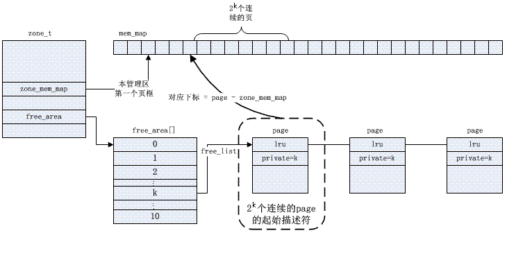
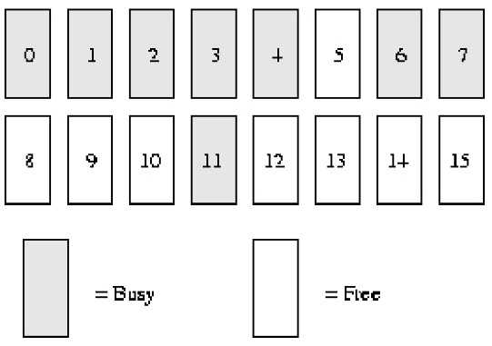

参考：

http://www.cnblogs.com/zhaoyl/p/3695517.html

本文以32位机器为准，串讲一些内存管理的知识点。

## 1. 虚拟地址、物理地址、逻辑地址、线性地址

虚拟地址又叫线性地址。linux没有采用分段机制，所以逻辑地址和虚拟地址（线性地址）（在用户态，内核态逻辑地址专指下文说的线性偏移前的地址）是一个概念。物理地址自不必提。内核的虚拟地址和物理地址，大部分只差一个线性偏移量。用户空间的虚拟地址和物理地址则采用了多级页表进行映射，但仍称之为线性地址。

## 2. DMA/HIGH_MEM/NROMAL 分区

在x86结构中，Linux内核**虚拟地址空间(！！！)**划分0~3G为用户空间，3~4G为内核空间(注意，**内核可以使用的线性地址只有1G**)。**内核虚拟空间**（3G~4G）又划分为三种类型的区：

- ZONE_DMA 3G之后起始的16MB

- ZONE_NORMAL 16MB~896MB

- ZONE_HIGHMEM 896MB ~1G

由于内核的虚拟和物理地址只差一个偏移量：**物理地址 = 逻辑地址 – 0xC0000000**。所以**如果1G内核空间完全用来线性映射，显然物理内存也只能访问到1G区间**，这显然是不合理的。HIGHMEM就是为了解决这个问题，专门开辟的一块不必线性映射，可以灵活定制映射，以便访问1G以上物理内存的区域。从网上扣来一图，

高端内存的划分，又如下图，

内核直接映射空间 PAGE\_OFFSET\~VMALLOC\_START，kmalloc和\_\_get\_free\_page()分配的是这里的页面。二者是借助slab分配器，直接分配物理页再转换为逻辑地址（物理地址连续）。适合分配小段内存。此区域包含了内核镜像、物理页框表mem\_map等资源。

内核动态映射空间 VMALLOC\_START\~VMALLOC\_END，被vmalloc用到，可表示的空间大。

内核永久映射空间 PKMAP\_BASE \~ FIXADDR\_START，kmap

内核临时映射空间 FIXADDR\_START\~FIXADDR\_TOP，kmap\_atomic

## 3. 伙伴算法和slab分配器

伙伴Buddy算法解决了外部碎片问题.内核在每个zone区管理着可用的页面，按2的幂级（order）大小排成链表队列，存放在free_area数组。

具体buddy管理基于位图，其分配回收页面的算法描述如下，

buddy算法举例描述:

假设我们的系统内存只有16个页面RAM。因为RAM只有16个页面，我们只需用四个级别（orders）的伙伴位图（因为最大连续内存大小为16个页面），如下图所示。

order（0）bimap有8个bit位（页面最多16个页面，所以16/2）

order（1）bimap有4个bit位（order（0）bimap有8个bit位，所以8/2）；

也就是order（1）第一块由两个页框page1 与page2组成与order（1）第2块由两个页框page3 与page4组成，这两个块之间有一个bit位

order（2）bimap有2个bit位（order（1）bimap有4个bit位，所以4/2）

order（3）bimap有1个bit位（order（2）bimap有4个bit位，所以2/2）

在order（0），第一个bit表示开始的2个页面，第二个bit表示接下来的2个页面，以此类推。因为页面4已分配，而页面5空闲，故第三个bit为1。

同样在order（1）中，bit3是1的原因是一个伙伴完全空闲（页面8和9），和它对应的伙伴（页面10和11）却并非如此，故以后回收页面时，可以合并。