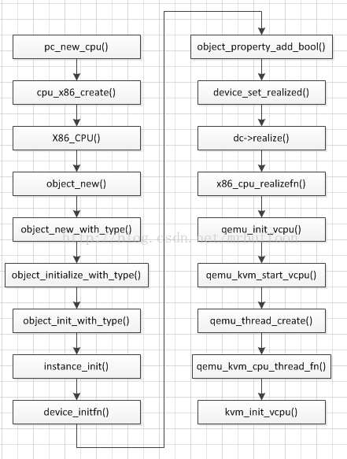

前面讲了KVM内核层创建及初始化虚拟机的一些工作过程，现在讲一下QEMU层的流程以及与KVM内核层的配合过程。

Qemu层是从vl.c中的main()函数开始的，这里通过在代码中添加一些注释的方式来进行讲解。

```
int main(int argc, charchar **argv, charchar **envp)  
{  
    ......  
    atexit(qemu_run_exit_notifiers);//注册了Qemu的退出函数  
    ......  
    module_call_init(MODULE_INIT_QOM);//初始化Qemu的各个模块，具体见下面注释  
      
/* 
    module_call_init实际上是设计了一个函数链表ModuleTypeList，参数作为一个Type，相关的函数注册到这个函数链表上， 
    然后内部通过调用e->init()函数完成所有Type相关的设备的初始化。关于e->init()的具体内容后面再细说。 
    Type总计有这些类型： 
    typedef enum { 
    MODULE_INIT_BLOCK, 
    MODULE_INIT_MACHINE, 
    MODULE_INIT_QAPI, 
    MODULE_INIT_QOM, 
    MODULE_INIT_MAX 
    } module_init_type; 
*/   
  
    qemu_add_opts(&qemu_drive_opts);//将各种函数指针（也就是操作）集合添加到链表中   
    qemu_add_opts(&qemu_chardev_opts);   
    qemu_add_opts(&qemu_device_opts);   
    qemu_add_opts(&qemu_netdev_opts);   
    qemu_add_opts(&qemu_net_opts);   
    qemu_add_opts(&qemu_rtc_opts);   
    qemu_add_opts(&qemu_global_opts);   
    qemu_add_opts(&qemu_mon_opts);   
    qemu_add_opts(&qemu_trace_opts);   
    qemu_add_opts(&qemu_option_rom_opts);   
    qemu_add_opts(&qemu_machine_opts);   
    qemu_add_opts(&qemu_boot_opts);   
    qemu_add_opts(&qemu_sandbox_opts);   
    qemu_add_opts(&qemu_add_fd_opts);   
    qemu_add_opts(&qemu_object_opts);   
    qemu_add_opts(&qemu_tpmdev_opts);   
    qemu_add_opts(&qemu_realtime_opts);  
     ......   
    init_clocks();//时钟初始化相关   
    rtc_clock = host_clock;   
    ......   
    module_call_init(MODULE_INIT_MACHINE);   
    machine = find_default_machine();  
    ......   
    ......   
    cpudef_init();//初始化CPU def相关  
     ......   
    if (log_mask) {//日志相关的设置，KVM对外的日志在这里配置   
        int mask;   
        if (log_file) {   
            qemu_set_log_filename(log_file);   
        }  
        mask = qemu_str_to_log_mask(log_mask);   
        if (!mask) {   
            qemu_print_log_usage(stdout);   
            exit(1);   
        }  
        qemu_set_log(mask);  
     }   
    ......   
    configure_accelerator();//进行虚拟机模拟器的配置，这里重点注意，它内部调用了accel_list[i].init()函数   
  
/* 
    for (i = 0; i < ARRAY_SIZE(accel_list); i++) { 
        if (strcmp(accel_list[i].opt_name, buf) == 0) { 
            if (!accel_list[i].available()) { 
                printf("%s not supported for this target\n",accel_list[i].name); 
                continue; 
            } 
            *(accel_list[i].allowed) = true; 
            ret = accel_list[i].init(); 
            if (ret < 0) { 
                init_failed = true; 
                fprintf(stderr, "failed to initialize %s: %s\n",accel_list[i].name,strerror(-ret)); 
               *(accel_list[i].allowed) = false;         
            } else {             
                accel_initialised = true;        
            }        
            break;    
         } 
     }  
    //accel_list定义如下，实际上在kvm平台，我们就关注kvm_init即可。     
    static struct { 
        const char *opt_name;   
        const char *name;   
        int (*available)(void); 
        int (*init)(void); 
        bool *allowed;  
    } accel_list[] = { 
       { "tcg", "tcg", tcg_available, tcg_init, &tcg_allowed }, 
       { "xen", "Xen", xen_available, xen_init, &xen_allowed }, 
       { "kvm", "KVM", kvm_available, kvm_init, &kvm_allowed }, 
       { "qtest", "QTest", qtest_available, qtest_init, &qtest_allowed },  
    };     
    //kvm_init函数内首先打开用于用户层以及内核层交互的字符设备文件/dev/kvm，
    然后通过kvm_ioctl()与内核进行交互，比如KVM_GET_API_VERSION，KVM_CREATE_VM等命令，
    其中KVM_CREATE_VM命令创建虚拟机并获得虚拟机句柄，
    后续kvm_arch_init()、 kvm_irqchip_create()等函数
    就可以通过kvm_vm_ioctl系统调用进行更进一步的一些配置。
    这些系统调用实际上是传递到内核层，由内核来完成相应的操作并返回到用户层，
    内核层的相关函数很多就是前一篇文章注册过的函数指针。 
*/  
    ......       
    ......       
    cpu_exec_init_all();//记录CPU执行前的一些初始化工作     
    ......      
    ......       
    return 0;  
}  
```

前面提到过e->init()函数，并没有展开细说，现在来说一下这个函数。实际上e->init()函数是在machine_init(pc_machine_init)函数注册时注册到ModuleTypeList的ModuleEntry上的，module_call_init()针对X86架构时调用amchine_init(),随即调用pc_machine_init()函数，代码如下：

```
static void pc_machine_init(void)   //在hw/pc_piix.h文件中
{  
    qemu_register_machine(&pc_i440fx_machine_v1_5);  
    qemu_register_machine(&pc_i440fx_machine_v1_4);  
    qemu_register_machine(&pc_machine_v1_3);  
    qemu_register_machine(&pc_machine_v1_2);  
    qemu_register_machine(&pc_machine_v1_1);  
    qemu_register_machine(&pc_machine_v1_0);  
    qemu_register_machine(&pc_machine_v0_15);  
    qemu_register_machine(&pc_machine_v0_14);  
    qemu_register_machine(&pc_machine_v0_13);  
    qemu_register_machine(&pc_machine_v0_12);  
    qemu_register_machine(&pc_machine_v0_11);  
    qemu_register_machine(&pc_machine_v0_10);  
    qemu_register_machine(&isapc_machine);  
#ifdef CONFIG_XEN  
    qemu_register_machine(&xenfv_machine);  
#endif  
}  
  
machine_init(pc_machine_init);  
```

注意这里注册的第一个为pc_i440fx_machine_v1_5，这个结构体定义为下：

```
static QEMUMachine pc_i440fx_machine_v1_5 = {  
    .name = "pc-i440fx-1.5",  
    .alias = "pc",  
    .desc = "Standard PC (i440FX + PIIX, 1996)",  
    .init = pc_init_pci,  
    .hot_add_cpu = pc_hot_add_cpu,  
    .max_cpus = 255,  
    .is_default = 1,  
    DEFAULT_MACHINE_OPTIONS,  
};  
```

.init=pc_init_pci, pc_init_pci()即为初始化时候调用的函数，一路跟下去，其实最终调到pc_init1()这个函数。再看pc_init1()这个函数，这里面进行了内存（pc_memory_init）、cpu（pc_cpus_init）、中断等等多种的初始化，这里不细说，重点看cpu的初始化。

```
void pc_cpus_init(const charchar *cpu_model, DeviceState *icc_bridge)  
{  
    int i;  
    X86CPU *cpu = NULL;  
    Error *error = NULL;  
  
    /* init CPUs */  
    if (cpu_model == NULL) {  
#ifdef TARGET_X86_64  
        cpu_model = "qemu64";  
#else  
        cpu_model = "qemu32";  
#endif  
    }  
    current_cpu_model = cpu_model;  
  
    for (i = 0; i < smp_cpus; i++) {  
        cpu = pc_new_cpu(cpu_model, x86_cpu_apic_id_from_index(i),//对每一个CPU进行初始化及创建  
                         icc_bridge, &error);  
        if (error) {  
            fprintf(stderr, "%s\n", error_get_pretty(error));  
            error_free(error);  
            exit(1);  
        }  
    }  
  
    /* map APIC MMIO area if CPU has APIC */  
    if (cpu && cpu->env.apic_state) {  
        /* XXX: what if the base changes? */  
        sysbus_mmio_map_overlap(SYS_BUS_DEVICE(icc_bridge), 0,  
                                APIC_DEFAULT_ADDRESS, 0x1000);  
    }  
}  
```

该函数内调用pc_new_cpu()函数对每一个CPU进行初始化，其后依次调用关系为：



下面来看kvm_init_vcpu()函数

```
int kvm_init_vcpu(CPUState *cpu)  
{  
    KVMState *s = kvm_state;  
    long mmap_size;  
    int ret;  
  
    DPRINTF("kvm_init_vcpu\n");  
  
    ret = kvm_vm_ioctl(s, KVM_CREATE_VCPU, (voidvoid *)kvm_arch_vcpu_id(cpu));//通过ioctl调用向内核发起创建CPU请求，内核完成相关工作。  
    if (ret < 0) {  
        DPRINTF("kvm_create_vcpu failed\n");  
        goto err;  
    }  
  
    cpu->kvm_fd = ret;  
    cpu->kvm_state = s;  
    cpu->kvm_vcpu_dirty = true;  
  
    mmap_size = kvm_ioctl(s, KVM_GET_VCPU_MMAP_SIZE, 0);//通过ioctl调用获取内核与用户层共享的内存大小，这部分内存以内存映射的方式进行共享。  
    if (mmap_size < 0) {  
        ret = mmap_size;  
        DPRINTF("KVM_GET_VCPU_MMAP_SIZE failed\n");  
        goto err;  
    }  
  
    cpu->kvm_run = mmap(NULL, mmap_size, PROT_READ | PROT_WRITE, MAP_SHARED,//获取内存大小后，用户层进行共享内存映射。  
                        cpu->kvm_fd, 0);  
    if (cpu->kvm_run == MAP_FAILED) {  
        ret = -errno;  
        DPRINTF("mmap'ing vcpu state failed\n");  
        goto err;  
    }  
  
    if (s->coalesced_mmio && !s->coalesced_mmio_ring) {  //mmio相关的一部分共享内存设置  
        s->coalesced_mmio_ring =  
            (voidvoid *)cpu->kvm_run + s->coalesced_mmio * PAGE_SIZE;  
    }  
  
    ret = kvm_arch_init_vcpu(cpu);//相关初始化  
    if (ret == 0) {  
        qemu_register_reset(kvm_reset_vcpu, cpu);  
        kvm_arch_reset_vcpu(cpu);  
    }  
err:  
    return ret;  
}  
```

回到上面一些列调用中的qemu_kvm_cpu_thread_fn()函数中，在调用了kvm_init_vcpu()函数完成cpu的初始化之后，又调用kvm_cpu_exec()函数运行cpu，也就是运行了整个虚拟机。

我们来看kvm_cpu_exec()这个函数

```
int kvm_cpu_exec(CPUArchState *env)  
{  
    .......  
    do{   
        run_ret = kvm_vcpu_ioctl(cpu, KVM_RUN, 0);  
  
       .......  
        trace_kvm_run_exit(cpu->cpu_index, run->exit_reason);  
        switch (run->exit_reason) {  
        case KVM_EXIT_IO:  
            ......  
            break;  
        case KVM_EXIT_MMIO:  
            ......  
            break;  
        case KVM_EXIT_IRQ_WINDOW_OPEN:  
            ......  
            break;  
        case KVM_EXIT_SHUTDOWN:  
            ......  
            break;  
        case KVM_EXIT_UNKNOWN:  
            ......  
            break;  
        case KVM_EXIT_INTERNAL_ERROR:  
           ......  
            break;  
        default:  
            ......  
            break;  
        }  
    } while (ret == 0);  
  
    .......  
    return ret;  
}  
```

首先一个kvm_vcpu_ioctl系统调用，向内核请求运行虚拟机，然后内核运行虚拟机，kvm_cpu_exec()内是有一个while循环，只要是没有错误就会不断运行不会终止，后面的switch语句实际上是接收内核传来的退出原因，因为I/O等是需要Qemu即用户层来完成的，这样虚拟机运行时内核层遇到I/O等就需要退出到Qemu层并记录退出原因，Qemu根据退出原因执行相关操作，完成后再次执行ioctl操作转到内核层继续运行虚拟机。关于异常退出的具体流程后面文章再详细讲解。

关于内存初始化相关工作，在之前提到过的kvm初始化主函数kvm_init()函数里，依次调用：

memory_listener_register(&kvm_memory_listener, &address_space_memory);

listener_add_address_space(listener, as);

listener->region_add(listener, &section);

.region_add = kvm_region_add,

kvm_set_phys_mem(section, true);

err = kvm_set_user_memory_region(s, mem);

return kvm_vm_ioctl(s, KVM_SET_USER_MEMORY_REGION, &mem);

这些函数依次调用，基本完成内存初始化过程，这里最后的ioctl调用是设置影子页表信息以及设置页面访问权限等。

最终，在内核与用户层的配合下完成整个虚拟机的创建和初始化工作，并运行虚拟机。