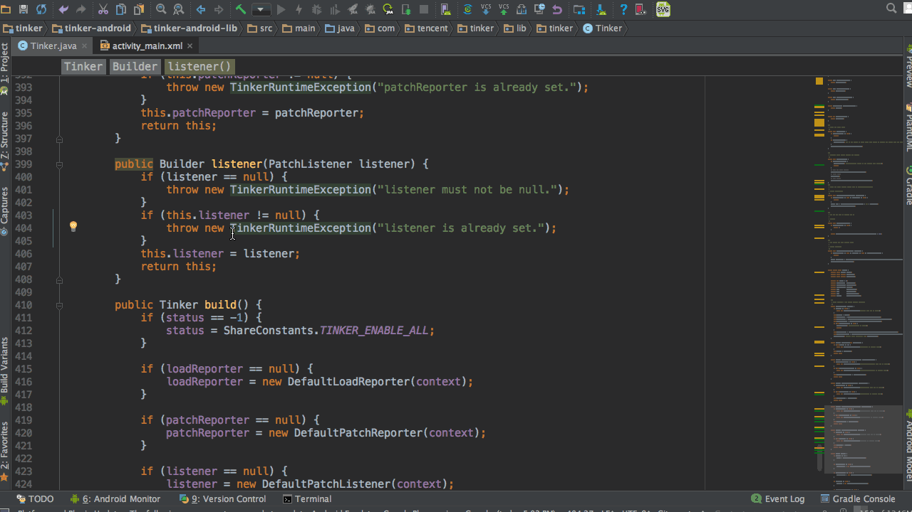
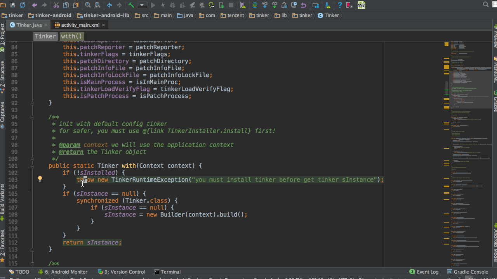
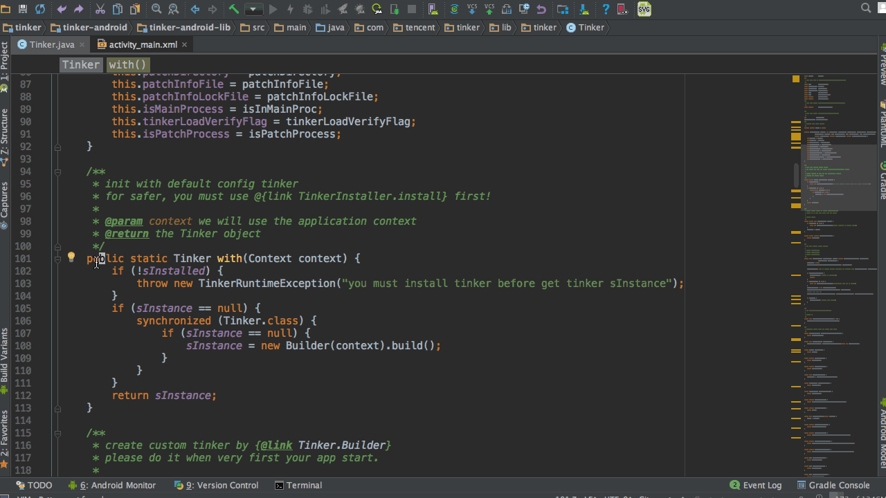
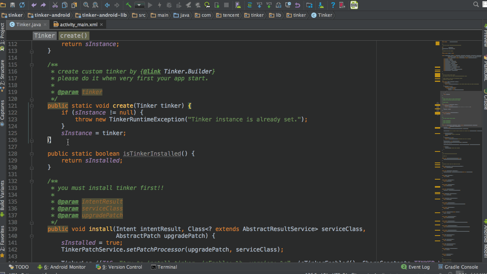
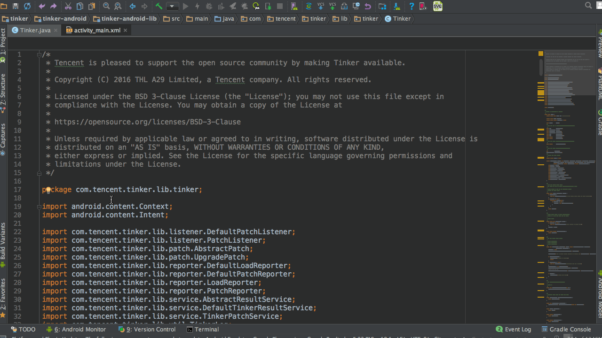
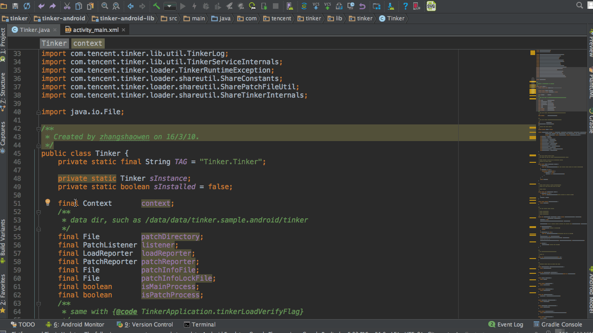
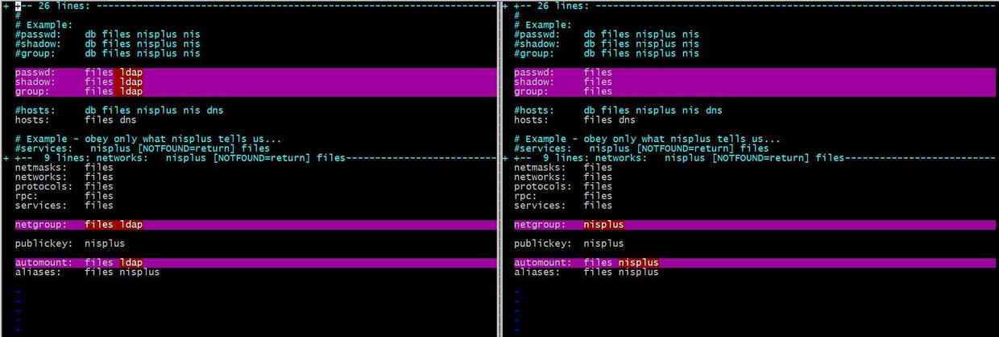

<!-- @import "[TOC]" {cmd="toc" depthFrom=1 depthTo=6 orderedList=false} -->

<!-- code_chunk_output -->

- [1. 简介](#1-简介)
  - [1.1. 进入vim](#11-进入vim)
- [2. 编辑模式](#2-编辑模式)
  - [2.1. 跳转](#21-跳转)
    - [2.1.1. 上下左右](#211-上下左右)
    - [2.1.2. 单词间定位](#212-单词间定位)
    - [2.1.3. 行内定位](#213-行内定位)
    - [2.1.4. 块定位](#214-块定位)
    - [2.1.5. 页面定位](#215-页面定位)
    - [2.1.6. 整屏滚动](#216-整屏滚动)
    - [2.1.7. 半屏滚动](#217-半屏滚动)
    - [2.1.8. 行滚动](#218-行滚动)
  - [2.2. 搜索匹配](#22-搜索匹配)
  - [2.3. 替换和删除](#23-替换和删除)
  - [2.4. 复制粘贴](#24-复制粘贴)
  - [2.5. 撤销和重复](#25-撤销和重复)
- [3. 插入模式](#3-插入模式)
  - [3.1. 进入插入模式](#31-进入插入模式)
  - [3.2. 退出插入模式](#32-退出插入模式)
- [4. 命令模式](#4-命令模式)
  - [4.1. 打开、保存、退出](#41-打开-保存-退出)
  - [4.2. 行号与文件](#42-行号与文件)
  - [4.3. 字符串搜索](#43-字符串搜索)
  - [4.4. Vim中的正则表达式](#44-vim中的正则表达式)
  - [4.5. 正文替换](#45-正文替换)
  - [4.6. 删除正文](#46-删除正文)
  - [4.7. 恢复文件](#47-恢复文件)
  - [4.8. 选项设置](#48-选项设置)
  - [4.9. Shell切换](#49-shell切换)
  - [4.10. 分屏与标签页](#410-分屏与标签页)
    - [4.10.1. 分屏](#4101-分屏)
    - [4.10.2. 标签页](#4102-标签页)
  - [4.11. 与外部工具集成](#411-与外部工具集成)
    - [4.11.1. diff](#4111-diff)
    - [4.11.2. sort](#4112-sort)
    - [4.11.3. xxd](#4113-xxd)
- [5. 视图模式](#5-视图模式)
  - [5.1. 操作](#51-操作)
- [6. vim配置](#6-vim配置)
  - [6.1. vim自身配置项](#61-vim自身配置项)
    - [6.1.1. 配置文件路径](#611-配置文件路径)
    - [6.1.2. vim配置选项](#612-vim配置选项)
    - [6.1.3. 配置项资料](#613-配置项资料)
- [7. Vim插件](#7-vim插件)
- [8. Vim完整文档](#8-vim完整文档)
- [9. Vim使用](#9-vim使用)
- [10. 参考](#10-参考)

<!-- /code_chunk_output -->

# 1. 简介

Vim（Vi[Improved]）是跨平台文本文件编辑工具，继承自Unix系统的Vi编辑器，支持Linux/Mac OS X/Windows系统。进入Vim编辑程序，可以在终端输入下面的命令：

```
$vim [filename]
```

## 1.1. 进入vim

```
vim filename             打开或新建文件，并将光标置于第一行首

vim +n filename          打开文件，并将光标置于第 n行首

vim + filename           打开文件，并将光标置于最后一行首

vim -r filename          在上次正用 vi编辑时发生系统崩溃，恢复文件

vim file1....filen       打开多个文件，依次编辑
```

如果文件不存在，它将为你建立一个新文件。Vim编辑程序有四种操作模式，分别称为 编辑模式、插入模式、命令模式和视图模式，当运行Vim时，首先进入编辑模式。

# 2. 编辑模式

当完成所有的编辑工作后，需要保存编辑器结果，退出编辑程序回到终端，可以发出ZZ命令（保存退出），连续按两次大写的Z键。ZQ（不保存退出）。

## 2.1. 跳转

### 2.1.1. 上下左右

```
k                上移；

j                下移；

h                左移；

l                右移。
```



### 2.1.2. 单词间定位

```
如果是大写，则单词允许包含标点

w        右移光标到下一个字的开头；

e        右移光标到一个字的末尾；

b        左移光标到前一个字的开头；
```



### 2.1.3. 行内定位

```
0         数字0，左移光标到本行的开始；

$         右移光标，到本行的末尾；

^         移动光标，到本行的第一个非空字符。

g_        到本行最后一个不是 blank 字符的位置。

fa        到下一个为 a 的字符处，你也可以fs到下一个为s的字符。

t,        到逗号前的第一个字符。逗号可以变成其它字符。

3fa       在当前行查找第三个出现的 a。

F/T       和 f 和 t 一样，只不过是相反方向;
```



### 2.1.4. 块定位

```
(/)       移动到 前/后 句 的开始；

{/}       跳转到 当前/下一个 段落 的开始。

%         定位到另一个匹配的括号
```



### 2.1.5. 页面定位

```
gg        将光标定位到文件第一行起始位置；

G         将光标定位到文件最后一行起始位置；

NG或Ngg   将光标定位到第 N 行的起始位置。

H         将光标移到屏幕上的起始行（或最上行）；

M         将光标移到屏幕中间；

L         将光标移到屏幕最后一行。
```

同样需要注意字母的大小写。H 和 L 命令还可以加数字。如 2H 表示将光标移到屏幕的第2行，3L 表示将光标移到屏幕的倒数第3行。

m\<a\>和'\<a\>（这是一对很强大的命令，可标记一个位置，然后在同页面快速定位到该标志。m表示mark，a是一个字母，可以是26字母的其中一个，'是单引号，后面跟上前面标记的字母）


### 2.1.6. 整屏滚动

```
ctrl+b    在文件中向上移动一页（相当于 page up）；

ctrl+f    在文件中向下移动一页（相当于 page down）；
```


### 2.1.7. 半屏滚动

```
ctrl+u    屏幕往后移动半页

ctrl+d    屏幕往前移动半页
```



### 2.1.8. 行滚动

```
Ctrl+e    向下滚动一行内容 

Ctrl+y    向上滚动一行内容
```



## 2.2. 搜索匹配

```
/str1     正向搜索字符串 str1；

n         继续搜索，找出 str1 字符串下次出现的位置；

N         继续搜索，找出 str1 字符串上一次出现的位置；

?str2     反向搜索字符串 str2 。

*         当光标停留在一个单词上，* 键会在文件内搜索该单词，并跳转到下一处；

#         当光标停留在一个单词上，# 在文件内搜索该单词，并跳转到上一处；
```

Vim中执行搜索匹配最强大的地方是结合 **正则表达式** 来搜索，后续将会介绍。

## 2.3. 替换和删除

Vim常规的删除命令是 `d`(删除 **行** )、 `x` (删除 **字符** ), 结合Vim的其他特性可以实现基础的删除功能。将光标定位于文件内指定位置后，可以用其他字符来替换光标所指向的字符，或从当前光标位置删除一个或多个字符或一行、多行。例如：

```
rc        用 c 替换光标所指向的当前字符；
nrc       用 c 替换光标所指向的前 n 个字符；
5rA       用 A 替换光标所指向的前 5 个字符；

x         删除光标所指向的当前字符；
nx        删除光标所指向的前 n 个字符；
3x        删除光标所指向的前 3 个字符；

dw        删除光标右侧的字；
ndw       删除光标右侧的 n 个字；
3dw       删除光标右侧的 3 个字；

db        删除光标左侧的字；
ndb       删除光标左侧的 n 个字；
5db       删除光标左侧的 5 个字；

dd        删除光标所在行，并去除空隙；
ndd       删除（剪切） n 行内容，并去除空隙；
3dd       删除（剪切） 3 行内容，并去除空隙；

daw       删除光标所在的单词
```

d{motion}：

剪切 motion 命令跨过的字符到剪贴板。比如，dw 会剪切一个词而 dfS 会将从当前光标到下一个 S 之间的字符剪切至剪贴板。

其他常用的删除命令有：

```
d$        从当前光标起删除字符直到行的结束；
D         从当前光标起删除字符直到行的结束；
d0        从当前光标起删除字符直到行的开始；
J         删除本行的回车符（CR），并和下一行合并。
```

Vim常规的替换命令有 `c` 和 `s` ，结合Vim的其他特性可以实现基础的替换功能，不过**替换命令**执行以后，通常会由 **编辑模式** 进入 **插入模式** ：

```
s     用输入的正文替换光标所指向的字符；
S     删除当前行，并进入编辑模式；
ns    用输入的正文替换光标右侧 n 个字符；
nS    删除当前行在内的 n 行，并进入编辑模式；

cw    用输入的正文替换光标右侧的字；
cW    用输入的正文替换从光标到行尾的所有字符（同 c$ )；
ncw   用输入的正文替换光标右侧的 n 个字；

cb    用输入的正文替换光标左侧的字；
ncb   用输入的正文替换光标左侧的 n 个字；

cd    用输入的正文替换光标的所在行；
ncd   用输入的正文替换光标下面的 n 行；

c$    用输入的正文替换从光标开始到本行末尾的所有字符；
c0    用输入的正文替换从本行开头到光标的所有字符。
```

c{motion}：和 d{motion} 类似，不过最后进入插入模式。

## 2.4. 复制粘贴

从正文中删除的内容（如字符、字或行）并没有真正丢失，而是被剪切并复制到了一个内存缓冲区中。用户可将其粘贴到正文中的指定位置。完成这一操作的命令是：

```
p     小写字母 p，将缓冲区的内容粘贴到光标的后面；
P     大写字母 P，将缓冲区的内容粘贴到光标的前面。
```

如果缓冲区的内容是字符或字，直接粘贴在光标的前面或后面；如果缓冲区的内容为整行正文，执行上述粘贴命令将会粘贴在当前光标所在行的上一行或下一行。

注意上述两个命令中字母的大小写。Vim 编辑器经常以一对大、小写字母（如 p 和 P）来提供一对相似的功能。通常，小写命令在光标的后面进行操作，大写命令在光标的前面进行操作。

有时需要复制一段正文到新位置，同时保留原有位置的内容。这种情况下，首先应当把指定内容**复制**（而不是剪切）到内存缓冲区。完成这一操作的命令是：

```
yy    复制当前行到内存缓冲区；
nyy   复制 n 行内容到内存缓冲区；
5yy   复制 5 行内容到内存缓冲区；
“+y   复制 1 行到操作系统的粘贴板；
“+nyy 复制 n 行到操作系统的粘贴板。
```

y{motion}：和d{motion}类似，不过是拷贝。y3t″ 将会拷贝从当前光标到第三个出现的引号之间的内容到剪贴板。

## 2.5. 撤销和重复

在编辑文档的过程中，为消除某个错误的编辑命令造成的后果，可以用撤消命令。另外，如果用户希望在新的光标位置重复前面执行过的编辑命令，可用重复命令。

```
u        撤消前一条命令的结果；

.        重复最后一条修改正文的命令。

ctrl+r   恢复刚才撤销的动作
```

# 3. 插入模式

## 3.1. 进入插入模式

在编辑模式下正确定位光标之后，可用以下命令切换到插入模式：

```
i     在光标左侧插入正文
a     在光标右侧插入正文

o     在光标所在行的下一行增添新行
O     在光标所在行的上一行增添新行

I     在光标所在行的开头插入
A     在光标所在行的末尾插入

c{motion}    删除 motion 命令跨过的字符，并且进入插入模式。比如：c$，这将会删除从光标位置到行尾的字符并且进入插入模式。ct！，这会删除从光标位置到下一个叹号（但不包括），然后进入插入模式。被删除的字符被存在了剪贴板里面，并且可以再粘贴出来。

s{motion}
```

## 3.2. 退出插入模式

退出插入模式的方法是，按 ESC 键或组合键 Ctrl+[ ，退出插入模式之后，将会进入编辑模式 。

# 4. 命令模式

在Vim的命令模式下，可以使用复杂的命令。在编辑模式下键入 : ，光标就跳到屏幕最后一行，并在那里显示冒号，此时已进入命令模式。命令模式又称 末行模式 ，用户输入的内容均显示在屏幕的最后一行，按回车键，Vim 执行命令。

## 4.1. 打开、保存、退出

在已经启动的Vim中打开一个文件需要用 :e 命令：

```
:e path_to_file/filename
```

保存当前编辑的文件需要用 :w 命令（单词 write 的缩写）：

```
:w
```

将当前文件另存为 file_temp 则：

```
:w file_temp
```

在编辑模式下可以用 ZZ 命令退出Vim编辑程序，该命令保存对正文所作的修改，覆盖原始文件。如果只需要退出编辑程序，而不打算保存编辑的内容，可用下面的命令：

```
:q    在未作修改的情况下退出；
:q!   放弃所有修改，退出编辑程序。
```

保存并退出则可以讲两条命令结合起来使用（注意命令顺序，先保存，后退出）：

```
:wq
```

## 4.2. 行号与文件

编辑中的每一行正文都有自己的行号，用下列命令可以移动光标到指定行（效果与 编辑模式 下的 ngg 或 nG 相同）：

```
:n             将光标移到第 n 行
:set nu        显示行号 
:set nonu      取消行号显示
: .+5          将光标移到当前行之后的第5行 
: $            将光标移到正文最后一行
```

命令模式下，可以规定命令操作的行号范围。数值用来指定绝对行号；字符“.”表示光标所在行的行号；字符符“$”表示正文最后一行的行号；简单的表达式，例如“.+5”表示当前行往下的第 5 行。例如：

```
:345         将光标移到第 345 行
:345w file   将第 345 行写入 file 文件
:3,5w file   将第 3 行至第 5 行写入 file 文件
:1,.w file   将第 1 行至当前行写入 file 文件
:.,$w file   将当前行至最后一行写入 file 文件
:.,.+5w file 从当前行开始将 6 行内容写入 file 文件
:1,$w file   将所有内容写入 file 文件，相当于 :w file 命令
```

在命令模式下，允许从文件中读取正文，或将正文写入文件。例如：

```
:w          将编辑的内容写入原始文件，用来保存编辑的中间结果
:wq         将编辑的内容写入原始文件并退出编辑程序（相当于 ZZ 命令）
:w file     将编辑的内容写入 file 文件，保持原有文件的内容不变
:a,bw file  将第 a 行至第 b 行的内容写入 file 文件
:r file     读取 file 文件的内容，插入当前光标所在行的后面
:e file     编辑新文件 file 代替原有内容
:f file     将当前文件重命名为 file
:f          打印当前文件名称和状态，如文件的行数、光标所在的行号等
```

命令":f"相当Ctrl+g

## 4.3. 字符串搜索

在 编辑模式 讲过字符串的搜索，此处的 命令模式 也可以进行字符串搜索，给出一个字符串，可以通过搜索该字符串到达指定行。如果希望进行正向搜索，将待搜索的字符串置于两个 / 之间；如果希望反向搜索，则将字符串放在两个 ? 之间。例如：

```
:/str/         正向搜索，将光标移到下一个包含字符串 str 的行
:?str?         反向搜索，将光标移到上一个包含字符串 str 的行
:/str/w file   正向搜索，并将第一个包含字符串 str 的行写入 file 文件
:/str1/,/str2/w file   正向搜索，并将包含字符串 str1 的行至包含字符串 str2 的行写
```

## 4.4. Vim中的正则表达式

当给Vim指定搜索字符串时，可以包含具有特殊含义的字符。包含这些特殊字符的搜索字符串称为正则表达式（Regular Expressions）。例如，要搜索一行正文，这行正文的开头包含 struct 字。下面的命令做不到这一点：

```
:/struct/
```

因为它只找出在行中任意位置包含 struct的第一行，并不一定在行的开始包含 struct 。解决问题的办法是在搜索字符串前面加上特殊字符^：

```
:/^struct/
```

^ 字符比较每行开头的字符串。所以上面的命令表示：找出以字符串 struct 开头的行。

也可以用类似办法在搜索字符串后面加上表示行的末尾的特殊字符 $ 来找出位于行末尾的字：

```
:/struct$/
```

下表给出大多数特殊字符和它们的含义：

```
^         放在字符串前面，匹配行首的字；
$         放在字符串后面，匹配行尾的字；
\<        匹配一个字的字头；
\>        匹配一个字的字尾；
.         匹配任何单个正文字符；
[str]     匹配 str 中的任何单个字符；
[^str]    匹配任何不在 str 中的单个字符；
[a-b]     匹配 a 到 b 之间的任一字符；
*         匹配前一个字符的 0 次或多次出现；
\         转义后面的字符。
```

简单介绍这么多，正则表达式知识可以参考
《正则表达式30分钟入门》:http://deerchao.net/tutorials/regex/regex.htm

另外，进阶的Vim正则表达式还有对Magic 模式的介绍，可以参考
《Vim正则表达式详解》:
http://blog.csdn.net/salc3k/article/details/8222397

## 4.5. 正文替换

利用 `:s` 命令可以实现字符串的替换，将第一个//之间的正则表达式替换成第二个//之间的字符串。

具体的用法包括：

```
:[range]s/from/to/[flags]

:%s/str1/str2/        用字符串 str2 替换行中首次出现的字符串 str1
:s/str1/str2/g        用字符串 str2 替换行中所有出现的字符串 str1
:.,$ s/str1/str2/g    用字符串 str2 替换正文当前行到末尾所有出现的字符串 str1
:1,$ s/str1/str2/g    用字符串 str2 替换正文中所有出现的字符串 str1
:g/str1/s//str2/g     功能同上
:m,ns/str1/str2/g     将从m行到n行的str1替换成str2
```

从上述替换命令可以看到：

- g 放在命令末尾，表示对搜索字符串的每次出现进行替换,不止匹配每行中的第一次出现；不加 g，表示只对搜索字符串的首次出现进行替换；g 放在命令开头，表示对正文中所有包含搜索字符串的行进行替换操作;

- s 表示后面跟着一串替换的命令；

- % 表示替换范围是所有行，即全文。

另外一个实用的命令，在Vim中统计当前文件中字符串 str1 出现的次数，可用替换命令的变形：

```
:%s/str1/&/gn
```

## 4.6. 删除正文

在命令模式下，同样可以删除正文中的内容。例如：

```
:d                              删除光标所在行
:3d                             删除 3 行
:.,$d                           删除当前行至正文的末尾
:/str1/,/str2/d                 删除从字符串 str1 到 str2 的所有行
:g/^\(.*\)$\n\1$/d              删除连续相同的行，保留最后一行
:g/\%(^\1$\n\)\@<=\(.*\)$/d     删除连续相同的行，保留最开始一行
:g/^\s*$\n\s*$/d                删除连续多个空行，只保留一行空行
:5,20s/^#//g                    删除5到20行开头的 # 注释
```

总之，Vim的初级删除命令是用 d ，高级删除命令可以用 正则替换 的方式执行。

## 4.7. 恢复文件

Vim 在编辑某个文件时，会另外生成一个临时文件，这个文件的名称通常以 . 开头，并以 .swp 结尾。

Vim 在正常退出时，该文件被删除，若意外退出，而没有保存文件的最新修改内容，则可以使用恢复命令 :recover 来恢复文件，也可以在启动Vim时用 -r 选项。

## 4.8. 选项设置

为控制不同的编辑功能，Vim 提供了很多内部选项。利用 :set 命令可以设置选项。基本语法为：

```
:set option         设置选项 option
```

常见的功能选项包括：

```
autoindent        设置该选项，则正文自动缩进
ignorecase        设置该选项，则忽略规则表达式中大小写字母的区别
number            设置该选项，则显示正文行号
ruler             设置该选项，则在屏幕底部显示光标所在行、列的位置
tabstop           设置按 Tab 键跳过的空格数。例如 :set tabstop=n，n 默认值为 8
mk                将选项保存在当前目录的 .exrc 文件中
```

## 4.9. Shell切换

当处于编辑的对话过程中时，可能需要执行一些Linux命令。如果需要保存当前的结果，退出编辑程序，再执行所需的Linux命令，然后再回头继续编辑过程，就显得十分累赘。如果能在编辑的环境中运行Linux命令就要省事得多。在Vim中，可以用下面的命令来做到这一点：

```
:!shell_command   执行完 shell_command 后回到Vim
```

这称为Shell切换。它允许执行任何可以在标准的Shell提示符下执行的命令。当这条命令执行完毕，控制返回给编辑程序。又可以继续编辑对话过程。

## 4.10. 分屏与标签页

### 4.10.1. 分屏

普通的Vim模式，打开一个Vim程序只能查看一个文件，如果想同时查看多个文件，就需要用到Vim分屏与标签页功能。

Vim的分屏，主要有两种方式：上下分屏（水平分屏）和左右分屏（垂直分屏），在命令模式分别敲入以下命令即可：

```
:split（可用缩写 :sp）            上下分屏；
:vsplit（可用缩写 :vsp）          左右分屏。
```

另外，也可以在终端里启动vim时就开启分屏操作：

```
vim -On file1 file2...   打开 file1 和 file2 ，垂直分屏
vim -on file1 file2...   打开 file1 和 file2 ，水平分屏
```

大O表示垂直分割(vertical)，小o表示水平分割（默认horizontal），后面的n表示分几个屏，实际上我觉得不用写，默认按后面要分割的文件数来决定分几个屏。

理论上，一个Vim窗口，可以分为多个Vim屏幕，切换屏幕需要用键盘快捷键，命令分别有：

```
Ctrl+w+h    切换到当前分屏的左边一屏；
Ctrl+w+l    切换到当前分屏的右边一屏；
Ctrl+w+j    切换到当前分屏的下方一屏；
Ctrl+w+k    切换到当前分屏的上方一屏。
```

即键盘上的h,j,k,l 四个Vim专用方向键，配合Ctrl键和w键（window的缩写），就能跳转到目标分屏。另外，也可以直接按 Ctrl+w+w 来跳转分屏，不过跳转方向则是在当前Vim窗口所有分屏中，按照逆时针方向跳转。
下面是改变尺寸的一些操作，主要是高度，对于宽度你可以使用 [Ctrl+W <] 或是 [Ctrl+W >] ，但这可能需要最新的版本才支持。

```
Ctrl+W =    让所有的屏都有一样的高度；
Ctrl+W +    增加高度；
Ctrl+W -    减少高度。
```

### 4.10.2. 标签页

Vim的标签（Tab）页，类似浏览器的标签页，一个标签页打开一个Vim的窗口，一个Vim的窗口可以支持N个分屏。
在Vim中新建一个标签的命令是：

```
:tabnew
```

如果要在新建标签页的同时打开一个文件，则可以在命令后面直接附带文件路径：

```
:tabnew filename
```

Vim中的每个标签页有一个唯一的数字序号，第一个标签页的序号是0，从左向右依次加一。关于标签页有一系列操作命令，简介如下：

```
:tN[ext]                跳转到上一个匹配的标签
:tabN[ext]              跳到上一个标签页
:tabc[lose]             关闭当前标签页
:tabdo                  为每个标签页执行命令
:tabe[dit]              在新标签页里编辑文件
:tabf[ind]              寻找 'path' 里的文件，在新标签页里编辑之
:tabfir[st]             转到第一个标签页
:tabl[ast]              转到最后一个标签页
:tabm[ove]  N           把标签页移到序号为N位置
:tabnew [filename]      在新标签页里编辑文件
:tabn[ext]              转到下一个标签页
:tabo[nly]              关闭所有除了当前标签页以外的所有标签页
:tabp[revious]          转到前一个标签页
:tabr[ewind]            转到第一个标签页
```

## 4.11. 与外部工具集成

Vim可以与许多外部程序集成，功能十分强大，比如 diff , ctags , sort , xxd 等等，下面选取几个简单介绍一下。

### 4.11.1. diff

Linux命令 diff 用来对比两个文件的内容，不过对比结果显示在终端里，可读性比较差。结合Vim，在终端里可以直接输入命令 vimdiff，后面跟两个文件名作为参数：

```
vimdiff file1 file2
```

即可在Vim里分屏显示两个文件内容的对比结果，对文件内容差异部分进行高亮标记，还可以同步滚动两个文件内容，更可以实时修改文件内容，方便程度和用户体验大大提高。

```
vimdiff a.txt b.txt
```

如果直接给 -d 选项是一样的

```
vim -d a.txt b.txt
```

除了在终端里开启vimdiff 功能，也可以在打开Vim后，在Vim的命令模式输入相关命令来开启 vimdiff 功能：

```
:diffsplit abc.txt
```

如果你现在已经开启了一个文件，想Vim帮你区分你的文件跟 abc.txt 有什么区别，可以在Vim中用 diffsplit 的方式打开第二个文件，这个时候Vim会用 split（分上下两屏）的方式开启第二个文件，并且通过颜色，fold来显示两个文件的区别
这样Vim就会用颜色帮你区分开2个文件的区别。如果文件比较大（源码）重复的部分会帮你折叠起来。

```
:diffpatch filename
```

通过 :diffpatch 你的patch的文件名，就可以以当前文件加上你的patch来显示。vim会split一个新的屏，显示patch后的信息并且用颜色标明区别。
如果不喜欢上下对比，喜欢左右（比较符合视觉）可以在前面加 vert ，例如：

```
:vert diffsplit abc.txt
:vert diffpatch abc.txt
```

看完diff，用 :only 回到原本编辑的文件，觉得diff的讨厌颜色还是在哪里，只要用 :diffoff 关闭就好了。

还有个常用的diff中的就是 :diffu ,这个是 :diffupdate 的简写，更新的时候用。

Vim的diff功能显示效果如下所示：



### 4.11.2. sort

Linux命令 sort 可以对文本内容进行按行中的字符比较、排序，但在终端里使用 sort 命令处理文件，并不能实时查看文件内容。具体用法请自查手册。

### 4.11.3. xxd

vim+xxd 是Linux下最常用的二进制文本编辑工具，xxd其实是Vim外部的一个转换程序，随Vim一起发布，在Vim里调用它来编辑二进制文本非常方便。
首先以二进制模式在终端里打开一个文件：

```
vim -b filename
```

Vim 的 -b 选项是告诉 Vim 打开的是一个二进制文件，不指定的话，会在后面加上 0x0a ，即一个换行符。

然后在Vim的命令模式下键入：

```
:%!xxd
```

即可看到二进制模式显示出来的文本，看起来像这样：

```
0000000: 1f8b 0808 39d7 173b 0203 7474 002b 4e49  ....9..;..tt.+NI 
0000010: 4b2c 8660 eb9c ecac c462 eb94 345e 2e30  K,......b..4^.0 
0000020: 373b 2731 0b22 0ca6 c1a2 d669 1035 39d9  7;'1.".....i.59
```

然后就可以在二进制模式下编辑该文件，编辑后保存，然后用下面命令从二进制模式转换到普通模式：

```
:%!xxd -r
```

另外，也可以调整二进制的显示模式，默认是 2 个字节为一组，可以通过 g 参数调整每组字节数：

```
:%!xxd -g 1         表示每1个字节为1组 
:%!xxd -g 2         表示每2个字节为1组(默认) 
:%!xxd -g 4         表示每4个字节为1组
```

# 5. 视图模式

视模式简单来说就是选中一块编辑区域，然后在上面执行一些操作，比如删除，替换，改变大小写等。

有三种 visual 模式

```
模式类型        激活方式        选择效果
字符文本        v(小写)         逐个字符选择文本
行文本          V(大写)         逐行选择文本
块文本          <C-v>           按照块的方式选择文本
```

## 5.1. 操作

在可视模式中也可以使用编辑模式模式下的修改命令。

```
命令    命令效果
d       删除选中文本
c       修改选中文本
r       替换选中文本
I       在选中文本前插入
A       在选中文本后插入
gu      选中区域转为小写
gU      选中区域转为大写
g~      大小写互调
>       向右缩进一个单位
<       向左缩进一个单位
```

# 6. vim配置

最初安装的Vim功能、特性支持比较少，用起来比较费劲，想要稍微“好用”一点，需做一些初步的配置。Vim的配置主要分为**Vim本身特性的配置**和**外部插件的配置**两部分。

## 6.1. vim自身配置项

Vim的配置是通常是存放在用户主目录的 `.vimrc` 的隐藏文件中的。就Vim本身特性来说，基础的配置有编程语言语法高亮、缩进设置、行号显示、搜索高亮、TAB键设置、字体设置、Vim主题设置等等，稍微高级一些的有编程语言缩进、自动补全设置等.

### 6.1.1. 配置文件路径

首先，让我们在Linux下的vim中输入“:version”命令


Windows下面输入“:version”查看结果


- 在windows下，有三个可选的用户`vimrc`文件，一个是`$HOME_vimrc`，另一个是`$HOME\vimfiles\vimrc`，还有一个是`$VIM_vimrc`。vim启动时，会先尝试执行系统的vimrc文件(通常此文件不存在)，然后将按照上述顺序查找用户vimrc，并执行所找到的第一个用户vimrc中的命令，忽略其余的用户vimrc。

- 在Linux下使用的vimrc文件名为vimrc，而在windows下因为不支持以点(.)开头的文件名，vimrc文件的名字使用`_vimrc`。不过，在Linux下，如果未找到名为.vimrc的文件，也会尝试查找名为`_vimrc`的文件；而在windows下也是这样，只不过查找顺序颠倒一下，如果未找到名为`_vimrc`的文件，会去查找.vimrc。

- 从这里可以看出，vimrc的执行先于gvimrc。所以我们可以把全部vim配置命令都放在vimrc中，不需要用gvimrc。

如果不知道`$HOME`或者`$VIM`具体是哪个目录，可以在vim中用下面的命令查看：

```
:echo $VIM 
:echo $HOME 
```

在windows版本的vim安装时，缺省会安装一个`$VIM/_vimrc`的，你可以直接修改这个`_vimrc`，加入你自己的配置(使用`:e $VIM/_vimrc`可以打开此文件。或者，你也可以在windows中增加一个名为HOME的环境变量(控制面板->系统–>高级–>环境变量)，然后把你的vimrc放在HOME环境变量所指定的目录中。从上面:version命令的输出看到，`$HOME/_vimrc`如果存在，就会执行这个文件中的配置，而跳过`$VIM/_vimrc`。

如果使用”`vim -u filename`“命令来启动vim，则会用你**指定的filename**作为vim的**配置文件**(在调试你的vimrc时有用)；如果用”`vim -u NORC`“命令启动vim，则不读取任何vimrc文件：当你怀疑你的vimrc配置有问题时，可以用这种方式跳过vimrc的执行。

通过命令

```cpp
:echo $MYVIMRC
```

查看当前vim配置文件路径

### 6.1.2. vim配置选项

以下介绍几个常用的底行模式命令：

（1）. 设置缩进

:set smartindent // 设置缩进

:set smartindent shiftwidth=4 // C语言自动缩进，缩进值为4个字符宽度

（2）. 显示光标行列信息

:set ruler // 显示光标信息（右下角）

（3）. 查看制表符

:set list // 显示制表符，以^符号显示制表符的位置

（4）. 查看行数信息

:set number //显示行号（左边）

（5）. 关键字高亮

:syntax on //关键字高亮

（6）. 多文件编辑 ，在编写程序时有可能需要同时编辑多个文件，在这种情况下，需要如下设置

:split two.c // 多文件编辑

当然，如果不嫌麻烦，可以在每次打开Vim时 输入如上命令，如我经常用的是:set number :set ruler :syntax on :set smartindent 命令，如果将平时在底行模式下输入的命令直接写入配置文件，则以后使用Vim时不用再次输入这些命令。

首先，试着在Vi的底行模式下输入如下命令，如果不支持的话，去下载一个Vim的全版本，sudo apt-get install vim-full。

以下是修改配置文件的方法：

（1）. 找到Vimrc文件。

（2） 查看文件的权限：

```
ls -l vimrc
shisir@shisir-desktop:/usr/share/vim$ cd /etc/vim
shisir@shisir-desktop:/etc/vim$ ls
gvimrc vimrc vimrc.tiny
shisir@shisir-desktop:/etc/vim$ ls -l vimrc
-r--r--r-- 1 root root 2492 2009-04-10 08:08 vimrc
```

（3） 如果没有写权限的话，修改权限，使我们可以修改该配置文件

```
sudo chmod a+w vimrc
```

（4）根据个人需要将上诉命令写入配置文件

比如，我个人的设置是： syntax on , set ruler ,set number , set smartindent shiftwidth=4

下面贴上我的vimrc文件的配置信息：

```
"显示行号
set number
"检测文件的类型
filetype on
"记录历史的行数
set history=1000
"自动对齐
set autoindent
set cindent
"智能选择对齐方式
set smartindent
"tab为4个空格
set tabstop=4
"当前行之间交错时使用4个空格
set shiftwidth=4
"设置匹配模式，输入做括号会出现右括号
set showmatch
"编辑时显示光标状态
set ruler
"快速匹配
set incsearch
"修改文件自动备份
if has("vms")
set nobackup
else
set backup
endif
```

### 6.1.3. 配置项资料

具体配置项可以自行查资料，全面详细的配置项介绍可以参考：

《Vim Options》：

http://vimcdoc.sourceforge.net/doc/options.html#%27completeopt%27

# 7. Vim插件

Vim“编辑器之神”的称号并不是浪得虚名，然而，这个荣誉的背后，或许近半的功劳要归功于强大的插件支持特性，以及社区开发的各种各样功能强大的插件。

平时开发人员常用插件主要是目录（文件）查看和管理、编程语言缩进与自动补全、编程语言Docs支持、函数跳转、项目管理等等，简单配置可以参考下面：

《Vim插件简单介绍》：  
http://blog.segmentfault.com/xuelang/1190000000630547

《手把手教你把Vim改装成一个IDE编程环境(图文)》：  
http://blog.csdn.net/wooin/article/details/1858917

《将Vim改造为强大的IDE》：  
http://www.cnblogs.com/zhangsf/archive/2013/06/13/3134409.html

当然，这些插件都是拜Vim本身的插件支持特性所赐。Vim为了支持丰富的第三方插件，自身定义了一套简单的脚本开发语言，供程序员自行开发自己所需要的插件，插件开发介绍可以参考：

《Writing Vim Plugins》：  
http://stevelosh.com/blog/2011/09/writing-vim-plugins/

# 8. Vim完整文档

Vim官方文档：http://vimdoc.sourceforge.net/

Vim中文用户手册7_3.pdf ：http://pan.baidu.com/s/1jGzbTBo

在线帮助：在VIM中调用命令:help或者:help Commands或者:help options

# 9. Vim使用

1. 要知道它是支持插件，绝大部分插件在github。什么插件都不装的vim是很简陋的。
2. 第一个插件是插件管理器：vim-plug
3. 折腾vim的过程就是折腾配置插件的过程

上面三步是基本的

4. 很多插件用得不爽，所以学习写插件。
5. vim本身用得不爽，遇到bug，学习c语言给vim的源码提交patch改善。
6. 实在不爽，自己造一个轮子，写一个更好编辑器。

这才是一个黑客应该具有的素质：用得不爽就自己创造。

# 10. 参考

参考：http://www.jianshu.com/p/bcbe916f97e1

