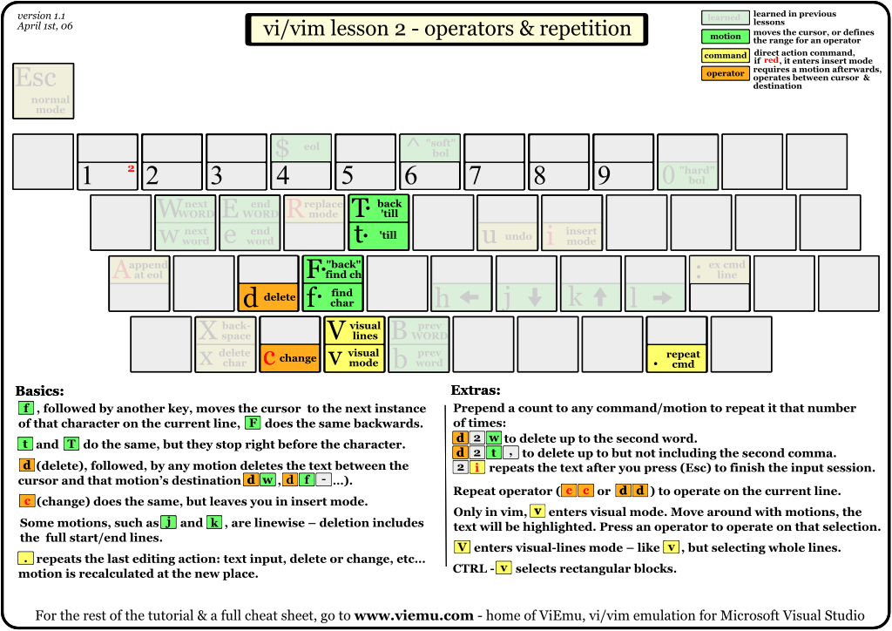

<!-- @import "[TOC]" {cmd="toc" depthFrom=1 depthTo=6 orderedList=false} -->

<!-- code_chunk_output -->

- [1. 图形小抄](#1-图形小抄)
- [2. 图形化教程](#2-图形化教程)
  - [2.1. lession 1:](#21-lession-1)
  - [2.2. lession 2:](#22-lession-2)
  - [2.3. lession 3:](#23-lession-3)
  - [2.4. lession 4:](#24-lession-4)
  - [2.5. lession 5:](#25-lession-5)
  - [2.6. lession 6:](#26-lession-6)
  - [2.7. lession 7:](#27-lession-7)
- [3. vim 命令图解](#3-vim-命令图解)
- [4. Vim特性图解](#4-vim特性图解)
- [5. 参考](#5-参考)

<!-- /code_chunk_output -->

# 1. 图形小抄

（Graphical cheat sheet）

下图描述了完全的vi/vim输入模式、所有按键的功能以及所有主要特性。你可以把它当作一个压缩版的vi/vim手册。

图中没有关于查找和替换的，应该用下面的。

- 自上而下的查找操作  /word小写的n和N
- 自下而上的查找操作  ?word小写的n和N
- 普通替换操作    :s/old/new
- 当前行进行匹配和替换、命令替换当前行中第一个匹配的字符行内全部替换操作s/old/new/g
- 当前行替换所有匹配的字符串在行区域内进行替换操作:#,#s/old/new/g
- 在整个文件内的替换操作:%s/old/new/g
- 在整个文档中进行替换操作的命令使用替换的确认功能:s/old/new/c:s/old/new/gc:#,#s/old/new/gc:%s/old/new/gc

# 2. 图形化教程

（Graphical cheat sheet based tutorial）

这个教程由7张图片组成，覆盖了vi/vim的主要命令。该教程是循序渐进的，首先是最简单以及最常用的部分，然后是一些高级特性。

## 2.1. lession 1:

## 2.2. lession 2:

## 2.3. lession 3:

## 2.4. lession 4:

## 2.5. lession 5:

## 2.6. lession 6:

## 2.7. lession 7:

# 3. vim 命令图解

# 4. Vim特性图解

# 5. 参考

翻译自

http://www.viemu.com/a_vi_vim_graphical_cheat_sheet_tutorial.html
