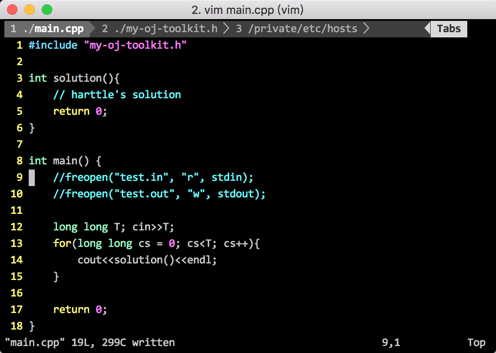

<!-- @import "[TOC]" {cmd="toc" depthFrom=1 depthTo=6 orderedList=false} -->

<!-- code_chunk_output -->

- [整体介绍](#整体介绍)
- [Buffer(缓冲区)](#buffer缓冲区)
  - [1. 介绍](#1-介绍)
  - [2. 打开与关闭](#2-打开与关闭)
  - [3. 缓冲区跳转](#3-缓冲区跳转)
  - [4. 分屏](#4-分屏)
  - [5. 利用通配符进行缓冲区跳转](#5-利用通配符进行缓冲区跳转)
- [Tab(标签页)](#tab标签页)
  - [1. 介绍](#1-介绍-1)
  - [2. 打开与关闭](#2-打开与关闭-1)
- [3. 移动标签](#3-移动标签)
- [4. 标签跳转](#4-标签跳转)
  - [Buffer](#buffer)

<!-- /code_chunk_output -->

# 整体介绍

多文件编辑的场景太常见了：代码比对、项目重构、模块构建… 最初harttle在碰到这些问题时直接转向IDE了，其实Vim不仅支持多文件编辑，而且支持多种风格：标签页(tab)、窗口(window)、缓冲区(buffer)等。

Vim 中的 window 和 tab 非常具有迷惑性，跟我们平时所说的 “窗口” 和 “标签页” ，是完全不同的两个概念，请看 vimdoc 给出的定义:

```
A buffer is the in-memory text of a file.
A window is a viewport on a buffer.
A tab page is a collection of windows.
```

简单来说就是:

- buffer 可以看做是内存中的文本文件，在没写到磁盘上时，所有的修改都发生在内存中;
- window 用来显示 buffer，同一个 buffer 可以被多个 window 显示(一个 window 只能显示一个 buffer);
- tab page 包含了一系列的 window，其实叫 layout 更合适，看 [这里](http://stackoverflow.com/questions/102384/using-vims-tabs-like-buffers/103590#103590)

vim中的buffer就相当于一个文件，windows相当于一个窗口的frame（一个显示区，viewport），tab相当于一个窗口。也就是说，一个显示区（frame）显示一个文件（buffer），一个窗口（tab）可以有多个显示区（frame）。

来看 Vim 官网上的一幅图:


# Buffer(缓冲区)

## 1. 介绍

引用Vim官方解释，缓冲区是**一个文件的内容**占用的**那部分Vim内存**：

>
>A buffer is an area of Vim’s memory used to hold text read from a file. In addition, an empty buffer with no associated file can be created to allow the entry of text. –vim.wikia

先来回顾一下Tab，Window，Buffer的关系吧！


**基于缓冲区的多文件编辑**是Vim**最为推荐的做法**，Vim维护着你在当前打开的这些Buffer里的所有跳转， Ctrl+o和Ctrl+i可以遍历这些光标位置（参考：在Vim中进行快速光标移动）

但一个窗口内只有一个Buffer是处于可见状态的，所以Buffer的用法最不直观。

学习Vim就要克服那些不直观的操作！因为Vim本身就是基于CLI的，而我们相信CLI就是效率。本文便来总结一下Buffer相关的命令与操作。

## 2. 打开与关闭

**不带任何参数**打开多个文件便可以把它们都放入缓冲区（Buffer）：

```
vim a.txt b.txt
```

>当你使用:q关闭文件时？是否看到过1 more file to edit的警告？那就是缓冲区中的文件。

进入Vim后，通过`:e[dit]`命令即可打开某个文件到缓冲区。

使用`:new`可以打开**一个新窗口**。 

关闭一个文件可以用`:q`，移出缓冲区用`:bd[elete]`（占用缓冲区的文件对你毫无影响，多数情况下不需要这样做）。

>如果Buffer未保存:bd会失败，如果强制删除可以:bd!。

## 3. 缓冲区跳转

缓冲区之间跳转最常用的方式便是 `Ctrl+^`（不需要按下Shift）来**切换当前缓冲区**和**上一个缓冲区**。 

另外，还提供了很多跳转命令：

```
:ls, :buffers       列出所有缓冲区
:bn[ext]            下一个缓冲区
:bp[revious]        上一个缓冲区
:b {number, expression}     跳转到指定缓冲区
```

:b接受缓冲区编号，或者部分文件名。例如：

* :b2将会跳转到编号为2的缓冲区，如果你正在用:ls列出缓冲区，这时只需要输入编号回车即可。
* :b exa将会跳转到最匹配exa的文件名，比如example.html，模糊匹配打开文件正是Vim缓冲区的强大之处。

## 4. 分屏

其实分屏时还可以指定一个Buffer在新的Window中打开。

```
:sb 3               分屏并打开编号为3的Buffer
:vertical sb 3      同上，垂直分屏
:vertical rightbelow sfind file.txt
```

注意sfind可以打开在Vim PATH中的任何文件。这当然需要我们设置PATH，一个通用的做法是在\~/.vimrc中添加：

```
" 将当前工作路径设为Vim PATH
set path=$PWD/**
```

## 5. 利用通配符进行缓冲区跳转

这是缓冲区最强大的功能之一。我们可以使用通配符来指定要跳转到的缓冲区文件名。 在此之前，我们启动wildmenu并设置匹配后文件选择模式为full。 wildchar为选择下一个备选文件的快捷键， 而wildcharm用于宏定义中（语义同wildchar），比如后面的noremap。

```
set wildmenu wildmode=full 
set wildchar=<Tab> wildcharm=<C-Z>
```
比如现在按下打开这些文件：

```
vehicle.c vehicle.h car.c car.h jet.c jet.h jetcar.c jetcar.h
```

然后按下`:b <Tab>`便可看到Vim提供的备选文件列表了， 按下`<Tab>`选择下一个，按下回车打开当前文件。

```
:b <Tab>       " 显示所有Buffer中的文件
:b car<Tab>    " 显示 car.c car.h
:b *car<Tab>   " 显示 car.c jetcar.c car.h jetcar.h
:b .h<Tab>     " 显示 vehicle.h car.h jet.h jetcar.h
:b .c<Tab>     " 显示 vehicle.c car.c jet.c jetcar.c
:b ar.c<Tab>   " 显示 car.c jetcar.c
:b j*c<Tab>    " 显示 jet.c jetcar.c jetcar.h
```

我们可以为`:b <Tab>`设置一个快捷键`<c-n>`，这时便用到上文中设置的wildcharm了：

```
noremap <c-n> :b <c-z>
```

# Tab(标签页)

## 1. 介绍

标签页是最常见的多文件编辑方式.

Vim的标签（Tab）页，类似浏览器的标签页，一个标签页打开一个Vim的窗口，一个Vim的窗口可以支持N个分屏。



>在Vim中:h tabedit可以查看命令帮助

Vim中的**每个标签页**有一个**唯一的数字序号**，第一个标签页的序号是0，从左向右依次加一。

## 2. 打开与关闭

使用`-p`参数来用**多个标签页**启动Vim：

```
vim -p main.cpp my-oj-toolkit.h /private/etc/hosts
```

在Vim中新建一个标签的命令是：

```
:tabnew
```

如果要在新建标签页的同时打开一个文件，则可以在命令后面直接附带文件路径：

```
:tabnew [filename]      在新标签页里打开文件
```

在Vim中也可以打开和关闭标签：

```
:tabe[dit] {file}   在新标签页里编辑文件
:tabf[ind] {file}   寻找 'path' 里的文件，在新标签页里编辑
:tabc[lose]         关闭当前标签页
:tabc[lose] {i}     关闭第i个标签页
:tabo[nly]          关闭所有除了当前标签页以外的所有标签页
```

关于标签页有一系列操作命令，简介如下：


# 3. 移动标签

```
:tabs           查看所有打开的tab
:tabm[ove]  N   把标签页移到序号为N位置
:tabm 0         move current tab to first
:tabm           move current tab to last
:tabm {i}       move current tab to position i+1
```

# 4. 标签跳转

```
:tN[ext]                跳转到上一个匹配的标签
:tabN[ext]              跳到上一个标签页
:tabn                   转到下一个标签页
:tabp                   转到前一个标签页
:tabfir[st]             转到第一个标签页
:tabr[ewind]            转到第一个标签页
:tabl[ast]              转到最后一个标签页
```

在正常模式（normal）下，还可以使用快捷键：

```
gt            go to next tab
gT            go to previous tab
{i}gt         go to tab in position i 
```

可以设置更通用的切换标签页快捷键，比如我的~/.vimrc是这样设置的:

```
noremap <C-L> <Esc>:tabnext<CR>
noremap <C-H> <Esc>:tabprevious<CR>
```

## Buffer

Buffer 是内存中的一块缓冲区域，用于临时存放Vim打开过的文件。用Vim打开文件后，文件就自动被加入到Buffer队列中，而且Buffer中永远是最新的版本，修改文件后还未保存时，改动就存在于Buffer中。打开过的文件会一直存在Buffer中，除非手动的删除（bw命令，不过很多时候没这个必要）。

```
:ls                     查看当前Buffer中的文件列表
:buffers                查看当前Buffer中的文件列表
:files                  查看当前Buffer中的文件列表

:bn(bnext)              切换到当前buffer的下一个buffer
:bp(bprevious)          切换当前buffer的前一个buffer
:bfirst                 切换到第一个buffer
:blast                  切换到最后一个buffer

:badd file              将文件file添加到buffer
:bd(bdelete)            关闭当前buffer，对应文件也随之关闭
:bd 2                   关闭buffer id为2的buffer(先要查看)，对应文件也随之关闭

:args                   查看当前打开的文件列表，当前正在编辑的文件会用[]括起来。
```

:ls等第一列是文件编号，第二列是缓冲文件的状态，第三列是文件的名称，第四列是上一次编辑的位置，即在不同文件之间切换的时候Vim会自动跳转到上一次光标所在的位置。 缓冲文件的状态有如下几种，仅供参考：

```
- （非活动的缓冲区）
a （当前被激活缓冲区）
h （隐藏的缓冲区）
% （当前的缓冲区）
# （交换缓冲区）
= （只读缓冲区）
+ （已经更改的缓冲区）
```

