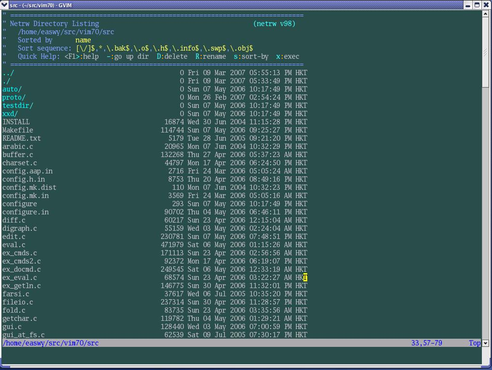
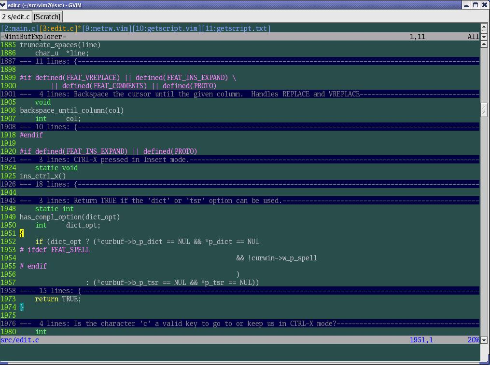
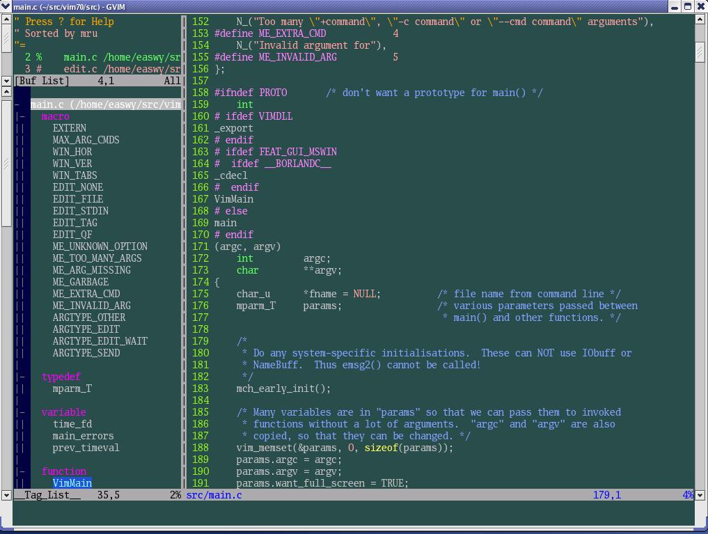

本节介绍了如何在vim中浏览文件，以及如何查看当前打开的缓冲区。利用netrw插件，可以方便的在vim中浏览各个目录、打开指定文件，而不用切换到文件浏览器或shell；当然，netrw插件的作用并不仅仅局限于此。利用bufexplorer插件，则可以方便的查看打开的缓冲区(buffer)，在缓冲区间进行切换。本文的最后介绍了winmanager插件，使用这个插件，可以把netrw插件、bufexplorer插件和taglist插件整合起来，使vim看起来更像一个集成开发环境(IDE)。

本节所用命令的帮助入口：

```
:help netrw-browse
:help bufexplorer
:help winmanager 
```

### [文件浏览]

在开发过程中，经常需要查找某个文件。我们前面在介绍path选项时，介绍过使用find命令查找文件的方法。本节介绍vim的文件浏览插件。

在vim 7.0以前，文件浏览功能由explorer.vim插件提供，在vim 7.0中，这个插件被netrw.vim插件所代替。本文以vim 7.0为例，主要介绍netrw.vim插件。

netrw.vim是vim的标准插件，它已经伴随vim而发行，不需要安装。

我们现在试一下vim文件功能，当你使用vim尝试打开目录时，vim会自动调用netrw.vim插件打开该目录（从操作系统的视角来看，目录其实是一种特殊的文件）。例如，我们在vim中执行命令”:e ~/src/vim70/src/“，会显示下面的窗口：



这个窗口类似于文件管理器，你可以创建、删除、改名文件或目录；在目录上按回车时，会进入该目录；在文件上按回车时，会使用vim打开该文件；可以更改排序方式、排序风格；隐藏目录或文件（使之不在上述窗口中显示）等等。

Netrw插件中常用键绑定有：

```
<F1>        显示帮助
<cr>        如果光标下为目录，则进入该目录；如果光标下是文件，则用vim打开该文件
-           返回上级目录
c           切换vim的当前工作目录为正在浏览的目录
d           创建目录 
D           删除文件或目录
i           切换显示方式
R           改名文件或目录
s           选择排序方式
x           定制浏览方式，使用你指定的程序打开该文件 
```

其它常用键，诸如使用书签、隐藏符合条件的文件等，请参阅netrw帮助页。

上面我们用”:e ~/src/vim70/src/“的方式打开netrw，我们还可以使用”:Explore“等Ex命令来打开文件浏览器。我的vimrc中这样配置：

```
""""""""""""""""""""""""""""""
" netrw setting
""""""""""""""""""""""""""""""
let g:netrw_winsize = 30
nmap <silent> <leader>fe :Sexplore!<cr> 
```

这样，在我输入”,fe“时，就会打开一个垂直分隔的窗口浏览当前文件所在的目录，窗口的宽度为30。

浏览本地文件只是netrw插件的一项小功能，netrw插件最主要的功能是支持远程文件读写。利用该插件，你可以通过ftp，ssh，http等多种协议来编辑远程文件，也可以浏览远程机器的目录。

在软件开发过程中不常使用此功能，本文中不再介绍。参阅netrw手册页获取更多信息。

### [缓冲区浏览]

在开发过程中，经常会打开很多缓冲区，尤其是使用tag文件在不同函数间跳转时，会不知不觉打开很多文件。要知道自己当前打开了哪些缓冲区，可以使用vim的”:ls“Ex命令查看。

开发过程中，又经常需要在不同文件间跳转。我习惯于使用”CTRL-^“来切换文件，这就需要知道文件所在的缓冲区编号。每次都使用”:ls“来找缓冲区编号很麻烦，所以我使用BufExplorer插件来显示缓冲区的信息。

BufExplorer插件在此处下载：http://vim.sourceforge.net/scripts/script.php?script_id=42

下载后，把该文件在~/.vim/目录中解压缩，这会在你的~/.vim/plugin和~/.vim/doc目录中各放入一个文件：

```
plugin/ bufexplorer.vim - bufexplorer插件
doc/ bufexplorer.txt    - bufexplorer帮助文件 
```

使用下面的命令生成帮助标签（下面的操作在vim中进行）：

```
:helptags ~/.vim/doc 
```

然后，就可以使用”:help bufexplorer“命令查看BufExplorer的帮助文件了。

BufExplorer功能比较简单，这里就不做介绍了。我的vimrc里这样设置BufExplorer插件：

```
""""""""""""""""""""""""""""""
" BufExplorer
""""""""""""""""""""""""""""""
let g:bufExplorerDefaultHelp=0       " Do not show default help.
let g:bufExplorerShowRelativePath=1  " Show relative paths.
let g:bufExplorerSortBy='mru'        " Sort by most recently used.
let g:bufExplorerSplitRight=0        " Split left.
let g:bufExplorerSplitVertical=1     " Split vertically.
let g:bufExplorerSplitVertSize = 30  " Split width
let g:bufExplorerUseCurrentWindow=1  " Open in new window.
autocmd BufWinEnter \[Buf\ List\] setl nonumber 
```

BufExplorer已经映射了几个键绑定，例如，使用”,bv“就可以打开一个垂直分割窗口显示当前的缓冲区。

有一个称为minibufexpl.vim的插件，也可以把缓冲区列表显示出来，这个插件在此处下载：http://vim.sourceforge.net/scripts/script.php?script_id=159

使用这个插件后，屏幕截图看起来是这样，最上面一个窗口就是minibuffer窗口，列出了当前打开的缓冲区：



这个插件没有帮助文件，参考下载页上的说明，以及脚本代码来进行配置。

### [winmanager插件]

winmanager插件可以把上面介绍的Explorer插件(vim 7.0以前的文件浏览插件)和BufExplorer插件集成在一起，我们上篇文章中介绍过的taglist插件也提供了对winmanager插件的支持。

Winmanager插件在这里下载：http://vim.sourceforge.net/scripts/script.php?script_id=95

下载后，把该文件在\~/.vim/目录中解压缩，这会把winmanager插件解压到\~/.vim/plugin和~/.vim/doc目录中：

```
plugin/winmanager.vim – winmanager插件
plugin/winfileexplorer.vim  - 改良的Explorer插件
plugin/wintagexplorer.vim – winmanager提供的tag插件，用处不大
doc/winmanager.txt – 帮助文件 
```

仍然用”:helptags \~/.vim/doc“命令来生成帮助标签，然后就可以使用”:help winmanager“来查看帮助了。

使用winmanager插件可以控制各插件在vim窗口中的布局显示。我的vimrc中这样设置：

```
""""""""""""""""""""""""""""""
" winManager setting
""""""""""""""""""""""""""""""
let g:winManagerWindowLayout = "BufExplorer,FileExplorer|TagList"
let g:winManagerWidth = 30
let g:defaultExplorer = 0
nmap <C-W><C-F> :FirstExplorerWindow<cr>
nmap <C-W><C-B> :BottomExplorerWindow<cr>
nmap <silent> <leader>wm :WMToggle<cr> 
```

g:winManagerWindowLayout变量的值定义winmanager的窗口布局，使用上面的设置，我们的窗口布局看起来是这样的：



左边有两个窗口，上面的是BufExplorer窗口，下面是taglist窗口。FileExplorer窗口和BufExplorer共用一个窗口，在BufExplorer窗口中使用”CTRL-N“可以切换到FileExplorer窗口，再使用一次则又切换回BufExplorer窗口。也就是说，在变量g:winManagerWindowLayout中，使用”,”分隔的插件，在同一个窗口中显示，使用”CTRL-N“在不同插件间切换；使用”|”分隔的插件，则在另外一个窗口中显示。

在屏幕右边的窗口则是主编辑区。

在上面的vimrc设置中，还定义了三个键映射，分别用于跳到左上窗口、左下窗口，以及显示/关闭winmanager窗口。

注：安装后，如果未设置g:winManagerWindowLayout变量，winmanager插件需要与BufExplorer插件一起才能使用。所以需要下载BufExplorer。

在http://vim.sourceforge.net/scripts/script.php?script_id=1440有一个winmanager插件的修改版本，如果在FileExplorer中打开文件时，它会使用与该文件相关联的程序来打开该文件，而不是使用vim。我没有使用过这个插件，有兴趣你可以试试。