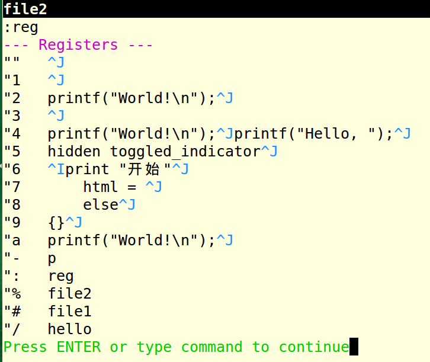

参考《vim实用技巧》第10章

## 1. 官方帮助手册

:help registers

:help :registers

## 2. 寄存器分类

首先对vim中的寄存器来进行个大致浏览，它主要分为这么几个部分：

- 1.无名（unnamed）寄存器：(")，缓存最后一次操作内容；

- 2.数字（numbered）寄存器：(0 ～ 9)，缓存最近操作内容，复制与删除有别, 0寄存器缓存最近一次复制的内容，1-9缓存最近9次删除内容

- 3.行内删除（small delete）寄存器：(-)，缓存行内删除内容；

- 4.具名（named）寄存器：(a ～ z)，指定时可用；

- 5.只读（read-only）寄存器：(:), (.), (%), (#)，分别缓存最近命令、最近插入文本、当前文件名、当前交替文件名；

- 6.表达式（expression）寄存器：(=)，只读，用于执行表达式命令；

- 7.选择及拖拽（selection and drop）寄存器：(\*), (+), (~)，存取GUI选择文本，可用于与外部应用交互，**使用前提为系统剪切板（clipboard）可用**；

- 8.黑洞（black hole）寄存器：(_)，不缓存操作内容（干净删除）；

- 9.模式寄存器（last search pattern）：(/)，缓存最近的搜索模式。

**无名寄存器(")**，它用一个双引号(")来标识，这个是我们接触的最多的寄存器了，如果没有特别指定的话，复制(y)，剪切(x,s,d,c和他们的大写)，粘贴(p)命令都会将内容存放到这个寄存器里面，或是从这个寄存器里面来读取内容。

**复制专用寄存器(0)**，就是使用y命令复制的内容都会存放到这个寄存器中，比如这么一段文本：

```
printf("Hello, ");
printf("world!\n");
```

把光标停留在第一行上，按下yy命令，将第一行复制，然后再移到第二行，按下dd命令，删除第二行。此时如果我们想要粘贴第一行的内容的话，直接按p是不行的，因为此时的p将引用无名寄存器中的内容，而它的内容已经被第二行的内容给覆盖了，所以此时就轮到复制专用寄存器大显身手了，此时如果按下这个命令:

```
"0p
```

这时，将会粘贴复制专用寄存器中的内容。

**系统剪贴板寄存器(+)和X11视窗系统的主剪贴板寄存器(\*)**。众所周知，任何操作系统都有一个剪贴版板，而vim就是用+寄存器来代表这个剪贴版。

复制到系统剪贴板，这时打开vim想要粘贴到vim中，那么只需要这个命令就好了

```
"+p
```

这样就把系统剪贴板中的内容直接贴进vim的缓冲区了。

需要声明的一点是这个剪贴板需要vim在编译的时候加上clipboard这个选项，想要查看自己的vim有没有这个选项，只要打开vim，在ex模式下输入version命令，就可以查看自己的vim支不支持这个特性了，如下图所示：


还有一个主剪贴板的寄存器，这个是在Linux下的X11视窗系统中才存在的东西，这个寄存器中存放的就是上次高亮选中的内容。

**黑洞寄存器(_)**。这个寄存器的功能和/dev/null设备非常地相似，就是将一切输入其中的东西都吞噬掉。平常我们经常用x命令来删除某个字符，用dd命令来删除某行，其实这些都不是删除，是剪贴，真正的删除应该是这些命令：

```
"_dd         //删除某行
"_x          //删除光标下的字符
```

**命名寄存器(a-z)**。这个一共是a-z26个寄存器，分别用英文字母来表示。这个感觉主要需要讲的就是大写字母和小写字母的区别，当向寄存器中写入内容的时候（即复制或者剪切的时候），大写字母表示的是将当前要复制的内容追加到寄存器中，而小写字母表示的是将当前要复制的内容将寄存器中的原有内容给覆盖掉。这个可以类比于数据流重定向中的">"和">>"命令。

举个例子，比如现在有个文件file2，其中的内容是这样

```
printf("Hello, ");
printf("World!\n");
```

而a寄存器中的内容刚开始是这样：


在第一行上执行了 "Ayy命令之后，a寄存器中的内容就变成了这样，第一行的内容被追加到了寄存器中：


接着我再在第二行上执行 "ayy命令之后，a寄存器中的内容就变成了这样，寄存器中原来的内容都被覆盖掉了：


**表达式寄存器(=)**。normal模式下按"=或者插入模式下按<C-r>,=来进入编辑vim表达式的模式，表达式运行的结果将被插入到vim的缓冲区中。

**特定信息的寄存器**，主要是下面这几个：

- 当前文件名寄存器 （%）

- 轮换文件名寄存器 （#）

- 上次执行的ex命令 （:）

- 上次查找的关键字 （/）

打开了两个文件file1和file2,然后切换到了file2,并进行了一次查找，查找了hello关键字，执行了两次reg命令，第二次reg命令执行结果如下图：



最后四行分别就是对应我们上面讲的那四个寄存器，这里需要注意的的是关键字寄存器（/）比较特殊，它是可以通过let命令来更改的，具体的执行命令如下：

```
let @/="the"
```

## 3. 各种复制粘贴命令说明

在详细了解这些寄存器之前，我们还得了解几个和寄存器有关的命令：

```
yy      //复制当前行
yw      //当前光标下面的这个单词
yit     //复制一个html标签中的内容
yft     //复制当前行上光标到第一个t之间的所有内容
```

## 4. 在普通模式中使用寄存器

在执行粘贴（p）命令，或者复制（y）和剪切（x,s,d,c和他们的大写）命令时，可以在前面加上 "{register}（其中那个{register}代表的是寄存器的名字），这样我们就可以使用相应的寄存器了，如果不加的话，默认使用的是无名寄存器。

比如，%代表的是文件名寄存器，存放的是当前正在编辑的文件名，我现在打开了一个文件file2，并且正处于普通模式，此时如果我输入以下内容：

```
"%p  //表示将文件名寄存器的内容粘贴到当前行
```

## 5. 在插入模式中使用寄存器

在插入模式，当我们按下 \<CTRL\> + r键，再加上相应的寄存器的名字，就可以插入寄存器中的内容了。

比如=代表的是表达式寄存器，比如我在vim中输入如下命令：

```
i           #进入插入模式
<C-r>=      #按下<Ctrl>+r键，再按等号键，此时就可以输入表达式了 
```

## 6. 查看当前寄存器的内容

在ex模式下输入:reg或者:dis命令，就可以查看当前所有寄存器的内容了。

```
:reg 寄存器名  //查看单个寄存器内容
```
