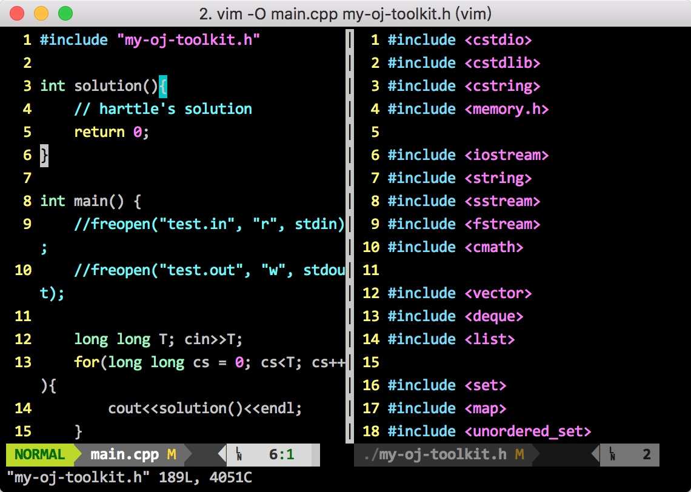

<!-- @import "[TOC]" {cmd="toc" depthFrom=1 depthTo=6 orderedList=false} -->

<!-- code_chunk_output -->

- [1. 介绍](#1-介绍)
- [2. 启动Vim](#2-启动vim)
  - [2.1. 创建空白窗口](#21-创建空白窗口)
  - [2.2. 使用小写的o参数来上下窗口](#22-使用小写的o参数来上下窗口)
  - [2.3. 使用大写的O参数来左右窗口](#23-使用大写的o参数来左右窗口)
- [3. 打开窗口](#3-打开窗口)
  - [3.1. 上下分割当前打开的文件](#31-上下分割当前打开的文件)
  - [3.2. 上下分割，并打开一个新的文件](#32-上下分割并打开一个新的文件)
  - [3.3. 左右分割当前打开的文件](#33-左右分割当前打开的文件)
  - [3.4. 左右分割，并打开一个新的文件](#34-左右分割并打开一个新的文件)
- [4. 关闭窗口](#4-关闭窗口)
  - [4.1. 关闭当前窗口](#41-关闭当前窗口)
  - [4.2. 关闭当前窗口，如果只剩最后一个了，则退出Vim。](#42-关闭当前窗口如果只剩最后一个了则退出vim)
  - [4.3. 取消其它窗口，只保留当前窗口](#43-取消其它窗口只保留当前窗口)
- [5. 移动光标](#5-移动光标)
  - [5.1. 把光标移到右边的窗口](#51-把光标移到右边的窗口)
  - [5.2. 把光标移到左边的窗口中。](#52-把光标移到左边的窗口中)
  - [5.3. 把光标移到上边的窗口中](#53-把光标移到上边的窗口中)
  - [5.4. 把光标移到下边的窗口中](#54-把光标移到下边的窗口中)
  - [5.5. 把光标移到下一个的窗口中](#55-把光标移到下一个的窗口中)
- [6. 移动窗口](#6-移动窗口)
  - [6.1. 向右移动当前窗口](#61-向右移动当前窗口)
  - [6.2. 向左移动当前窗口](#62-向左移动当前窗口)
  - [6.3. 向上移动当前窗口](#63-向上移动当前窗口)
  - [6.4. 向下移动当前窗口](#64-向下移动当前窗口)
- [7. 窗口尺寸](#7-窗口尺寸)
  - [7.1. 让所有的窗口都有一样的高度和一样的宽度](#71-让所有的窗口都有一样的高度和一样的宽度)
  - [7.2. 设置当前窗口的高度](#72-设置当前窗口的高度)
  - [7.3. 增加高度](#73-增加高度)
  - [7.4. 减少高度](#74-减少高度)
  - [7.5. 设置当前窗口的宽度](#75-设置当前窗口的宽度)
  - [7.6. 增加宽度](#76-增加宽度)
  - [7.7. 减少宽度](#77-减少宽度)

<!-- /code_chunk_output -->

# 1. 介绍

标签页(tab)、窗口(window)、缓冲区(buffer)是Vim多文件编辑的三种方式，它们可以单独使用，也可以同时使用。 它们的关系是这样的：

```
A buffer is the in-memory text of a file. A window is a viewport on a buffer. A tab page is a collection of windows. –vimdoc
```

本文主要介绍Vim窗口

上图:



# 2. 启动Vim

## 2.1. 创建空白窗口

```
:new
```

## 2.2. 使用小写的o参数来上下窗口

```
vim -on file1 file2 ...
```

## 2.3. 使用大写的O参数来左右窗口

```
vim -On file1 file2 ...
```

注释: n是数字，表示分成几个窗口。

# 3. 打开窗口

命令:

```
:sp[lit] {file}     水平窗口
:new {file}         水平窗口
:sv[iew] {file}     水平窗口，以只读方式打开
:vs[plit] {file}    垂直窗口
:clo[se]            关闭当前窗口
```

快捷键:

```
Ctrl+w s        水平分割当前窗口
Ctrl+w v        垂直分割当前窗口
Ctrl+w q        关闭当前窗口
Ctrl+w n        打开一个新窗口（空文件）
Ctrl+w o        关闭出当前窗口之外的所有窗口
Ctrl+w T        当前窗口移动到新标签页
```

## 3.1. 上下分割当前打开的文件

```
Ctrl+W s(split)
:sp
```

## 3.2. 上下分割，并打开一个新的文件

```
:sp filename
:new filename
```

```
:sv[iew] {file}     水平窗口，以只读方式打开
```
## 3.3. 左右分割当前打开的文件

```
Ctrl+W v(vsplit)
:vsp
:vs
```

## 3.4. 左右分割，并打开一个新的文件

```
:vsp filename
:vs filename
```

# 4. 关闭窗口

## 4.1. 关闭当前窗口

```
Ctrl+W c(close)
```

## 4.2. 关闭当前窗口，如果只剩最后一个了，则退出Vim。

```
Ctrl+W q(quit)
```

## 4.3. 取消其它窗口，只保留当前窗口

```
:only 

或者 

ctrl+w o
```

# 5. 移动光标

Vi中的光标键是h, j, k, l，要在各个窗口间切换，只需要先按一下Ctrl+W

```
Ctrl+w h        切换到左边窗口
Ctrl+w j        切换到下边窗口
Ctrl+w k        切换到上边窗口
Ctrl+w l        切换到右边窗口

Ctrl+w w        遍历切换窗口

Ctrl+w t        切换到最上方窗口
Ctrl+w b        切换到最下方窗口
```

## 5.1. 把光标移到右边的窗口

```
Ctrl+W l
```

## 5.2. 把光标移到左边的窗口中。

```
Ctrl+W h
```

## 5.3. 把光标移到上边的窗口中

```
Ctrl+W k
```

## 5.4. 把光标移到下边的窗口中

```
Ctrl+W j
```

## 5.5. 把光标移到下一个的窗口中

```
Ctrl+W w
```

# 6. 移动窗口

这个功能还是使用了Vim的光标键，只不过都是大写。

```
Ctrl+w H        向左移动当前窗口
Ctrl+w J        向下移动当前窗口
Ctrl+w K        向上移动当前窗口
Ctrl+w L        向右移动当前窗口
```

## 6.1. 向右移动当前窗口

```
Ctrl+W L
```

## 6.2. 向左移动当前窗口

```
Ctrl+W H
```

## 6.3. 向上移动当前窗口

```
Ctrl+W K
```

## 6.4. 向下移动当前窗口

```
Ctrl+W J
```

# 7. 窗口尺寸

```
Ctrl+w +        增加窗口高度
Ctrl+w -        减小窗口高度
Ctrl+w =        统一窗口高度
```

## 7.1. 让所有的窗口都有一样的高度和一样的宽度

```
Ctrl+W =
```

## 7.2. 设置当前窗口的高度

```
:res[ize] [N]

CTRL-W [N]_        设置当前窗口的高度为 N (默认值为最大可能高度)。
```

## 7.3. 增加高度

默认增加1

```
Ctrl+W [N]+ 

:res[ize] +[N]   #高度增加N（默认是1）
```

## 7.4. 减少高度

```
Ctrl+W [N]-       

:res[ize] -[N]   #高度减少N（默认是1）
```

## 7.5. 设置当前窗口的宽度

如果没有N，默认是最大宽度

```
CRTL-W [N]|

:vertical res[ize] [N]     
```

## 7.6. 增加宽度

```
CTRL-W [N]>        使得当前窗口宽度加 N (默认值是 1)。

:vertical res[ize] +[N]
```

## 7.7. 减少宽度

```
CTRL-W [N]<        使得当前窗口宽度减 N (默认值是 1)。                                
:vertical res[ize] -[N]
```