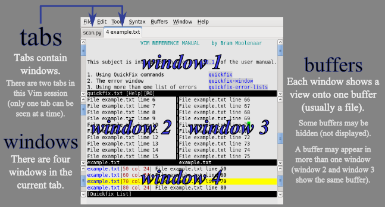

# 介绍

引用Vim官方解释，缓冲区是一个文件的内容占用的那部分Vim内存：

>
>A buffer is an area of Vim’s memory used to hold text read from a file. In addition, an empty buffer with no associated file can be created to allow the entry of text. –vim.wikia

先来回顾一下Tab，Window，Buffer的关系吧！



基于缓冲区的多文件编辑是Vim最为推荐的做法，Vim维护着你在当前打开的这些Buffer里的所有跳转， Ctrl+o和Ctrl+i可以遍历这些光标位置（参考：在Vim中进行快速光标移动）

但一个窗口内只有一个Buffer是处于可见状态的，所以Buffer的用法最不直观。

学习Vim就要克服那些不直观的操作！因为Vim本身就是基于CLI的，而我们相信CLI就是效率。本文便来总结一下Buffer相关的命令与操作。

# 打开与关闭

不带任何参数打开多个文件便可以把它们都放入缓冲区（Buffer）：

```
vim a.txt b.txt
```


