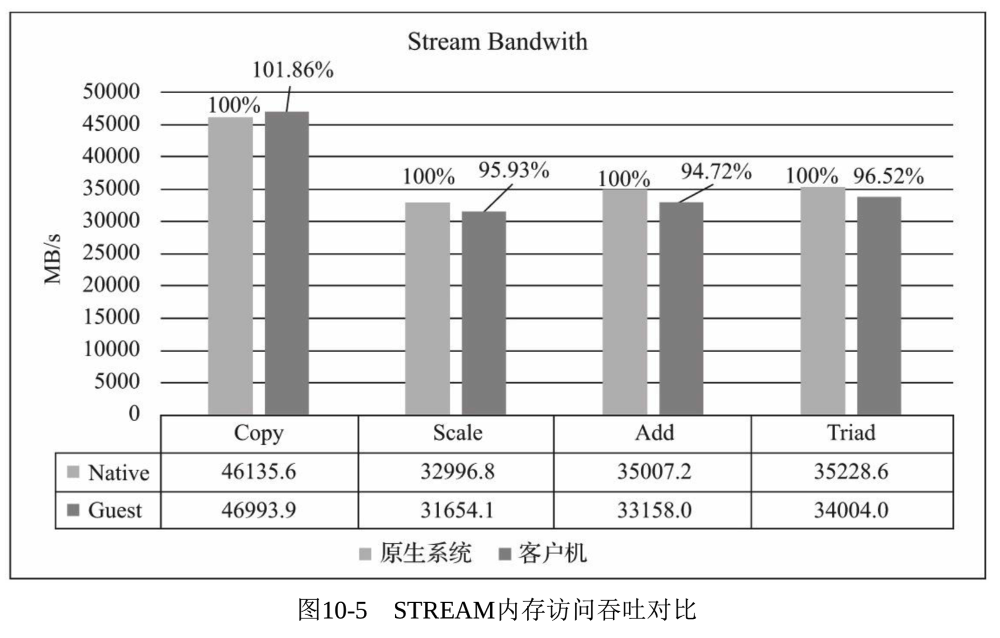
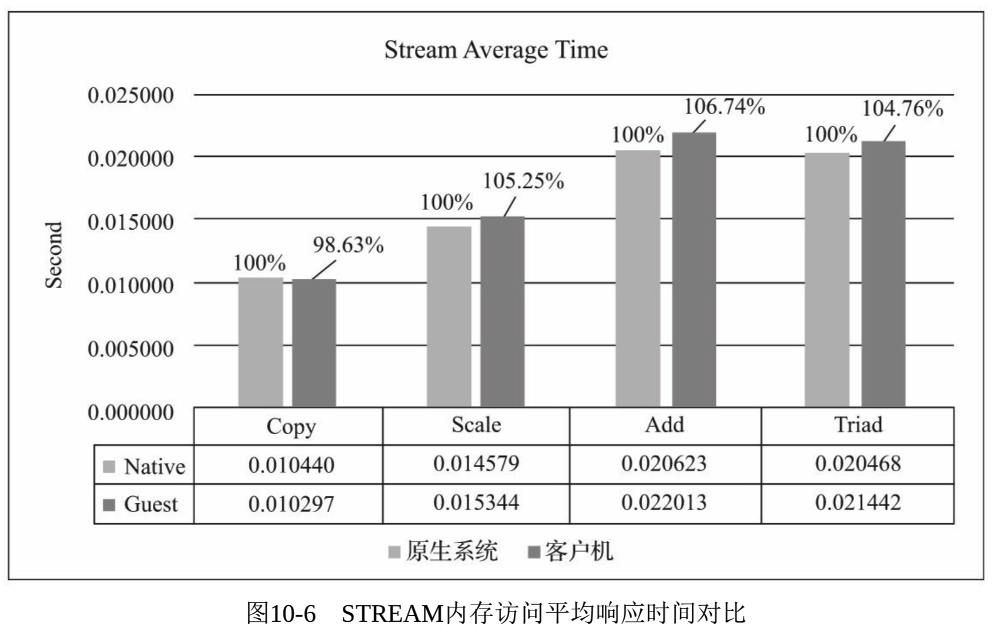

<!-- @import "[TOC]" {cmd="toc" depthFrom=1 depthTo=6 orderedList=false} -->

<!-- code_chunk_output -->

- [1. 内存性能测试工具](#1-内存性能测试工具)
  - [1.1. LMbench](#11-lmbench)
  - [1.2. Memtest86\+](#12-memtest86)
  - [1.3. STREAM](#13-stream)
- [2. 测试环境配置](#2-测试环境配置)
- [3. 性能测试方法](#3-性能测试方法)
- [4. 性能测试数据](#4-性能测试数据)

<!-- /code_chunk_output -->

# 1. 内存性能测试工具

**内存密集型**的应用程序分别在非虚拟化的原生系统和KVM客户机中运行，然后**根据它们的运行效率**就可以**粗略评估KVM的内存虚拟化性能**。

对于**内存**的性能测试，可以选择上节节中提到的**SPECjbb2015**、**SysBench**、**内核编译**等基准测试（因为它们**同时也是内存密集型的测试**），还可以选择**LMbench**、**Memtest86**+、**STREAM**等测试工具。

下面简单介绍几种内存性能测试工具。

## 1.1. LMbench

LMbench是一个使用GNU GPL许可证发布的免费和开源的自由软件，可以运行在类UNIX系统中，以便比较它们的性能，其官方网址是：http://www.bitmover.com/lmbench 。LMbench是一个用于评价**系统综合性能**的可移植性良好的**基准测试工具套件**，它主要关注两个方面：**带宽（bandwidth**）和**延迟（latency**）。

LMbench中包含了很多简单的基准测试，它覆盖了**文档读写**、**内存操作**、**管道**、**系统调用**、**上下文切换**、**进程创建和销毁**、**网络**等多方面的性能测试。

另外，LMbench能够对同级别的系统进行比较测试，反映**不同系统的优劣势**，通过选择**不同的库函数**我们就能够比较库函数的性能。

更为重要的是，作为一个开源软件，LMbench提供一个**测试框架**，假如测试者对测试项目有更高的测试需要，能够修改少量的源代码就达到目的（比如现在只能评测进程创建、终止的性能和进程转换的开销，通过修改部分代码即可实现线程级别的性能测试）。

## 1.2. Memtest86\+

Memtest86\+是基于由Chris Brady所写的著名的**Memtest86**改写的一款**内存检测工具**，其官方网址为：http://www.memtest.org . 该软件的目标是提供一个可靠的软件工具，进行**内存故障检测**。Memtest86\+同Memtest86一样是基于GNU GPL许可证进行开发和发布的，它也是免费和开源的。

**Memtest86**\+对**内存的测试不依赖于操作系统**，它提供了一个**可启动文件镜像**（如ISO格式的镜像文件），将其**烧录到软盘、光盘或U盘**中，然后**启动系统**时就从软驱、光驱或U盘中的Memtest86\+启动，之后就可以**对系统的内存进行测试**。

在运行Memtest86\+时，**操作系统都还没有启动**，所以此时的**内存基本上是未使用状态**（**除了BIOS等可能占用了小部分内存**）。一些高端计算机**主板**甚至将Mestest86\+**默认集成到BIOS**中。

## 1.3. STREAM

STREAM是一个用于衡量系统在运行**一些简单矢量计算内核时**能达到的**最大内存带宽**和**相应的计算速度**的基准测试程序，其官方网址为：http://www.cs.virginia.edu/stream 。 

STREAM可以运行在DOS、Windows、Linux等系统上。另外，STREAM的作者还开发了对STREAM进行扩充和功能增强的工具STREAM2，可以参考其主页：http://www.cs.virginia.edu/stream/stream2 。

本节对KVM内存虚拟化性能的测试，使用了STREAM这个基准测试工具。

# 2. 测试环境配置

对KVM的内存虚拟化性能测试的测试环境配置与上节的环境配置基本相同，具体可以参考表10\-1和表10\-2。

宿主机中启动客户机的命令也与10.2.2节相同。

```
qemu-system-x86_64 -enable-kvm -cpu host -smp cpus=4,cores=4,sockets=1 -m 16G -drive file=./rhel7.img,format=raw,if=virtio,media=disk -drive file=./raw_disk.img,format=raw,if=virtio,media=disk -device virtio-net-pci,netdev=nic0 -netdev bridge,id=nic0,br=virbr0 -daemonize -name perf_test -display vnc=:1
```

值得注意的是，本次测试的Intel平台是支持EPT和VPID的，对于内存测试，只要硬件支持，KVM也默认使用了EPT、VPID。EPT和VPID（特别是EPT）对KVM中内存虚拟化的加速效果是非常明显的，所以要保证能使用它们（可参考5.3.2节）。

# 3. 性能测试方法

本节选取STREAM工具来进行内存的性能测试，分别在原生系统和KVM客户机系统中执行STREAM基准测试，然后对比各项测试的得分即可评估KVM内存虚拟化的性能。

1. 下载STREAM

从其官方网址 https://www.cs.virginia.edu/stream/FTP/Code/ 下载STREAM测试程序，截至笔者写作时，其最新为5.10版本。

2. 编译STREAM

我们使用C语言版本的stream.c（另有一个stream.f，是Fortune语言版本），然后运行下面的gcc命令编译。这里解释一下几个编译选项。

- \-DSTREAM\_ARRAY\_SIZE=30000000，根据源代码中的注释，其中：‘STREAM_ARRAY_SIZE’要根据实际的机器环境定义，以确保测试准确性，其确定的原则是：它要使得数组大小至少3.8倍于你的机器缓存大小。笔者环境的L3 Cache大约为55M，所以指定这个大小为30000000。具体换算方法，读者可以参照源代码中注释的例子。
- \-O3，编译最优化。
- \-fopenmp，使用OpenMP（并发多线程接口）。
- \-mavx2\-march=core\-avx2，笔者的机器是Xeon Broadwell平台，它已经支持AVX2，所以编译以AVX2指令优化。

```
gcc -DSTREAM_ARRAY_SIZE=30000000 -O3 -fopenmp -mavx2 -march=core-avx2 stream.c -o stream
```

编译完以后，就获得了名为stream的可执行程序，直接运行它就可以获得STREAM基准测试的结果了。示例如下：

```
[root@kvm-host ~]# ./stream
-------------------------------------------------------------
STREAM version $Revision: 5.10 $
-------------------------------------------------------------
This system uses 8 bytes per array element.
-------------------------------------------------------------
Array size = 30000000 (elements), Offset = 0 (elements)
Memory per array = 228.9 MiB (= 0.2 GiB).
Total memory required = 686.6 MiB (= 0.7 GiB).
Each kernel will be executed 10 times.
 The *best* time for each kernel (excluding the first iteration)will be used to compute the reported bandwidth.
-------------------------------------------------------------
Number of Threads requested = 4
Number of Threads counted = 4
-------------------------------------------------------------
Your clock granularity/precision appears to be 1 microseconds.
Each test below will take on the order of 10143 microseconds.
    (= 10143 clock ticks)
Increase the size of the arrays if this shows that you are not getting at least 20 clock ticks per test.
-------------------------------------------------------------
WARNING -- The above is only a rough guideline.
For best results, please be sure you know the precision of your system timer.
-------------------------------------------------------------
Function    Best Rate MB/s  Avg time     Min time     Max time
Copy:           46185.4     0.010459     0.010393     0.010690
Scale:          31227.9     0.015491     0.015371     0.015963
Add:            32065.5     0.022566     0.022454     0.022877
Triad:          33538.0     0.021568     0.021468     0.021666
-------------------------------------------------------------
Solution Validates: avg error less than 1.000000e-13 on all three arrays
-------------------------------------------------------------
```

可以看到，测试结果中包含了**Copy**、**Scale**、**Add**、**Triad**这4种内存操作的**最优传输速率**、**平均时间**、**最大时间**和**最小时间**的值。

在本次测试中，分别在原生系统和KVM客户机中执行**5次基准测试**，速率上取Copy、Scale、Add、Triad各自最大的一次，响应时间上，取平均值中各自最小的一次，作为比较值。

# 4. 性能测试数据

这里实验的结果数据，由于**限制了CPU和内存等资源**，并**不表示机器环境的绝对性能**，而是注重虚拟化环境与原生环境在**同等资源条件下的性能对比**。

从图10\-5可以看出，KVM虚拟化中内存的访问带宽与原生系统相比都是比较接近的。**Copy**操作甚至客户机表现还略微（可以忽略不计）好于原生系统，Scale操作为原生系统的95.93%，Add操作为94.72%，Triad操作为96.52%。这主要归功于**硬件EPT支持**。



而从图10-6访问时间上来看，客户机平均响应时间比原生系统的差值在5%左右；Copy case甚至略好于原生系统（可以忽略不计）。

