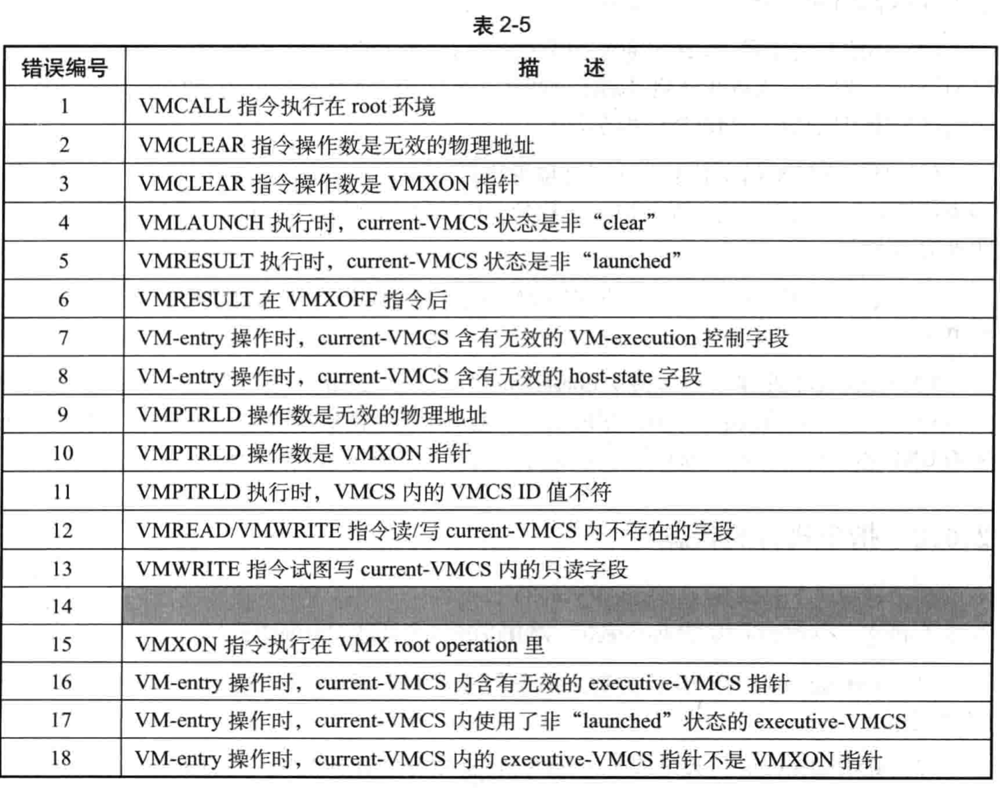
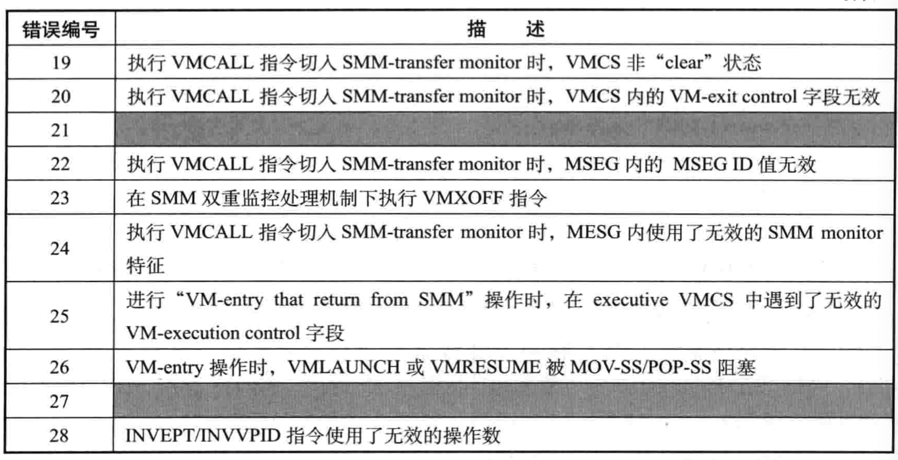
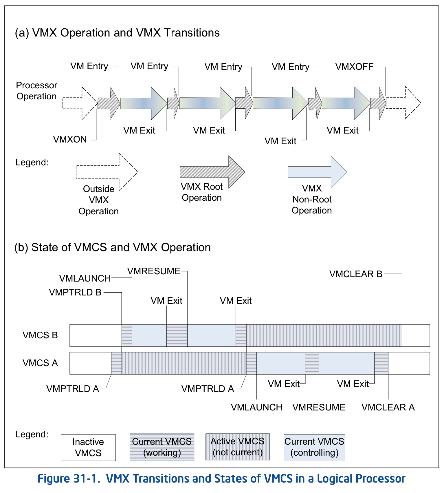

<!-- @import "[TOC]" {cmd="toc" depthFrom=1 depthTo=6 orderedList=false} -->

<!-- code_chunk_output -->

- [1. 概述](#1-概述)
- [2. VMX指令执行环境](#2-vmx指令执行环境)
- [3. 指令执行的状态](#3-指令执行的状态)
- [4. VMfailValid事件原因](#4-vmfailvalid事件原因)
- [5. 指令异常优先级](#5-指令异常优先级)
- [6. VMCS 管理指令](#6-vmcs-管理指令)
  - [6.1. VMPTRLD 指令](#61-vmptrld-指令)
  - [6.2. VMPTRST 指令](#62-vmptrst-指令)
  - [6.3. VMCLEAR 指令](#63-vmclear-指令)
  - [6.4. VMREAD 指令](#64-vmread-指令)
  - [6.5. VMWRITE 指令](#65-vmwrite-指令)
- [7. VMX模式管理指令](#7-vmx模式管理指令)
  - [7.1. VMCON 指令](#71-vmcon-指令)
  - [7.2. VMXOFF 指令](#72-vmxoff-指令)
  - [7.3. VMLAUNCH 指令](#73-vmlaunch-指令)
  - [7.4. VMRESUME 指令](#74-vmresume-指令)
  - [7.5. 返回到 executive monitor](#75-返回到-executive-monitor)
- [8. cache 刷新指令](#8-cache-刷新指令)
  - [8.1. INVEPT 指令](#81-invept-指令)
  - [8.2. INVVPID 指令](#82-invvpid-指令)
- [9. 调用服务例程指令](#9-调用服务例程指令)
  - [9.1. VMCALL指令](#91-vmcall指令)
  - [9.2. VMFUNC指令](#92-vmfunc指令)
- [使用 VMX 指令](#使用-vmx-指令)

<!-- /code_chunk_output -->

# 1. 概述

VMX架构提供了13条VMX指令, 负责管理4个职能. 如表.


# 2. VMX指令执行环境

VMX架构对CR0和CR4寄存器的设置有基本的限制要求(详见2.3.2.2), 即需要开启分页保护模式以及CR4.VMXE=1. 下面是VMX指令执行的基本环境.

(1) 除了**VMXON指令**可以在**进入VMX operation模式前执行**, **其他指令**必须执行在**VMX operation模式**里. 否则, 将产生`#UD`异常.

(2) 不能在实模式, virtual\-8086模式以及compatibility模式下执行. 否则, 将产生\#UD异常. 除了在**支持并开启**"**unrestricted guest**"功能后, 在**guest的非分页**或**非保护模式**环境里可以**执行VMFUNC指令**外.

(3) **所有VMX指令**必须在**root环境**里执行(除了**VMFUNC指令**可以在**non\-root环境**里执行外). 否则, 将**产生VM\-exit行为(！！！**). 而VMFUNC指令执行在root环境里, 将产生\#UD异常.

(4) 除了**VMFUNC指令**外, **所有VMX指令**必须执行在**0级权限**里. 否则, 将产生\#GP异常.

VMXON是唯一在VMX operation模式外可执行的指令. VMXON指令在root内执行会产生下面所说的VMfailValid失败. 在non\-root内执行则会产生VM\-exit行为. 而VMFUNC指令是唯一non\-root内正常执行的指令.

# 3. 指令执行的状态

# 4. VMfailValid事件原因

**VMX 指令**产生的 VMfailValid 失败会对应**一个编号**, 这个编号就记录在 **VM-instruction error** 字段里. 这个字段是 VM-exit 信息区域内的其中一个 32 位字段. 如表所示.





表列出了所有**可能发生的 VMfailValid 原因**, 编号 14、21以及27没有使用。其中有数个失败产生于 VM-entry 和 SMM 双重监控处理机制下的切入 SMM-transfer monitor 时.

# 5. 指令异常优先级

如前面, 如果VMX指令非正常执行, 会出现下面三种情况之一.

(1) 产生异常, 可能产生的异常为: `#UD`, `#GP`, `#PF`或`#SS`

(2) 产生 VM-exit 行为

(3) 产生 **VMfailInvalid** 失败或者 **VMfailValid** 失败

**VMfailValid** 与 **VMfailInvalid** 失败是在**指令允许执行的前提！！！** 下(即**执行指令不会产生异常**和 `VM-exit` ), 它会发生在root环境里. 

**VMFUNC** 指令执行在 `non-root` 环境**不会产生失败**, 只可能产生 `#UD` 异常或 `VM-exit`.

在开启 "unrestricted guest" 功能后并进入**实模式**的guest软件里执行 VMX 指令时, 一个 `#UD` 异常的优先级高于 `VM-exit` 行为. 或者一个由于 CPL 非 0 而引发的 `#GP` 异常, 优先级高于 `VM-exit` 行为(见5.6). 

# 6. VMCS 管理指令

有5条VMX指令涉及VMCS区域的管理. 下面介绍用法.

## 6.1. VMPTRLD 指令

VMPTRLD 指令从**内存**中加载一个**64位物理地址**作为 `current-VMCS pointer`, 这个 `current-VMCS pointer` 由**处理器内部记录和维护**, 除了 VMXON、VMPTRLD 和VMCLEAR 指令需要提供 VMXON 或 VMCS 指针作为操作数外, 其他的指令指定都是在 `current-VMS` 上操作.

## 6.2. VMPTRST 指令

## 6.3. VMCLEAR 指令

## 6.4. VMREAD 指令

## 6.5. VMWRITE 指令

# 7. VMX模式管理指令

## 7.1. VMCON 指令

## 7.2. VMXOFF 指令

## 7.3. VMLAUNCH 指令

`VMLAUNCH` 指令使用于第一次发起 `VM-entry` 操作. 因此 `current-VMCS` 的状态必须为 "`clear`" , 否则产生 `VMfailValid` 类型失败. 

在发起 `VM entry` **操作前**的一系列动作里, 需要使用 `VMCLEAR` **指令**将**目标 VMCS** 状态置为 "`clear`" 状态, 然后使用 `VMPTRLD` **指令**加载**该 VMCS** 为 `current-VMCS`.

VM entry 操作是一个复杂的过程, 分为**三个阶段**进行, 每个阶段会进行一些必要的检查. 检查不通过时, 这三个阶段的后续处理也不同, 如下.

(1) 执行基本检查

包括:

- 可能产生的指令异常(`#UD`或`#GP`异常)
- `current-VMCS pointer`是否有效
- 当前VMCS状态是否为 "clear"
- 执行的 VMLAUNCH 指令是否被 "MOV-SS" 指令阻塞.

(2) 对 VMCS 内的 VM-execution、VM-exit、VM-entry以及 host-state 区域的各个字段进行检查.

(3) 对 VMCS 的 guest-state 区域的各个字段进行检查.

在**第 1 步**里的**检查失败**后将执行 VMLAUNCH 指令的**下一条指令**. 当 `current-VMCS pointer` 无效(如 `FFFFFFF_FFFFFFFFh` )时产生 `VMfailInvalid` 失败. 当 `current-VMCS` 为非 "clear" 或执行的 VMLAUNCH 指令被 "`MOV-SS`" 指令阻塞时, 产生 VMfailValid 失败. **产生异常**时转入**执行异常处理例程**.

这一步里, 有一个需要关注的 "blocking by MOV-SS" 阻塞状态, 在下面的情形里:

```
mov ss, ax    ; 更新 ss 寄存器, 或执行 pop ss 指令
vmlaunch      ; vmlaunch 有 "blocking by MOV-SS" 阻塞状态
```

上面情况, 当 VMLAUNCH 或 VMRESUME 指令执行在 MOV-SS 或 POP-SS 指令后, 那么就会产生 VMfailValid 失败, 产生的指令错误号为 26, 指示 "VMLAUNCH 或 VMRESUME 指令将被 MOV-SS 阻塞".

在第 2 步的检查不通过时, 也产生 VMfailValid 失败. 指令错误号为 7, 指示 "


## 7.4. VMRESUME 指令

## 7.5. 返回到 executive monitor

# 8. cache 刷新指令

## 8.1. INVEPT 指令

## 8.2. INVVPID 指令

# 9. 调用服务例程指令

VMX架构提供了两个调用服务例程指令: VMCALL与VMFUNC指令. 它们服务的对象不同, VMCALL指令使用在VMM里, 而VMFUNC指令使用在VM里.

## 9.1. VMCALL指令

利用**VMCALL指令**可以实现**SMM**的**dual\-monitor treatment(SMM双重监控处理)机制**. VMCALL指令在**non\-root**里执行将会**产生VM\-exit行为**, 但在**root环境**里执行**VMCALL指令**, 当**满足检查条件**时, 在VMM里产生被称为"**SMM VM\-exit**"的退出行为, 从而**切换到SMM模式的SMM\-transfer monitor**里执行. 这个SMM\-transfer monitor**入口地址**提供在**MSEG区域头部(由IA32\_SMM\_MONITOR\_CTL\[31:12**\])

在**VMX root operation**里执行**VMCALL指令**, 除了可能产生异常(\#UD或\#GP)外, 有两种可能: (1) 指令失败(VMfailInvalid或VMfailValid). (2) 产生"**SMM Vm\-Exit**", 激活**SMM双重监控处理功能**.

**IA32\_SMM\_MONITOR\_CTL寄存器**的bit 0为valid位. 只有当**bit 0为1**时, 才允许使用**VMCALL指令**通过**切入SMM\-transfer monitor执行**来**激活SMM双重监控处理机制**. 否则将产生VMfailValid失败, 指示"VMCALL指令执行在VMX root operation模式里".

## 9.2. VMFUNC指令

# 使用 VMX 指令

