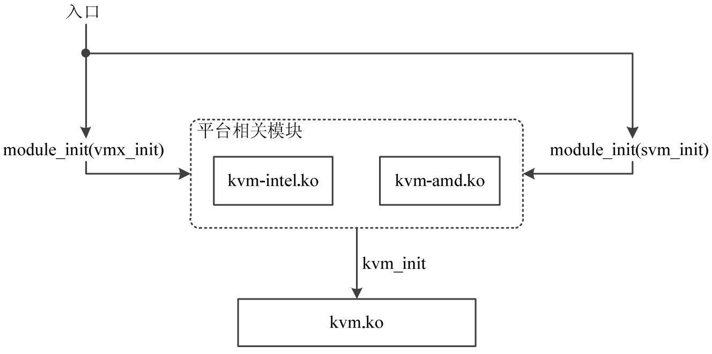
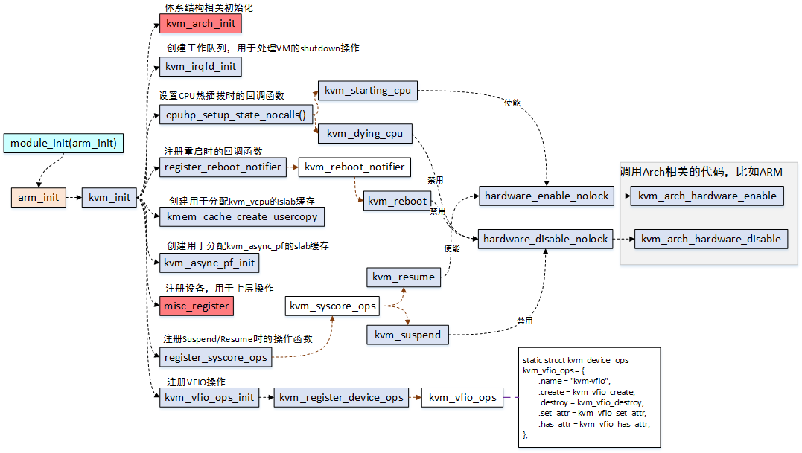

<!-- @import "[TOC]" {cmd="toc" depthFrom=1 depthTo=6 orderedList=false} -->

<!-- code_chunk_output -->

- [1. 基本介绍](#1-基本介绍)
- [2. 整体流程](#2-整体流程)
- [3. trace方法](#3-trace方法)
  - [3.1. ftrace](#31-ftrace)
  - [3.2. trace-cmd(推荐)](#32-trace-cmd推荐)
- [4. XXX_init: 模块初始化入口](#4-xxx_init-模块初始化入口)
- [5. kvm_init: 初始化 kvm 框架](#5-kvm_init-初始化-kvm-框架)
  - [5.1. 架构初始化: kvm_arch_init](#51-架构初始化-kvm_arch_init)
    - [5.1.1. CPU特性支持检查](#511-cpu特性支持检查)
    - [5.1.2. kmem_cache分配(x86_fpu)](#512-kmem_cache分配x86_fpu)
    - [5.1.3. percpu kvm_shared_msrs](#513-percpu-kvm_shared_msrs)
    - [5.1.4. mmu 模块相关处理](#514-mmu-模块相关处理)
    - [5.1.5. 设置全局的 kvm_x86_ops](#515-设置全局的-kvm_x86_ops)
    - [5.1.6. 设置 MMU 的shadow PTE masks](#516-设置-mmu-的shadow-pte-masks)
    - [5.1.7. timer初始化](#517-timer初始化)
    - [5.1.8. lapic初始化](#518-lapic初始化)
  - [5.2. workqueue?](#52-workqueue)
  - [5.3. 架构相关的硬件设置](#53-架构相关的硬件设置)
    - [5.3.1. vmx/svm 的硬件配置 hardware_setup()](#531-vmxsvm-的硬件配置-hardware_setup)
        - [5.3.1.1. 设置全局 vmcs_config 和 vmx_capability](#5311-设置全局-vmcs_config-和-vmx_capability)
        - [5.3.1.2. 一堆检查](#5312-一堆检查)
        - [5.3.1.3. posted 中断的 wakeup 处理函数设置](#5313-posted-中断的-wakeup-处理函数设置)
        - [5.3.1.4. percpu的VMXON region](#5314-percpu的vmxon-region)
    - [5.3.2. msr保存到全局变量msrs_to_save[]数组](#532-msr保存到全局变量msrs_to_save数组)
  - [5.4. 检查每个处理器对vmx的兼容性](#54-检查每个处理器对vmx的兼容性)
  - [5.5. 注册CPU状态变化的通知函数](#55-注册cpu状态变化的通知函数)
  - [5.6. 注册reboot时候的通知函数](#56-注册reboot时候的通知函数)
  - [5.7. 给kvm_vcpu分配cache](#57-给kvm_vcpu分配cache)
  - [5.8. 赋值file_operations的模块名](#58-赋值file_operations的模块名)
  - [5.9. 注册设备文件/dev/kvm](#59-注册设备文件devkvm)
  - [5.10. 动作注册](#510-动作注册)
  - [5.11. debugfs初始化](#511-debugfs初始化)
  - [5.12. vfio操作初始化](#512-vfio操作初始化)
- [6. 参考](#6-参考)

<!-- /code_chunk_output -->

# 1. 基本介绍

KVM模块分为两类模块：
* 通用功能模块: `kvm.ko`
* 架构模块: `kvm-intel.ko`或`kvm-amd.ko`

模块之间在初始化阶段的流程如图`5-4`所示. 

图5-4 KVM模块初始化阶段:



以intel平台为例, KVM的初始化流程如图`5-5`所示. 

图5-5 KVM的初始化流程:


**KVM模块**可以**编译进内核**中，也可以作为**内核模块**在Linux系统启动完成**之后加载**. 加载时，KVM 根据主机所用的体系架构是 Intel的 VMX技术还是AMD的SVM技术，会采用略微不同的加载流程. 

Linux的**子模块入口**通常通过`module_init`宏进行定义，由**内核进行调用**. 

# 2. 整体流程

内核的功能模块，基本上的套路就是：
1. 完成模块初始化，向系统注册；
2. 响应各类请求，这种请求可能来自用户态，也可能来自异常响应等；



KVM的初始化步骤分为以下三步:

1. 在**平台相关的 KVM_XXX 模块**中通过`module_init`宏正式进入KVM的初始化阶段，并且执行相关的**硬件初始化准备**. 
* (`arch/x86/kvm/vmx/vmx.c`, `arch/x86/kvm/svm/svm.c`, `arch/arm64/kvm/arm.c`)
2. 进入`kvm_main.c`中的**kvm\_init**函数进行正式的初始化工作，期间进行了一系列子操作. 
* (`virt/kvm/kvm_main.c`)
3. 进行后续的硬件初始化准备操作.

而核心逻辑在`kvm_init`中完成，既包含了体系结构相关的初始化设置，也包含了各类回调函数的设置，资源分配，以及设备注册等，只有当初始化完成后，才能响应各类请求，比如创建虚拟机等

1. 回调函数设置：

* `cpuhp_setup_state_nocall`与CPU的热插拔相关，
* `register_reboot_notifer`与系统的重启相关，
* `register_syscore_ops`与系统的休眠唤醒相关，

而这几个模块的回调函数，最终都会去调用体系结构相关的函数去打开或关闭Hypervisor；

2. `资源分配：kmem_cache_create_usercopy` 与 `kvm_async_pf_init` 都是创建slab缓存，用于内核对象的分配；
3. `kvm_vfio_ops_init`：VFIO是一个可以安全将**设备I/O**、**中断**、**DMA**导出到**用户空间**的框架，后续在将IO虚拟化时再深入分析；

```cpp
vmx_init()/svm_init()/arm_init()         // 初始化入口
 ├─ kvm_init(KVM_GET_API_VERSION)        // 初始化KVM框架
 |   ├─ kvm_arch_init()                  // 架构相关初始化
 |   |   ├─ if (kvm_x86_ops.hardware_enable)    //
 |   |   ├─ !ops->cpu_has_kvm_support()         // CPU是否支持kvm, vmx.c
 |   |   ├─ ops->disabled_by_bios()        // bios是否禁用vt, vmx.c
 |   |   ├─ boot_cpu_has()                // CPU是否支持一些特性
 |   |   ├─ kmem_cache_create("x86_fpu")  // x86_fpu kmem_cache
 |   |   ├─ kmem_alloc_emulator_cache()  // x86_emulator kmem_cache
 |   |   ├─ alloc_percpu()                // user_return_msrs
 |   |   ├─ kvm_mmu_module_init()         // mmu模块初始化
 |   |   |   ├─ kvm_mmu_set_mmio_spte_mask()         //
 |   |   |   ├─ kmem_cache_create("pte_list_desc")         // pte_list_desc kmem_cache
 |   |   |   ├─ kmem_cache_create("kvm_mmu_page_header")   // kvm_mmu_page_header kmem_cache
 |   |   |   ├─ percpu_counter_init()            //
 |   |   |   └─ register_shrinker($mmu_shrinker) // 给每个cpu分配一个struct vmcs
 |   |   ├─ kvm_mmu_set_mask_ptes()       // shadow pte mask设置
 |   |   ├─ kvm_timer_init()              // 时钟初始化
 |   |   ├─ kvm_lapic_init()              // lapic初始化
 |   ├─ kvm_irqfd_init()                  // 创建工作队列, 用于处理vm的shutdown操作
 |   ├─ kvm_arch_hardware_setup()         // 
 |   |   ├─ kvm_x86_ops->hardware_setup() // 具体的硬件体系结构的初始化
 |   |   └─ kvm_init_msr_list()           // 将msr保存到全局变量msrs_to_save[]数组
 |   ├─ smp_call_function_single()       // 对每个online cpu进行兼容性检查
 |   ├─ cpuhp_setup_state_nocalls()      // 注册cpu状态变化(热插拔)的回调函数
 |   ├─ register_reboot_notifier()       // 注册reboot时候的回调函数
 |   ├─ kvm_cache_create_usercopy()      // 创建vcpu 的 kmem cache, 对象大小是sizeof(struct vcpu_vmx)
 |   ├─ kvm_async_pf_init()              // 异步
 |   ├─ misc_register(&kvm_dev)          // 注册字符设备文件/dev/kvm 
 |   ├─ register_syscore_ops()           // 注册系统核心函数, 这里是suspend和resume时候的回调
 |   ├─ kvm_init_debug()                 // 初始化debugfs
 |   └─ kvm_vfio_ops_init()              // vfio的操作初始化
```

# 3. trace方法

## 3.1. ftrace

1. kvm准备

```
rmmod kvm_intel; rmmod kvm
modprobe kvm
```

2. ftrace准备

```
cd /sys/kernel/debug/tracing
echo nop > current_tracer
echo 0 > tracing_on
echo kvm_init > set_graph_function
echo function_graph > current_tracer
echo 1 > tracing_on
```

3. 加载kvm_intel或kvm_amd模块

```
modprobe kvm_intel
```

4. 关闭ftrace并查看

```
cd /sys/kernel/debug/tracing
echo 0 > tracing_on
```

缺点: 有时候显示不全

## 3.2. trace-cmd(推荐)

```
rmmod kvm_intel; rmmod kvm
modprobe kvm
/usr/local/bin/trace-cmd record -p function_graph -g kvm_init modprobe kvm_intel
/usr/local/bin/trace-cmd report > trace_cmd_intel.trace
```

缺点: 不显示属于哪个模块

注: trace-cmd也是受tracing目录下配置影响的, 所以使用之前确保清除本身所有配置项

然后最好用脚本过滤下, 比如过滤只得到以"modprobe-14924"开头的

# 4. XXX_init: 模块初始化入口

(`arch/x86/kvm/vmx/vmx.c`, `arch/x86/kvm/svm/svm.c`, `arch/arm64/kvm/arm.c`)

参见下面模块自身的部分

# 5. kvm_init: 初始化 kvm 框架


```cpp
r = kvm_init(&vmx_x86_ops, sizeof(struct vcpu_vmx), __alignof__(struct vcpu_vmx), THIS_MODULE);
```

正式进行KVM框架初始化

## 5.1. 架构初始化: kvm_arch_init

通过`kvm_arch_init`函数初始化KVM内部的一些数据结构：**注册全局变量kvm\_x86\_ops**、**初始化MMU**等数据结构、**初始化Timer定时器**架构。(`arch/x86/kvm/x86.c`)

使用传入的`opaque`参数, 注意这是`void *`类型的

```cpp
r = kvm_arch_init(opaque);
```

主要是架构相关的检查和初始化

### 5.1.1. CPU特性支持检查

```cpp
// CPUID.1:ECX.VMX[bit 5] -> VT 必须支持
ops->cpu_has_kvm_support();
// bios必须支持
ops->disable_by_bios();
// FPU和FXSR必须支持
!boot_cpu_has(x86_FEATURE_FPU) || !boot_cpu_has(X86_FEATURE_FXSR);
```

### 5.1.2. kmem_cache分配(x86_fpu)

```cpp
// arch/x86/kvm/x86.c
struct kmem_cache *x86_fpu_cache;
EXPORT_SYMBOL_GPL(x86_fpu_cache);

x86_fpu_cache = kmem_cache_create("x86_fpu", ...)
```

### 5.1.3. percpu kvm_shared_msrs

```cpp
static struct kvm_shared_msrs __percpu *shared_msrs;
shared_msrs = alloc_percpu(struct kvm_shared_msrs);
```

### 5.1.4. mmu 模块相关处理

```cpp
// arch/x86/kvm/x86.c
kvm_mmu_module_init();

// arch/x86/kvm/mmu.c
static struct kmem_cache *pte_list_desc_cache;
static struct kmem_cache *mmu_page_header_cache;
static struct percpu_counter kvm_total_used_mmu_pages;
int kvm_mmu_module_init(void)
{
	kvm_mmu_reset_all_pte_masks();
	// cache 初始化
	pte_list_desc_cache = kmem_cache_create("pte_list_desc", ...)
	// cache 初始化
	mmu_page_header_cache = kmem_cache_create("kvm_mmu_page_header", ...)
	// percpu的mmu pages使用计数
	percpu_counter_init(&kvm_total_used_mmu_pages, 0, GFP_KERNEL);
	// 预分配
	register_shrinker(&mmu_shrinker);
}
```

### 5.1.5. 设置全局的 kvm_x86_ops

在 **arch/x86/kvm/x86.c** 中，定义了名为 **kvm\_x86\_ops** 的**静态变量**，通过**export\_symbol 宏**在 **全局范围！！！** 内导出. 

```cpp
// arch/x86/kvm/x86.c
struct kvm_x86_ops *kvm_x86_ops __read_mostly;
EXPORT_SYMBOL_GPL(kvm_x86_ops);
```

给全局`kvm_x86_ops`赋值

```cpp
kvm_x86_ops = ops;
```

### 5.1.6. 设置 MMU 的shadow PTE masks

```cpp
// 设置MMU的shadow PTE masks
kvm_mmu_set_mask_ptes();
```

### 5.1.7. timer初始化

```cpp
kvm_timer_init();
```

### 5.1.8. lapic初始化

```cpp
kvm_lapic_init();
```

## 5.2. workqueue?

```
kvm_irqfd_init();
```

## 5.3. 架构相关的硬件设置

```cpp
kvm_arch_hardware_setup();
```

### 5.3.1. vmx/svm 的硬件配置 hardware_setup()

实际上调用的是 

```cpp
kvm_x86_ops->hardware_setup();
```

##### 5.3.1.1. 设置全局 vmcs_config 和 vmx_capability

```cpp
// arch/x86/kvm/vmx/vmx.c
struct vmcs_config vmcs_config;
struct vmx_capability vmx_capability;

if (setup_vmcs_config(&vmcs_config, &vmx_capability) < 0)
    return -EIO;
```

这里的这两个全局变量不是指针, 而是真正值, 所以就直接分配了内存

##### 5.3.1.2. 一堆检查

##### 5.3.1.3. posted 中断的 wakeup 处理函数设置

```cpp
kvm_set_posted_intr_wakeup_handler(wakeup_handler);
```

##### 5.3.1.4. percpu的VMXON region

```cpp
alloc_kvm_area();
```

给每个cpu分配struct vmcs, 用于VMXON region

```cpp
struct vmcs_hdr {
        u32 revision_id:31;
        u32 shadow_vmcs:1;
};

struct vmcs {
        struct vmcs_hdr hdr;
        u32 abort;
        char data[0];
};

DECLARE_PER_CPU(struct vmcs *, current_vmcs);
```

### 5.3.2. msr保存到全局变量msrs_to_save[]数组

```cpp
kvm_init_msr_list();
```

通过`rdmr_safe()`把msr保存到**全局**变量`msrs_to_save[]`数组.

## 5.4. 检查每个处理器对vmx的兼容性

```cpp
for_each_online_cpu(cpu) {
		smp_call_function_single(cpu, check_processor_compat, &r, 1);
}
```

对每一个online的cpu调用`smp_call_function_single`, 这个函数是让第一个参数(cpu)运行第二个参数(`check_processor_compat`), 最终调用`kvm_x86_ops`的`check_processor_compatibility`

在前面的`kvm_arch_init`中已经初始化了`kvm_x86_ops`, 这里以vmx为例

最终调用`vmx_check_processor_compat`, 检查处理器的兼容性

## 5.5. 注册CPU状态变化的通知函数

> 热插拔

```cpp
r = cpuhp_setup_state_nocalls(CPUHP_AP_KVM_STARTING, "kvm/cpu:starting",
                    kvm_starting_cpu, kvm_dying_cpu);
``` 

当**cpu状态**变成 `starting` 会调用回调函数 `kvm_starting_cpu` 和 `kvm_dying_cpu`, 这里面会**使能**或**禁止cpu虚拟化特性**

> 设置了CPU热插拔时候的回调函数, `kvm_starting_cpu`, `kvm_dying_cpu`

```
* hardware_enable
    * hardware_enable_nolock()
        * kvm_arch_hardware_enable() // 使能虚拟化特性
* hardware_disable
```

```cpp
static int kvm_usage_count;

static int kvm_starting_cpu(unsigned int cpu)
{
	raw_spin_lock(&kvm_count_lock);
	if (kvm_usage_count)
		hardware_enable_nolock(NULL);
	raw_spin_unlock(&kvm_count_lock);
	return 0;
}

static void hardware_enable_nolock(void *junk)
{
	int cpu = raw_smp_processor_id();
	int r;

	if (cpumask_test_cpu(cpu, cpus_hardware_enabled))
		return;

	cpumask_set_cpu(cpu, cpus_hardware_enabled);

	r = kvm_arch_hardware_enable();

	if (r) {
		cpumask_clear_cpu(cpu, cpus_hardware_enabled);
		atomic_inc(&hardware_enable_failed);
		pr_info("kvm: enabling virtualization on CPU%d failed\n", cpu);
	}
}

static int kvm_dying_cpu(unsigned int cpu)
{
	raw_spin_lock(&kvm_count_lock);
	if (kvm_usage_count)
		hardware_disable_nolock(NULL);
	raw_spin_unlock(&kvm_count_lock);
	return 0;
}

static void hardware_disable_nolock(void *junk)
{
	int cpu = raw_smp_processor_id();

	if (!cpumask_test_cpu(cpu, cpus_hardware_enabled))
		return;
	cpumask_clear_cpu(cpu, cpus_hardware_enabled);
	kvm_arch_hardware_disable();
}
```

## 5.6. 注册reboot时候的通知函数

原理同上, 重启的时候会调用这个函数

```cpp
register_reboot_notifier(&kvm_reboot_notifier);
```

## 5.7. 给kvm_vcpu分配cache

根据注释, 主要为了满足`fx_save`的对齐要求

```cpp
/* A kmem cache lets us meet the alignment requirements of fx_save. */
if (!vcpu_align)
    vcpu_align = __alignof__(struct kvm_vcpu);
kvm_vcpu_cache =
    kmem_cache_create_usercopy("kvm_vcpu", vcpu_size, vcpu_align,
                    SLAB_ACCOUNT,
                    offsetof(struct kvm_vcpu, arch),
                    sizeof_field(struct kvm_vcpu, arch),
                    NULL);
```

后面会给创建vcpu时候使用, 该cache的arch部分可被拷贝到用户态使用. 这里的`vcpu_size`是`sizeof(struct vcpu_vmx)`

## 5.8. 赋值file_operations的模块名

把早先传给`kvm_init()`的参数THIS_MODULE, 也就是**vmx的模块名**分别赋值给三个file operation结构体变量:

```cpp
kvm_chardev_ops.owner = module;
kvm_vm_fops.owner = module;
kvm_vcpu_fops.owner = module;
```

这三个变量都是`file_operation`结构体被**部分初始化**的**全局变量**, 分别用于处理**对不同介质的设备读写**(一切皆是文件). 

被部分初始化的**函数入口地址**分别指向`kvm_dev_ioctl`, `kvm_vm_release`,`noop_llseek`等函数(`kvm_main.c`)

```cpp
// virt/kvm/kvm_main.c
static struct file_operations kvm_vcpu_fops = {
	.release        = kvm_vcpu_release,
	.unlocked_ioctl = kvm_vcpu_ioctl,
#ifdef CONFIG_COMPAT
	.compat_ioctl   = kvm_vcpu_compat_ioctl,
#endif
	.mmap           = kvm_vcpu_mmap,
	.llseek		= noop_llseek,
};

static struct file_operations kvm_vm_fops = {
	.release        = kvm_vm_release,
	.unlocked_ioctl = kvm_vm_ioctl,
#ifdef CONFIG_COMPAT
	.compat_ioctl   = kvm_vm_compat_ioctl,
#endif
	.llseek		= noop_llseek,
};

static struct file_operations kvm_chardev_ops = {
	.unlocked_ioctl = kvm_dev_ioctl,
	.compat_ioctl   = kvm_dev_ioctl,
	.llseek		= noop_llseek,
};
```

## 5.9. 注册设备文件/dev/kvm

```cpp
misc_register(&kvm_dev);
```

`misc_register`函数是linux内核的一个通用接口，主要作用是为了**注册设备文件**，kvm模块借用该接口创建了`/dev/kvm`设备文件, 具体查看参看的文章(`KVM实战: 原理、进阶与性能调优`的)

下面是设备文件的结构体

```cpp
// virt/kvm/kvm_main.c
static struct file_operations kvm_chardev_ops = {
    .unlocked_ioctl = kvm_dev_ioctl,
    .llseek         = noop_llseek,
    KVM_COMPAT(kvm_dev_ioctl),
};
static struct miscdevice kvm_dev = {
    KVM_MINOR,
    "kvm",
    &kvm_chardev_ops,
};
```

## 5.10. 动作注册

> 系统的休眠唤醒

```cpp
register_syscore_ops(&kvm_syscore_ops);

kvm_preempt_ops.sched_in = kvm_sched_in;
kvm_preempt_ops.sched_out = kvm_sched_out;
```

从命名看, `kvm_syscore_ops`是系统核心函数, 包含`suspend`和`resume`:

```cpp
// virt/kvm/kvm_main.c
static struct syscore_ops kvm_syscore_ops = {
	.suspend = kvm_suspend,
	.resume = kvm_resume,
};

// drivers/base/syscore.c
static LIST_HEAD(syscore_ops_list);

void register_syscore_ops(struct syscore_ops *ops)
{
	mutex_lock(&syscore_ops_lock);
	list_add_tail(&ops->node, &syscore_ops_list);
	mutex_unlock(&syscore_ops_lock);
}
EXPORT_SYMBOL_GPL(register_syscore_ops);
```

`kvm_preempt_ops`是结构体`preempt_ops`:

```cpp
static __read_mostly struct preempt_ops kvm_preempt_ops;
```

从命名看, `sched_in`和`sched_out`可以申请调度器对任务的换入换出.

## 5.11. debugfs初始化

```cpp
kvm_init_debug();
```

kvm模块的加载依赖debugfs,所以在加载之前要手动挂载.

这个函数建立了debugfs目录下的kvm目录,然后建立了一系列复杂的tracepoint

```cpp
// virt/kvm/kvm_main.c
static int kvm_init_debug(void)
{
	int r = -EEXIST;
	struct kvm_stats_debugfs_item *p;

	kvm_debugfs_dir = debugfs_create_dir("kvm", NULL);

	kvm_debugfs_num_entries = 0;
	for (p = debugfs_entries; p->name; ++p, kvm_debugfs_num_entries++) {
		if (!debugfs_create_file(p->name, 0444, kvm_debugfs_dir,
					 (void *)(long)p->offset,
					 stat_fops[p->kind]))
			goto out_dir;
	}
}
```

目前支持的tracepoint有:

```cpp
// arch/x86/kvm/x86.c
struct kvm_stats_debugfs_item debugfs_entries[] = {
```

## 5.12. vfio操作初始化

VFIO是一个可以安全将设备I/O、中断、DMA导出到用户空间的框架，后续在将IO虚拟化时再深入分析；

```cpp
kvm_vfio_ops_init();
```

其实就是调用了

```cpp
kvm_register_device_ops(&kvm_vfio_ops, KVM_DEV_TYPE_VFIO);
```

# 6. 参考

https://www.haodong.org/kvm%E6%BA%90%E4%BB%A3%E7%A0%81%E9%98%85%E8%AF%BB%E7%AC%94%E8%AE%B0/


Linux虚拟化KVM-Qemu分析（三）之KVM源码（1）: https://blog.csdn.net/LoyenWang/article/details/108557810 (none)