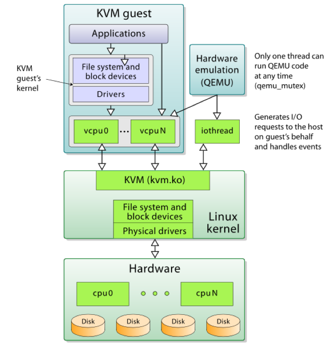
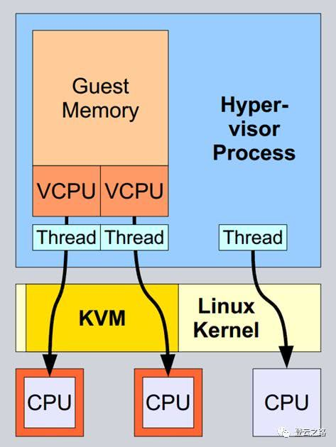

<!-- @import "[TOC]" {cmd="toc" depthFrom=1 depthTo=6 orderedList=false} -->

<!-- code_chunk_output -->

- [虚拟化方案](#虚拟化方案)
- [1. QEMU/KVM 架构](#1-qemukvm-架构)
  - [1.1. KVM运行时的三种模式](#11-kvm运行时的三种模式)
  - [1.2. 理解KVM与Qemu的关系](#12-理解kvm与qemu的关系)
- [2. KVM工作原理](#2-kvm工作原理)
- [3. CPU虚拟化](#3-cpu虚拟化)
- [4. Mem虚拟化](#4-mem虚拟化)
- [IO虚拟化](#io虚拟化)
- [5. 参考](#5-参考)

<!-- /code_chunk_output -->

# 虚拟化方案

在所有虚拟化方案中，都是由**hypervisor取代原生的OS**去控制具体硬件资源，而同时hypervisor将资源分配具体的VM，VM中运行的是没有修改过的OS，如果让VM中的OS能正常运行，hypervisor的任务就是模拟具体的硬件资源，让OS不能识别出是真是假。

KVM全称是Kernel\-based Virtual Machine，是一个基于Linux环境的开源虚拟化解决方案。

与 Xen、VMware 等提供完整解决方案的商业化虚拟产品不同，KVM的**思想**是在**Linux内核的基础**上添加**虚拟机管理模块**，重用Linux内核中已经完善的**进程调度**、**内存管理**、**IO管理**等部分，使之成为一个可以支持运行虚拟机的Hypervisor。

因此，KVM并**不是一个完整的模拟器**，而只是一个提供了虚拟化功能的内核插件，具体的模拟器工作是借助QEMU来完成的，二者的架构区别如图5-1所示。

图5-1 KVM 和 Xen 虚拟化方案比较:


在**Xen**的体系结构中，**Xen Hypervisor**运行于**硬件之上**，并且将系统资源进行了虚拟化操作，将虚拟化的资源分配给上层的虚拟机（VM），然后通过虚拟机VM来运行相应的客户机操作系统。

# 1. QEMU/KVM 架构

基于KVM/QEMU架构实现的虚拟化，相关的架构如下图所示：





在KVM中，**一个虚拟机**就是一个**传统的Linux中的线程**，拥有自己的PID号，也可以被kill系统调用直接杀死（在这种情况下，虚拟机的行为表现为“突然断电”）。在一个Linux系统中，有多少个VM，就有多少个进程，如图5\-2所示。

图5-2 qemu-kvm虚拟机的运行时进程信息:


每一个虚拟机(guest)在Host上都被模拟为一个QEMU进程，即emulation进程，它有自己的pid。并且有四个线程，线程数量不是固定的，但是**至少会有三个**（**vCPU**，**IO**，**Signal**)。其中有两个是vCPU线程，有一个**IO线程**还有一个**信号处理线程**。

```cpp
➜  ~ pstree -p 20308
qemu-system-x86(20308)-+-{qemu-system-x86}(20353)
                       |-{qemu-system-x86}(20408)
                       |-{qemu-system-x86}(20409)
                       |-{qemu-system-x86}(20412)
```

KVM是基于硬件辅助虚拟化技术（Intel的VT\-x或者AMD\-V）的全虚拟化解决方案，客户机操作系统能够不经过修改直接在 KVM 的虚拟机中运行，每一台虚拟机能够享有独立的虚拟硬件资源：网卡、磁盘、图形适配器等。

**KVM**支持**虚拟化嵌套**，即在虚拟化出来的主机中，KVM能够再次进行虚拟机中的虚拟化，但是此项功能**只针对KVM**，不支持Xen、VMwaer等其他虚拟化架构方案。

上面的模型是Xen示例，OS对应用而言是硬件资源管理中心，那么hypervisor就是具体VM的OS了，**KVM**是就利用了这一点，利用现有的**kernel**代码，构建了一个hypervisor，这个样子[内存分配](http://www.oenhan.com/kernel-program-exec)，[进程调度](http://www.oenhan.com/task-group-sched)等就无需重写代码，如此hypervisor就是所谓的host，VM中的OS就是guest。

guest OS保证具体运行场景中的程序正常执行，而**KVM的代码**则部署在**HOST**上，**Userspace**对应的是**QEMU**，**Kernel**对应的是**KVM Driver**，**KVM Driver**负责模拟**虚拟机的CPU运行**，[**内存管理**](http://www.oenhan.com/size-512-slab-kmalloc)，**设备管理**等；**QEMU**则**模拟虚拟机的IO设备接口**以及**用户态控制接口**。QEMU通过KVM等fd进行IOCTL控制KVM驱动的运行过程。


如上图所示，guest自身有自己的用户模式和[内核模式](http://www.oenhan.com/iowait-wa-vmstat)；

**guest**在**host**中是作为一个**用户态进程**存在的，这个进程就是**qemu**，qemu本身就是一个**虚拟化程序**，只是纯软件虚拟化效率很低，它被KVM进行改造后，作为**KVM的前端**存在，用来进行[**创建进程**](http://www.oenhan.com/cpu-load-balance)或者**IO交互**等；

而**KVM Driver**则是Linux内核模式，它提供**KVM fd**给**qemu**调用，用来进行**cpu虚拟化**，**内存虚拟化**等。

kvm已经是**内核模块**，被看作是一个标准的**linux 字符集设备**（/**dev/kvm**）。

Qemu通过**libkvm应用程序接口**，用**fd**通过**ioctl**向设备驱动来发送创建，运行虚拟机命令。

设备驱动kvm就会来解析命令（`kvm_dev_ioctl`函数在`kvm_main.c`文件中）,如下图：


```cpp
// virt/kvm/kvm_main.c
static long kvm_dev_ioctl(struct file *filp,
			  unsigned int ioctl, unsigned long arg)
{
	long r = -EINVAL;

	switch (ioctl) {
	case KVM_GET_API_VERSION:
		if (arg)
			goto out;
		r = KVM_API_VERSION;
		break;
	case KVM_CREATE_VM:
		r = kvm_dev_ioctl_create_vm(arg);
		break;
	case KVM_CHECK_EXTENSION:
		r = kvm_vm_ioctl_check_extension_generic(NULL, arg);
		break;
	case KVM_GET_VCPU_MMAP_SIZE:
		if (arg)
			goto out;
		r = PAGE_SIZE;     /* struct kvm_run */
#ifdef CONFIG_X86
		r += PAGE_SIZE;    /* pio data page */
#endif
#ifdef CONFIG_KVM_MMIO
		r += PAGE_SIZE;    /* coalesced mmio ring page */
#endif
		break;
	case KVM_TRACE_ENABLE:
	case KVM_TRACE_PAUSE:
	case KVM_TRACE_DISABLE:
		r = -EOPNOTSUPP;
		break;
	default:
		return kvm_arch_dev_ioctl(filp, ioctl, arg);
	}
out:
	return r;
}
```

KVM Driver使得整个Linux成为一个虚拟机监控器，负责接收**qemu模拟效率很低**的命令。

## 1.1. KVM运行时的三种模式

kvm 模块让Linux主机成为一个虚拟机监视器（VMM），并且在原有的Linux两种执行模式基础上，新增加了客户模式，客户模式拥有自己的内核模式和用户模式。

所以在虚拟机运行时，有三种模式，分别是：

- 客户模式：我们可以简单理解成客户机操作系统运行在的模式，它本身又分为自己的内核模式和用户模式。执行非I/O的客户代码，虚拟机运行在这个模式下。

- 用户模式：为用户提供虚拟机管理的用户空间工具以及代表用户执行I/O，Qemu运行在这个模式之下。

- 内核模式：模拟CPU以及内存，实现客户模式的切换，处理从客户模式的退出。KVM内核模块运行在这个模式下。

三种模式的层次关系我们可以用图简单描述一下：


在kvm的模型中，**每一个Gust OS**都是作为一个**标准的linux进程**，都可以使用linux进程管理命令管理。

这里假如**qemu**通过**ioctl**发出**KVM\_CREATE\_VM** 指令，**创建了一个VM后**，qemu需要需要发送一些命令给VM，如**KVM\_CREATE\_VCPU**。这些命令当然也是通过**ioctl**发送的，用户程序中用ioctl发送**KVM\_CREATE_VM**得到的**返回值**就是**新创建的VM对应的fd(kvm\_vm**)，fd是创建的**指向特定虚拟机实例**的**文件描述符**，之后利用这个fd发送命令给VM进行访问控制。kvm解析这些命令的函数是kvm\_vm\_ioctl。

## 1.2. 理解KVM与Qemu的关系

我们都知道开源虚拟机KVM，并且知道它总是跟Qemu结合出现，那这两者之间有什么关系呢？

首先，Qemu本身并不是KVM的一部分，而是一整套完整的虚拟化解决方案，它是纯软件实现的，包括处理器虚拟化、内存虚拟化以及各种虚拟设备的模拟，但因为是纯软件模拟，所以性能相对比较低。

而广义的KVM实际上包含两部分，一部分是基于Linux内核支持的KVM内核模块，另一部分就是经过简化和修改Qemu。

KVM内核模块模拟处理器和内存以支持虚拟机的运行，Qemu主要处理I/O以及为用户提供一个用户空间工具来进行虚拟机的管理。两者相互结合，相辅相成，构成了一个完整的虚拟化平台。

# 2. KVM工作原理

KVM的工作原理如图：


上图是一个执行过程图，首先启动一个**虚拟化管理软件qemu**，开始启动一个虚拟机，通过**ioctl**等**系统调用**向**内核**中**申请指定的资源**，搭建好虚拟环境，启动虚拟机内的OS，执行 **VMLAUCH** 指令，即**进入了guest代码**执行过程。

如果 Guest OS 发生**外部中断**或者**影子页表缺页**之类的事件，暂停 Guest OS 的执行，**guest VM\-exit**，进行一些必要的处理，然后重新进入客户模式，执行guest代码；这个时候如果是io请求，则提交给用户态下的qemu处理，qemu处理后再次通过IOCTL反馈给KVM驱动。

KVM的大致工作原理：用户模式的Qemu利用接口libkvm通过**ioctl系统调用**进入内核模式。KVMDriver为虚拟机创建虚拟CPU和虚拟内存，然后执行VMLAUNCH指令进入**客户模式**，装载Guest OS并运行。Guest OS运行过程中如果发生中断或者影子缺页等异常，将暂停Guest OS的运行并保存当前上下文退出到内核模式来处理这些异常。内核模式处理这些异常时如果不需要I/O则处理完成后重新进入客户模式，如果需要I/O则进入到用户模式，由Qemu来处理I/O，处理完成后进入内核模式，再进入客户模式。

# 3. CPU虚拟化

X86体系结构**CPU虚拟化**技术的称为 **Intel VT\-x** 技术，引入了VMX，提供了两种处理器的工作环境。 VMCS 结构实现两种环境之间的切换。 VM Entry 使虚拟机进去guest模式，VM Exit 使虚拟机退出guest模式。

VMM调度guest执行时，qemu 通过 ioctl [系统调用](http://oenhan.com/kernel-program-exec)进入内核模式，在 KVM Driver中获得当前物理 CPU的引用。之后将guest状态从VMCS中读出, 并装入物理CPU中。执行 VMLAUCH 指令使得物理处理器进入非根操作环境，运行guest OS代码。

当 guest OS 执行一些特权指令或者外部事件时，比如I/O访问，对控制寄存器的操作，MSR的读写等， 都会导致物理CPU发生 VMExit， 停止运行 Guest OS，将 Guest OS保存到VMCS中，Host 状态装入物理处理器中， 处理器进入根操作环境，KVM取得控制权，通过读取 VMCS 中 VM_EXIT_REASON 字段得到引起 VM Exit 的原因。 从而调用kvm_exit_handler 处理函数。 如果由于 I/O 获得信号到达，则退出到userspace模式的 Qemu 处理。处理完毕后，重新进入guest模式运行虚拟 CPU。

guest的所有用户级别(user)的指令集，都会直接由宿主机线程执行，此线程会调用KVM的ioctl方式提供的接口加载guest的指令并在特殊的CPU模式下运行，不需要经过CPU指令集的软件模拟转换，大大的减少了虚拟化成本，这也是KVM优于其他虚拟化方式的点之一。

KVM向外提供了一个虚拟设备/dev/kvm，通过ioctl(IO设备带外管理接口）来对KVM进行操作，包括虚拟机的初始化，分配内存，指令加载等等。

# 4. Mem虚拟化

OS对于物理内存主要有两点认识：1.物理地址从0开始；2.[内存地址](http://www.oenhan.com/kernel-program-exec)是连续的。

VMM接管了所有内存，但guest OS的对内存的使用就存在这两点冲突了，除此之外，一个guest对内存的操作很有可能影响到另外一个guest乃至host的运行。VMM的内存虚拟化就要解决这些问题。

在OS代码中，应用也是占用所有的逻辑地址，同时不影响其他应用的关键点在于有线性地址这个中间层；解决方法则是添加了一个中间层：**guest物理地址空间**；guest看到是从0开始的guest物理地址空间（类比从0开始的线性地址），而且是连续的，虽然有些地址没有映射；同时guest物理地址映射到不同的host逻辑地址，如此保证了VM之间的安全性要求。

这样MEM虚拟化就是GVA\->GPA\->HPA的寻址过程，传统软件方法有**影子页表**，硬件虚拟化提供了EPT支持。

guest的内存在host上由emulator提供，对emulator来说，guest访问的内存就是他的虚拟地址空间，guest上需要经过一次虚拟地址到物理地址的转换，转换到guest的物理地址其实也就是emulator的虚拟地址，emulator再次经过一次转换，转换为host的物理地址。后面会有介绍各种虚拟化的优化手段，这里只是做一个overview。

# IO虚拟化

guest作为一个进程存在，当然他的内核的所有驱动等都存在，只是硬件被QEMU所模拟（后面介绍virtio的时候特殊)。guest的所有硬件操作都会有QEMU来接管，QEMU负责与真实的宿主机硬件打交道。

# 5. 参考

http://oenhan.com/kvm-src-1

https://www.linuxidc.com/Linux/2015-01/112328.htm