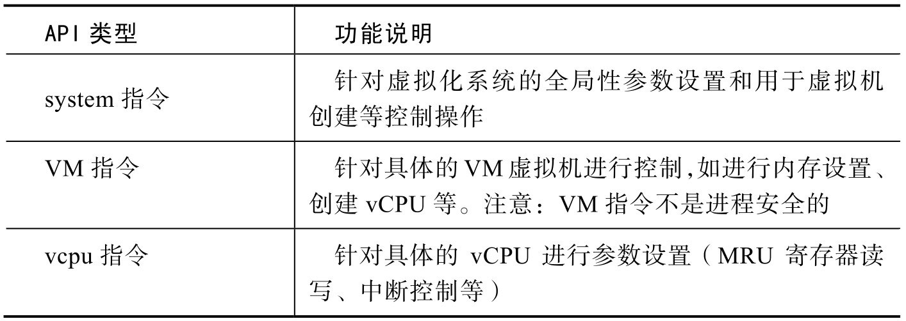
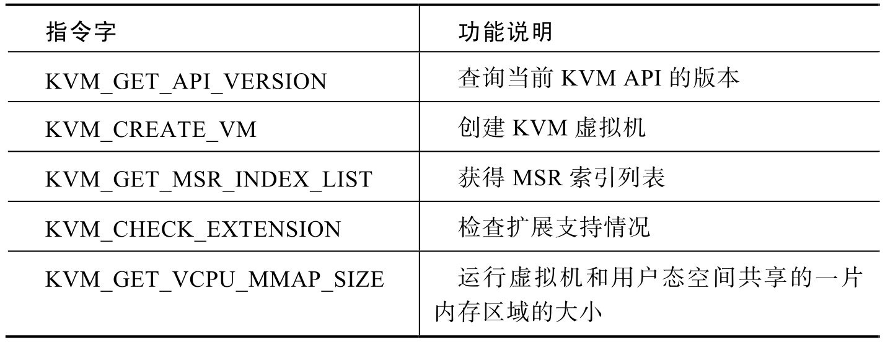
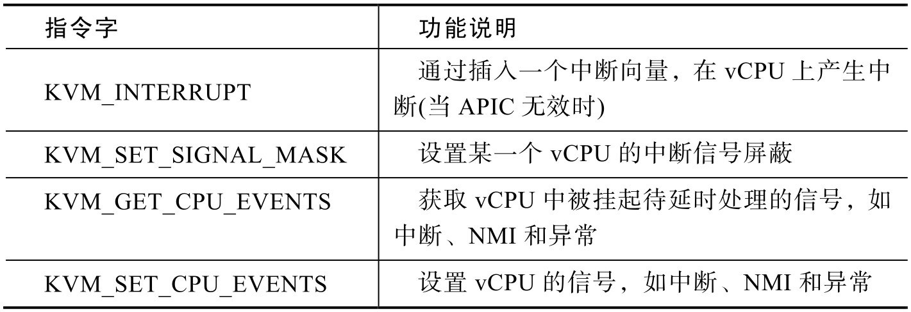
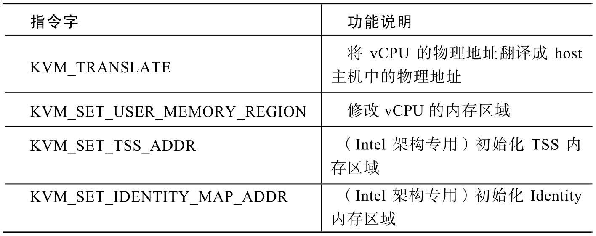

<!-- @import "[TOC]" {cmd="toc" depthFrom=1 depthTo=6 orderedList=false} -->

<!-- code_chunk_output -->

- [1. KVM API纵览](#1-kvm-api纵览)
- [2. system ioctls调用](#2-system-ioctls调用)
- [3. vm ioctl系统调用](#3-vm-ioctl系统调用)
- [4. vcpu ioctl系统调用](#4-vcpu-ioctl系统调用)
  - [4.1. 寄存器控制](#41-寄存器控制)
  - [4.2. 中断和事件管理](#42-中断和事件管理)
  - [4.3. 内存管理](#43-内存管理)
  - [4.4. 其它管理](#44-其它管理)

<!-- /code_chunk_output -->

# 1. KVM API纵览

KVM的 API是通过`/dev/kvm`设备进行访问的。`/dev/kvm`是一个**字符型设备**。

作为 Linux 的一个**标准字符型设备**，可以使用常见的**系统调用**如 **open**、**close**、**ioctl**等**指令**进行操作。

因为KVM的字符型设备的实现函数中，**没有**包含**write**、**read**等操作。所有对KVM的操作都是通过**ioctl**发送相应的**控制字**实现的。

KVM所提供的**用户空间API**从功能上划分，可以分为**三种类型**，如表所示。


通常，

1. 对于KVM API的操作是从**打开/dev/kvm设备**文件开始的，通过使用**系统调用open**之后，会获得针对kvm subsystem的一个**fd文件描述符**。

2. 然后通过**ioctl系统指令**针对该文件描述符进行进一步的操作。

3. 通过**KVM\_CREATE\_VM指令**将**创建一个虚拟机**并**返回该虚拟机对应的fd文件描述符**，然后根据**该描述符**来**控制虚拟机的行为**。

4. 通过**KVM\_CREATE\_VCPU指令**，将**创建一个虚拟CPU**并且返回**该vCPU对应的fd**。

需要注意的一点是，在 Linux 的**系统调用**中，通过 **fork**()系统调用创建的**子进程**将**继承父进程的文件访问描述符 fd**，从而实现**多进程访问**。而在 **KVM内部的API实现**中，并**没有针对这种情况进行保护**。

# 2. system ioctls调用

**system ioctls系统调用**用于控制KVM运行环节的**参数**，相关工作包括**全局性的参数设置**和**虚拟机创建**等工作，其主要指令字如表所示。


**KVM\_CREATE\_VM** 是其中比较重要的指令字。通过该参数，KVM 将**返回一个文件描述符**，该文件描述符指向内核控件中一个新的**虚拟机**。

全新创建的虚拟机**没有vCPU**，也**没有内存**，需要通过后续的ioctl指令进行配置。使用**mmap**()系统调用，则会直接返回**该虚拟机**对应的**虚拟内存空间**，并且内存的偏移量为 0。如果 KVM支持 KVM\_CAP\_USER\_MEMORY扩展特性，则应使用其他方法。

# 3. vm ioctl系统调用

**vm ioctl系统调用**实现了**对虚拟机的控制**。vm ioctl控制指令的参数大多需要从 **KVM\_CREATE\_VM** 中返回的 **fd 文件描述符**来进行操作，涉及的操作主要针**对某一个虚拟机**进行**控制**，如配置内存、配置vCPU等。


**KVM\_RUN**和**KVM\_CREATE\_VCPU**是vm ioctl系统调用的两个重要指令字。在通过 KVM\_CREATE\_VCPU为 VM虚拟机**创建 vCPU**，并且获得 **vCPU对应的fd文件描述符！！！** 之后，可以进行**KVM\_RUN启动虚拟机！！！** 的操作。

KVM\_RUN 指令字虽然没有任何参数，但是在调用 **KVM\_RUN** 启动了**虚拟机**之后，可以通过 **mmap**()系统调用**映射 vCPU 的 fd 所在的内存空间！！！** 来获得**kvm\_run 结构体信息！！！**。该结构体位于**内存偏移量 0**，结束位置在 **KVM\_GET\_VCPU\_MMAP\_SIZE指令所返回的大小**中。

**kvm\_run结构体**的定义在`include/uapi/linux/kvm.h`中，通过读取该结构体可以了解 **KVM 内部的运行状态**，可以类比为计算机芯片中的**寄存器组**。其中主要的字段及说明如表4所示。


# 4. vcpu ioctl系统调用

vcpu ioctl系统调用主要针对具体的**每一个虚拟的vCPU**进行配置，包括**寄存器读/写**、**中断设置**、**内存设置**、**调试开关**、**时钟管理**等功能，能够对 KVM的虚拟机进行精确的运行时配置。

## 4.1. 寄存器控制

对于一个 VM的 CPU来说，**寄存器控制**是最重要的一个环节，vcpu ioctl在寄存器控制方面提供了丰富的指令字，如表所示。


## 4.2. 中断和事件管理

KVM在**中断管理**和**事件管理**中，也提供了丰富的指令字。在**KVM运行期间**，可以通过**中断管理向vCPU插入中断**，或者**获取vCPU的一些事件**（如热插拔等），该部分指令字如表所示。


## 4.3. 内存管理

**内存管理**是虚拟机管理中一个重要的组成部分，KVM也提供了相应的API支持，该部分指令字如表所示。


## 4.4. 其它管理

除了上面的vCPU 管理、中断管理和内存管理之外，KVM 最后还提供了其他方面的管理，如 **CPUID 的设置**、**调试接口**等，这部分接口的指令字如表所示。

