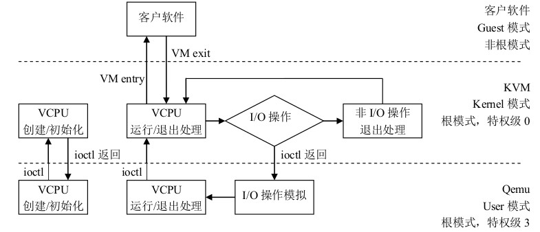

<!-- @import "[TOC]" {cmd="toc" depthFrom=1 depthTo=6 orderedList=false} -->

<!-- code_chunk_output -->

- [1. VT-x 技术](#1-vt-x-技术)
- [2. VMCS寄存器](#2-vmcs寄存器)
- [3. VM-Entry/VM-Exit](#3-vm-entryvm-exit)
- [KVM_CREATE_VM](#kvm_create_vm)
- [4. 参考](#4-参考)

<!-- /code_chunk_output -->

# 1. VT-x 技术

Intel处理器支持的虚拟化技术即是VT-x，之所以CPU支持硬件虚拟化是因为软件虚拟化的效率太低。

处理器虚拟化的本质是分时共享，主要体现在状态恢复和资源隔离，实际上每个VM对于VMM看就是一个task么，之前Intel处理器在虚拟化上没有提供默认的硬件支持，传统 x86 处理器有4个特权级，Linux使用了0,3级别，0即内核，3即用户态，（[更多参考CPU的运行环、特权级与保护](http://blog.csdn.net/drshenlei/article/details/4265101)）而在虚拟化架构上，虚拟机监控器的运行级别需要内核态特权级，而CPU特权级被传统OS占用，所以Intel设计了VT-x，提出了VMX模式，即VMX root operation 和 VMX non-root operation，虚拟机监控器运行在VMX root operation，虚拟机运行在VMX non-root operation。每个模式下都有相对应的0~3特权级。

为什么引入这两种特殊模式，在传统x86的系统中，CPU有不同的特权级，是为了划分不同的权限指令，某些指令只能由系统软件操作，称为特权指令，这些指令只能在最高特权级上才能正确执行，反之则会触发异常，处理器会陷入到最高特权级，由系统软件处理。还有一种需要操作特权资源（如[访问中断寄存器](http://www.oenhan.com/rwsem-realtime-task-hung)）的指令，称为敏感指令。OS运行在特权级上，屏蔽掉用户态直接执行的特权指令，达到控制所有的硬件资源目的；而在虚拟化环境中，VMM控制所有所有硬件资源，VM中的OS只能占用一部分资源，OS执行的很多特权指令是不能真正对硬件生效的，所以原特权级下有了root模式，OS指令不需要修改就可以正常执行在特权级上，但这个特权级的所有敏感指令都会传递到root模式处理，这样达到了VMM的目的。

在KVM源代码分析1:基本工作原理章节中也说了kvm分3个模式，对应到VT-x 中即是客户模式对应vmx非root模式，内核模式对应VMX root模式下的0特权级，用户模式对应vmx root模式下的3特权级。



在非根模式下敏感指令引发的陷入称为`VM-Exit`，`VM-Exit`发生后，CPU从非根模式切换到根模式；对应的，`VM-Entry`则是从根模式到非根模式，通常意味着调用VM进入运行态。`VMLAUCH`/`VMRESUME`命令则是用来发起`VM-Entry`。

# 2. VMCS寄存器

**VMCS**保存**虚拟机**的**相关CPU状态**，**每个VCPU**都有一个**VMCS**（内存的），**每个物理CPU**都有**VMCS**对应的**寄存器（物理的**）.

- 当CPU发生`VM-Entry`时，CPU则从**VCPU指定的内存**中**读取VMCS**加载到**物理CPU**上执行;
- 当发生`VM-Exit`时，CPU则将**当前的CPU状态**保存到**VCPU指定的内存**中，即VMCS，以备下次`VMRESUME`。

`VMLAUCH`指VM的**第一次**`VM-Entry`，`VMRESUME`则是**VMLAUCH之后**后续的`VM-Entry`。

VMCS下有一些**控制域**：


关于具体控制域的细节，还是翻Intel手册吧。

# 3. VM-Entry/VM-Exit

VM-Entry是从根模式切换到非根模式，即VMM切换到guest上，这个状态由**VMM发起**，**发起之前**先保存**VMM中的关键寄存器**内容到**VMCS**中，然后进入到VM-Entry，`VM-Entry`附带**参数主要有3个**：

1. guest是否处于64bit模式，
2. `MSR VM-Entry`控制，
3. 注入事件。

1应该**只在VMLAUCH有意义**，3更多是在VMRESUME，而VMM发起`VM-Entry`更多是因为3，2主要用来每次更新MSR。

`VM-Exit`是CPU从**非根模式**切换到**根模式**，从guest切换到VMM的操作，`VM-Exit`触发的原因就很多了，执行**敏感指令**，[**发生中断**](http://www.oenhan.com/rwsem-realtime-task-hung)，**模拟特权资源**等。

运行在**非根模式**下的**敏感指令**一般分为3个方面：

1. **行为没有变化**的，也就是说该指令能够**正确执行**。

2. **行为有变化**的，直接产生`VM-Exit`。

3. **行为有变化**的，但是是否产生`VM-Exit`受到`VM-Execution`**控制域控制**。

主要说一下"受到`VM-Execution`控制域控制"的敏感指令，这个就是**针对性的硬件优化**了，一般是

1. 产生`VM-Exit`；
2. 不产生`VM-Exit`，同时调用**优化函数完成功能**。

典型的有“**RDTSC指令**”。除了大部分是优化性能的，还有一小部分是直接`VM-Exit`执行指令结果是异常的，或者说在[虚拟化](http://www.oenhan.com/kvm-src-1)场景下是不适用的，典型的就是**TSC offset**了。

`VM-Exit`发生时退出的相关信息，如退出原因、触发中断等，这些内容保存在`VM-Exit`**信息域**中。

# KVM_CREATE_VM

创建VM就写这里吧，`kvm_dev_ioctl_create_vm`函数是主干，在`kvm_create_vm`中，主要有**两个函数**，`kvm_arch_init_vm`和`hardware_enable_all`，需要注意，但是更先一步的是KVM结构体，下面的struct是精简后的版本。

```cpp
struct kvm {
    struct mm_struct *mm; /* userspace tied to this vm */
    struct kvm_memslots *memslots;  /*qemu模拟的内存条模型*/
    struct kvm_vcpu *vcpus[KVM_MAX_VCPUS]; /* 模拟的CPU */
    atomic_t online_vcpus;
    int last_boosted_vcpu;
    struct list_head vm_list;  //HOST上VM管理链表，
    struct kvm_io_bus *buses[KVM_NR_BUSES];
    struct kvm_vm_stat stat;
    struct kvm_arch arch; //这个是host的arch的一些参数
    atomic_t users_count;
 
    long tlbs_dirty;
    struct list_head devices;
};
```

`kvm_arch_init_vm`基本没有特别动作，初始化了`KVM->arch`，以及更新了**kvmclock函数**，这个另外再说。

而`hardware_enable_all`，针对于**每个CPU**执行“`on_each_cpu(hardware_enable_nolock, NULL, 1)`”，在`hardware_enable_nolock`中先把`cpus_hardware_enabled`**置位**，进入到`kvm_arch_hardware_enable`中，有`hardware_enable`和**TSC**初始化规则，主要看`hardware_enable`，`crash_enable_local_vmclear`清理位图，判断`MSR_IA32_FEATURE_CONTROL`寄存器**是否满足虚拟环境**，不满足则**将条件写入到寄存器**内，`CR4`将`X86_CR4_VMXE`**置位**，另外还有`kvm_cpu_vmxon`打开**VMX操作模式**，外层包了`vmm_exclusive`的判断，它是`kvm_intel.ko`的**外置参数**，默认唯一，可以让用户**强制不使用VMM硬件支持**。


# 4. 参考

http://oenhan.com/kvm-src-3-cpu