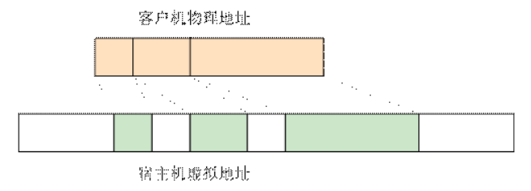
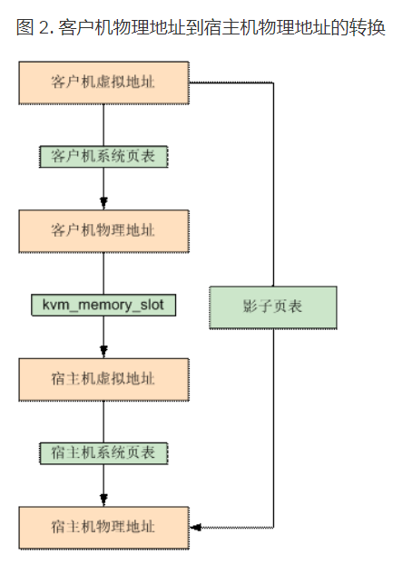

<!-- @import "[TOC]" {cmd="toc" depthFrom=1 depthTo=6 orderedList=false} -->

<!-- code_chunk_output -->

- [1. 概述](#1-概述)
- [2. 客户机物理地址空间](#2-客户机物理地址空间)
- [四种地址](#四种地址)
  - [GVA -> GPA](#gva-gpa)
  - [GPA -> HVA](#gpa-hva)
  - [两种内存虚拟化方案](#两种内存虚拟化方案)
- [3. 地址转换过程](#3-地址转换过程)
- [4. 影子页表](#4-影子页表)
  - [4.1. 影子页表异常处理机制](#41-影子页表异常处理机制)
- [5. EPT页表](#5-ept页表)
- [参考](#参考)

<!-- /code_chunk_output -->

# 1. 概述

实现 KVM 虚拟化，使客户机高效地、安全地使用宿主机的内存资源，就必须实现内存的虚拟化。

# 2. 客户机物理地址空间

为了实现内存虚拟化，让**客户机**使用一个**隔离的**、**从零开始**且具有**连续的内存空间**，KVM 引入一层**新的地址空间**，即**客户机物理地址空间 (Guest Physical Address, GPA**)，这个地址空间并**不是真正的物理地址空间**，它只是**宿主机虚拟地址空间**在**客户机地址空间**的一个映射。

对**客户机**来说，**客户机物理地址空间**都是**从零开始的连续地址空间**，但对于**宿主机**来说，**客户机的物理地址空间**并**不一定是连续的**，客户机物理地址空间有可能映射在若干个不连续的宿主机地址区间，如下图 1 所示：

所以就有四种地址

# 四种地址

1. GVA - Guest虚拟地址

2. GPA - Guest物理地址

3. HVA - Host虚拟地址

4. HPA -Host物理地址

## GVA -> GPA

Guest OS维护的页表进行传统的操作

## GPA -> HVA

由于**客户机物理地址**不能直接用于**宿主机物理MMU**进行寻址，所以需要把**客户机物理地址**转换成**宿主机虚拟地址 (Host Virtual Address, HVA**).

为此，KVM用一个`kvm_memory_slot`数据结构来记录**每一个地址区间**的**映射关系**，此数据结构包含了对应此映射区间的**起始客户机页帧号 (Guest Frame Number, GFN**)，映射的**内存页数目**以及**起始宿主机虚拟地址**。

于是 KVM就可以实现对**客户机物理地址**到**宿主机虚拟地址**之间的转换，也即首先根据**客户机物理地址**找到**对应的映射区间**，然后根据此**客户机物理地址**在**此映射区间**的**偏移量**就可以得到其**对应的宿主机虚拟地址**。进而再**通过宿主机的页表**也可实现客户机物理地址到宿主机物理地址之间的转换，也即 **GPA 到 HPA** 的转换。

**KVM的虚拟机**实际上运行在**Qemu的进程上下文**中。于是，**虚拟机的物理内存**实际上是**Qemu进程的虚拟地址**。Kvm要把**虚拟机的物理内存**分成**几个slot**。这是因为，对计算机系统来说，**物理地址**是**不连续**的，除了**bios**和**显存**要编入内存地址，**设备的内存**也可能**映射到内存**了，所以内存实际上是分为一段段的。

实现**内存虚拟化**，最主要的是实现**客户机虚拟地址 (Guest Virtual Address, GVA**) 到**宿主机物理地址之间的转换**。`GVA -> HPA`

根据上述**客户机物理地址**到**宿主机物理地址**之间的**转换**以及**客户机页表**，即可实现**客户机虚拟地址空间**到**客户机物理地址空间**之间的映射，也即 **GVA** 到 **HPA** 的转换。

## 两种内存虚拟化方案

显然通过这种映射方式，**客户机**的**每次内存访问**都需要 **KVM 介入！！！**，并由**软件进行多次地址转换**，其**效率是非常低**的。因此，为了**提高 GVA 到 HPA 转换的效率**，KVM 提供了**两种实现方式**来进行客户机虚拟地址到宿主机物理地址之间的直接转换。

其一是基于**纯软件**的实现方式，也即通过**影子页表 (Shadow Page Table**) 来实现**客户虚拟地址**到**宿主机物理地址**之间的直接转换。

其二是基于**硬件对虚拟化**的支持，来实现两者之间的转换。下面就详细阐述两种方法在 KVM 上的具体实现。

# 3. 地址转换过程

由于**宿主机MMU不能直接装载客户机的页表！！！** 来进行**内存访问**，所以当**客户机**访问**宿主机物理内存**时，需要经过**多次地址转换**。

也即**首先**根据**客户机页表**把**客户机虚拟地址**转传成**客户机物理地址**，然后再通过**客户机物理地址**到**宿主机虚拟地址**之间的映射转换成**宿主机虚拟地址**，最后再根据**宿主机页表**把宿主机虚拟地址转换成宿主机物理地址。

注意: **客户机页表基地址(即客户机CR3**)是**客户机物理地址**, 当加载CR3时可以直接通过`kvm_memory_slot`进行转换成**宿主机虚拟地址**, 然后**在宿主机进行页表转换**, 得到**客户机页表基地**址的**真实物理地址**.

# 4. 影子页表

而通过影子页表，则可以实现客户机虚拟地址到宿主机物理地址的直接转换。如下图所示：

**影子页表**简化了地址转换过程，实现了**客户机虚拟地址空间**到**宿主机物理地址空间**的**直接映射**。但是由于**客户机**中**每个进程**都有**自己的虚拟地址空间**，所以**KVM**需要为**客户机**中的**每个进程页表**都要**维护一套相应的影子页表**。

在**客户机**访问**内存**时，真正被装入**宿主机MMU**的是**客户机当前页表**所对应的**影子页表**，从而实现了从客户机虚拟地址到宿主机物理地址的直接转换。而且，在 **TLB 和 CPU 缓存**上缓存的是来自**影子页表**中**客户机虚拟地址**和**宿主机物理地址**之间的映射，也因此提高了缓存的效率。

在**影子页表**中，**每个页表项**指向的都是**宿主机的物理地址**。这些**表项**是随着**客户机操作系统**对**客户机页表**的**修改**而**相应地建立**的。客户机中的**每一个页表项**都有**一个影子页表项**与之相对应。如下图 3 所示：

为了**快速检索**客户机页表所对应的的**影子页表**，KVM 为**每个客户机**都维护了一个**哈希表**，**影子页表**和**客户机页表**通过此**哈希表**进行**映射**。

对于**每一个客户机**来说，**客户机的页目录**和**页表**都有**唯一**的**客户机物理地址**，通过**页目录 / 页表的客户机物理地址**就可以在**哈希链表**中快速地找到**对应的影子页目录 / 页表**。

在**检索哈希表**时，**KVM** 把**客户机页目录** / **页表**的**客户机物理地址低 10 位作为键值**进行**索引**，根据其**键值**定位到**对应的链表**，然后**遍历此链表**找到**对应的影子页目录/页表**。当然，如果**不能发现对应的影子页目录 / 页表**，说明 **KVM** 还**没有为其建立**，于是 KVM 就为其**分配新的物理页**并加入此**链表**，从而建立起客户机页目录 / 页表和对应的影子页目录 / 页表之间的映射。

当**客户机切换进程**时，**客户机操作系统**会把**待切换进程的页表基址载入 CR3**，而 KVM 将会**截获这一特权指令**，进行新的处理，也即在**哈希表**中找到与**此页表基址**对应的**影子页表基址**，载入**客户机 CR3**，使**客户机在恢复运行**时 CR3 实际指向的是**新切换进程对应的影子页表**。

## 4.1. 影子页表异常处理机制

在通过**影子页表**进行**寻址**的过程中，有**两种原因**会引起**影子页表的缺页异常**，一种是由**客户机本身所引起的缺页异常**，具体来说就是客户机所访问的**客户机页表项存在位 (Present Bit) 为 0**，或者写一个**只读的客户机物理页**，再者所访问的**客户机虚拟地址无效**等。另一种异常是由**客户机页表**和**影子页表不一致**引起的异常。

当**缺页异常发生**时，**KVM** 首先**截获该异常**，然后对发生异常的**客户机虚拟地址**在**客户机页表**中所对应**页表项**的访问权限进行检查，并根据**引起异常的错误码**，确定出此**异常的原因**，进行相应的处理。

如果该异常是由**客户机本身引起**的，KVM 则直接把该**异常**交由**客户机的缺页异常处理机制**来进行处理。

如果该异常是由**客户机页表**和**影子页表不一致**引起的，KVM 则根据**客户机页表同步影子页表**。为此，KVM 要建立起**相应的影子页表数据结构**，填充**宿主机物理地址**到**影子页表的页表项**，还要根据客户机页表项的访问权限修改影子页表对应页表项的访问权限。

由于**影子页表**可被载入**物理 MMU** 为**客户机直接寻址**使用， 所以客户机的**大多数内存访问**都可以在**没有 KVM 介入**的情况下正常执行，**没有额外的地址转换开销**，也就大大提高了客户机运行的效率。但是影子页表的引入也意味着 KVM 需要为**每个客户机**的**每个进程的页表**都要维护一套**相应的影子页表**，这会带来**较大内存上的额外开销**，此外，**客户机页表**和和**影子页表的同步**也比较复杂。

因此，Intel 的 EPT(Extent Page Table) 技术和 AMD 的 NPT(Nest Page Table) 技术都对内存虚拟化提供了硬件支持。这两种技术原理类似，都是在**硬件层面**上实现客户机虚拟地址到宿主机物理地址之间的转换。下面就以 EPT 为例分析一下 KVM 基于硬件辅助的内存虚拟化实现。

# 5. EPT页表

EPT 技术在**原有客户机页表**对**客户机虚拟地址**到**客户机物理地址映射**的基础上，又引入了 **EPT 页表**来实现**客户机物理地址**到**宿主机物理地址**的另一次映射，这**两次地址映射**都是由**硬件自动完成**。

- **Guest**维护自身的客户页表: `GVA->GPA`
- **EPT**维护 `GPA->HPA` 的映射

**客户机运行**时，**客户机页表**被载入 **物理CR3**，而 **EPT 页表**被载入专门的 **EPT 页表指针寄存器 EPTP**。**EPT 页表对地址的映射机理**与**客户机页表对地址的映射机理相同**，下图 4 出示了一个页面大小为 4K 的映射过程：

在**客户机物理地址**到**宿主机物理地址转换**的过程中，由于**缺页、写权限不足等原因**也会**导致客户机退出**，产生 **EPT 异常**。

对于 **EPT 缺页异常**，KVM 首先根据**引起异常的客户机物理地址**，映射到**对应的宿主机虚拟地址！！！**，然后**为此虚拟地址分配新的物理页**，最后 **KVM 再更新 EPT 页表**，建立起引起**异常的客户机物理地址**到**宿主机物理地址**之间的映射。对 **EPT 写权限**引起的异常，KVM 则通过**更新相应的 EPT 页表**来解决。

由此可以看出，**EPT 页表**相对于前述的影子页表，其实现方式大大简化。而且，由于**客户机内部的缺页异常**也**不会致使客户机退出**，因此**提高了客户机运行的性能**。此外，KVM 只需为**每个客户机**维护**一套 EPT 页表**，也大大**减少了内存的额外开销**。

# 参考

https://my.oschina.net/liyufeng0803/blog/715989