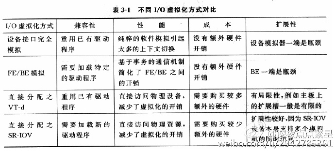

<!-- @import "[TOC]" {cmd="toc" depthFrom=1 depthTo=6 orderedList=false} -->

<!-- code_chunk_output -->

- [概述](#概述)
- [IO虚拟化](#io虚拟化)
  - [设备发现](#设备发现)
  - [访问截获](#访问截获)
    - [非直接分配给客户机操作系统的设备](#非直接分配给客户机操作系统的设备)
    - [直接分配给客户机操作系统的设备](#直接分配给客户机操作系统的设备)
  - [设备模拟](#设备模拟)
    - [基于软件的全虚拟化](#基于软件的全虚拟化)
    - [半虚拟化](#半虚拟化)
    - [基于硬件的直接分配（实际上已经不是设备模拟了）](#基于硬件的直接分配实际上已经不是设备模拟了)
  - [设备共享](#设备共享)

<!-- /code_chunk_output -->

https://www.cnblogs.com/jintianfree/p/4234301.html

# 概述

从**处理器**的角度看，**外设**是通过**一组I/O资源（port I/O或者是MMIO**）来进行**访问**的，所以**设备的相关虚拟化**被称为**I/O虚拟化**。其思想就是**VMM截获客户操作系统对设备的访问请求**，然后通过**软件的方式来模拟真实设备的效果**。基于设备类型的多样化，I/O虚拟化的方式和特点纷繁复杂。

一个完整的**系统虚拟化方案****在I/O虚拟化**方面需要处理以下几块

- **虚拟芯片组**

- **虚拟PCI总线布局**，主要是通过**虚拟化PCI配置空间**，为**客户机操作系统**呈现**虚拟的**或是**直接分配使用的设备**。

- **虚拟系统设备**，例如PIC、IO\-APIC、PIT和RTC等。

- **虚拟基本的输入输出设备**，例如**显卡**、**网卡**和**硬盘**等。

**I/O虚拟化**主要包含以下几个方面的虚拟化

- I/O端口寄存器(Port I/O)
- MMIO寄存器
- 中断
- DMA

# IO虚拟化

下面具体的描述**IO虚拟化**需要做的工作

## 设备发现

设备发现就是要让**VMM提供一种方式**，来让**客户机操作系统**发现**虚拟设备**，这样**客户机操作系统**才能加载**相关的驱动程序**，这是IO虚拟化的第一步。**设备发现**取决于**被虚拟的设备类型**。

模拟一个**所处物理总线的设备**，这其中包含如下两种类型。

1）模拟一个所处**总线类型**是**不可枚举的物理设备**，而且该设备本身所属的**资源是硬编码固定**下来的。比如**ISA设备**、**PS/2键盘**、**鼠标**、**RTC**及**传统IDE控制器**。对于这类设备，**驱动程序**会通过**设备特定的方式**来**检测设备是否存在**，例如读取**特定端口的状态信息**。对于这类设备的发现，**VMM**在**给定端口**进行**正确的模拟**就可以了，即**截获客户机对该端口的访问**，**模拟出结果交给客户机**。

2）模拟一个所处总线类型是**可枚举的物理设备**，而且相关设备**资源是软件可配置**的，比如**PCI设备**。由于**PCI总线**是通过**PCI配置空间**定义一套完备 的**设备发现方式**，并且运行**系统软件**通过**PCI配置空间**的**一些字段**对**给定PCI设备进行资源的配置**，例如**允许或禁止I/O端口和MMIO**，设置**I/O和 MMIO的起始地址**等。所以**VMM**仅模拟**自身的逻辑**是不够的，必须进一步**模拟PCI总线**的行为，包括**拓扑关系**和**设备特定的配置空间内容**，以便让客户机操作系统发现这类虚拟设备。

模拟一个**完全虚拟的设备**

这种情况下，没有一个现实中的规范与之对应，**这种虚拟设备**所处的**总线类型**完全由**VMM自行决定**，VMM可以选择将虚拟设备挂在PCI总线上，也可以完全**自定义一套新的虚拟总线协议**，这样的话**客户机操作系统**必须加装**新的总线驱动**。

## 访问截获

**虚拟设备**被客户机操作系统**发现**后，**客户机操作系统**中的**驱动**会按照**接口定义**访问这个虚拟设备。此时**VMM**必须**截获驱动对虚拟设备的访问**，并**进行模拟**。

### 非直接分配给客户机操作系统的设备

对于**端口I/O**，**IO指令**本身是**特权指令**，处于**低特权的客户机**访问端口I/O会**抛出异常**，从而**陷入到VMM**中，交给**设备模拟器进行模拟**。

对于**MMIO**，**VMM**把**映射到该MMIO的页表**设为**无效**，**客户机访问MMIO**时会抛出**缺页异常**，从而**陷入到VMM**中，交给**设备模拟器进行模拟**。

对于**中断**，VMM需要提供一种机制，供**设备模拟器**在 接收到**物理中断**并需要**触发中断时**，可以通知到**虚拟中断逻辑**，然后由**虚拟中断逻辑模拟一个虚拟中断的注入**。

### 直接分配给客户机操作系统的设备

对于**端口I/O**，可以**直接让客户机访问**, in和out指令是操作的端口port(立即数或DX寄存器)和累加器(AL或AX寄存器), 所以不需要内存虚拟化地址转换。

```assembly
IN 累加器, {端口号│DX}
OUT {端口号│DX},累加器
```

对于**MMIO**，也可以**直接让客户机进行映射访问**。

对于**中断**，**VMM物理中断处理函数**接收到**物理中断**后，辨认出**中断源**属于**哪个客户机**，直接通知**该客户机的虚拟中断逻辑**。

## 设备模拟

上一步中我们已经多次提到，下面分类介绍下设备模拟。

### 基于软件的全虚拟化

**虚拟设备**与**现实设备**具有**完全一样的接口定义**。这种情况下，**VMM的设备模拟器**需要仔细研究现实设备的接口定义和内部设计规范，然后以**软件的方式**模拟真实逻辑电路来满足每个接口的定义和效果。现实设备具有哪些资源，设备模拟器就需要呈现出同样的资源。这种情况下，**客户机操作系统原有的驱动程序无需修改 **就能驱动虚拟设备。**设备访问过程**中，**VMM**通过**截获驱动程序对设备的访问进行模拟**。

举例：qemu, VMware Workstation

### 半虚拟化

给**客户机操作系统**提供一个**特定的驱动程序（称为前端**），**VMM**中的**模拟程序称为后端**，**前端**将请求通过**VMM提供的通信机制**直接发送给**后端**，**后端处理完**请求后再**发回通知给前者**。

与传统设备驱动程序流程（前一种方式）比较，**传统设备程序**为了完成一次操作要**涉及到多个寄存器的操作**，使得**VMM**要**截获每个寄存器访问！！！**并进行**相应的模拟**，就会导致**多次上下文切换**。这种方式能很大程度的**减少上下文切换的频率**，提供更大的优化空间。

举例：xen virtio（virtio，主要包括virtio框架、virtio前端驱动、后端实现方式及原理、前端后端共享内存的方式）

### 基于硬件的直接分配（实际上已经不是设备模拟了）

直接将**物理设备**分配给**客户机操作系统**，由**客户机操作系统直接访问目标设备！！！**。这种情况下**实际上不存在设备模拟**，**客户机**直接通过**原有的驱动**操作**真实硬件**。这种方式从**性能上说是最优**的，但这种方式需要比**较多的硬件资源**。

基于硬件的直接分配还有一种方式，**硬件本身支持虚拟化**，本身可以向**不同的虚拟机**提供**独立的硬件支持**，设备本身支持多个虚拟机同时访问。比如SR-IOV。

举例：intel vt-d SR-IOV

一个VMM中，常常是多种虚拟化方式并存。

不同的IO虚拟化方式对比



## 设备共享

**设备虚拟化**中，**有些设备**可以被软件模拟器完全用**软件的方式模拟**而不用接触实际物理设备，比如**CMOS**，而有些设备需要设备模拟进一步**请求物理硬件**的帮助。**一般输入输出类设备**，如鼠标、键盘、显卡、硬盘、网卡。这些设备都涉及到**从真实设备上获取输入或者输出到真实设备**上。

对于**多个客户机**，**每个客户机**拥有自己的**设备模拟器**，多个设备模拟器需要**共享同一个物理设备**，这种情况下，**VMM**中的**真实设备的驱动程序**需要**同时接收并处理多个客户或进程的请求**，达到**物理资源的复用**。