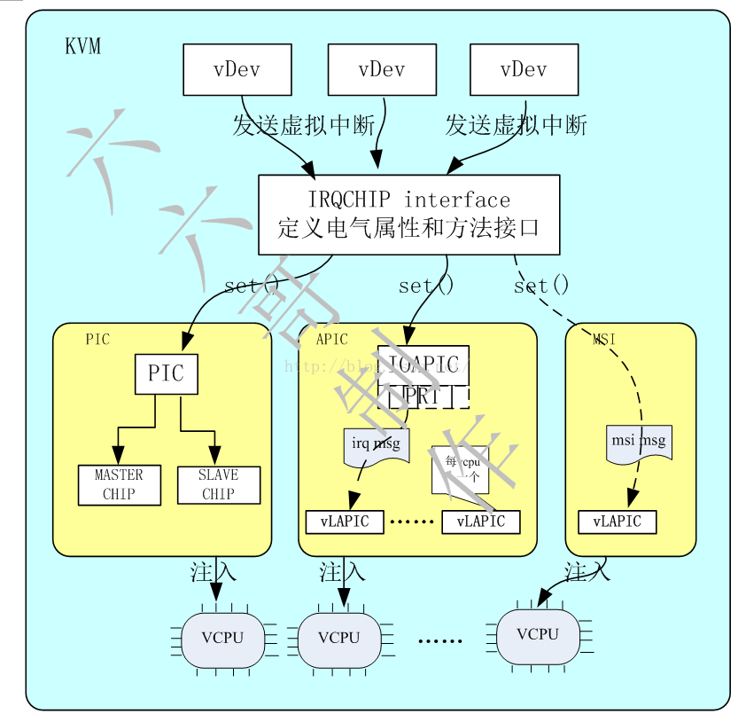
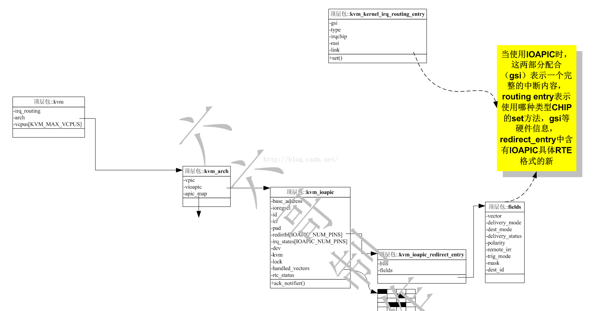

# 虚拟中断子系统逻辑图

KVM中断系统逻辑图如下



KVM将**所有类型**的**IRQ CHIP**抽象出**一个接口**，类似于C++的interface抽象基类，定义了

- **中断的触发方法**: `set()`
- 以及**每个引脚**和**GSI**的**映射关系**，

这些都是**和芯片类型无关**的，**具体的芯片**都是**继承和实现接口**，**虚拟设备的中断**发送给**IRQ CHIP接口**开始中断的模拟；分别实现了**PIC**、**IOAPIC**以及**MSI**的**set方法**进行，通过**set方法**完成对于**VCPU的中断注入**。

其中**IOAPIC**中对于**每个引脚**，又定义了**PRT**，**IOAPIC**收到中断后根据**RTE格式化**出**中断消息**并发送给**目标LAPIC**，LAPIC完成**中断的选举和注入实现**。


# 

# 虚拟中断子系统的关系

## IRQ抽象接口层


`struct kvm_irq_routing_table`是**vm整个**的**中断路由信息**，以**gsi为索引**可以找到**对应的路由项**，即`struct kvm_kernel_irq_routing_entry`。`struct kvm_irq_routing_table`中**map**是**以gsi为索引**的**结构体数组**，数组元素是**双链表**，同`struct kvm_kernel_irq_routing_entry`中**link关联**。


KVM中`irq_routing`指向了**IRQ CHIP抽象接口**的**表**`kvm_irq_routing_table`结构体。

`kvm_irq_routing_table.chip`每个成员**对应一个引脚**，内容记录了**该引脚的GSI号**，其实**该成员已经不用了**。

`kvm_irq_routing_table.map`成员指向一个**hash桶**，桶上的每个元素**对应一个抽象引脚**，即**每个链对一个IRQ号**，链上的每个元素指向`kvm_kernel_irq_routing_entry`结构体，**每个该结构体**代表了一个**具体芯片**的`set()`方法的实现，在进行**中断注入的时候**，**每种芯片的set方法**都会**被调用**一下，在**guest**中会**忽略没有实现的芯片类型发送的中断消息**(其实这里是可以优化的，必经不需要多次的中断注入，在**QEMU注册中断设备**的时候就**不要注册不需要的中断芯片类型**)

 

`kvm_kernel_irq_routing_entry`结构体**对应具体芯片的一个引脚**，按照芯片类型实现`kvm_kernel_irq_routing_entry.set`接口，`kvm_kernel_irq_routing_entry.chip`成员记录了该结构体对应的具体是哪种芯片的那个引脚，`kvm_kernel_irq_routing_entry.gsi`记录了该引脚的gsi号。

 

可以参考kvm_set_routing_entry()、kvm_set_irq()函数

## PIC 芯片结构


PIC是系统一个，由kvm.arch.vpic成员指向

Kvm_pic结构体就是虚拟PIC的实现dev_master、dev_slave、dev_eclr实现了虚拟PIC设备的PIO地址空间，并注册在KVM内核的PIO总线上，以便完成设备的IO操作，这个我会在后面的博文中对大家介绍，ECLR就是控制中断触发方式的寄存器; pics执行一个数组，每个元素指向kvm_kpic_state结构体，kvm_kpic_state结构体芯片的所有寄存器和状态，包括IRR，ISR，IMR等

## IOAPIC芯片结构



IOAPIC在KVM实现中只有一个，由kvm.arch.vioapic指向kvm_ioapic结构体。

kvm_ioapic结构体就是虚拟IOAPIC。irr成员就是IRR寄存器。redirtbl[IOAPIC_NUM_PINS]是一个数组，构成PRT表，每个成员对一个IOAPIC的引脚，执行kvm_ioapic_redirect_entry结构体。

kvm_ioapic_redirect_entry结构体就是一个RTE，fields成员执行了RTE中的各个域，如dest_id和dest_mode用来确定目标CPU，vector用来确定中断向量号，remote_irr在level触发时候保证中断共享情况下可以处理到所有设备的中断请求。Fields和kvm_kernel_irq_routing_entry的gsi配合起来确定了一个完整的中断信息内容

## LAPIC芯片结构体


LAPIC是每个VCPU一个，由kvm.vcpus[i].arch.apic指向kvm_lapic结构体。

kvm_lapic结构体代表一个虚拟LAPIC。base_address为LAPIC的基地址，这是一个GPA，是GUEST设置的LAPIC的基地址，在GUEST写某个LAPIC寄存器的时候，会带入该寄存器的GPA',然后GPA'减去base_address可以算出寄存器对于基地址的偏移量，然后到regs成员中真正的找到虚拟寄存器加以修改，请参见apic_mmio_read，apic_mmio_write；dev成员将lapic在KVM内核空间的KVM MMIO BUS总线上注册了IO地址空间，通过对IO地址空间的操作完成对LAPIC的操作。regs成员指向一个页面，这是一个HVA，指向一个HOST的页面，这个页面总记录了LAPIC是所有虚拟寄存，IRR，ISR，LVT等等，通过偏移量就可以得到某个虚拟寄存器的HVA，完成对该虚拟寄存器的读写操作。

kvm_lapic_irq结构体是中断经过IOAPIC的PRT格式化出来的中断消息，从IOAPIC发送给LAPIC。

LAPIC在GUEST运行之前会对IRR中的进行选举，找到最高优先级的中断，该中断会被记录在kvm_queued_interrupt结构体中并且pending成员设置为true；nr成员记录了该中断的中断向量号，soft说明是否是硬中断。如果该中断大于PPR，就进行注入。如果注入成功，在虚拟机退出的时候，将pending设置为false，这个结构体保存着kvm.vcpus[i].arch.interrupt中。如果注入不成功，会在再次进入虚拟机的时候再次进行注入。

为了加速对于目标VCPU的查找，在kvm.arch.apic_map中保存了kvm_apic_map结构体。phys_map成员和logical_map成员记录了RTE的destination filed同VLAPIC结构体的对应的关系，分别对应physical mode和logic mode。在发送中断的时候，如果有该map表，且中断不是lowest priority和广播，则通过RTE的destination filed就可以直接找到目标VCPU，进行快速的分发。否则需要遍历所有的VCPU，逐一的和RTE的destination filed进行匹配。


# kvm_pic: PIC 芯片结构

```cpp
struct kvm_kpic_state {
        u8 last_irr;    /* edge detection */
        u8 irr;         /* interrupt request register */
        u8 imr;         /* interrupt mask register */
        u8 isr;         /* interrupt service register */
        u8 priority_add;        /* highest irq priority */
        u8 irq_base;
        u8 read_reg_select;
        u8 poll;
        u8 special_mask;
        u8 init_state;
        u8 auto_eoi;
        u8 rotate_on_auto_eoi;
        u8 special_fully_nested_mode;
        u8 init4;               /* true if 4 byte init */
        u8 elcr;                /* PIIX edge/trigger selection */
        u8 elcr_mask;
        u8 isr_ack;     /* interrupt ack detection */
        struct kvm_pic *pics_state;
};

struct kvm_pic {
        spinlock_t lock;
        bool wakeup_needed;
        unsigned pending_acks;
        struct kvm *kvm;
        struct kvm_kpic_state pics[2]; /* 0 is master pic, 1 is slave pic */
        int output;             /* intr from master PIC */
        struct kvm_io_device dev_master;
        struct kvm_io_device dev_slave;
        struct kvm_io_device dev_eclr;
        void (*ack_notifier)(void *opaque, int irq);
        unsigned long irq_states[PIC_NUM_PINS];
};
```

# 参考

https://blog.csdn.net/leoufung/article/details/53081207

https://blog.csdn.net/Mr0cheng/article/details/102578713 (未完)