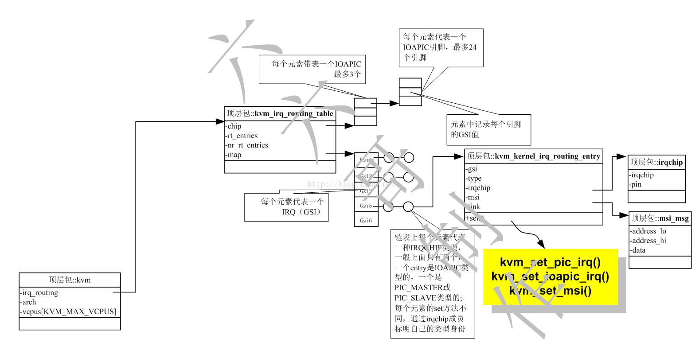
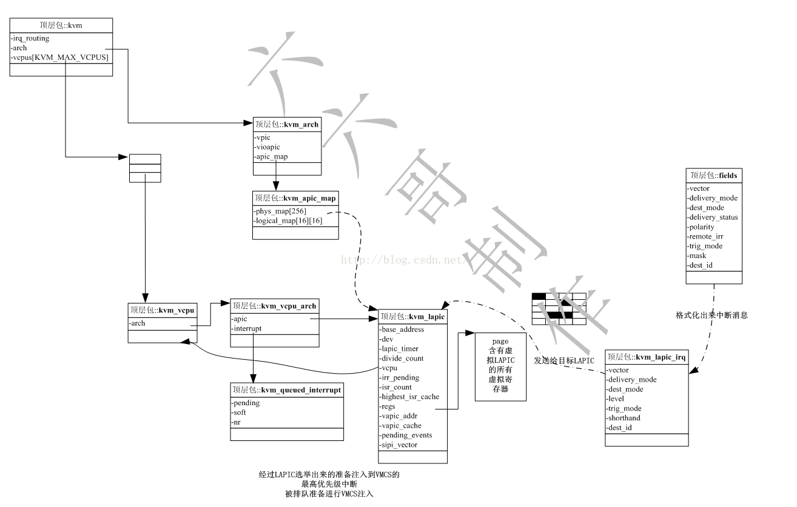

<!-- @import "[TOC]" {cmd="toc" depthFrom=1 depthTo=6 orderedList=false} -->

<!-- code_chunk_output -->

- [1. 虚拟中断子系统逻辑图](#1-虚拟中断子系统逻辑图)
- [2. 虚拟中断子系统的关系](#2-虚拟中断子系统的关系)
  - [2.1. kvm_irq_routing_table: 虚拟机的中断路由表](#21-kvm_irq_routing_table-虚拟机的中断路由表)
  - [2.2. kvm_kernel_irq_routing_entry: 中断路由项](#22-kvm_kernel_irq_routing_entry-中断路由项)
  - [2.3. IRQ抽象接口层](#23-irq抽象接口层)
  - [2.4. PIC 芯片结构](#24-pic-芯片结构)
  - [2.5. IOAPIC芯片结构](#25-ioapic芯片结构)
  - [2.6. LAPIC芯片结构体](#26-lapic芯片结构体)
- [3. 参考](#3-参考)

<!-- /code_chunk_output -->

# 1. 虚拟中断子系统逻辑图

KVM中断系统逻辑图如下


KVM将**所有类型**的**IRQ CHIP**(**中断芯片**)抽象出**一个接口**，类似于C++的interface抽象基类.

每个**中断芯片**定义了

- **中断的触发方法**: `set()`
- 以及**每个引脚**和**GSI**的**映射关系**，

这些都是**和芯片类型！！！无关**的，**具体的芯片**都是**继承和实现接口**，**虚拟设备的中断**发送给**IRQ CHIP(中断芯片)接口**开始中断的模拟；分别实现了**PIC**、**IOAPIC**以及**MSI**的**set方法**进行，通过**set方法**完成对于**VCPU的中断注入**。

其中**IOAPIC**中对于**每个引脚**，又定义了**PRT**，**IOAPIC**收到中断后根据**RTE格式化**出**中断消息**并发送给**目标LAPIC**，LAPIC完成**中断的选举和注入实现**。

# 2. 虚拟中断子系统的关系

在**KVM架构**下，**每个KVM虚拟机！！！** 维护一个**IO APIC！！！**，但是**每个VCPU！！！** 有**一个local APIC！！！**。

## 2.1. kvm_irq_routing_table: 虚拟机的中断路由表

一个`struct kvm`代表一个虚拟机, 
`irq_routing`是这个**虚拟机所有IRQ CHIP抽象接口**的**表**(汇总)。即表示该**虚拟机的整个中断路由信息表**.

**一个虚拟机**对应**一个中断路由表**.

```cpp
struct kvm {
        struct mutex irq_lock;
#ifdef CONFIG_HAVE_KVM_IRQCHIP
	/*
	 * Update side is protected by irq_lock.
	 */
	// irq相关部分
	struct kvm_irq_routing_table __rcu *irq_routing;
#endif
}

// pic master
#define KVM_IRQCHIP_PIC_MASTER   0
// pic slave
#define KVM_IRQCHIP_PIC_SLAVE    1
// ioapic
#define KVM_IRQCHIP_IOAPIC       2
#define KVM_NR_IRQCHIPS          3
#define KVM_IOAPIC_NUM_PINS 24
#define KVM_IRQCHIP_NUM_PINS KVM_IOAPIC_NUM_PINS

#ifdef CONFIG_HAVE_KVM_IRQ_ROUTING
struct kvm_irq_routing_table {
        // 每个引脚的GSI, 已不使用
        // 3个芯片, 每个最大24个引脚(ioapic最大), 最大72个引脚
        int chip[KVM_NR_IRQCHIPS][KVM_IRQCHIP_NUM_PINS];
        // 中断路由项的数目
        u32 nr_rt_entries;
        /*
         * Array indexed by gsi. Each entry contains list of irq chips
         * the gsi is connected to.
         */
        // 哈希链表结构体数组, 索引是gsi号
        // 数组里面的元素是哈希链表, 同一个irq关联的所有entry
        struct hlist_head map[0];
};
#endif
```

`chip`是个**二维数组**, 表示**三个中断控制器芯片**的**每一个管脚**（最多24个pin）. 每个成员**对应一个引脚**，内容记录了**该引脚的GSI号**，其实**该成员已经不用了**。

这三个中断控制器芯片是`pic master`, `pic slave`和`ioapic`

`nr_rt_entries`表示**中断路由表**中存放的“**中断路由项**”的**数目**

**map**是一个**哈希链表结构体数组**, 也就是说可以将map理解为**链表头数组**, 即**每个元素**都是**一个链表头**. 链表中每个项都是`kvm_kernel_irq_routing_entry`, 链表的所有项是通过`kvm_kernel_irq_routing_entry`中的`link`关联起来.

**以GSI作为索引**这个map数组, 可以找到**同一个irq**关联的所有（中断路由项）, 即这个链表头。也就是说**每个链表**对应**一个IRQ号**.

## 2.2. kvm_kernel_irq_routing_entry: 中断路由项

`kvm_kernel_irq_routing_entry`结构体**对应具体芯片的一个引脚**

```cpp
/* gsi routing entry types */
#define KVM_IRQ_ROUTING_IRQCHIP 1
#define KVM_IRQ_ROUTING_MSI 2
#define KVM_IRQ_ROUTING_S390_ADAPTER 3
#define KVM_IRQ_ROUTING_HV_SINT 4

struct kvm_kernel_irq_routing_entry {
        // 该entry对应的GSI号
        u32 gsi;
        // 类型
        u32 type;
        // 该GSI关联的中断触发方式
        int (*set)(struct kvm_kernel_irq_routing_entry *e,
                   struct kvm *kvm, int irq_source_id, int level,
                   bool line_status);
        // 联合体
        union {
                // irq芯片
                struct {
                        // 芯片类型
                        // 有三个, pic master, pic slave和ioapic
                        unsigned irqchip;
                        // 引脚号
                        unsigned pin;
                } irqchip;
                // msi中断
                struct {
                        u32 address_lo;
                        u32 address_hi;
                        u32 data;
                        u32 flags;
                        u32 devid;
                } msi;
                struct kvm_s390_adapter_int adapter;
                struct kvm_hv_sint hv_sint;
        };
        // 
        struct hlist_node link;
};
```

GSI是该entry对应的**GSI号**，一般**和IRQ是一样**，

type表示**该gsi的类型**, 取值可以是` KVM_IRQ_ROUTING_IRQCHIP`, `KVM_IRQ_ROUTING_MSI`等

set表示该gsi关联的中断触发方法（不同type的GSI会调用不同的set触发函数)，通过该方法把**IRQ传递给IO-APIC**；按照**芯片类型**实现路由项中的`set`接口，

link就是**连接点**，连接在上面**同一IRQ**对应的**map**上；hlist_node则是中断路由表哈希链表的节点，通过link将同一个gsi对应的中断路由项链接到map对应的gsi上。

**每个该结构体**代表了一个**具体芯片**的`set()`方法的**实现**，在进行**中断注入的时候**，**每种芯片的set方法**都会**被调用**一下，在**guest**中会**忽略没有实现的芯片类型发送的中断消息**(其实这里是可以优化的，必经不需要多次的中断注入，在**QEMU注册中断设备**的时候就**不要注册不需要的中断芯片类型**)

## 2.3. IRQ抽象接口层



```cpp

struct kvm_irq_routing_entry {
        __u32 gsi;
        __u32 type;
        __u32 flags;
        __u32 pad;
        union {
                struct kvm_irq_routing_irqchip irqchip;
                struct kvm_irq_routing_msi msi;
                struct kvm_irq_routing_s390_adapter adapter;
                struct kvm_irq_routing_hv_sint hv_sint;
                __u32 pad[8];
        } u;
};

struct kvm_irq_routing {
        __u32 nr;
        __u32 flags;
        struct kvm_irq_routing_entry entries[0];
};
```

`kvm_irq_routing`是中断路由, 用来记录中断路由信息的数据结构

## 2.4. PIC 芯片结构


```cpp
/**
 * kvm_io_device_ops are called under kvm slots_lock.
 * read and write handlers return 0 if the transaction has been handled,
 * or non-zero to have it passed to the next device.
 **/
struct kvm_io_device_ops {
        int (*read)(struct kvm_vcpu *vcpu,
                    struct kvm_io_device *this,
                    gpa_t addr,
                    int len,
                    void *val);
        int (*write)(struct kvm_vcpu *vcpu,
                     struct kvm_io_device *this,
                     gpa_t addr,
                     int len,
                     const void *val);
        void (*destructor)(struct kvm_io_device *this);
};


struct kvm_io_device {
        const struct kvm_io_device_ops *ops;
};

struct kvm_kpic_state {
        u8 last_irr;    /* edge detection */
        // irr寄存器
        u8 irr;         /* interrupt request register */
        // imr寄存器
        u8 imr;         /* interrupt mask register */
        // isr寄存器
        u8 isr;         /* interrupt service register */
        u8 priority_add;        /* highest irq priority */
        u8 irq_base;
        u8 read_reg_select;
        u8 poll;
        u8 special_mask;
        u8 init_state;
        u8 auto_eoi;
        u8 rotate_on_auto_eoi;
        u8 special_fully_nested_mode;
        u8 init4;               /* true if 4 byte init */
        u8 elcr;                /* PIIX edge/trigger selection */
        u8 elcr_mask;
        u8 isr_ack;     /* interrupt ack detection */
        struct kvm_pic *pics_state;
};

struct kvm_pic {
        spinlock_t lock;
        bool wakeup_needed;
        unsigned pending_acks;
        struct kvm *kvm;
        struct kvm_kpic_state pics[2]; /* 0 is master pic, 1 is slave pic */
        int output;             /* intr from master PIC */
        struct kvm_io_device dev_master;
        struct kvm_io_device dev_slave;
        struct kvm_io_device dev_eclr;
        void (*ack_notifier)(void *opaque, int irq);
        unsigned long irq_states[PIC_NUM_PINS];
};
```

PIC是**一个KVM虚拟机对应一个**，由`kvm.arch.vpic`成员指向

`kvm_pic`结构体就是虚拟PIC的实现, `dev_master`、`dev_slave`、`dev_eclr`实现了**虚拟PIC设备**的**PIO地址空间**，并**注册**在**KVM内核的PIO总线**上，以便**完成设备的IO操作**，**ECLR**就是**控制中断触发方式的寄存器**; 

`pics`执行一个数组，每个元素指向`kvm_kpic_state`结构体，`kvm_kpic_state`结构体**芯片**的**所有寄存器和状态**，包括**IRR**，**ISR**，**IMR**等.

## 2.5. IOAPIC芯片结构


```cpp
// arch/x86/kvm/ioapic.h
struct rtc_status {
        int pending_eoi;
        struct dest_map dest_map;
};

union kvm_ioapic_redirect_entry {
        u64 bits;
        struct {
                // 向量号
                u8 vector;
                // 交付模式
                u8 delivery_mode:3;
                u8 dest_mode:1;
                u8 delivery_status:1;
                u8 polarity:1;
                u8 remote_irr:1;
                u8 trig_mode:1;
                u8 mask:1;
                u8 reserve:7;
                u8 reserved[4];
                u8 dest_id;
        } fields;
};

struct kvm_ioapic {
        u64 base_address;
        u32 ioregsel;
        u32 id;
        // irr寄存器
        u32 irr;
        u32 pad;
        union kvm_ioapic_redirect_entry redirtbl[IOAPIC_NUM_PINS];
        unsigned long irq_states[IOAPIC_NUM_PINS];
        struct kvm_io_device dev;
        struct kvm *kvm;
        void (*ack_notifier)(void *opaque, int irq);
        spinlock_t lock;
        struct rtc_status rtc_status;
        struct delayed_work eoi_inject;
        u32 irq_eoi[IOAPIC_NUM_PINS];
        u32 irr_delivered;
};
```

IO APIC可以一个系统里面有多个，但是在KVM实现中只有一个，由`kvm.arch.vioapic`指向`kvm_ioapic`结构体。**设备发送中断**，发送到·；IO APIC中存在着**一个PRT表**，每个PRT的表项成为**RTE**，RTE是每个引脚一个，IOAPIC引脚收到中断消息后，根据RTE得到目标LAPIC，并格式化出一个**中断消息**发送给**LAPIC**，同时置位remote irr(level)。

kvm_ioapic结构体就是**虚拟IOAPIC**。

irr成员就是IRR寄存器。真实的ioapic没有irr寄存器吧???

`redirtbl[IOAPIC_NUM_PINS]`是一个数组，构成**PRT表**，**每个成员**对一个**IOAPIC的引脚**，执行`kvm_ioapic_redirect_entry`结构体。

`kvm_ioapic_redirect_entry`结构体就是一个**RTE**，**fields**成员执行了**RTE中的各个域**，如
- `dest_id`和`dest_mode`用来**确定目标CPU**，
- `vector`用来确定中断向量号，
- `remote_irr`在**level触发**时候保证**中断共享**情况下可以处理到**所有设备的中断请求**。

`fields`和`kvm_kernel_irq_routing_entry`的**gsi**配合起来**确定了一个完整的中断信息内容！！！**

目前kvm只为**虚拟机**创建**一个ioapic设备**（现在多路服务器可能有多个ioapic设备），**ioapic设备**提供**24个PIN**给**外部中断**使用。

在**IRQ路由**上 `0-15` 号GSI为**PIC和IOAPIC共用的**，`16-23`号GSI则都**分配给ioapic**。

## 2.6. LAPIC芯片结构体



LAPIC是每个VCPU一个，由`kvm.vcpus[i].arch.apic`指向`kvm_lapic`结构体。

```cpp
struct kvm_timer {
        // 对应的hrtimer定时器
        struct hrtimer timer;
        // 触发周期
        s64 period;                             /* unit: ns */
        ktime_t target_expiration;
        // 定时器模式, apic timer 有3种
        u32 timer_mode;
        u32 timer_mode_mask;
        // tscdeadline寄存器
        u64 tscdeadline;
        u64 expired_tscdeadline;
        u32 timer_advance_ns;
        s64 advance_expire_delta;
        atomic_t pending;                       /* accumulated triggered timers */
        bool hv_timer_in_use;
};

struct kvm_lapic {
        //GPA, Guest设置
        unsigned long base_address;
        struct kvm_io_device dev;
        // APIC timer(LVT功能)
        struct kvm_timer lapic_timer;
        // timer计数的时钟频率
        u32 divide_count;
        struct kvm_vcpu *vcpu;
        bool sw_enabled;
        bool irr_pending;
        bool lvt0_in_nmi_mode;
        /* Number of bits set in ISR. */
        s16 isr_count;
        /* The highest vector set in ISR; if -1 - invalid, must scan ISR. */
        int highest_isr_cache;
        /**
         * APIC register page.  The layout matches the register layout seen by
         * the guest 1:1, because it is accessed by the vmx microcode.
         * Note: Only one register, the TPR, is used by the microcode.
         */
        void *regs;
        gpa_t vapic_addr;
        struct gfn_to_hva_cache vapic_cache;
        unsigned long pending_events;
        unsigned int sipi_vector;
};
```

kvm_lapic结构体代表一个虚拟LAPIC。base_address为LAPIC的基地址，这是一个GPA，是GUEST设置的LAPIC的基地址，在GUEST写某个LAPIC寄存器的时候，会带入该寄存器的GPA, 然后GPA减去base_address可以算出寄存器对于基地址的偏移量，然后到regs成员中真正的找到虚拟寄存器加以修改，请参见apic_mmio_read，apic_mmio_write；dev成员将lapic在KVM内核空间的KVM MMIO BUS总线上注册了IO地址空间，通过对IO地址空间的操作完成对LAPIC的操作。regs成员指向一个页面，这是一个HVA，指向一个HOST的页面，这个页面总记录了LAPIC是所有虚拟寄存，IRR，ISR，LVT等等，通过偏移量就可以得到某个虚拟寄存器的HVA，完成对该虚拟寄存器的读写操作。

```cpp
struct kvm_lapic_irq {
        u32 vector;
        u16 delivery_mode;
        u16 dest_mode;
        bool level;
        u16 trig_mode;
        u32 shorthand;
        u32 dest_id;
        bool msi_redir_hint;
};
```

kvm_lapic_irq结构体是中断经过**IOAPIC**的**PRT**格式化出来的中断消息，从IOAPIC发送给LAPIC。

LAPIC在GUEST运行之前会对IRR中的进行选举，找到最高优先级的中断，该中断会被记录在kvm_queued_interrupt结构体中并且pending成员设置为true；nr成员记录了该中断的中断向量号，soft说明是否是硬中断。如果该中断大于PPR，就进行注入。如果注入成功，在虚拟机退出的时候，将pending设置为false，这个结构体保存着kvm.vcpus[i].arch.interrupt中。如果注入不成功，会在再次进入虚拟机的时候再次进行注入。

为了加速对于目标VCPU的查找，在kvm.arch.apic_map中保存了kvm_apic_map结构体。phys_map成员和logical_map成员记录了RTE的destination filed同VLAPIC结构体的对应的关系，分别对应physical mode和logic mode。在发送中断的时候，如果有该map表，且中断不是lowest priority和广播，则通过RTE的destination filed就可以直接找到目标VCPU，进行快速的分发。否则需要遍历所有的VCPU，逐一的和RTE的destination filed进行匹配。


# 3. 参考

https://blog.csdn.net/leoufung/article/details/53081207

https://blog.csdn.net/Mr0cheng/article/details/102578713 (未完)

https://blog.csdn.net/Mr0cheng/article/details/102578713?utm_medium=distribute.pc_relevant.none-task-blog-BlogCommendFromBaidu-1&depth_1-utm_source=distribute.pc_relevant.none-task-blog-BlogCommendFromBaidu-1 (未完)