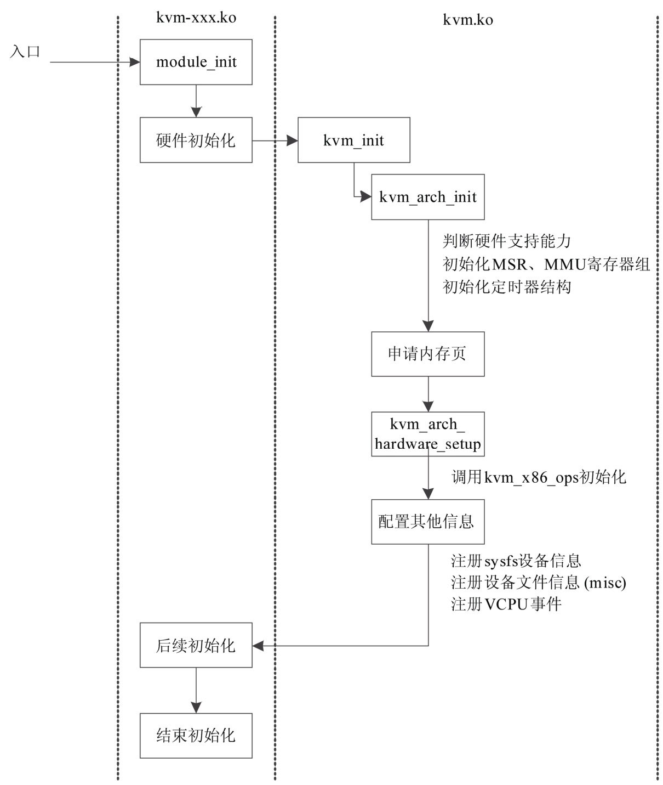

# 整体介绍

核心数据结构和主要流程见:

`Virtualization/Learning/KVM实战: 原理、进阶与性能调优/第3篇 KVM虚拟化技术/第5章 qemu-kvm虚拟化解决方案/5. KVM内核模块重要流程的分析.md`

`Virtualization/Learning/KVM实战: 原理、进阶与性能调优/第3篇 KVM虚拟化技术/第5章 qemu-kvm虚拟化解决方案/4. KVM内核模块重要的数据结构.md`



```
vmx_init()                               // 初始化入口
 ├─ kvm_init(KVM_GET_API_VERSION)        // 初始化KVM框架
 |   ├─ kvm_arch_init()                  // 架构相关初始化
 |   |   ├─cpu_has_kvm_support()         // CPU是否支持kvm 
 |   |   ├─disabled_by_bios()            // bios是否禁用vt
 |   |   ├─boot_cpu_has()                // CPU是否支持一些特性
 |   |   ├─kmem_cache_create("x86_fpu")  // 
 |   |   ├─alloc_percpu()                // CPU是否支持一些特性
 |   |   ├─kvm_mmu_module_init()         // CPU是否支持一些特性
 |   |   ├─kvm_mmu_set_mask_ptes()       // CPU是否支持一些特性
 |   |   ├─kvm_timer_init()              // CPU是否支持一些特性
 |   |   ├─kvm_lapic_init()              // CPU是否支持一些特性
 |   ├─ kvm_irqfd_init()                 // 初始化KVM框架
 |   ├─ kvm_arch_hardware_setup()        // 初始化KVM框架
 |   ├─ smp_call_function_single()       // 对每个online cpu
 |   ├─ cpuhp_setup_state_nocalls()      // 初始化KVM框架
 |   ├─ register_reboot_notifier()       // 初始化KVM框架
 |   ├─ kvm_cache_create_usercopy()      // 初始化KVM框架
 |   ├─ kvm_async_pf_init()              // 初始化KVM框架
 |   ├─ misc_register(&kvm_dev)          // 注册字符设备文件/dev/kvm 
 |   ├─ register_syscore_ops()           // 注册系统核心函数, 这里是suspend和resume
 |   ├─ kvm_init_debug()                 // 初始化debugfs
 |   └─ kvm_vfio_ops_init()
 ├─ vmx_setup_l1d_flush()                // 
 └─ vmx_check_vmcs12_offsets()
```

# kvm_init: 初始化kvm框架

在`virt/kvm/kvm_main.c`中

vmx.c定义了vmx的架构下的操作函数`vmx_x86_ops`, 其他架构也有自己的定义

`vmx_init()`将自己的`vmx_x86_ops`作为参数传了进去

```cpp
r = kvm_init(&vmx_x86_ops, sizeof(struct vcpu_vmx), __alignof__(struct vcpu_vmx), THIS_MODULE);
```

正式进行KVM框架初始化

## 架构初始化

使用传入的`vmx_x86_ops`参数, 注意这是`void *`类型的

```cpp
r = kvm_arch_init(opaque);
```

先功能性检查, 

### 

## 注册设备文件/dev/kvm

```cpp
misc_register(&kvm_dev);
```

`misc_register`函数是linux内核的一个通用接口，主要作用是为了**注册设备文件**，kvm模块借用该接口创建了`/dev/kvm`设备文件, 具体查看参看的文章(`KVM实战: 原理、进阶与性能调优`的)

下面是设备文件的结构体

```cpp
// virt/kvm/kvm_main.c
static struct file_operations kvm_chardev_ops = {
    .unlocked_ioctl = kvm_dev_ioctl,
    .llseek         = noop_llseek,
    KVM_COMPAT(kvm_dev_ioctl),
};
static struct miscdevice kvm_dev = {
    KVM_MINOR,
    "kvm",
    &kvm_chardev_ops,
};
```

## 动作注册

```cpp
register_syscore_ops(&kvm_syscore_ops);

kvm_preempt_ops.sched_in = kvm_sched_in;
kvm_preempt_ops.sched_out = kvm_sched_out;
```

从命名看, `kvm_syscore_ops`是系统核心函数, 包含`suspend`和`resume`:

```cpp
static struct syscore_ops kvm_syscore_ops = {
	.suspend = kvm_suspend,
	.resume = kvm_resume,
};
```

`kvm_preempt_ops`是结构体`preempt_ops`:

```cpp
static __read_mostly struct preempt_ops kvm_preempt_ops;
```

从命名看, `sched_in`和`sched_out`可以申请调度器对任务的换入换出.

## debugfs初始化

```cpp
kvm_init_debug();
```

kvm模块的加载依赖debugfs,所以在加载之前要手动挂载.

这个函数建立了debugfs目录下的kvm目录,然后建立了一系列复杂的tracepoint

```cpp
// virt/kvm/kvm_main.c
static int kvm_init_debug(void)
{
	int r = -EEXIST;
	struct kvm_stats_debugfs_item *p;

	kvm_debugfs_dir = debugfs_create_dir("kvm", NULL);

	kvm_debugfs_num_entries = 0;
	for (p = debugfs_entries; p->name; ++p, kvm_debugfs_num_entries++) {
		if (!debugfs_create_file(p->name, 0444, kvm_debugfs_dir,
					 (void *)(long)p->offset,
					 stat_fops[p->kind]))
			goto out_dir;
	}
}
```

目前支持的tracepoint有:

```cpp
// arch/x86/kvm/x86.c
struct kvm_stats_debugfs_item debugfs_entries[] = {
```