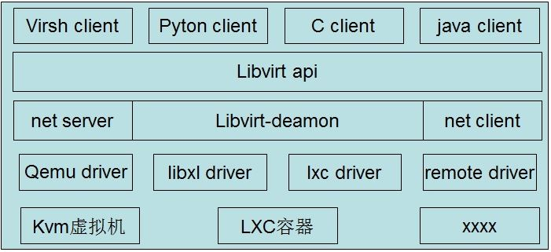

# libvirt的架构

libvirt是CS架构应用，用户通过client与server交互，server与client通过socket连接通信。

## 基本架构图

基本架构图如下所示：

* libvirt分为**client**和**deamon**两个部分
* libvirt **deamon**中还包含了**rpc**、**acl**、**事件机制**、**线程池**等公共组件。
    * **基于rpc**可以实现**libvirt remote client**对本地虚拟机的操作。
    * **acl**实现了**访问控制标签**。
    * **事件机制**是libvirt**所有动作的基础**，所有的请求，消息转发，事件触发都是通过事件机制传递的。
* libvirt deamon中通过**事件机制**监听**某个端口**的消息。**client**发出的请求会通过**socket连接**发送到libvirt **api**。
* libvirt deamon在启动时会**加载**部署的**hypervisor驱动**，libvirt api接收到的请求会路由到**conn对象**指定的**驱动程序**中。
* **驱动程序**接收到转发的请求之后会与**hypervisor交互**实现对虚拟机的具体操作。
* libvirt中目前实现了**多种hypervisor的驱动**，其中**qemu_driver**对应**kvm**，**lxc**对应**容器**。
* 对于kvm而言，一个虚拟机对应一个qemu进程。**qemu进程**通过**软件**模拟计算机的**主板**，**CPU**，**南北桥**及**内存设备**。虚拟机操作系统就运行在qemu进程内。
* libvirt独立实现了lxc driver来管理容器。**lxc driver**启动一个**独立的进程**并使用这个进程拉起一个**init子进程**，这个子进程有其**独立的namespace**并与cgroup结合实现了容器资源的隔离和限制。

## 接口调用方式

在libvirt中接口的调用方式分为两种：

远程调用

本地调用

# 从nova到libvirt

openstack是基于Python实现的，而libvirt是基于C实现的。那么C和Python之间是如何转换的呢。

下面以启动虚拟机实例来看一下在openstack中如何调用libvirt接口: 

1. import python-libvirt库

