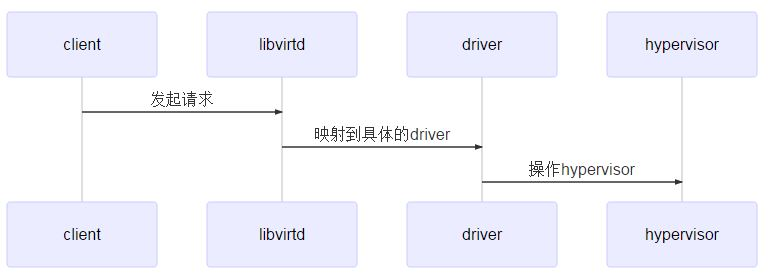

<!-- @import "[TOC]" {cmd="toc" depthFrom=1 depthTo=6 orderedList=false} -->

<!-- code_chunk_output -->

- [libvirt的架构](#libvirt的架构)
  - [基本架构图](#基本架构图)
  - [接口调用方式](#接口调用方式)
- [从nova到libvirt](#从nova到libvirt)
- [libvirt的接口调用流程](#libvirt的接口调用流程)
- [qemuProcessStart启动qemu进程](#qemuprocessstart启动qemu进程)
- [参考](#参考)

<!-- /code_chunk_output -->

# libvirt的架构

libvirt是CS架构应用，用户通过client与server交互，server与client通过socket连接通信。

## 基本架构图

基本架构图如下所示：


* libvirt分为**client**和**deamon**两个部分
* libvirt **deamon**中还包含了**rpc**、**acl**、**事件机制**、**线程池**等公共组件。
    * **基于rpc**可以实现**libvirt remote client**对本地虚拟机的操作。
    * **acl**实现了**访问控制标签**。
    * **事件机制**是libvirt**所有动作的基础**，所有的请求，消息转发，事件触发都是通过事件机制传递的。
* libvirt deamon中通过**事件机制**监听**某个端口**的消息。**client**发出的请求会通过**socket连接**发送到libvirt **api**。
* libvirt deamon在启动时会**加载**部署的**hypervisor驱动**，libvirt api接收到的请求会路由到**conn对象**指定的**驱动程序**中。
* **驱动程序**接收到转发的请求之后会与**hypervisor交互**实现对虚拟机的具体操作。
* libvirt中目前实现了**多种hypervisor的驱动**，其中**qemu_driver**对应**kvm**，**lxc**对应**容器**。
* 对于kvm而言，一个虚拟机对应一个qemu进程。**qemu进程**通过**软件**模拟计算机的**主板**，**CPU**，**南北桥**及**内存设备**。虚拟机操作系统就运行在qemu进程内。
* libvirt独立实现了lxc driver来管理容器。**lxc driver**启动一个**独立的进程**并使用这个进程拉起一个**init子进程**，这个子进程有其**独立的namespace**并与cgroup结合实现了容器资源的隔离和限制。

## 接口调用方式

在libvirt中接口的调用方式分为两种：

远程调用


本地调用



# 从nova到libvirt

openstack是基于Python实现的，而libvirt是基于C实现的。那么C和Python之间是如何转换的呢。

下面以启动虚拟机实例来看一下在openstack中如何调用libvirt接口: 

1. import python-libvirt库

```python
if libvirt is None:
    libvirt = __import__('libvirt')
```

2. 通过openAuth获取与libvirtd进程的连接conn

```python
return tpool.proxy_call(
    (libvirt.virDomain, libvirt.virConnect),
    libvirt.openAuth, uri, auth, flags)
)
```

3. 调用define接口创建一个虚拟机实例, 获取domain对象

```python
domain = self._conn.defineXML(xml)
```

4. 通过domain对象启动虚拟机实例

```python
domain.createWithFlags(launch_flags)
```

由这个流程我们可以看到，openstack中主要通过与libvirtd进程交互，完成对虚拟机实例的操作。

**libvirt\-python**是由libvirt提供的一个**面向python client**的连接组件，包含以下内容：

```
/usr/share/pyshared/libvirt.py #libvirt python接口文件，包含大部分的libvirt接口
/usr/share/pyshared/libvirt_lxc.py #lxc接口文件，因为这部分接口参数不能自动转换，所以通过手动重写完成转换
/usr/share/pyshared/libvirt_qemu.py #与上面的类似，qemu相关的。
/usr/lib/python2.7/dist-packages/libvirtmod_qemu.so
/usr/lib/python2.7/dist-packages/libvirtmod_lxc.so
/usr/lib/python2.7/dist-packages/libvirtmod.so
```

在**libvirt代码**中有一个专门的目录用于存放接口python化相关的代码。

所有的**libvirt接口**被分为了两个部分：

1. 可以**直接自动转换**的接口，使用**generator.py**直接封装python接口
2. 无法直接自动转换的接口，通过**libvirt-override.c等文件**对C接口做一层封装再封装python接口。 

**libvirt-python**工程会将未重写和重写过的接口编译到一个动态库中，并且和生成的py文件一起打包到python-libvirt包中。然后我们就可以通过引入这个python库的方式调用libvirt的C接口了。

# libvirt的接口调用流程

下面继续以创建虚拟机为例说明libvirt中接口调用的流程

1. libvirt中接收**xml格式定义的虚拟机实例配置**，nova通过**defineXML接口**定义虚拟机。该接口返回一个虚拟机的domain对象，用户接下来可以通过这个对象操作虚拟机。

```python
domain = self._conn.defineXML(xml)
```

2. 第一步只是执行了定义操作，相当于libvirt开始管理这台虚拟机。但是此时实际的虚拟机还没有运行，用户还无法使用。nova中调用domain.**createWithFlags**(launch_flags)接口，用第一步中定义的虚拟机规格在**hypervisor层**把虚拟机真正创建起来。

3. createWithFlags调用**libvirt\-python**封装的virDomainCreateWithFlags

```python
def createWithFlags(self, flags=0):
        ret = libvirtmod.virDomainCreateWithFlags(self._o, flags)
        if ret == -1: raise libvirtError ('virDomainCreateWithFlags() failed', dom=self)
        return ret
```

4. 在libvirt\-python中，createWithFlags接口是**直接封装**的，参数不需要转换。下一步会在转换中调用到**libvirt.c**中的**virDomainCreateWithFlags接口**，由此进入libvirt api层。 传入的flag值为0，flag取值范围及对应含义如下：

```python
VIR_DOMAIN_NONE               = 0,      /* Default behavior */
VIR_DOMAIN_START_PAUSED       = 1 << 0, /* Launch guest in paused state */
VIR_DOMAIN_START_AUTODESTROY  = 1 << 1, /* Automatically kill guest when virConnectPtr is closed */
VIR_DOMAIN_START_BYPASS_CACHE = 1 << 2, /* Avoid file system cache pollution */
VIR_DOMAIN_START_FORCE_BOOT   = 1 << 3, /* Boot, discarding any managed save */
```

```cpp
int
virDomainCreateWithFlags(virDomainPtr domain, unsigned int flags) {
    virConnectPtr conn;

    VIR_DOMAIN_DEBUG(domain, "flags=%x", flags);

    virResetLastError();#重置错误码。
    #libvirt中采用了线程池机制，每次从线程池中取出一个线程执行当前的请求。
    #线程中会保存当前线程最后产生的错误码，因此在请求最开始的位置就要把原有的错误重置，防止误报。

    #合法性检查，传入的domain指针及其中的conn指针是否为正确的类型。
    if (!VIR_IS_CONNECTED_DOMAIN(domain)) {
        virLibDomainError(VIR_ERR_INVALID_DOMAIN, __FUNCTION__);
        virDispatchError(NULL);
        return -1;
    }
    #获取domain中的conn指针，如果conn是只读的，则设置错误码并直接退出。因为创建虚拟机属于修改操作。
    conn = domain->conn;
    if (conn->flags & VIR_CONNECT_RO) {
        virLibDomainError(VIR_ERR_OPERATION_DENIED, __FUNCTION__);
        goto error;
    }
    #从这里跳转到具体的driver中执行。驱动在libvirtd启动的时候加载，映射关系由conn指针初始化的时候指定。在配置文件中可以配置默认的conn driver，也可以在创建conn的时候通过接口参数指定。
    if (conn->driver->domainCreateWithFlags) {
        int ret;
        ret = conn->driver->domainCreateWithFlags(domain, flags);
        if (ret < 0)
            goto error;
        return ret;
    }
    #如果驱动中没有实现对应的方法，直接报no support错误。
    virLibConnError(VIR_ERR_NO_SUPPORT, __FUNCTION__);

error:
    virDispatchError(domain->conn);
    return -1;
}
```

5. libvirt中**每一个driver**都有**一张映射关系表**，用于对应driver中的函数指针和具体的driver函数。第4步中从api映射到了具体的driver。在qemu_driver.c中查找该函数。

```cpp
static int
qemuDomainCreateWithFlags(virDomainPtr dom, unsigned int flags)
{
    virQEMUDriverPtr driver = dom->conn->privateData;
    virDomainObjPtr vm;
    int ret = -1;
    #首先检查传入flag参数的合法性，必须是上面提到的几个可选值之一。这里是一个宏来实现的，如果出错直接返回-1。
    virCheckFlags(VIR_DOMAIN_START_PAUSED |
                  VIR_DOMAIN_START_AUTODESTROY |
                  VIR_DOMAIN_START_BYPASS_CACHE |
                  VIR_DOMAIN_START_FORCE_BOOT, -1);
    #获取虚拟机的vm指针
    if (!(vm = qemuDomObjFromDomain(dom)))
        return -1;
    #访问控制，判断当前conn是否有权限执行该操作。目前配置的访问控制标签默认为None，即所有用户都有最高权限。
    if (virDomainCreateWithFlagsEnsureACL(dom->conn, vm->def) < 0)
        goto cleanup;
    #获取虚拟机job锁，类型为MODIFY，可选类型如后所示。只有获得该锁才能继续执行。
    if (qemuDomainObjBeginJob(driver, vm, QEMU_JOB_MODIFY) < 0)
        goto cleanup;
    #检查虚拟机是否已经处于运行状态
    if (virDomainObjIsActive(vm)) {
        virReportError(VIR_ERR_OPERATION_INVALID,
                       "%s", _("domain is already running"));
        goto endjob;
    }
    #启动虚拟机
    if (qemuDomainObjStart(dom->conn, driver, vm, flags) < 0)
        goto endjob;

    ret = 0;

endjob:
    #该job是同步操作，任务结束之后要释放job锁。
    if (!qemuDomainObjEndJob(driver, vm))
        vm = NULL;

cleanup:
    if (vm)
        virObjectUnlock(vm);
    return ret;
}
```

qemu job的类型

```cpp
QEMU_JOB_NONE = 0,  /* Always set to 0 for easy if (jobActive) conditions */
QEMU_JOB_QUERY,         /* Doesn't change any state */
QEMU_JOB_DESTROY,       /* Destroys the domain (cannot be masked out) */
QEMU_JOB_SUSPEND,       /* Suspends (stops vCPUs) the domain */
QEMU_JOB_MODIFY,        /* May change state */
QEMU_JOB_ABORT,         /* Abort current async job */
QEMU_JOB_MIGRATION_OP,  /* Operation influencing outgoing migration */

/* The following two items must always be the last items before JOB_LAST */
QEMU_JOB_ASYNC,         /* Asynchronous job */
QEMU_JOB_ASYNC_NESTED,  /* Normal job within an async job */

QEMU_JOB_LAST
};
```

6. 第5步中调用到了qemuDomainObjStart,这个函数处理了虚拟机wakeup的逻辑并且在虚拟机启动成功之后发送事件通知。

```cpp
static int
qemuDomainObjStart(virConnectPtr conn, virQEMUDriverPtr driver, virDomainObjPtr vm, unsigned int flags)
{
    int ret = -1;
    char *managed_save;
    #根据传入的参数确定虚拟机的启动模式
    bool start_paused = (flags & VIR_DOMAIN_START_PAUSED) != 0;
    bool autodestroy = (flags & VIR_DOMAIN_START_AUTODESTROY) != 0;
    bool bypass_cache = (flags & VIR_DOMAIN_START_BYPASS_CACHE) != 0;
    bool force_boot = (flags & VIR_DOMAIN_START_FORCE_BOOT) != 0;
    unsigned int start_flags = VIR_QEMU_PROCESS_START_COLD;

    start_flags |= start_paused ? VIR_QEMU_PROCESS_START_PAUSED : 0;
    start_flags |= autodestroy ? VIR_QEMU_PROCESS_START_AUTODESTROY : 0;

    #组装hibernate文件的路径
    managed_save = qemuDomainManagedSavePath(driver, vm);

    if (!managed_save)
        goto cleanup;
    #如果存在hibernate文件，则从该文件恢复虚拟机
    if (virFileExists(managed_save)) {
        #启动时可以指定强制启动，此时移除hibernate文件并按照正常流程启动虚拟机
        if (force_boot) {
            if (unlink(managed_save) < 0) {
                virReportSystemError(errno,
                                     _("cannot remove managed save file %s"),
                                     managed_save);
                goto cleanup;
            }
            vm->hasManagedSave = false;
        } else {
        #从hibernate文件恢复虚拟机，因为我们目前还不支持内存快照的功能，暂时不跟进了。
            ret = qemuDomainObjRestore(conn, driver, vm, managed_save,
                                       start_paused, bypass_cache);
            #恢复成功，移除suspend文件
            if (ret == 0) {
                if (unlink(managed_save) < 0)
                    VIR_WARN("Failed to remove the managed state %s", managed_save);
                else
                    vm->hasManagedSave = false;
            }
            #如果恢复失败，则忽略suspend文件直接按正常流程启动虚拟机
            if (ret > 0)
                VIR_WARN("Ignoring incomplete managed state %s", managed_save);
            else
                goto cleanup;
        }
    }
    #启动qemu进程
    ret = qemuProcessStart(conn, driver, vm, NULL, -1, NULL, NULL,
                           VIR_NETDEV_VPORT_PROFILE_OP_CREATE, start_flags);
    #虚拟机启动完成之后，验证对应的启动参数，并且在/var/run/libvirt/qemu目录下保存一份运行状态的配置文件，这个文件的内容在虚拟机配置改变的时候会随之改变，
    virDomainAuditStart(vm, "booted", ret >= 0);
    if (ret >= 0) {
        #向事件队列发送虚拟机启动事件。如果此时有程序在监听此事件就会收到相应的通知。
        virDomainEventPtr event =
            virDomainEventNewFromObj(vm,
                                     VIR_DOMAIN_EVENT_STARTED,
                                     VIR_DOMAIN_EVENT_STARTED_BOOTED);
        if (event) {
            qemuDomainEventQueue(driver, event);
            #如果指定了启动之后pause虚拟机，同时还要发送一个虚拟机pause事件。
            if (start_paused) {
                event = virDomainEventNewFromObj(vm,
                                                 VIR_DOMAIN_EVENT_SUSPENDED,
                                                 VIR_DOMAIN_EVENT_SUSPENDED_PAUSED);
                if (event)
                    qemuDomainEventQueue(driver, event);
            }
        }
    }

cleanup:
    VIR_FREE(managed_save);
    return ret;
}
```

7. 接下来我们来分析一下qemuProcessStart函数，这个函数处理qemu进程启动的主逻辑流程。由于这个函数中逻辑比较长，就不直接贴代码了，只选取其中关键部分了解一下。

# qemuProcessStart启动qemu进程

首先，老规矩检查输入参数。

```cpp
virCheckFlags(VIR_QEMU_PROCESS_START_COLD |
                  VIR_QEMU_PROCESS_START_PAUSED |
                  VIR_QEMU_PROCESS_START_AUTODESTROY, -1);
```

再次检查虚拟机是否处于运行状态。在api中检查的时候并未持有job锁，虚拟机可能正在执行启动操作。在拿到虚拟机job锁后做最后一次检查，如果没有启动则可以保证在本次启动过程中不会有其他的启动操作了。

```cpp
if (virDomainObjIsActive(vm)) {
        virReportError(VIR_ERR_OPERATION_INVALID,
                       "%s", _("VM is already active"));
        virObjectUnref(cfg);
        return -1;
    }
```

复制**xml文件**下发的配置，作为虚拟机的**在线配置**。

在libvirt中，虚拟机配置分为**在线配置**和**离线配置**两种。

* **在线配置**记录在**内存**中，与**虚拟机实时状态**保持一致（比如执行网卡热插拔之后，在线配置也会同步更新）。
* 离线配置则作为一个**持久化配置**记录在宿主机磁盘上，虚拟机关机之后仍然存在直到虚拟机被**undefine**，**下一次启动**的时候使用该配置。**离线插拔设备**等操作会更新离线配置信息，虚拟机关机的时候也会把在线配置更新到离线配置中。

```cpp
if (virDomainObjSetDefTransient(caps, driver->xmlopt, vm, true) < 0)
        goto cleanup;
```

获取虚拟机vm-id。这个ID与nova中的instance uuid不是一回事，仅有运行状态的虚拟机有这个ID。宿主机唯一，宿主机重启之后会重新计算。

```cpp
vm->def->id = qemuDriverAllocateID(driver);
```

设置虚拟机的fakereboot标志位，正常reboot虚拟机的时候，qemu进程会被kill掉并重新启动。而如果fakereboot被设置为true时，只是重置当前qemu进程。

```cpp
qemuDomainSetFakeReboot(driver, vm, false);
```

设置虚拟机状态。libvirt中有一套虚拟机状态管理机制，分为stat和reason。并提供了相应的查询接口，可以查询虚拟机当前状态以及进入当前状态的原因。

```cpp
virDomainObjSetState(vm, VIR_DOMAIN_SHUTOFF, VIR_DOMAIN_SHUTOFF_UNKNOWN);
```

执行hook脚本。libvirt提供了**hook机制**，允许用户在某些事件发生时执行预先自定义的脚本文件。目前我们的默认配置均为空。

```cpp
if (virHookPresent(VIR_HOOK_DRIVER_QEMU)) {
        char *xml = qemuDomainDefFormatXML(driver, vm->def, 0);
        int hookret;

        hookret = virHookCall(VIR_HOOK_DRIVER_QEMU, vm->def->name,
                              VIR_HOOK_QEMU_OP_PREPARE, VIR_HOOK_SUBOP_BEGIN,
                              NULL, xml, NULL);
        VIR_FREE(xml);

        /*
         * If the script raised an error abort the launch
         */
        if (hookret < 0)
            goto cleanup;
    }
```

获取宿主机上安装的qemu支持的特性列表，用于后续对虚拟机执行某些操作时判断兼容性。

```cpp
if (!(priv->qemuCaps = virQEMUCapsCacheLookupCopy(driver->qemuCapsCache,
                                                      vm->def->emulator)))
        goto cleanup;
```

预处理配置文件中的虚拟设备。

```cpp
#处理配置文件中的直通网卡。虽然在配置文件中指定设备类型为interface，但是实际上直通网卡还是一个PCI设备，因此将其加入hostdev设备中。
    if (qemuNetworkPrepareDevices(vm->def) < 0)
       goto cleanup;
    #处理直通设备。直通设备分为三类：PCI设备，USB设备及scsi设备。
    #PCI设备的处理逻辑比较复杂，大致流程为
    # - 检查配置的PCI设备是否已经直通到其他虚拟机
    # - 移除这些设备的原有驱动
    # - 重置这些设备
    # - 对于SRIOV的网卡直通设备，需要额外设置一些网络相关的参数
    # - 在qemu驱动中将这些设备设置为active状态
    # - 在qemu驱动的未启用设备列表中移除这些设备
    # - 在qemu驱动中记录当前使用这些设备的虚拟机
    # - 记录这些设备的原始状态
    # - 从host上隐藏这些设备
    #经过以上处理之后，配置的PCI设备就可以作为一个普通的虚拟机设备供虚拟机使用了。
    #对于USB直通设备不需要这么复杂，只要确保设备存在并且在qemu驱动中记录使用这些设备的虚拟机。
    #
    if (qemuPrepareHostDevices(driver, vm->def, priv->qemuCaps,
                               !migrateFrom) < 0)
        goto cleanup;
    #处理字符设备，包括serial，parallels，channel，console等设备类型，主要是检查这些设备是否存在
    if (virDomainChrDefForeach(vm->def,
                               true,
                               qemuProcessPrepareChardevDevice,
                               NULL) < 0)
        goto cleanup;
```

安全相关的，这块没有接触过。

移除原有的cgroup目录

```cpp
qemuRemoveCgroup(vm);
```

初始化图形设备 vnc/spice，我们现在主要使用的是vnc。根据配置分配vnc端口。

创建虚拟机日志文件/var/log/libvirtd/qemu/虚拟机名称.log

```cpp
if (virFileMakePath(cfg->logDir) < 0) {
        virReportSystemError(errno,
                             _("cannot create log directory %s"),
                             cfg->logDir);
        goto cleanup;
    }
    if ((logfile = qemuDomainCreateLog(driver, vm, false)) < 0)
        goto cleanup;
```

检查宿主机是否支持kvm，判断条件为/dev/kvm设备文件是否存在

```cpp
if (vm->def->virtType == VIR_DOMAIN_VIRT_KVM) {
        VIR_DEBUG("Checking for KVM availability");
        if (!virFileExists("/dev/kvm")) {
            virReportError(VIR_ERR_CONFIG_UNSUPPORTED, "%s",
                           _("Domain requires KVM, but it is not available. "
                             "Check that virtualization is enabled in the host BIOS, "
                             "and host configuration is setup to load the kvm modules."));
            goto cleanup;
        }
    }
```

检查vcpu配置的合法性。配置的maxvcpus数量不能超过宿主机配置的最大vcpu数量

```cpp
if (!qemuValidateCpuMax(vm->def, priv->qemuCaps))
        goto cleanup;
```

为所有的设备分配别名

```cpp
if (qemuAssignDeviceAliases(vm->def, priv->qemuCaps) < 0)
        goto cleanup;
    #分配的别名可以通过virsh dumpxml命令查看
```


# 参考

https://sq.163yun.com/blog/article/172808502565068800