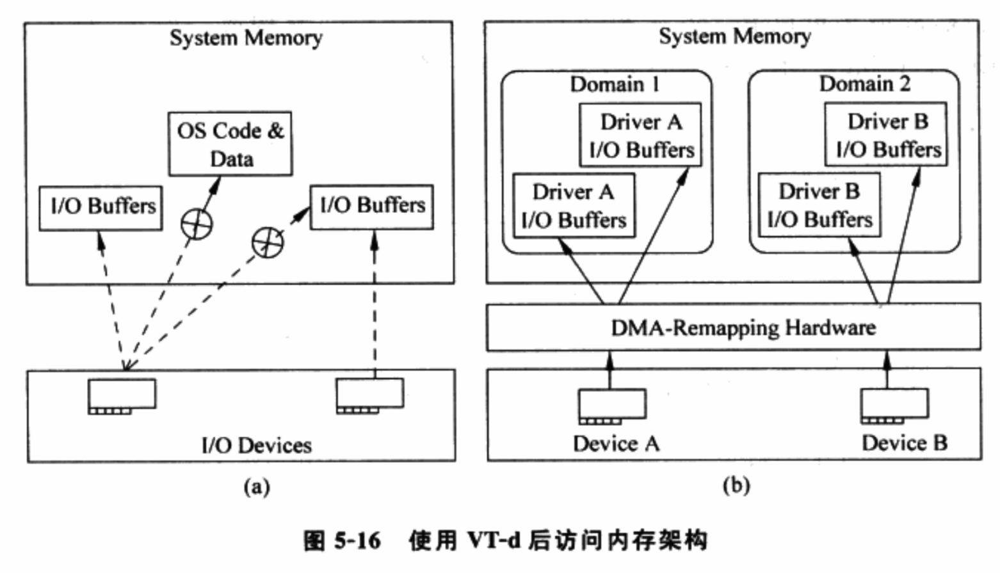
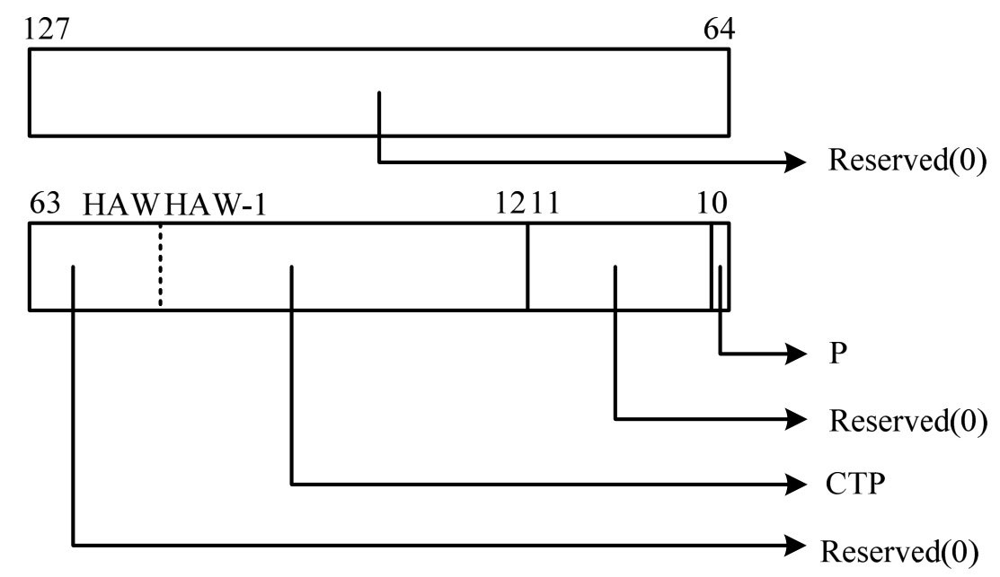
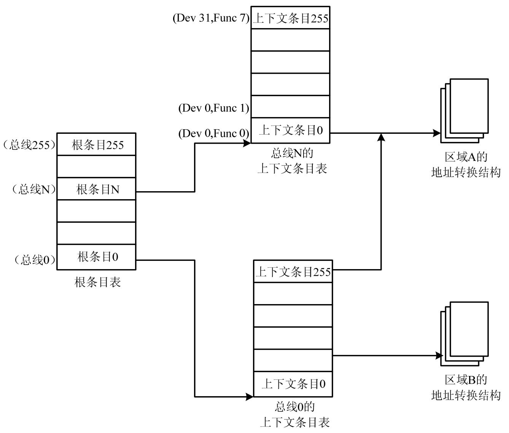
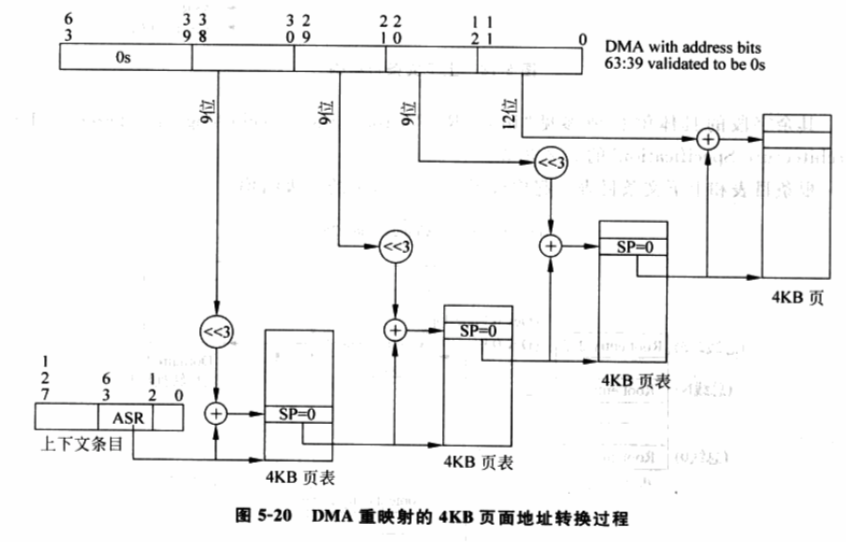
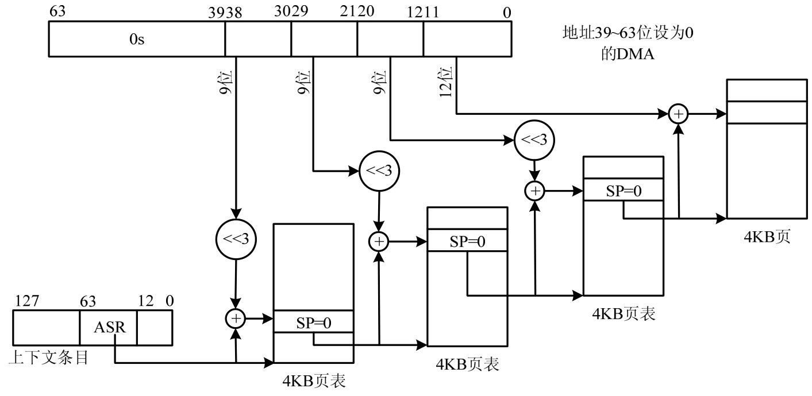
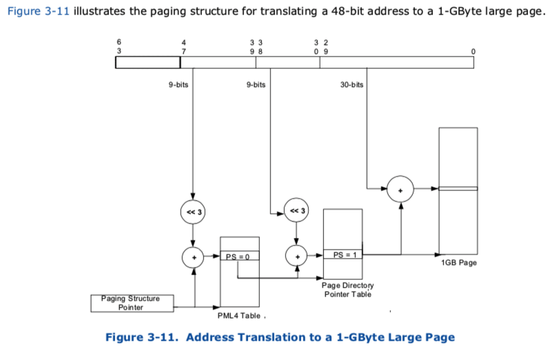
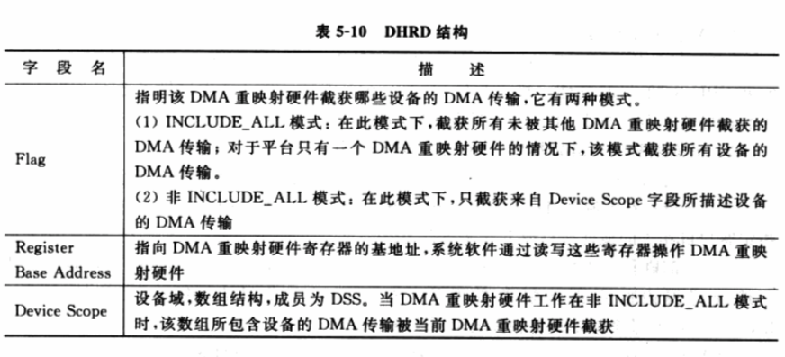
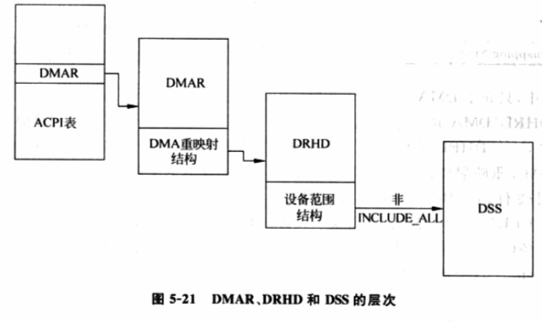
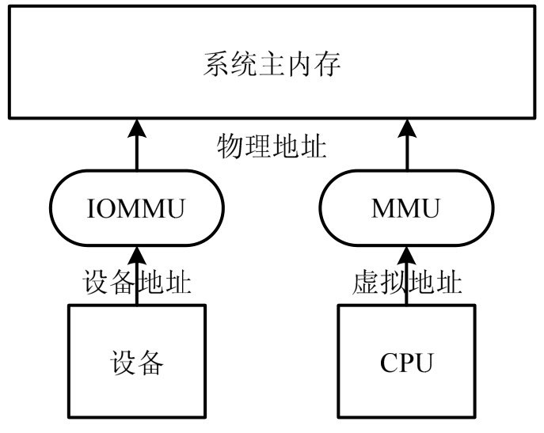

<!-- @import "[TOC]" {cmd="toc" depthFrom=1 depthTo=6 orderedList=false} -->

<!-- code_chunk_output -->

- [1. 概述](#1-概述)
  - [1.1. I/O虚拟化的指标](#11-io虚拟化的指标)
    - [1.1.1. 高性能的挑战](#111-高性能的挑战)
    - [1.1.2. 通用性的挑战](#112-通用性的挑战)
  - [1.2. 问题的解决](#12-问题的解决)
- [2. VT-d技术](#2-vt-d技术)
  - [2.1. DMA重映射](#21-dma重映射)
    - [2.1.1. VT-d中的PCI总线架构](#211-vt-d中的pci总线架构)
      - [2.1.1.1. BDF标识DMA操作由哪个设备发起](#2111-bdf标识dma操作由哪个设备发起)
      - [2.1.1.2. 根条目](#2112-根条目)
      - [2.1.1.3. 上下文条目](#2113-上下文条目)
    - [2.1.2. DMA重映射过程](#212-dma重映射过程)
  - [2.2. I/O页表](#22-io页表)
  - [2.3. VT-d硬件缓存](#23-vt-d硬件缓存)
  - [2.4. VT-d硬件的探测](#24-vt-d硬件的探测)
- [3. AMD IOMMU](#3-amd-iommu)

<!-- /code_chunk_output -->

# 1. 概述

**软件虚拟化**章节使用**软件**方式实现**I/O虚拟化**, 目前流行的"**设备模拟**"和"**类虚拟化**"都有各自的优点, 以及与生俱来的缺点. **前者通用性强**, 但**性能不理想**; 后者**性能不错**, 却**不通用**. 

Intel的**VT\-d**技术(Intel(R) Virtualization Technology for Directed I/O), 以帮助实现**通用性强**、**性能高**的**新型I/O虚拟化技术**.

## 1.1. I/O虚拟化的指标

介绍VT\-d之前, 先量化评价**I/O虚拟化的两个指标** \-\- **性能**和**通用性**. 

* 性能, 越接近**无虚拟环境的I/O性**能越好; 

* 通用性主要和**完全虚拟化**挂钩, 使用的**I/O虚拟化**技术对**客户机OS越透明**(客户机OS感知不到I/O虚拟化技术), 通用性越强. 

VT\-d如何实现这两个指标呢? 

- 对于**高性能**, 最直接方法就是让**客户机直接使用真实的硬件设备**, 这样**客户机的I/O路径**几乎和**无虚拟化的I/O路径相同**; 
- 对于**通用性**, 就得用**全虚拟化方法**, 让**客户机OS**能使用**自带驱动发现设备！！！、操作设备！！！**。

### 1.1.1. 高性能的挑战

实现这些目标面临的挑战.

对于**高性能**, **客户机直接操作设备**的挑战:

⓵ 如何让**客户机直接**访问**设备真实的I/O地址空间**(包括**MMIO**和**端口IO**)

⓶ 如何让**设备的DMA操作直接访问到客户机的内存空间**? 设备不关心系统中运行的是虚拟机还是真实OS, 它只用**驱动**给提供的**物理地址做DMA**.

### 1.1.2. 通用性的挑战

**通用性**面临的问题和⓵类似, 要有一种方法将**设备的I/O地址空间！！！**告诉给**客户机OS！！！**, 并让**驱动！！！**能够利用**这些地址！！！**访问到**真实的I/O地址空间！！！**.

## 1.2. 问题的解决

对于第一个问题，**只需一种机制**就能够把**设备的 I/O 地址空间**告诉给**客户机操作系统**，并让**驱动**通过这**些地址**访问到**设备真实的I/O地址空间**。**VT\-x！！！**已经能够解决**第一个问题**, 可以允许**客户机直接访问物理的I/O空间！！！**. 

**VT\-d**让**第二个问题**解决成为可能, 它提供了**DMA重映射技术！！！**, 帮助VMM的实现者达成目标.

# 2. VT-d技术

VT\-d通过在**北桥(MCH**)引入**DMA重映射硬件**, 以提供 **设备重映射！！！** 和 **设备直接分配！！！** 的功能. 

在**启用VT\-d**的平台上, **设备的所有DMA传输！！！**都会被**DMA重映射硬件截获！！！**. 根据**设备对应的I/O页表！！！**, **硬件**可以对**DMA中的地址进行转换！！！**, 使设备**只能访问到规定的内存！！！**. 

使用VT\-d后, 设备访问内存的架构如图5\-16所示.

图5\-16

- (a)是**没有VT\-d**的平台, 此时**设备的DMA**能够访问**整个物理内存**. 

- (b)是**启用VT\-d**的情况, 此时, 设备**只能访问指定的物理内存**. 这和**使用页表**将进程的**线性地址空间**映射到**指定物理内存区域**的思想一样, 不过对象换成了设备. 

注意: (b)中的**DMA Remapping Hardware硬件**的位置和作用, 它会**捕获设备的DMA操作**

注: 不仅仅是**DMA重映射**, Intel VT\-d为虚拟机监控器提供了几个重要的能力：**I/O设备分配**、**DMA重定向**、**中断重定向**、**中断投递**等。

对应的AMD是IOMMU技术

下面介绍VT\-d中核心的**DMA重映射技术**以及**如何探测DMA重映射硬件**, **设备分配**内容在下一节介绍. VT\-d技术较复杂, 限于篇幅, 只能对主要技术进行介绍, 完整的论述参考"**Intel(R) Virtualization Technology for Directed I/O Architecture Specification**".

## 2.1. DMA重映射

上节提到的诸多难点, 最主要的难题是**DMA问题**. 

**设备**对系统中运行的软件一无所知, 在**进行DMA**时, **设备唯一！！！** 做的是**向(从)驱动程序告知的"物理地址"复制(读取)数据**. 

内存虚拟化中可知, **虚拟机环境**下**客户机使用的是GPA**, 则**客户机！！！** 的**驱动直接操作设备时也是用GPA！！！**. 

而**设备进行DMA**, 需要使用**MPA！！！**, 如何在DMA时将GPA转换成MPA成了关键问题. 通常, **无法通过软件方法截获DMA操作**, VT\-d提供的DMA重映射就是为了解决这个问题.

### 2.1.1. VT-d中的PCI总线架构

首先, 我们介绍VT-d中PCI总线架构。

**VT\-d**提供了**三种数据结构**来描述**PCI架构**，分别是**设备标识符（BDF**）、**根条目（Root Entry**）和**上下文条目（Context Entry**）。

#### 2.1.1.1. BDF标识DMA操作由哪个设备发起

BDF（设备标识符）可以看做是**设备**在**PCI总线**上的**地址**，通过**BDF！！！**可索引到**任何一条总线上的任何一设备！！！**. 

同样, **DMA的总线传输！！！** 中包含一个 **BDF** 以 **标识该DMA传输是由哪个设备发起！！！** 的. 

BDF结构:

- 8 位的 **Bus** 字段代表设备所在的**总线号**，故系统中**最多有256条总线**；
- Device字段表示**设备号**，代表Bus所表示**总线上的某个设备**；
- Function字段表示**功能号**，标识**具体设备上的某个功能单元**，我们称为**逻辑设备**。

在**VT\-d**中, **标识DMA操作发起者！！！**的结构称为**源标识符(Source Identifier！！！**). 

对于**PCI总线！！！**, **VT\-d！！！** 使用 **BDF！！！** 作为**源标识符！！！**, 在下面的内容中提到的BDF均代表源标识符. 其格式在第2章给出, 也可参考"Intel(R) Virtualization Technology for Directed I/O Architecture Specification"的3.2.1获取详细内容.

#### 2.1.1.2. 根条目

用于**描述PCI总线**, **每条总线！！！对应一个根条目！！！**. 

由于PCI架构支持**最多256条总线**, 故最多可以有**256个根条目！！！**. 这些根条目一起构成一张表, 称为**根条目表(Root Entry Table**).  有了根条目表, 系统中**每一条总线都会被描述到！！！**. 图5\-17是根条目的结构.

根条目结构:

主要字段如下.

- P: 存在位. 为0条目无效, 来自**该条目所代表总线**的**所有DMA传输被屏蔽！！！**. 为1代表该条目有效.
- **CTP(Context Table Pointer, 上下文表指针**): 指向**上下文条目表**.

#### 2.1.1.3. 上下文条目

用于描述**某个具体的PCI设备！！！**, 这里的PCI设备指**逻辑设备**. 

**一条PCI总线**上最多有**256个设备**, 故有**256个上下文条目**, 它们一起组成上下文条目表(Context Entry Table). 

通过**上下文条目表**, 可描述**某条PCI总线上所有设备！！！**. 图5\-18是上下文条目的结构.

上下文条目的结构:

主要字段如下.

- P: 存在位. 为0时条目无效, 来自该条目所代表设备的所有DMA传输被屏蔽. 为1时, 表示条目有效.
- T: 类型, 表示ASR字段所指数据结构的类型. 目前, VT\-d中该字段为0, 表示多级页表.
- **ASR(Address Space Root**, 地址空间根): 实际是一个指针, 指向T字段所代表的数据结构, 目前该字段指向一个**I/O页表**(见后面).
- **DID(Domain ID, 域标识符**): VT\-d技术中Domain的具体含义参看"Intel(R) Virtualization Technology for Directed I/O Architecture Specification"的3.1. 在此, 可理解为**本文中的客户机**, **DID**可看作用于**唯一标识该客户机的标识符！！！**, 例如Guest ID.

其余字段具体解释参见"Intel(R) Virtualization Technology for Directed I/O Architecture Specification"的3.2.3.

根条目表和上下文条目表一起构成图5\-19所示的两级结构.

### 2.1.2. DMA重映射过程

当 **DMA重映射硬件捕获一个DMA传输！！！** 时, 

1. 通过其中BDF的bus字段索引根条目表, 可以得到产生该DMA传输的总线对应的根条目. 
2. 由根条目的CTP字段获得上下文条目, 用BDF中的{dev: func}索引该表, 可获得发起DMA传输的设备对应的上下文条目. 
3. 从上下文条目的**ASR字段**, 可寻址到**该设备**对应的**I/O页表**, 此时, DMA重映射硬件就可以做地址转换了. 

通过这样的两级结构, **VT\-d技术**可覆盖平台上**所有的PCI设备**, 并对它们的DMA传输进行地址转换.

## 2.2. I/O页表

I/O页表是**DMA重映射硬件**进行**地址转换**的**核心**. 

它的思想和CPU中paging机制的页表类似, 与之不同是, CPU通过CR3寄存器获得当前系统使用的页表的基地址, 而VT\-d需要借助上一节中介绍的根条目和上下文条目获得**设备对应的I/O页表**. 

VT\-d也使用**硬件查页表机制**, **整个地址转换**过程**对于设备、上层软件都是透明！！！** 的。 与CPU使用的页表相同， I/O页表也支持**几种粒度的页面大小**， 其中最典型的4K页面地址转换过程如图5\-20.

感觉上图有点问题, 查看Intel手册, 下面是4K、2M、1G页面的转换过程， 看得出来， 和paging机制页表类似

通过I/O页表中GPA到MPA的映射, DMA重映射硬件可将DMA传输中的GPA转换成MPA, 从而使设备直接访问指定客户机的内存区域. 关于I/O页表详细信息参见"Intel(R) Virtualization Technology for Directed I/O Architecture Specification"的3.3.1节.

## 2.3. VT-d硬件缓存

**VT\-d**使用了大量缓存. 其中, 和地址转换相关的缓存被称为**IOTLB**, 它和CPU中的TLB功能一样. 此外, 对于上下文条目, **VT\-d硬件提供了上下文条目表(！！！不仅仅是内存？？**). 当软件修改I/O页表、上下文条目表后, 要负责对这些缓存进行刷新.

VT\-d对两种缓存分别提供了三种粒度的刷新操作.

⓵ 全局刷新(Global Invalidation): 整个IOTLB或上下文条目表中所有条目无效.

⓶ 客户机粒度刷新(Domain\-Selective Invalidation): IOTLB中或上下文条目表中和指定客户机相关的地址条目或上下文条目无效

⓷ 局部刷新: 对于IOTLB, 称为Domain vPage\-Selective Invalidation, 指定客户机某一地址范围内的页面映射条目无效. 对于上下文条目表, 称为Device Selective Invalidation, 和某个指定设备相关的上下文条目无效.

硬件可以实现上述三种刷新操作的一种或多种. 对于系统软件而言, 它并不知道自己发起的刷新操作被硬件使用哪一种粒度的刷新操作完成. 具体参见"Intel(R) Virtualization Technology for Directed I/O Architecture Specification"的3.2.3.1和3.3.1.3节.

## 2.4. VT-d硬件的探测

**系统BIOS**负责**检测平台中的重映射硬件功能！！！**, 以及用于在主机系统地址空间中**定位**存储器映射的**重映射硬件寄存器！！！**. 

和所有硬件一样, 在**使用DMA重映射硬件** 之前需要**对它进行探测！！！**. **VT\-d**通过 **BIOS的ACPI表！！！** 向上层软件汇报平台DMA重映射硬件的情况, 硬件由三个主要数据结构描述.

⓵ **DMAR(DMA Remapping Reporting**): 该结构汇报平台**VT\-d相关硬件**的**整体情况！！！**, 可以看作是一个总表. 

其主要字段如表.

本文只介绍DMA Remapping Structure字段为DHRD的情况.

⓶ **DHRD(DMA Remapping Hardware Unit Definition**): 描述DMA重映射硬件, **一个DHRD结构！！！**对应**一个DMA重映射硬件！！！**. 

典型实现是平台只有一个DMA重映射硬件并管辖所有设备, 但VT\-d技术也支持一个平台多个DMA重映射硬件. DHRD主要字段如表5\-10. 关于INCLUDE\_ALL和非INCLUDE\_ALL模式, 可以换一种方式理解. 前者表示该DHRD管辖所有设备(一个平台只有一个DMA重映射硬件的情况); 后者, 该DHRD只管辖Device Scope字段描述的设备.

Register Base Address是这个unit硬件寄存器的基地址

⓷ **DSS(Device Scope Structure**): 描述**DHRD所管辖的设备**. DHRD的Device Scope指向的数组中的每个元素以DSS结构表示. 该结构可以代表两种类型的设备, 一种是PCI终端设备, 一种是PCI桥设备. 该结构有三个重要字段, 如表5\-11.

三种数据结构构成图5\-21所示的层次

其中, **第一级** 是 **ACPI表**, 从中获得 **DMAR**, 然后依据前面描述的各个结构的各字段, 可以解析出平台**每个DMA重映射硬件**的所有信息, 例如该硬件的寄存器地址、该硬件管辖的设备等。

详细信息参考"Intel(R) Virtualization Technology for Directed I/O Architecture Specification"

# 3. AMD IOMMU

AMD的IOMMU（输入/输出内存管理单元）技术提供了I/O虚拟化的解决方案，管理对系统内存的设备访问。它位于外围设备和主机之间，可以把DMA I/O总线和PC系统主内存连接在一起，将虚拟内存地址映射为物理内存地址，并检查每个接入的适当权限。图2-17是IOMMU技术的简单示意图。

AMD的IOMMU设计提供DMA地址转换、对设备读取和写入的权限检查的功能。有了 IOMMU，客户机操作系统中一个未经修改的驱动程序可以直接访问它的目标设备，从而避免通过VMM运行而产生的开销以及设备模拟的开销。将地址转译与访问保护相结合，是IOMMU的重要特色。

图2-17 IOMMU技术示意图:

IOMMU 为每个设备分配一个保护域。保护域定义了 I/O 页的转译将被用于域中的每个设备，并且明确指明每个I/O页的读取权限。虚拟化环境下，VMM可以指定所有的设备分配到相同保护域中的一个特定操作系统，这将创建一系列为运行在客户机操作系统中运行所有的设备所使用的地址转译和访问限制。

IOMMU 将页转译缓存在一个 TLB 中，进入 TLB 需要键入保护域和设备请求地址。而保护域是缓存密钥的一部分，故域中的所有设备共享TLB中的缓存地址。

IOMMU 决定一台设备属于哪个保护域，然后使用这个域和设备请求地址进入TLB。TLB入口包含读写权限标记和用于转译的目标系统地址，所以，在登入缓存时会根据许可标记决定该缓存是否允许此次访问。

对于不在TLB中的地址，IOMMU将会继续查看设备相关的I/O页表格。与TLB入口类似，I/O设备页表格的入口也包括连接到系统地址的许可信息。

因此，所有的地址转译最终都是一次TLB或页表查看，如果查看成功，适当的权限标记会告诉 IOMMU是否允许访问。VMM通过控制 IOMMU来查看地址的 I/O 页表格，实现对应的系统页和系统设备的控制，以及对每个域中每个页的读/写访问权限的控制。

IOMMU通过允许VMM直接将真实的设备分配到客户机操作系统，使I/O虚拟化更有效。VMM通过控制IOMMU，可以创建I/O页表将系统物理地址映射到客户机物理地址，为客户机操作系统创建一个保护域，然后让客户机操作系统在此域中正常运转。针对真实的设备编写的驱动程序可以继续作为客户机操作系统的一部分运行（客户机操作系统必须是未经修改的且对底层转译无感知）。

AMD 的 IOMMU 避免了设备模拟，取消了转译层，而且允许本机驱动程序直接配合设备，极大地降低了I/O设备虚拟化的开销。