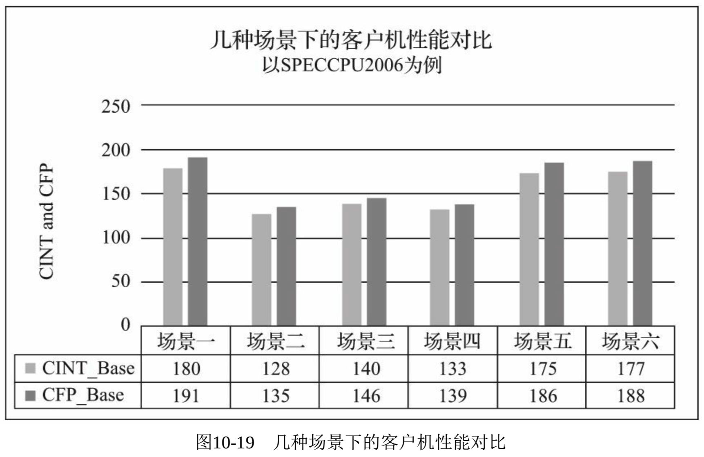

<!-- @import "[TOC]" {cmd="toc" depthFrom=1 depthTo=6 orderedList=false} -->

<!-- code_chunk_output -->

<!-- /code_chunk_output -->

在第7章中我们提到了内存管理的一些高级选项：**透明大页**、**内核合并相同页（KSM**）、**非一致性内存（NUMA**），这些配置都**有一些对应的后台服务自动调节**：/sys/kernel/mm/transparent\_hugepage/、ksm.service、ksmtuned.service、numad.service。它们具体的原理和调节方法在第7章都详细叙述过了，这里不赘述。

但笔者发现，这些**自动的后台服务**对普通的**客户机性能**是有影响的，确切地说是**负面的影响**。笔者通过这样的一个系列实验进行对比。我们构造下面6种测试场景（方法），分别启动同样资源配置（CPU、内存）的客户机，在客户机中运行SPECCPU2006，然后对比结果。

场景一（也就是前面10.2节到10.5节的测试场景）：通过**软件的方式**使得**宿主机没有NUMA架构**（确切地说是**只有一个NUMA节点资源online**），**vCPU**绑定在**Node 0**的pCPU上。**关闭KSM**、**NUMA服务**，并**关闭透明大页**。

场景二：保持宿主机的NUMA架构，通过numactl命令来运行客户机，使得客户机的所有运行和资源都限定于同一个NUMA节点（node 1）上，不对vCPU进行绑定。不关闭KSM、NUMA服务，也不关闭透明大页。

场景三：同场景二，但关闭KSM、NUMA服务，关闭透明大页。

场景四：同场景二，但将vCPU绑定于node 1的物理CPU上。KSM、NUMA服务、透明大页都是打开的。

场景五：不通过numactl命令来限定客户机运行于某个NUMA节点，但将其vCPU绑定在同一个NUMA节点的物理CPU上。KSM、NUMA服务、透明大页都是打开的。

场景六：同场景一，但KSM、NUMA服务、透明大页都是打开的。

图10\-19是上述6种场景下运行SPECCPU2006的性能对比。


我们可以看出：

1）使用了**numactl**来**限制客户机运行于某个NUMA节点**的情况（场景二、场景三、场景四）表现最差。这跟我们前面第7章介绍的NUMA的作用相悖。在这3种情况中，场景三（关闭KSM、NUMA服务，关闭透明大页）相对最好，场景四（绑定vCPU）也比场景二要好。

2）即使保留宿主机的NUMA架构，只要不用numactl限制客户机于某个NUMA节点（场景五），其表现依然明显好于场景二、三、四。笔者认为，虽然numactl为NUMA架构上的软件运行的调度进行限制优化，它对原生系统的支持应该是很好的，但对于虚拟化系统，它或许还要再研究下。

3）场景一表现最好，它通过软件去掉了NUMA架构，也关闭了透明大页、KSM、NUMA后台服务，同时vCPU绑定到物理CPU。场景六略逊于场景一，其与场景一的区别就是这些后台服务没有关闭。

综上，我们对读者的建议如下：

1）强烈不建议对客户机进程进行numactl。

2）建议进行vCPU的绑定。

3）建议关闭KSM、NUMA服务。

4）对于透明大页，读者可以参考7.2.1节中的数据，按照上述思路进一步研究。