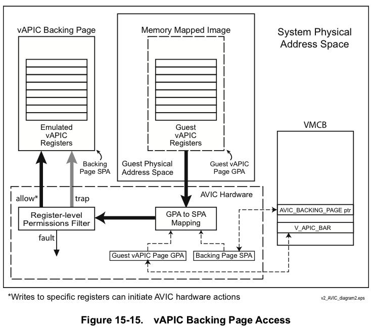

以下各节介绍了AVIC的架构。

# 虚拟LAPIC

Virtualizing the Local APIC

**guest虚拟处理器**通过读写位于**guest物理地址空间**中**4KB页面**中的**一组寄存器**来访问其LAPIC的功能。**AVIC硬件**通过将guest的尝试访问**重定向**到位于**系统物理地址**（System physical address, SPA）空间中的**vAPIC backing页面**来虚拟化此访问。

注: guest肯定访问的是guest自己的地址空间, 这里对lapic的访问使用的是物理地址, 所以是guest物理地址, 但是最终还是会落到真实的物理地址, 这部分也就是AVIC的工作.

**AVIC硬件**检测到**guest对其LAPIC寄存器集**的尝试**访问**，并将这些访问**重定向到vAPIC backing页面**。如下图所示。

要将**虚拟机vAPIC寄存器的guest访问**正确重定向到vAPIC backing页面，该硬件需要**两个地址**。 这些是：
* **系统物理地址(SPA)空间**中的**vAPIC backing页面地址**
* **虚拟机物理地址(GPA)空间**中的**guest vAPIC基地址**(APIC BAR)

**系统软件**负责在**嵌套页面表**中设置转换，以授予来宾读写访问SPA空间中vAPIC后台页面的权限。 中航工业硬件浏览嵌套页面表以检查权限，但不使用在叶子页面表条目中指定的SPA地址。 而是，AVIC硬件在VMCB的AVIC_BACKING_PAGE指针字段中找到此地址。

