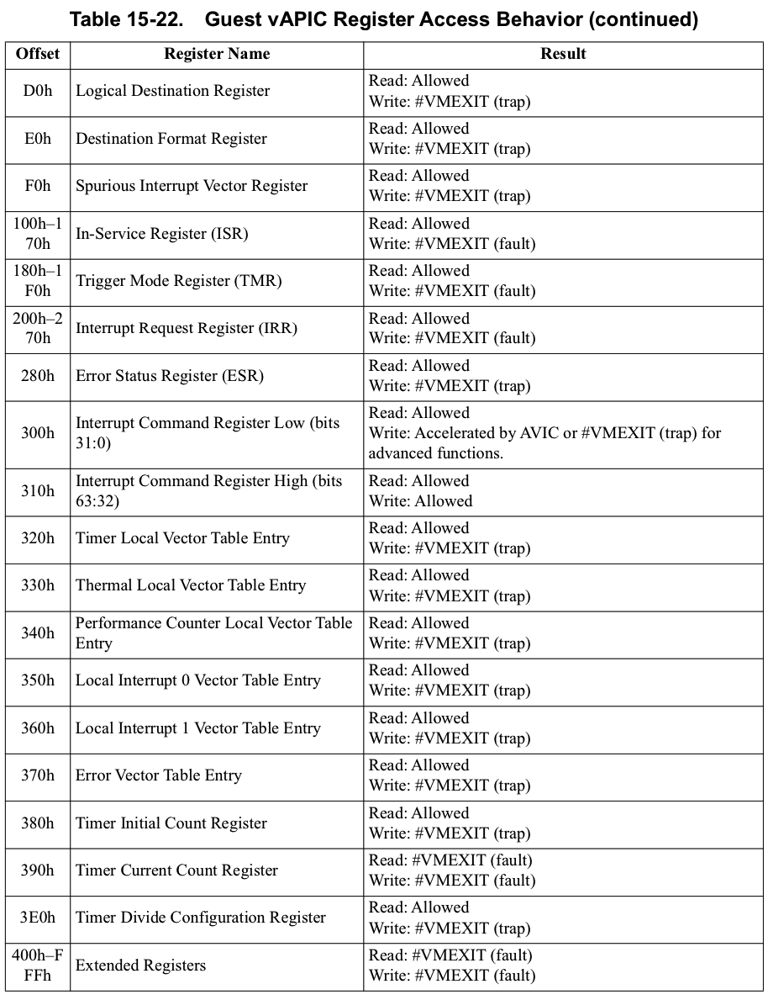
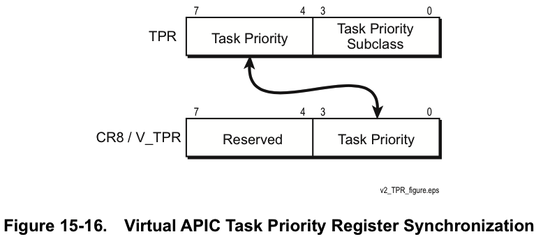

以下各节介绍了AVIC的架构。

# 虚拟LAPIC

Virtualizing the Local APIC

**guest虚拟处理器**通过读写位于**guest物理地址空间**中**4KB页面**中的**一组寄存器**来访问其LAPIC的功能。**AVIC硬件**通过将guest的尝试访问**重定向**到位于**系统物理地址**（System physical address, SPA）空间中的**vAPIC backing页面**来虚拟化此访问。

注: guest肯定访问的是guest自己的地址空间, 这里对lapic的访问使用的是物理地址, 所以是guest物理地址, 但是最终还是会落到真实的物理地址, 这部分也就是AVIC的工作.

**AVIC硬件**检测到**guest对其LAPIC寄存器集**的尝试**访问**，并将这些访问**重定向到vAPIC backing页面**。如下图所示。

要将**虚拟机vAPIC寄存器的guest访问**正确重定向到vAPIC backing页面，该硬件需要**两个地址**。 这些是：
* **系统物理地址(SPA)空间**中的**vAPIC backing页面地址**
* **虚拟机物理地址(GPA)空间**中的**guest vAPIC基址**(APIC BAR)

**系统软件**负责在**嵌套页面表**(nested page table)中**设置转换关系**，以授予**guest读写**访问**SPA空间**中**vAPIC backing页面**的权限。AVIC硬件walks nested page table(嵌套页面表)以**检查权限**，但**不使用**在**叶子页表条目**中指定的**SPA地址**。而是，AVIC硬件在**VMCB**的`AVIC_BACKING_PAGE`指针字段中找到此地址。

VMM使用适当的**默认APIC寄存器值**（包括诸如**APIC版本号**之类的项目）初始化backing页面。vAPIC backing页面地址和guest vAPIC基址分别存储在VMCB字段`AVIC_BACKING_PAGE`**指针**和`V_APIC_BAR`中。

系统固件将**guest vAPIC基址**（和`VMCB.V_APIC_BAR`）的值初始化为`FEE0_0000h`。 **guest操作系统**在**引导**时希望在**此地址**找到**LAPIC寄存器集**。

如果**guest**尝试通过**写入APIC基址寄存器**（MSR `0000_001Bh`）来在**GPA空间**中**重新定位LAPIC寄存器基址**，则VMM应该**拦截该写操作**，以更新**guest VMCB**的`V_APIC_BAR`字段和虚拟机**嵌套页表**的**translation**中**GPA部分**内容。

在**guestVM的整个生命周期**中，vAPIC backing页必须存在于**系统物理内存**中，因为即使guest未运行，**某些字段也会更新**。

## 虚拟APIC寄存器访问: Virtual APIC Register Accesses

**虚拟APIC寄存器访问**(Virtual APIC Register Accesses)。AVIC硬件检测到guest尝试访问backing页中的vAPI寄存器。这些尝试的访问由**寄存器级权限过滤器**(register-level permissions filter)处理, 使用下列三种方式之一处理：
* 允许(Allow). 允许完成对backing页面的访问。 **写入**将更新backing页面值，而**读取**将返回**当前值**。 在**某些情况**下，**写操作**会导致特定的**基于硬件的加速操作**（在表15-22中进行了汇总，并在下面进行了介绍）。不会发生`#VMEXIT`???
* 故障(Fault). **访问之前**处理器执行**SVM拦截**。 导致`#VMEXIT`。
* 陷阱(Trap). **访问完成后**，处理器立即**执行SVM拦截**。 导致`#VMEXIT`。

下表总结了**每个寄存器**的行为的详细信息：

此表中没有明确定义的其他寄存器, 是被允许(allow)读取和写入backing page. 不会发生`#VMEXIT`??

所有vAPIC寄存器均为32位宽，位于16字节对齐的偏移量处。 尝试读取或写入`[register_offset + 4：register_offset + 15]`范围内的任何字节的结果均未定义。

guest写入**任务优先级寄存器**（TPR），写入**中断结束**（EOI）寄存器和**中断命令低位寄存器**（ICRL）的特定使用情况会导致**特定的硬件操作**。 由于该寄存器的写入没有立即的硬件副作用(`side-effect`)，因此AVIC硬件允许guest写入**中断命令高位寄存器**（ICRH）。 AVIC硬件维护并使用**处理器优先级寄存器**（PPR）中的值来**控制向guest虚拟处理器的中断传递**。 

以下各节讨论guest对vAPIC支持页面中的这些寄存器的访问处理。

### 任务优先级寄存器: Task Priority Register(TPR)

任务优先级寄存器(Task Priority Register, TPR). 

* 当客户操作系统**写入TPR**时，该值会**在backing页中更新**，并且该值的**高4位**会由**硬件自动复制**到**VMCB**中的`V_TPR`值。 同样，使用`MOV CR8`语义的**任何TPR访问**都会**更新backing页**和`V_TPR`值。
* 所有读取TPR值均从**vAPIC backing页面返回**。

存储在**CR8**和`V_TPR`中的**优先级值**与**APIC TPR寄存器**的**格式不同**。仅仅任务优先级位(Task Priority)被保留在CR8和`V_TPR`的低4位。没有存储“任务优先级子类别(Task Priority Subclass)”值。**写入内存映射(memory-mapped)的TPR寄存器**更新CR8和V_TPR的`bits 3：0`，**写入CR8**更新TPR备份页值位7：4，而位3：0设置为零。

