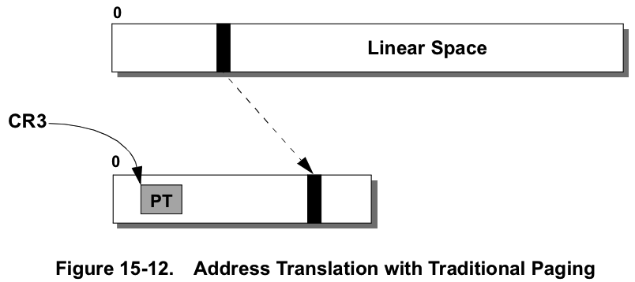
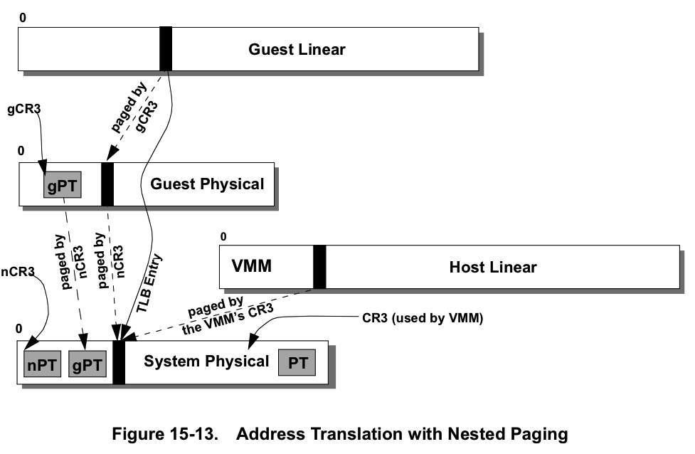

Traditional Paging versus Nested Paging

图15-12显示了如何在传统(单级)地址转换中将**线性地址空间**中的**页面**映射到**物理地址空间**中的**页面**。

**控制寄存器CR3**包含页表(PT，由图中的阴影框表示)的基址的**物理地址**，该地址**控制着地址转换**。

启用嵌套分页后，将有两级地址转换： 请参阅下面的图15-13。

* guest和host级别都有自己的CR3副本，分别称为gCR3和nCR3
* guest页表（gPT）是guest线性地址到guest物理地址的映射。 guest页表位于guest物理内存中，并由gCR3指向。
* 嵌套页表（nPT）将guest物理地址映射到系统物理地址。 嵌套的页表位于系统物理内存中，并由nCR3指向。
* 最近使用的从guest线性到系统物理地址的转换存储在TLB中，并在以后的guest访问中使用。

