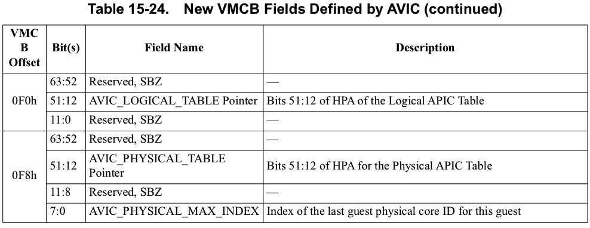
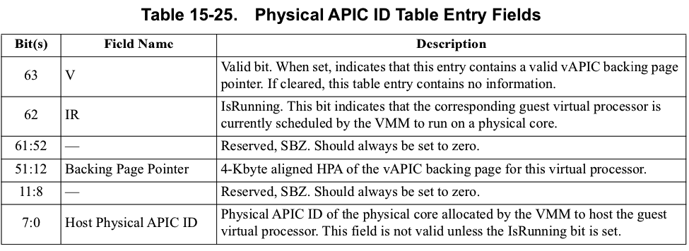

<!-- @import "[TOC]" {cmd="toc" depthFrom=1 depthTo=6 orderedList=false} -->

<!-- code_chunk_output -->

- [1. 虚拟LAPIC: Virtualizing the Local APIC](#1-虚拟lapic-virtualizing-the-local-apic)
  - [1.1. 虚拟APIC寄存器访问: Virtual APIC Register Accesses](#11-虚拟apic寄存器访问-virtual-apic-register-accesses)
    - [1.1.1. 任务优先级寄存器: Task Priority Register(TPR)](#111-任务优先级寄存器-task-priority-registertpr)
    - [1.1.2. 处理器优先级寄存器: Processor Priority Register(PPR)](#112-处理器优先级寄存器-processor-priority-registerppr)
    - [1.1.3. 中断结束寄存器: End of Interrupt(EOI) Register](#113-中断结束寄存器-end-of-interrupteoi-register)
    - [1.1.4. 中断命令寄存器低位: Interrupt Control Register Low(ICRL)](#114-中断命令寄存器低位-interrupt-control-register-lowicrl)
- [2. AVIC对VMCB修改的支持: VMCB Changes in Support of AVIC](#2-avic对vmcb修改的支持-vmcb-changes-in-support-of-avic)
  - [2.1. VMCB控制字段: VMCB Control Word](#21-vmcb控制字段-vmcb-control-word)
  - [2.2. 新定义的VMCB域: Newly Defined VMCB Fields](#22-新定义的vmcb域-newly-defined-vmcb-fields)
- [3. AVIC内存数据结构: AVIC Memory Data Structures](#3-avic内存数据结构-avic-memory-data-structures)
  - [3.1. 虚拟APIC backing页: Virtual APIC Backing Page](#31-虚拟apic-backing页-virtual-apic-backing-page)
  - [3.2. 物理APIC ID表: Physical APIC ID Table](#32-物理apic-id表-physical-apic-id-table)
  - [3.3. 逻辑APIC ID表: Logical APIC ID Table](#33-逻辑apic-id表-logical-apic-id-table)
- [4. 中断传递: Interrupt Delivery](#4-中断传递-interrupt-delivery)
  - [4.1. 处理器间中断: IPI, AVIC硬件](#41-处理器间中断-ipi-avic硬件)
  - [4.2. 设备中断: Device Interrupts, IOMMU](#42-设备中断-device-interrupts-iommu)
- [5. CPUID功能位: CPUID Feature Bits](#5-cpuid功能位-cpuid-feature-bits)
- [6. 新的处理器机制: New Processor Mechanisms](#6-新的处理器机制-new-processor-mechanisms)
  - [6.1. 特殊的陷阱/故障处理: Special Trap/Fault Handling for vAPIC Accesses](#61-特殊的陷阱故障处理-special-trapfault-handling-for-vapic-accesses)
  - [6.2. 门铃机制: Doorbell Machanism](#62-门铃机制-doorbell-machanism)
    - [6.2.1. 门铃注册: Doorbell Register](#621-门铃注册-doorbell-register)
    - [6.2.2. 门铃信号处理: Processing of Doorbell Signals](#622-门铃信号处理-processing-of-doorbell-signals)
  - [6.3. 额外的VMRUN处理: Additional VMRUN Handling](#63-额外的vmrun处理-additional-vmrun-handling)
- [7. 新的退出码: New Exit Codes for AVIC](#7-新的退出码-new-exit-codes-for-avic)
  - [7.1. AVIC IPI交付未完成: AVIC IPI Delivery Not Completed](#71-avic-ipi交付未完成-avic-ipi-delivery-not-completed)
  - [7.2. AVIC 访问未加速的vAPIC寄存器: AVIC Access to un-accelerated vAPIC register](#72-avic-访问未加速的vapic寄存器-avic-access-to-un-accelerated-vapic-register)

<!-- /code_chunk_output -->

以下各节介绍了AVIC的架构。

# 1. 虚拟LAPIC: Virtualizing the Local APIC

* **guest虚拟处理器**通过**读写！！！** 位于**guest物理地址空间**中**4KB页面**中的**一组寄存器**来**访问其LAPIC的功能！！！**。(**GPA**)
* **AVIC硬件**通过将guest的尝试访问**重定向**到位于**系统物理地址**（System physical address, SPA）空间中的**vAPIC backing页面**来虚拟化此访问。(**HPA**)

注: guest肯定访问的是guest自己的地址空间, 这里对lapic的访问使用的是物理地址, 所以是guest物理地址, 但是最终还是会落到真实的物理地址, 这部分也就是AVIC的工作.

**AVIC硬件**检测到**guest对其LAPIC寄存器集**的尝试**访问**，并将这些访问**重定向到vAPIC backing页面**。如下图所示。

要将**虚拟机vAPIC寄存器的guest访问**正确重定向到vAPIC backing页面，该硬件需要**两个地址**。 这些是：
* **系统物理地址(SPA)空间**中的**vAPIC backing页面地址**(vAPIC backing page address), HPA/SPA
* **虚拟机物理地址(GPA)空间**中的**guest vAPIC基址**(Guest vAPIC base address, APIC BAR), GPA

**系统软件**负责在**嵌套页面表！！！** (nested page table)中**设置转换关系**，以授予**guest读写！！！** 访问**SPA空间！！！** 中**vAPIC backing页面**的权限。AVIC硬件walks nested page table(嵌套页表)以**检查权限！！！**，但**不使用**在**叶子页表条目**中指定的**SPA地址**。而是，AVIC硬件在**VMCB**的`AVIC_BACKING_PAGE`指针字段中找到此地址。

VMM使用适当的**默认APIC寄存器值**（包括诸如**APIC版本号**之类的项目）初始化backing页面。**vAPIC backing页面地址**和**guest vAPIC基址**分别存储在**VMCB**字段`AVIC_BACKING_PAGE`**指针**和`V_APIC_BAR`中。

系统固件将**guest vAPIC基址**（和`VMCB.V_APIC_BAR`）的值初始化为`FEE0_0000h`。 **guest操作系统**在**引导**时希望在**此地址**找到**LAPIC寄存器集**。

如果**guest**尝试通过**写入APIC基址寄存器**（MSR `0000_001Bh`）来在**GPA空间**中**重新定位LAPIC寄存器基址**，则VMM应该**拦截该写操作！！！**，以更新**guest VMCB！！！** 的`V_APIC_BAR`字段和虚拟机**嵌套页表！！！** 的**translation**中**GPA部分**内容。

在**guestVM的整个生命周期**中，vAPIC backing页必须存在于**系统物理内存**中，因为即使guest未运行，**某些字段也会更新**。

## 1.1. 虚拟APIC寄存器访问: Virtual APIC Register Accesses

**AVIC硬件**检测到**guest尝试访问backing页**中的**vAPI寄存器**。

这些尝试的访问由**寄存器级权限过滤器**(register-level permissions filter)处理, 使用下列三种方式之一处理：

* 允许(Allow). 允许完成对backing页面的访问。 **写入**将**更新backing页面值**，而**读取**将返回**当前值**。 在**某些情况**下，**写操作**会导致特定的**基于硬件的加速操作**（在表15-22中进行了汇总，并在下面进行了介绍）。Allow是不会发生`#VMEXIT`的.
* 故障(Fault). **访问之前**处理器执行**SVM拦截**。 导致`#VMEXIT`。注: 阻止访问并导致`#VMEXIT`.
* 陷阱(Trap). **访问完成后**，处理器立即**执行SVM拦截**。 导致`#VMEXIT`。注: 允许访问, 然后再发生`#VMEXIT`.

下表总结了**每个寄存器**的行为的详细信息：

此表中没有明确定义的其他寄存器, 是被**允许(allow**)**读取和写入**backing page. 不会发生`#VMEXIT`??

所有vAPIC寄存器均为32位宽，位于16字节对齐的偏移量处。 尝试读取或写入`[register_offset + 4：register_offset + 15]`范围内的任何字节的结果均未定义。

guest写入**任务优先级寄存器**（TPR），写入**中断结束**（EOI）寄存器和**中断命令寄存器低位**（ICRL）的特定使用情况会导致**特定的硬件操作**。由于该寄存器的写入没有立即的硬件副作用(`side-effect`)，因此AVIC硬件允许guest写入**中断命令寄存器高位**（ICRH）。 AVIC硬件维护并使用**处理器优先级寄存器**（PPR）中的值来**控制向guest虚拟处理器的中断传递**。 

以下各节讨论guest对vAPIC支持页面中的这些寄存器的访问处理。

### 1.1.1. 任务优先级寄存器: Task Priority Register(TPR)

任务优先级寄存器(Task Priority Register, TPR). 

* 当客户操作系统**写入TPR**时，该值会**在backing页中更新**，并且该值的**高4位**会由**硬件自动复制**到**VMCB**中的`V_TPR`值。 同样，使用`MOV CR8`语义的**任何TPR访问**都会**更新backing页**和`V_TPR`值。
* 所有读取TPR值均从**vAPIC backing页面返回**。

存储在**CR8**和`V_TPR`中的**优先级值**与**APIC TPR寄存器**的**格式不同**。仅仅任务优先级位(Task Priority)被保留在CR8和`V_TPR`的低4位。没有存储“任务优先级子类别(Task Priority Subclass)”值。**写入内存映射(memory-mapped)的TPR寄存器**更新CR8和V_TPR的`bits 3:0`，**写入CR8**更新TPR backing页值 `bits 7:4`，而 `bits 3:0`设置为零。

TPR的“任务优先级”字段与CR8的“任务优先级”字段之间的同步是由AVIC模拟的常规LAPIC行为。 有关APIC的更多信息，请参见第567页上的第16章，“高级可编程中断控制器（APIC）”。

### 1.1.2. 处理器优先级寄存器: Processor Priority Register(PPR)

处理器优先级寄存器: Processor Priority Register(PPR)

### 1.1.3. 中断结束寄存器: End of Interrupt(EOI) Register

中断结束寄存器: End of Interrupt(EOI) Register

### 1.1.4. 中断命令寄存器低位: Interrupt Control Register Low(ICRL)

中断命令寄存器低位: Interrupt Control Register Low(ICRL)

# 2. AVIC对VMCB修改的支持: VMCB Changes in Support of AVIC

以下段落概述了定义在AVIC架构中的新VMCB字段部分。

## 2.1. VMCB控制字段: VMCB Control Word

**VMCB控制字段**(VMCB Control Word). 

AVIC在**VMCB控制字偏移量60h**处添加了**AVIC启用位**：

AVIC Enable - 虚拟中断控制(Virtual Interrupt Control), `Bit 31`。可以在**每个虚拟处理器**的基础上**启用AVIC硬件支持**。该位确定**是否为特定的虚拟处理器启用了AVIC**。 

配置为使用AVIC的任何guest也必须启用RVI（nested paging, 嵌套分页）。 启用AVIC会**隐式禁用**VMCB控制字中的`V_IRQ`，`V_INTR_PRIO`，`V_IGN_TPR`和`V_INTR_VECTOR`字段。

## 2.2. 新定义的VMCB域: Newly Defined VMCB Fields

AVIC利用VMCB中的许多**先前保留的位置**。 下面的表15-24列出了体系结构定义的新字段：

以下各段将进一步讨论这些字段：

# 3. AVIC内存数据结构: AVIC Memory Data Structures

AVIC体系结构定义了**三个新的内存驻留数据结构**。这些结构中的**每一个**都被定义为恰好适合**一个4 KB页面**。未来的实现可能会扩大规模。

## 3.1. 虚拟APIC backing页: Virtual APIC Backing Page

**虚拟APIC backing页**(Virtual APIC Backing Page)。系统中的**每个虚拟处理器**都分配有**一个虚拟APIC backing页面**（vAPIC backing page）。guest对guest物理地址空间中的LAPIC寄存器块的访问将重定向到系统内存中的vAPIC backing页面。 AVIC硬件和VMM使用vAPIC backing页面来模拟LAPIC。有关详细说明，请参见第517页的“虚拟APIC寄存器访问”。

## 3.2. 物理APIC ID表: Physical APIC ID Table

物理APIC ID表由**VMM设置和维护**，并由**硬件**用于**定位适当的vAPIC backing页面**，该页面将用于根据**guest物理APIC ID**传递中断。**每个虚拟机**必须提供**一个物理APIC ID表**。

**guest物理APIC ID**用作此表的**索引**。每个条目都包含一个指向**虚拟处理器**的**vAPIC backing页面**的指针，一个指示**虚拟处理器**当前**是否已在物理CPU上调度**的位以及（如果是）该**物理CPU**的**物理APIC ID**。

该表的长度固定为**4KB**，**每个虚拟机**最多允许**512个虚拟处理器**。但是，在此版本的体系结构中，**每个guest**的**虚拟处理器**的最大数量限制为**256**。可以使用**稀疏方式**(sparse manner)使用**有效位填充物理ID表**，以指示分配的ID。**最后一个有效条目**的**索引**存储在**VMCB** `AVIC_PHYSICAL_MAX_INDEX`字段中。

指向该表的指针在VMCB中维护。由于**每个虚拟机只有一个物理APIC ID表！！！**，因此对于虚拟机中的**每个虚拟处理器**，**此指针的值都相同**。

表中的每个条目具有以下格式：

请注意，IR位置1时表示VMM已分配一个物理核心来承载此虚拟处理器。 该位不区分以访客模式（主动执行访客软件）或以虚拟机监控程序模式（已暂停访客软件的执行）运行的物理处理器。

由于将**目的地FFh**用于指定**广播**，因此保留了物理APIC ID FFh。 该表的高2048个字节已保留，应设置为零。

## 3.3. 逻辑APIC ID表: Logical APIC ID Table

LAPIC ID表(Logical APIC ID Table). 

除了物理APIC ID表之外，还为**每个guest VM**分配了**逻辑APIC ID表**。该表用于为逻辑寻址的中断请求查找**guest物理APIC ID**。该表的每个条目都提供与单个逻辑寻址APIC相对应的guest物理APIC ID。请注意，这意味着每个vAPIC的逻辑ID必须唯一。该表的条目使用逻辑ID进行选择，并根据guest的逻辑APIC寻址模式进行不同的解释。支持逻辑目标模式：平面集群。

如果访客尝试更改其APIC的逻辑ID，则VMM必须在逻辑APIC ID表中反映此更改。中航工业硬件支持针对一个或多个逻辑目标的固定中断消息类型。硬件还支持通过ICRL的目标速记（DSH）字段指定的自身和广播传递模式。 VMM必须通过仿真来支持其他任何消息类型。

# 4. 中断传递: Interrupt Delivery

虚拟中断有两种基本类型：处理器间中断（IPI）和I / O设备中断（设备中断）。 guest系统软件写入ICRL寄存器时，将启动IPI。 设备中断由已由guest系统软件（通常是设备驱动程序）编程的I / O设备发起，以将表示事件的消息发送到特定的guest物理处理器。 该消息通常包括指示事件性质的中断向量号。

以下各节讨论当虚拟处理器发信号通知IPI时由AVIC硬件采取的措施，以及当设备发信号通知虚拟中断时由I/O虚拟化硬件采取的措施。

## 4.1. 处理器间中断: IPI, AVIC硬件

处理器间中断(Inter processor Interrupts, IPI). 要处理IPI，**AVIC硬件**会执行以下步骤：

1. 如果命令中编码的 `destination-shorthand` 为**01b**（即**self**），请更新backing 页面中的IRR，向自己发出门铃(doorbell)信号，并跳过其余步骤。
2. 如果`destination-shorthand`不为零，或者目标字段(destination field)为**FFh**（即**广播**），请跳到步骤4。
3. 如果对目标(destination)进行了**逻辑寻址**，请使用**逻辑APIC ID表**为**每个逻辑ID**查找**guest物理APIC ID**。
    * 如果该表项无效(V位被清除)，则导致`#VMEXIT`。
    * 如果该条目有效，但包含无效的backing页面指针，则导致`#VMEXIT`。
4. 使用**guest物理APIC ID**作为表的索引，在**Physical APIC表**中查找vAPIC backing页面地址。
    * 对于定向中断(directed interrupts)，如果所选表条目无效，则导致`#VMEXIT`。 
    * 对于广播IPI，无效条目将被忽略。
5. 对于**每个有效的目的地**：
- 在每个目标的vAPIC backing页面中以原子方式设置适当的IRR位。
- 检查每个目的地的IsRunning状态。
- 如果设置了目标IsRunning位，则使用物理APIC ID表中的主机物理核心号发送门铃消息。
6. 如果将任何目的地标识为当前未在物理核心上调度（即，未设置该虚拟处理器的IsRunning位），则导致#VMEXIT。

有关与上面列出的#VMEXIT例外相关的新退出代码，请参阅第531页的“ AVIC IPI交付未完成”。

## 4.2. 设备中断: Device Interrupts, IOMMU

**I/O设备中断向虚拟处理器的传递过程**是由具有**虚拟中断功能**的**IOMMU**处理的。 为了传递虚拟中断，I/O虚拟化硬件(IOMMU)执行以下步骤：

1. **从I/O设备**来的**中断消息**会标识**源设备**和**中断向量号**。
2. I/O虚拟化硬件使用**设备ID**来确定作为设备中断**目标的core**的**guest物理APIC ID**。
3. I/O虚拟化硬件使用**guest物理APIC ID**索引到**物理APIC ID表**中，以找到**vAPIC backing页面**的**SPA**。如果I/O虚拟化硬件访问了**物理APIC ID表**中的**无效条目**（清除了V位），则**I/O虚拟化硬件**将**中止虚拟中断传递**并记录错误。
4. I/O虚拟化硬件执行任何所需的**向量编号转换**。
5. I/O虚拟化硬件**自动**设置**vAPIC backing页面**中与向量相对应的**IRR**中的**位**。
6. 如果作为**中断目标**的**虚拟处理器vCPU**当前**未**在其分配的物理内核上**运行**，则当虚拟处理器**再次处于活动状态**时，将**显示虚拟中断**。I/O虚拟化硬件可以向VMM提供有关设备中断的其他信息，以帮助虚拟处理器调度决策。

如果作为中断目标的虚拟处理器**已经**被调度到物理处理器**运行**（由设置的Physical APIC ID表条目的IsRunning位指示），则**I/O虚拟化硬件**将使用**表条目**中的**主机物理APIC ID**来向相应的**host CPU**发送门铃(doorbell)信号，以表明需要处理中断。

# 5. CPUID功能位: CPUID Feature Bits

CPUID Feature Bits用于指示在特定硬件实现的**AVIC支持**。 为此指定了`CPUID Fn8000_000A_EDX[AVIC]`，并在**EDX**的`bit 13`中将其返回。如果设置了`EDX[13]`，则该硬件**支持AVIC**体系结构。

有关使用CPUID指令的更多信息，请参见`See Section 3.3, “Processor Feature Identification,”`

# 6. 新的处理器机制: New Processor Mechanisms

为了支持将中断**直接注入到guest中**并**加速关键的vAPIC功能**，处理器中采用了新的硬件机制。

## 6.1. 特殊的陷阱/故障处理: Special Trap/Fault Handling for vAPIC Accesses

为了虚拟化guest使用的LAPIC来生成和处理中断，guest虚拟处理器对其**LAPIC寄存器**的所有**读取**和**写入**访问都将**重定向**到**vAPIC backing页面**。对该guest物理地址范围的大多数读取和多次写入均以对应的偏移量读取或写入vAPIC backing页面内的内存位置的内容。

为了支持对guest LAPIC的正确处理和仿真，处理器提供了**权限过滤硬件**（permissions filtering hardware, 请参阅`图15-15`。），该硬件**检测并拦截**对**vAPIC backing页面**内特定偏移量（代表APIC寄存器）的**访问**。该硬件
* 要么**允许访问**，
* 要么**阻止访问**并导致`#VMEXIT`(**故障行为**), 
* 或者**允许访问**然后导致`#VMEXIT`(**陷阱行为**)。

硬件直接处理guest写入TPR和EOI寄存器的副作用。直接处理具有简单功能副作用（例如定向IPI生成或自身IPI请求）的写入ICRL寄存器。写入ICRL的定义为启动更复杂行为的值会导致`#VMEXIT`允许VMM仿真该功能。guest写入ICRH寄存器不会立即产生硬件副作用，因此是允许的。

vAPIC寄存器组地址范围内的大多数其他写访问尝试都会导致具有陷阱或错误行为的`#VMEXIT`，从而允许VMM仿真该寄存器的功能。有关更多详细信息，请参见表15-22。

读取和写入vAPIC backing页面内的位置，但允许超出已定义的vAPIC寄存器的偏移范围。

## 6.2. 门铃机制: Doorbell Machanism

每个core提供门铃机制，**其他core**(用于**IPI**)和**IOMMU**(用于**设备中断**)使用该**门铃机制**向**目标物理core**的VMM发出信号，告知**需要处理虚拟中断**。 确切的机制是特定实现的，但是必须加以保护，以防止其他core上运行的非特权软件的访问以及外部设备的直接访问。

在guest模式下接收到门铃后，**接收core**上的**硬件**会评估vAPIC backing页面中当前正在运行的**虚拟处理器**的**vAPIC状态**，并根据需要**将中断注入guest**。

### 6.2.1. 门铃注册: Doorbell Register

门铃机制的**系统编程接口**是通过**MSR提供**的。通过将与**该core**相对应的**物理APIC ID**写**入门铃寄存器**（`MSR C001_011Bh`），可以**启动向另一个core发送门铃信号**。 该寄存器的格式如下图15-22所示。

**写入该寄存器**会使**门铃信号**发送到**指定的物理core**。 从该寄存器**读取**的任何尝试**均会**导致`#GP`。

### 6.2.2. 门铃信号处理: Processing of Doorbell Signals

**硬件**可以识别传递给**正在运行的guest**的**门铃信号**，而**不管**它**是否**可以作为虚拟中断**立即注入到guest**中。

在下一次VMRUN，**虚拟中断传递机制**评估guest的**vAPIC backing页**的**IRR寄存器的状态**，以找到优先级最高的**未决中断**(pending interrupt)，并在**中断屏蔽**(interrupt masking)和**优先级**(priority)允许的情况下将其注入。

## 6.3. 额外的VMRUN处理: Additional VMRUN Handling

除了正常的VMRUN操作外，core在进入guest时还会在**vAPIC backing页面**中**重新评估APIC状态**，并根据需要**处理未决的中断**。 特别：
* 当**VMRUN时**，如果**中断屏蔽**和**优先级**允许，则**评估中断状态**并**传递**(deliver, 交付, 触发等意思)IRR中表示的最高优先级的挂起中断(pending interrupt)
* **进入guest后**，**VMRUN处理期间**收到的任何门铃信号都会被立即识别
* 为虚拟处理器启用了AVIC模式时，将忽略VMCB中的`V_IRQ`，`V_INTR_PRIO`，`V_INTR_VECTOR`和`V_IGN_TPR`字段。

# 7. 新的退出码: New Exit Codes for AVIC

AVIC架构定义了两个新的AVIC相关的`#VMEXIT`事件。 以下各节将介绍这些情况。 分配的`EXITCODE`值在第631页的表C-1中给出。

## 7.1. AVIC IPI交付未完成: AVIC IPI Delivery Not Completed

**无法**将IPI交付给**所有目标guest虚拟处理器**，因为当时**至少一个guest虚拟处理器**没有分配给**物理核心**。 这将导致退出代码为`AVIC_INCOMPLETE_IPI`的`#VMEXIT`。 

与此`#VMEXIT`事件关联的其他数据在EXITINFO1和EXITINFO2字段中返回。

......

## 7.2. AVIC 访问未加速的vAPIC寄存器: AVIC Access to un-accelerated vAPIC register

AVIC访问未加速的vAPIC寄存器。 guest访问**未通过AVIC加速**的APIC寄存器会导致`#VMEXIT`，其退出代码为`AVIC_NOACCEL`。 

如果将最高优先级的in-service中断设置为**电平触发模式**，则尝试执行**EOI**时也会产生此故障。 与此`#VMEXIT`事件关联的其他数据在EXITINFO1和EXITINFO2字段中返回。