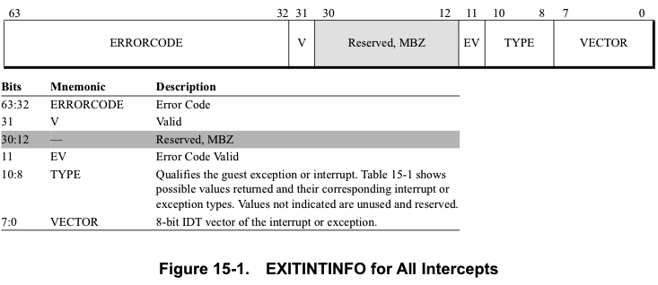
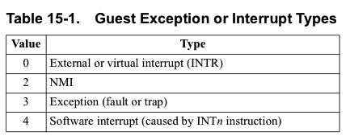

当guest试图通过IDT传递**异常或中断**时（例如`#PF`，因为VMM已调出guest的异常堆栈），有可能发生拦截。 在某些情况下，这种拦截可能会导致**透明恢复guest**所必需的**信息丢失**。 例如，在**外部中断**的情况下，处理器将已经通过**PIC或APIC**执行了一个**中断应答周期**(interrupt acknowledge cycle)以获得**中断类型**和**向量**，因此**该中断不再挂起**。

为了**从这种情况中恢复过来**，所有拦截都**指示**了（在VMCB的**EXITINTINFO字段**中）这些拦截是否发生在**通过IDT的异常传递或中断传递期间**。 即使不再可能重新创建所讨论的事件(even when it is no longer possible to recreate the event in question)，该机制也可以使VMM完成**被截获的中断传递**。

尽管有指令名称，但出于**EXITINTINFO**的目的，**INT1**(也称为ICEBP)、**INT3**和**INTO指令**(操作码分别是F1h，CCh和CEh)引发的事件**被视为异常**，而**不是软件中断**。 只有INTn指令（操作码CDh）引发的事件才被视为软件中断。