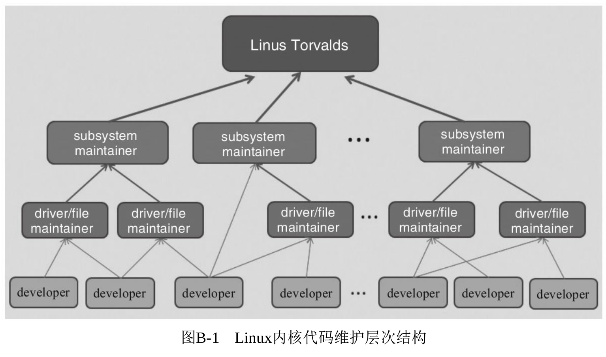

# 开源社区介绍

“开源即开放源代码（Open Source），保证任何人都可以根据“自由许可证”获得软件的源代码，并且允许任何人对其代码进行修改并重新发布。

在英文中，Free可以有两个意思：一个是免费，一个是自由。当提及“Free Software”（自由软件）时，应该将“Free”理解为“自由的演讲”（Free Speech）中的自由，而不是“免费的啤酒”（Free Beer）中的免费。

一般来说，每个开源软件都有一个对应的开源社区.

## Linux开源社区

KVM是Linux内核的一个模块，因此KVM社区也与Linux内核社区非常类似，也可以算作Linux内核社区的一部分。这里介绍的Linux开源社区主要是指Linux内核的社区而不是Linux系统的用户工具和发行版社区。

**Linus**并不会亲自审查每一个新的补丁、每一行新 的代码，而是将**大部分的工作**都交给各个**子系统的维护者**去处理。

各个维护者下面可能还有一些**驱动程序或几个特殊文件的维护者**，Linus自己则主要把握一些大的方向及合并(merge)各个子系统维护者的分支到Linux主干树。

如图所示，**普通的Linux内核开发者**一般都是向驱动程序或子系统的维护者提交代码，提交的代码经过**维护者**和开发社区中的**其他人审核**之后，才能进入**子系统！！！维护者**的**开发代码仓库！！！**，进入每个Linux内核的**合并窗口(merge window**)之后才能进入真正的Linux upstream代码仓库中。

注: upstream也被翻译为“上游”，是指在一些开源软件的开发过程中**最主干**的且**一直向前发展的代码树**。upstream中包含了**最新的代码**，一些新增的功能特性和修复bug的代码一般都先进入upstream中，然后才会到某一个具体的发型版本中。对于Linux内核来说， Linux upstream就是指最新的Linux内核代码树，而一些Linux发行版(如RHEL、Fedora、 Ubuntu等)的内核都是基于upstream中的某个版本再加上一部分patch来制作的。

在Linux内核中有许多的**子系统**(如:内存管理、PCI总线、网络子系统、ext4文件系 统、SCSI子系统、USB子系统、KVM模块等)，也分为更细的**许多驱动**(如:Intel的以 太网卡驱动、USB XHCI驱动、Intel的DRM驱动等)。各个**子系统**和**驱动**分别由相应的开发者来维护，如:PCI子系统的维护者是来自Google的Bjorn Helgaas，Intel以太网卡驱动 (如igb、ixgbe)的维护者是来自Intel的Jeff Kirsher。关于Linux内核中维护者相关的信 息，可以查看内核代码中名为“MAINTAINERS”的文件。

目前，Linux内核版本的发布周期一般是2~3个月，在这段时间中，一般会发布七八个RC[2]版本。

注: RC即Release Candidate，与Alpha、Beta等版本类似，RC也是一种**正式产品发布前**的一种**测试版本**。RC是**发布前的候选版本**，比Alpha/Beta更加成熟。一般来说，RC版本是前面已经经过测试并修复了大部分bug的，一般比较稳定、接近正式发布的产品。

## KVM开源社区

KVM(Kernel Virtual Machine)是Linux内核中原生的虚拟机技术，KVM内核部分的 代码全部都在Linux内核中，是Linux内核的一部分(相当于一个内核子系统)。

KVM项目的官方主页是 https://www.linux-kvm.org 。

除了平时在KVM邮件列表中讨论之外，KVM Forum是KVM开发者、用户等相互交流的一个重要会议。KVM Forum一般每年举行一届，其内容主要涉及KVM的一些最新开发 的功能、未来的发展思路，以及一些管理工具的开发。关于KVM Forum，可以参考其官方网页[3]，该网页提供了各届KVM Forum的议程和演讲文档，供用户下载。

KVM Forum官网: http://www.linux-kvm.org/page/KVM_Forum

## QEMU开源社区

QEMU(Quick EMUlator)是一个实现**硬件虚拟化**的开源软件，它通过**动态二进制转换**实现了对中央处理单元(CPU)的模拟，并且提供了**一整套模拟的设备模型**，从而可以使未经修改的各种操作系统得以在QEMU上运行。

QEMU自身就是一个**独立的、完整的虚拟机模拟器**，可以独立**模拟CPU**和其他一些**基本外设**。除此之外，QEMU还可以为KVM、Xen等流行的虚拟化技术提供设备模拟功能。