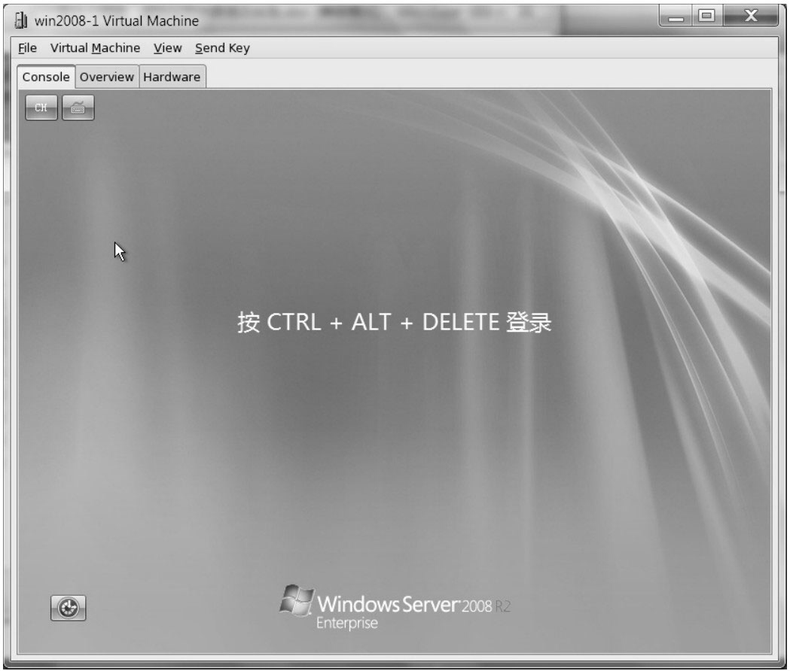

<!-- @import "[TOC]" {cmd="toc" depthFrom=1 depthTo=6 orderedList=false} -->

<!-- code_chunk_output -->

- [1 QEMU的三种运行模式](#1-qemu的三种运行模式)
  - [1.1 kqemu加速](#11-kqemu加速)
  - [1.2 用户态qemu](#12-用户态qemu)
  - [1.3 kvm\-qemu加速](#13-kvm-qemu加速)
- [2 libvirt和virt\-manager](#2-libvirt和virt-manager)
- [3 KVM的调试接口](#3-kvm的调试接口)

<!-- /code_chunk_output -->

# 1 QEMU的三种运行模式

QEMU作为一个开源的硬件模拟器项目，除了支持x86体系架构之外，还支持ARM、MIPS、PowerPC、IA64等多种硬件架构。QEMU采用模块化设计的方法，因此，还能支持多种多样的外设硬件，并且能够方便地进行扩充。

除了支持KVM之外，QEMU还支持全模拟化和kqemu加速模块等方式，这三种方式的架构区别如图5\-6所示。

图5-6 QEMU的三种模块架构


## 1.1 kqemu加速

第一种模式是通过 kqemu 模块实现内核态的加速。通过在**内核**中加入**kqemu的相关模块**，在**用户态的QEMU**则通过访问/dev/kqemu设备文件接口调用改进型加速。在这种模式中，主要针对**虚拟机**和**宿主机**运行于**统一架构**的情况下进行虚拟化。

## 1.2 用户态qemu

第二种模式是在用户态直接运行 QEMU，由 QEMU 对目标机的**所有指令进行翻译**后执行，相当于**全虚拟化**。在这种模式下，可以运行各种不同形态的体系结构，如Android开发环境中即使用了QEMU来为其模拟ARM运行环境，但是在这种模拟环境下，每一条目标机的执行指令都需要耗费少则数个，多则成千上万个宿主机的指令周期来模拟实现，速度方面不太理想。

## 1.3 kvm\-qemu加速

第三种模式则是 KVM 官方提供的 kvm\-qemu 加速模式。运行在**内核态的KVM 模块**通过/**dev/kvm** 字符设备文件向外提供操作接口。KVM 通过提供libkvm 这个操作库，将/dev/kvm 这一层面的 ioctl 类型的 API 转化成为通常意义上的函数API调用，提供给QEMU的相应适配层，通过QEMU的支持来完成整个虚拟化工作。

针对这三种不同运行模式的测试结果表明，通过KVM对QEMU进行加速从而获取的性能最为理想。

# 2 libvirt和virt\-manager

在很多开源版本的 qemu\-kvm 实现中，并不仅仅提供 qemu\-kvm 软件来进行管理，而引入了一个叫做libvirt的库和virt\-manager进行管理。

**libvirt** 和 **virt\-manager** 都是开源的多虚拟化产品解决方案，能够支持QEMU、Xen、KVM等解决方案在内的多种虚拟机。在Cent OS等发行版本中，通过使用libvirt和virt\-manager来进行虚拟机管理，图5\-4为一运行了Windows 2008 R2的KVM虚拟机，通过virt\-manager进行管理。

libvirt 通过引入**软件适配层**的概念，通过统一的上层接口管理虚拟机，对下则提供针对不同解决方案的适配器，如QEMU、Xen和KVM等。

**virt\-manager** 是一个基于 **Python** 和 **pygtk** 编写的虚拟机管理工具前端，通过引用libvirt来进行桌面环境下的虚拟机管理，其运行界面如图5-7所示。

图5-7 基于libvirt和virt-manager的虚拟机管理工具



# 3 KVM的调试接口

KVM提供了丰富的调试信息接口，通过Linux内核自带的**debugfs**将调试信息导出。要启用KVM的调试接口，可以输入以下指令来挂载调试信息分区：

```
mount -t debugfs none /sys/kernel/debug
```

之后可以进入/**sys/kernel/debug/kvm** 目录中查看到相应的调试信息，如图5\-8所示。

图5-8 KVM调试信息图


从前文分析中可以看出，KVM并没有提供一个完整的PC虚拟环境，而是提供了针对处理器、I/O和内存等关键技术点的API，借助第三方环境实现整台PC机的模拟。

QEMU基于模块化设计，因此，KVM的开发小组将QEMU针对x86模拟体系中的CPU模拟、I/O模拟和内存模拟等模块针对KVM所导出的API进行了优化后，qemu\-kvm就成了可以运行KVM虚拟机的宿主。