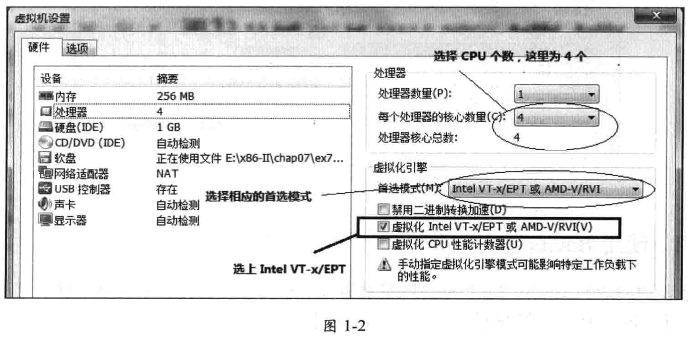
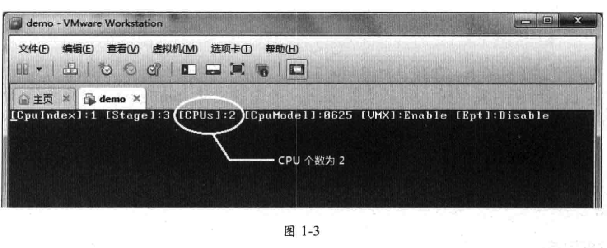

# 平台信息和状态

以4个逻辑处理器平台为例, 机器启动后最终进入一个等待状态, 如图.

图1\-1:

图1-1所显示的信息是处理器最后调用`updata_system_status`例程的结果, 它输出当前系统的信息, 在`lib/crt.asm`模块里实现.

## 处理器编号

**CPUIndex**指示处理器的编号, 从0开始编号.

在PCB(Processor Control Block, 处理器控制块)结构中的ProcessorIndex记录.

## 运行阶段

**Stage**指示系统当前运行在哪个阶段. 系统平台分为三个阶段(参见第1.5节).

- Stage1: 处理器处于32位未分页的保护模式, 此时关闭分页机制.
- Stage2: 处理器处于32位已分页的保护模式, 这是legacy模式的最终环境.
- Stage3: 处理器处于IA\-32e(即long\-mode)下的64位模式.

图1\-1显示, 处理器当前处于stage3阶段(64位模式).

## 处理器个数

CPUs 指示当前可用的处理器个数, 这是在启动阶段检测出来的. 实际上, 使用代码枚举出来更可靠. 因为, 存在**BIOS关闭某些处理器**的可能性.

图显示, 有4个可用的逻辑处理器

## 处理器模型

CpuModel 指示处理器的模型信息, 包括了处理器家族与型号. 显示当前处理器是 0625H. 06H指P6家族(包括了Core家族), 25H属于第1代的Core架构, 具体为Westmere架构.

## VMX开启

VMX enable 指示VMX模式已经开启, VMX disable则指示VMX模式关闭. 

实际上, 每个处理器都开启了VMX模式. 由调用`vmx_operation_enter`函数进入, 实现在`lib/Vmx/VmxInit.asm`.

## EPT开启

EPT enable指示EPT映射机制已经开启.

处理器在进入guest前, 根绝guest的设置决定是否开启EPT映射机制.

# 使用VMware

多数例子可以运行在VMware中, 只有少数需要在真实机器上运行. 

下面介绍如何使用VMware运行例子中的`demo.img`映像文件.

运行VMware后, 使用典型配置新建一个虚拟机, 名为"**demo**". "**客户机操作系统**"选"**其他**", 版本为"**其他64位**". **虚拟机内存**使用**256MB**足够.

接下来设置处理器个数以及虚拟化引擎, 如图1-2.

物理处理器数量为1, 处理器核心数量可以根据自己的平台, 这里选4.

假如选择了2个核心数量, 运行demo.img的结果如图: 检测到的CPU个数为2.

虚拟化引擎选择"虚拟化Intel VT-x/EPT或AMD-V/RVI(V)". 首选模式选为"intel VT-x/EPT或AMD-V/RVI". 这才能在VMware中使用VMX模式.

在VMware中, 我们使用软盘映像文件demo.img, 这个映像文件位于每个例子目录中. 例如1-4图中的chap07/ex7-5/demo.img.

# 使用Bochs

Bochs只支持基本的VMX特性. 所以不使用

# 在真实机器上运行

在后面看到, 实现了一个Build工具, 用于编译和生成所需

# Build工具

