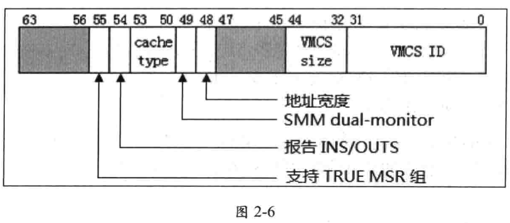

<!-- @import "[TOC]" {cmd="toc" depthFrom=1 depthTo=6 orderedList=false} -->

<!-- code_chunk_output -->

- [1. 功能检测的必要性](#1-功能检测的必要性)
- [2. 检测是否支持VMX架构](#2-检测是否支持vmx架构)
- [3. 通过MSR组检查VMX能力](#3-通过msr组检查vmx能力)
- [4. 例子 2-1](#4-例子-2-1)
- [5. 基本信息检测](#5-基本信息检测)
- [6. 允许为 0 以及允许为 1 位](#6-允许为-0-以及允许为-1-位)
  - [6.1. 决定 VMX 支持的功能](#61-决定-vmx-支持的功能)
  - [6.2. 控制字段设置算法](#62-控制字段设置算法)
- [7. VM-execution 控制字段](#7-vm-execution-控制字段)
  - [7.1. Pin-based VM-execution control 字段](#71-pin-based-vm-execution-control-字段)
  - [7.2. primary processor-based VM-execution control 字段](#72-primary-processor-based-vm-execution-control-字段)
  - [7.3. secondary processor-based VM-execution control 字段](#73-secondary-processor-based-vm-execution-control-字段)
- [8. VM-exit control 字段](#8-vm-exit-control-字段)
- [9. VM-entry control 字段](#9-vm-entry-control-字段)
- [10. VM-function control 字段](#10-vm-function-control-字段)
- [11. CR0 与 CR4 的固定位](#11-cr0-与-cr4-的固定位)
  - [11.1. CR0 与 CR4 寄存器设置算法](#111-cr0-与-cr4-寄存器设置算法)
- [12. VMX 杂项信息](#12-vmx-杂项信息)
- [13. VMCS 区域字段 index 值](#13-vmcs-区域字段-index-值)
- [14. VPID 与 EPT 能力](#14-vpid-与-ept-能力)

<!-- /code_chunk_output -->

# 1. 功能检测的必要性

VMX架构中的很多功能在不同处理器架构有不同的支持, 比如之前提的 `VMX-preemption timer` 功能. 

因此, VMM 需要检测当前VMX架构下的功能, 并进行相应设置.

注: 本书主要参照`Intel开发者手册` 2012年8月版, order number为: `325462-044US`.

# 2. 检测是否支持VMX架构

VMX 架构是否支持, 使用 `CPUID.01H:ECX.VMX[5]`位来进行检测(详细见2.2.3)

# 3. 通过MSR组检查VMX能力

VMX 架构提供了众多项目能力的检测, 包括: **VMX的基本信息**、**杂项信息**、**VPID与EPT能力**, 还有对**VMCS内**的`control fields`(**控制字段**)允许设置的位. 控制字段的位**允许被置为1**时, 代表着**处理器拥有这个能力**.

比如, `secondary processor-based control`字段的`bit 7`是"`Unrestricted guest`"位, 当它允许被置为1时, 表明处理器支持 unrestricted guest(不受限制的guest端)功能. 反之, 则表明处理器不支持该功能.

VMX 的这些能力的检测提供在几组共 **14** 个 **MSR**(Model Specific Register)里, 如表2-1, 除了这些, 还有 **4 个扩展**的 **TRUE 系列寄存器**, 详见2.5.4节和2.5.5节

......

# 4. 例子 2-1

# 5. 基本信息检测

`IA32_VMX_BASIC`寄存器用来检测 VMX 的基本能力信息, 如图 2-6 所示.

... ...

bit 55 位为 1 时, 表示支持 4 个 TRUE 寄存器, 这 4 个 TRUE 寄存器将影响最终的 VMCS 中的某些控制位, 如表 2-2 .

bit 55 的值决定由谁来控制这些 VMCS 字段固定位的设置. 当 bit 55 为 0 时, 这些 VMCS 字段的

# 6. 允许为 0 以及允许为 1 位

## 6.1. 决定 VMX 支持的功能

## 6.2. 控制字段设置算法

# 7. VM-execution 控制字段

在 VMCS 区域的三个 VM-execution control 字段需要检查 VMX 能力寄存器来确认 default0 与 default1 位. 如下所示:

## 7.1. Pin-based VM-execution control 字段

## 7.2. primary processor-based VM-execution control 字段

## 7.3. secondary processor-based VM-execution control 字段

# 8. VM-exit control 字段

# 9. VM-entry control 字段

# 10. VM-function control 字段

# 11. CR0 与 CR4 的固定位

## 11.1. CR0 与 CR4 寄存器设置算法

# 12. VMX 杂项信息

# 13. VMCS 区域字段 index 值

# 14. VPID 与 EPT 能力

`IA32_VMX_EPT_VPID_CAP`寄存器提供两方面的能力检测, 包括 EPT(扩展页表)所支持的能力, 以及 EPT 页面 cache(TLBs及paging-structure cache)的能力.

.... .

如图 2-11 是 `IA32_VMX_EPT_VPID_CAP`寄存器的结构.

