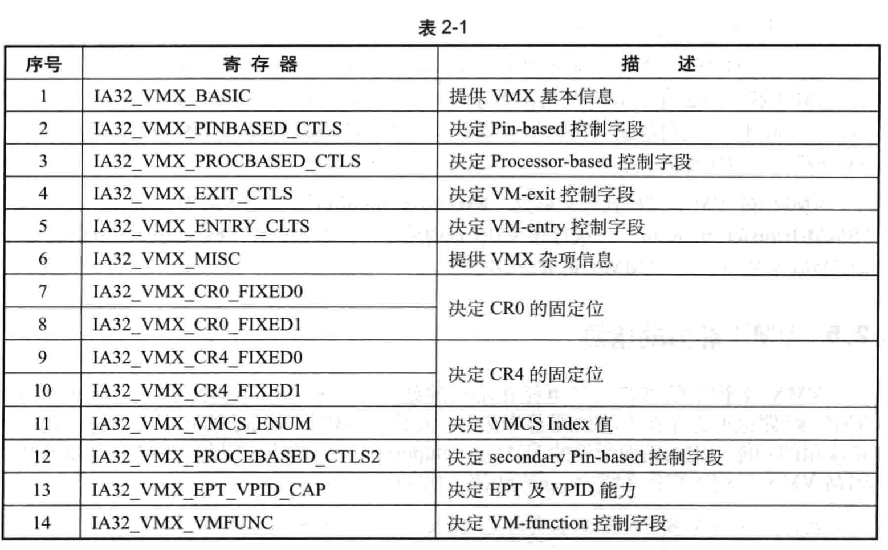

<!-- @import "[TOC]" {cmd="toc" depthFrom=1 depthTo=6 orderedList=false} -->

<!-- code_chunk_output -->

- [1. 检测是否支持VMX](#1-检测是否支持vmx)
- [2. 通过MSR组检查VMX能力](#2-通过msr组检查vmx能力)
- [3. 例子 2-1](#3-例子-2-1)
- [4. 基本信息检测](#4-基本信息检测)
- [5. 允许为 0 以及允许为 1 位](#5-允许为-0-以及允许为-1-位)
  - [5.1. 决定 VMX 支持的功能](#51-决定-vmx-支持的功能)
  - [5.2. 控制字段设置算法](#52-控制字段设置算法)
- [6. VM-execution 控制字段](#6-vm-execution-控制字段)
  - [6.1. Pin-based VM-execution control 字段](#61-pin-based-vm-execution-control-字段)
  - [6.2. primary processor-based VM-execution control 字段](#62-primary-processor-based-vm-execution-control-字段)
  - [6.3. secondary processor-based VM-execution control 字段](#63-secondary-processor-based-vm-execution-control-字段)
- [7. VM-exit control 字段](#7-vm-exit-control-字段)
- [8. VM-entry control 字段](#8-vm-entry-control-字段)
- [9. VM-function control 字段](#9-vm-function-control-字段)
- [10. CR0 与 CR4 的固定位](#10-cr0-与-cr4-的固定位)
  - [10.1. CR0 与 CR4 寄存器设置算法](#101-cr0-与-cr4-寄存器设置算法)
- [11. VMX 杂项信息](#11-vmx-杂项信息)
- [12. VMCS 区域字段 index 值](#12-vmcs-区域字段-index-值)
- [13. VPID 与 EPT 能力](#13-vpid-与-ept-能力)

<!-- /code_chunk_output -->

VMX架构中的很多功能在不同处理器架构有不同的支持, 比如之前提的 `VMX-preemption timer` 功能. 

因此, VMM 需要检测当前VMX架构下的功能, 并进行相应设置.

# 1. 检测是否支持VMX

在系统软件进入VMX操作之前，它必须发现处理器中存在VMX支持。 系统软件可以使用CPUID确定处理器是否支持VMX操作。

使用 `CPUID.01H:ECX.VMX[5]`位来进行检测, 该位的值为1表示支持VMX功能。

# 2. 通过MSR组检查VMX能力

而VMX体系结构被设计为**可扩展**的，以便将来VMX操作中的处理器可以支持VMX体系结构的第一代实现中不存在的其他功能。 通过使用一组**VMX功能MSR**将可扩展的VMX功能的**可用性报告**给软件。

从MSR地址`480H`开始对这些MSR进行索引。 **VMX功能MSR是只读的**。 尝试使用`WRMSR`写入它们会产生**一般保护异常**（general-protection exception, `#GP(0)`）。 它们在不支持VMX操作的处理器上不存在。 尝试在此类处理器上读取它们（使用`RDMSR`）会产生一般保护异常（`#GP(0)`）。

VMX 架构提供了众多项目能力的检测, 包括: **VMX的基本信息**、**杂项信息**、**VPID与EPT能力**, 还有对**VMCS内**的`control fields`(**控制字段**)允许设置的位. 控制字段的位**允许被置为1**时, 代表着**处理器拥有这个能力**.

比如, `secondary processor-based control`字段的`bit 7`是"`Unrestricted guest`"位, 当它允许被置为1时, 表明处理器支持 unrestricted guest(不受限制的guest端)功能. 反之, 则表明处理器不支持该功能.

VMX 的这些能力的检测提供在几组共 **14** 个 **MSR**(Model Specific Register)里, 如表2-1, 除了这些, 还有 **4 个扩展**的 **TRUE 系列寄存器**, 详见2.5.4节和2.5.5节

......

# 3. 例子 2-1

# 4. 基本信息检测

`IA32_VMX_BASIC MSR`寄存器用来检测 VMX 的基本能力信息, 如图 2-6 所示.

* bits `30:0`包含处理器使用的**31位**VMCS修订标识符(VMCS revision identifier, 也可称为VMCS ID)。 使用相同**VMCS修订标识符**的处理器对VMCS区域使用相同的大小（请参阅`bits 44:32`）。

注: 早期版本指定VMCS修订标识符是此MSR的`31：0`位中的**32位字段**。 对于此更改之前产生的所有处理器，此MSR的第31位均**为0**。

* `bit 31`一直为0
* bits `44:32`表明软件应为VMXON区域和任何VMCS区域分配的字节数。 它是一个大于0且最大为4096的值（只有且仅当清除了位43:32时，才设置位44）。
* `bit 48`指示物理地址的宽度, 包括VMXON区域，每个VMCS以及VMCS中指向的数据结构(I/O位图，virtual-APIC页面，用于VMX转换的MSR区域)的指针物理地址宽度。 
  * 如果是0, 这些地址仅限于处理器的物理地址宽度。 
  * 如果是1, 这些地址限制为32位。 
  * 对于支持Intel 64架构的处理器，该位始终为0。
* 如果bit 49为1，则逻辑处理器支持对系统管理中断和系统管理模式进行双监视器处理。 有关此处理的详细信息，请参见第34.15节。

... ...

bit 55 位为 1 时, 表示支持 4 个 TRUE 寄存器, 这 4 个 TRUE 寄存器将影响最终的 VMCS 中的某些控制位, 如表 2-2 .

bit 55 的值决定由谁来控制这些 VMCS 字段固定位的设置. 当 bit 55 为 0 时, 这些 VMCS 字段的

# 5. 允许为 0 以及允许为 1 位

## 5.1. 决定 VMX 支持的功能

## 5.2. 控制字段设置算法

# 6. VM-execution 控制字段

在 VMCS 区域的三个 VM-execution control 字段需要检查 VMX 能力寄存器来确认 default0 与 default1 位. 如下所示:

## 6.1. Pin-based VM-execution control 字段

## 6.2. primary processor-based VM-execution control 字段

## 6.3. secondary processor-based VM-execution control 字段

# 7. VM-exit control 字段

# 8. VM-entry control 字段

# 9. VM-function control 字段

# 10. CR0 与 CR4 的固定位

## 10.1. CR0 与 CR4 寄存器设置算法

# 11. VMX 杂项信息

`IA32_VMX_MISC`寄存器提供了一些vmx的杂项信息.

`bits 4:0`(5个bit) 提供一个 X 值，当 **TSC** 值的 `bit X` 改变时，`VMX-preemption timer count` 计数值将减 1。假如这个 X 值是 5, 那么表示当 TSC 的 `bit 5` 发生改变（0 变 1 或 1 变 0) 时, preemption timer count 计数值减 1。也就是说，**TSC 计数 32 次时**，preemption timer count值减 1.

bit5 为 1 时，表示当发生 VM-exit 行为时，将保存IA32EFER.LMA 的值在 VM  entry control 字段的“IA-32 e mode guest”位里。只有当 VMX 支持 unrestricted guest（不受限制的 guest）功能时，这个位才为 1 值。

bits8:6 是一个 mask 位值，提供虚拟处理器 Inactive 状态值的支持度，有下面的几个  Inactive 状态值：

bit6 为 1 时，支持 HLT 状态

bit7 为 1 时，支持 shutdown 状态

obit8 为 1 时，支持 wait-for-SIPI 状态

只有这些 Inactive 状态被支持时，才允许在 guest state 区域 activity state 字段设置相应的 Inactive 状态值。bits8:6 一般会返回 7（全部支持）。

bits24:16 指示支持的 CR3- -target 值的数量，一般会返回 4 值，表示支持 4 个 CR3 寄存器目标值。bits27:25 返回一个 N 值，这个 N 值用来计算出在 MSR 列表（M-exit MSR-load、VM- exit MSR- -store 以及 VM- entry Msr-load 列表）里推荐的 MSR 最大个数。计算方法是：个数= (N+1) ×512。一般会返回 0 值，表示列表里推荐最多支持 512 个 MSR。

bit28 为 1 时，表示支持 IA32 SMM MONITOR CTL 寄存器的 bit2 位能被设为 1 值。这个 bit2 置位时，表示执行 VMXOFF 指令时，SMI 能被解开阻塞。一般情况下  VMXOFF 指令的执行将阻塞 SMI 请求。

# 12. VMCS 区域字段 index 值

# 13. VPID 与 EPT 能力

`IA32_VMX_EPT_VPID_CAP`寄存器提供**两方面**的能力检测, 包括 **EPT**(扩展页表)所支持的能力, 以及 **EPT 页面 cache**( `TLBs` 及 `paging-structure cache` )的能力.

当下面的条件满足时, 才支持 `IA32_VMX_EPT_VPID_CAP` 寄存器.

(1) `CPUID.01H:ECX[5]=1`, 表明支持 **VMX** 架构.

(2) `IA32_VMX_PROCBASED_CTLS[63]=1`, 表明支持 `IA32_VMX_PROCBASED_CTLS2` 寄存器.

(3) `IA32_VMX_PROCBASED_CTLS2[33]=1`, 表明支持 "enable EPT" 位.

如图 2-11 是 `IA32_VMX_EPT_VPID_CAP`寄存器的结构.

对于 EPT 能力, `bit 0` 为 1 时, 允许在 EPT 页表表项里的 `bits 2:0` 使用 100b(execute-only页)属性. `bit 6`为 1 时, 表明支持 **4 级页表结构**. `bit 16`为1时**支持使用 2M 页**, `bit 17`为1时**支持使用 1G 页**. 最后, `bit 21` 为 1 时支持在**页表项**里使用 **dirty 标志**.

bit 8为 1 时, 允许在 EPTP 字段的 bits 2:0 里设为UC类型(值为0), 而bit 14为1时, 允许在 EPTP 的bits 2:0 里设置为WB类型(值为6). 见4.4.1.3

对于 EPT cache的能力, bit 20 为 1 时支持INVEPT指令, bit 32为 1 时支持INVVPID指令. INVEPT指令支持的刷新类型由 bit 25 和 bit 26 检测. bit 25为1时, 支持 single-context 刷新类型, bit 26为 1时, 支持all-context刷新类型.

INVVPID指令支持的刷新类型由bits 43:40检测. bit 40为1时, 支持 individual-address 类型(type值为0). bit 41为1时, 支持single-context类型(type值为1). bit 42为1时, 支持 all-context类型(type值为2). bit 43为1时, 支持single-context-retaining-globals类型(type值为3).