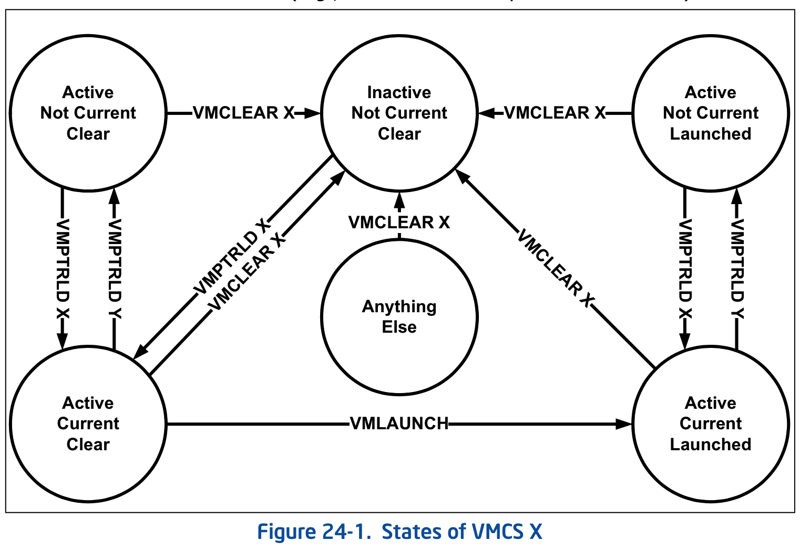

<!-- @import "[TOC]" {cmd="toc" depthFrom=1 depthTo=6 orderedList=false} -->

<!-- code_chunk_output -->

- [概述](#概述)
- [activity属性](#activity属性)
- [current属性](#current属性)
- [小结](#小结)

<!-- /code_chunk_output -->

# 概述

在一个存在**多个虚拟机**的平台里, **每个虚拟处理器**对应一个**属于自己的VMCS**. 

在**虚拟处理器之间的切换**也意味着**VMCS之间的切换**. 

**同一个时刻**, **一个逻辑处理器**只有**一个VMCS是current\-VMCS(！！！**).

根据Intel手册的描述, 可以归纳出用来描述**VMCS的三类属性状态**, 他们是:

(1) activity属性, 包括active及inactive状态

(2) current属性, 包括current及not current状态

(3) launch属性, 包括clear及launched状态.

这三类属性中, current与launch属于比较重要. 一个VMCS的某一类属于是什么状态并不影响其他的. 比如, VMCS可以是"active"状态, 但可能不属于"current"或"clear"与"launched"状态.

有一个例外, 如果VMCS处于"inactive"状态, 那么它必定是"not current"状态. 

在刚进入VMX operation模式时, 没有任何VMCS处于"active"状态, 因此, 也就不存在"current"以及"clear状态".

# activity属性

# current属性

# 小结

综合三节描述, VMCS状态随着下面指令的执行而改变:

- VMCLEAR指令将目标VMCS置为"inactive", "not current"及"clear"状态.
- VMPTRLD指令将目标VMCS置为"active"及"current"状态, 并更新current-VMCS指针.
- VMLAUNCH指令将current-VMCS置为"launched"状态.

处理器会记录VMCS的这些状态信息. 这些状态信息存放在目标VMCS的不可见字段里, 这样处理器就很容易知道VMCS目前属于什么状态.

这些不可见字段并没有实现对应的字段ID, 因此, 不能使用VMREAD与VMWRITE指令进行访问.