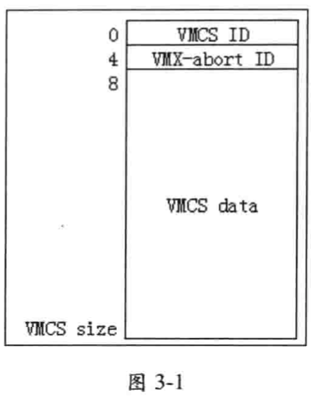

VMCS结构存放在一个**物理地址区域**里, 这个区域被称为"`VMCS region`". 

VMCS区域需要**对齐在4K边界**上. VMCS区域的大小由`IA32_VMX_BASIC[44:32]`域里得到(见2.5.4节), 以**KB**为单位, **最高4KB**. 

`IA32_VMX_BASIC[53:50]`域报告了VMCS区域支持的**cache类型**, 支持UC与WB类型.

执行 **VMCLEAR** 与 **VMPTRLD** 指令时, 需要提供**目标 VMCS 区域**的**物理指针**作为**操作数**. 而 **VMREAD**、VMWRITE、VMLAUNCH、VMRESUME 及 VMPTRST 指令**隐式**地使用 `current-VMCS pointer` 作为**目标 VMCS 指针**.

前面提到, 使用 **VMCLEAR** 指令对 `current-VMCS` 指针进行**初始化**时, `current-VMCS` 指针值变成 `FFFFFFFF_FFFFFFFFh`. 这时, 执行上面隐式使用 `current-VMCS pointer`的指令, 会产生 VMfailInvalid 失败.

# VMXON 区域

# Executive-VMCS 与 SMM-transfer VMCS

在 SMM 双重监控处理机制下, 还有两类 VMCS, 分别是: Executive-VMCS 与 SMM transfer VMCS. Executive-VMCS 对应 VMM 在 VMX operation 模式(包括 root 与 non-root )下的 VMCS, 而 SMM-transfer VMCS 对应 VMM 进入 SMM 模式时使用的 VMCS .

# VMCS 区域格式

VMCS 区域寄存在物理地址空间, 有一个 8 字节的头部和 VMCS 数据区域, 如图 3-1 所示.

注: DWORD, 双字, 四字节

VMCS 的首 DWORD 值是 VMCS ID, 这个 VMCS ID 值需要在初始化 VMCS 区域时写入, 必须等于 `IA32_VMX_BASIC[31:0]` 值(见2.5.4). 注意, VMXON 区域的首 DWORD 值也是 VMCS ID, 也必须等于 `IA32_VMX_BASIC[31:0]` 值.

接下来的 DWORD 值是 `VMX-abort ID`. 当进行 `VM-exit` 操作遇到一个**错误**时, 会产生 "VMX-abort". VMX-abort 导致**处理器**进入 **shutdown** 状态, 处理器会写入一个**非零值**到 `current-VMCS` 的 VMX-abort ID 字段(见5.17)

