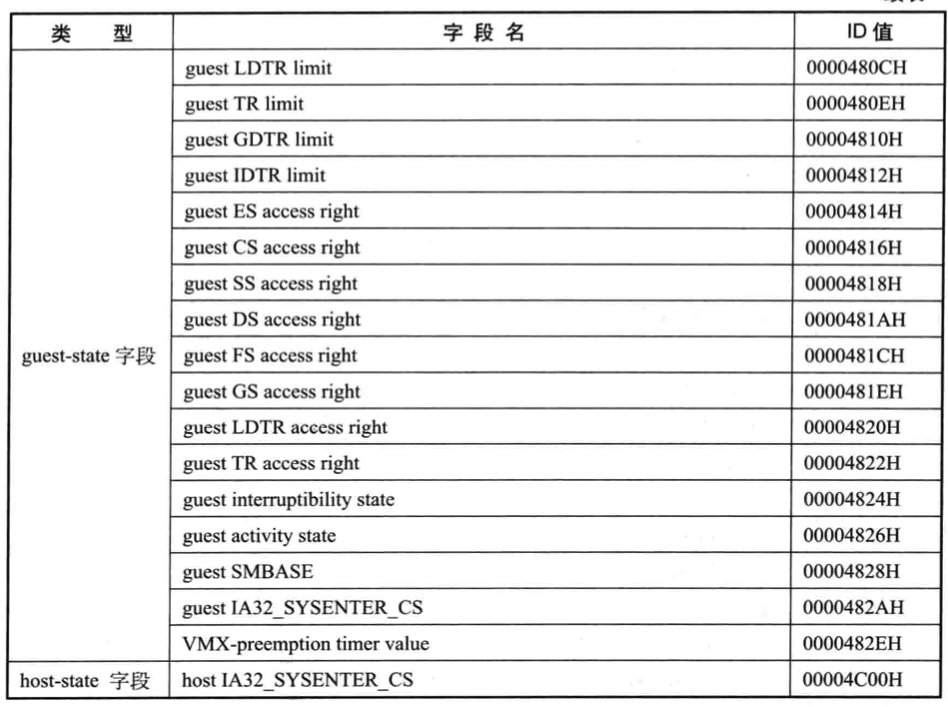

<!-- @import "[TOC]" {cmd="toc" depthFrom=1 depthTo=6 orderedList=false} -->

<!-- code_chunk_output -->

- [1. 16 位字段 ID](#1-16-位字段-id)
- [2. 64 位字段 ID](#2-64-位字段-id)
- [3. 32 位字段 ID](#3-32-位字段-id)
- [4. Natural-width 字段 ID](#4-natural-width-字段-id)

<!-- /code_chunk_output -->

# 1. 16 位字段 ID

# 2. 64 位字段 ID

64 位字段 ID 值 的 `bits 14:13` 值为1.

bits 11:10 的类型值包含 4 类:

- 控制字段(类型为0)
- 只读字段(类型为1)
- guest-state字段(类型为2)
- host-state字段(类型为3)

# 3. 32 位字段 ID

32 位字段ID值的 `bits 14:13`值为 2 .

`bits 11:10`的类型值包含4类:

- 控制字段(类型为0)
- 只读字段(类型为1)
- guest-state字段(类型为2)
- host-state字段(类型为3) 

# 4. Natural-width 字段 ID

natural-width 字段ID值的 `bits 14:13`值为 3 .

`bits 11:10`的类型值包含4类:

- 控制字段(类型为0)
- 只读字段(类型为1)
- guest-state字段(类型为2)
- host-state字段(类型为3) 

