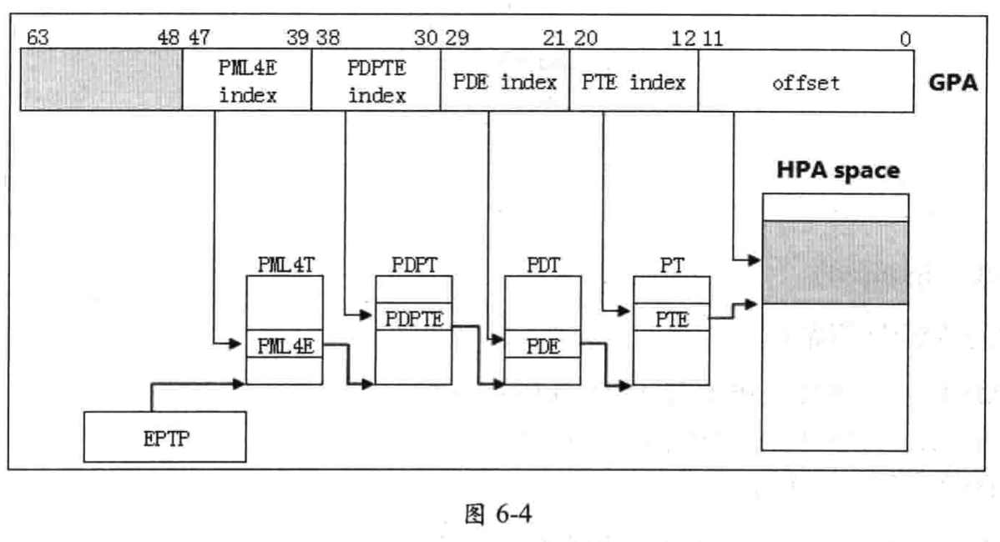

<!-- @import "[TOC]" {cmd="toc" depthFrom=1 depthTo=6 orderedList=false} -->

<!-- code_chunk_output -->

- [1. 基本原理](#1-基本原理)
- [2. EPT机制概述](#2-ept机制概述)
  - [2.1. guest分页机制与EPT](#21-guest分页机制与ept)
    - [2.1.1. guest的分页模式](#211-guest的分页模式)
    - [2.1.2. 引发GPA转换HPA](#212-引发gpa转换hpa)
    - [2.1.3. guest分页机制下GVA到HPA地址转换](#213-guest分页机制下gva到hpa地址转换)
- [3. EPT页表结构](#3-ept页表结构)
- [4. guest physical address](#4-guest-physical-address)
- [5. EPTP](#5-eptp)
  - [5.1. EP4TA 域](#51-ep4ta-域)
- [6. 4K 页面下的 EPT 页表结构](#6-4k-页面下的-ept-页表结构)
- [7. 2M 页面下的 EPT 页表结构](#7-2m-页面下的-ept-页表结构)
- [8. 1G 页面下的 EPT 页表结构](#8-1g-页面下的-ept-页表结构)
- [9. EPT 导致的 VM-exit](#9-ept-导致的-vm-exit)
  - [9.1. EPT violation: EPT 违例](#91-ept-violation-ept-违例)
    - [9.1.1. VM-exit记录信息](#911-vm-exit记录信息)
  - [9.2. EPT misconfiguration](#92-ept-misconfiguration)
    - [9.2.1. VM-exit 记录信息](#921-vm-exit-记录信息)
- [10. accessed 与 dirty 标志位](#10-accessed-与-dirty-标志位)
- [11. EPT 内存类型](#11-ept-内存类型)
- [12. EPTP switching](#12-eptp-switching)
- [13. 实现 EPT 机制](#13-实现-ept-机制)

<!-- /code_chunk_output -->

# 1. 基本原理

VMX架构引入了**EPT(Extended Page Table, 扩展页表**)机制来实现**VM物理地址空间的隔离**, EPT机制实现原理与x86/x64的**分页机制是一致**的.

当**guest软件发出指令访问内存**时, **guest**最终生成**GPA**(`Guest-Physical Address`). 

**EPT页表结构定义在host端(！！！**), **处理器**接受到**guest传来**的`guest-physical address`后, 通过**EPT页表**结构转换为**HPA**(`Host-physical address`), 从而访问平台上的物理地址.

# 2. EPT机制概述

VMM在设置前应查询处理器**是否支持EPT机制**, 通过检查`secondary processor-based VM-execution control`字段的"`enable EPT`"位(bit 1)是否允许被置为1(见2.5.6.3). 当允许为1, 表明支持EPT机制, 否则不支持.

当"`enable EPT`"位为1, 表明**开启了EPT机制**. 在该机制下, 引出了**两个物理地址**概念.

- **GPA**: guest所有访问的物理地址都是GPA
- **HPA**: 平台最终的物理地址. GPA必须转换成HPA才能访问真实的物理地址.

**VMM**中**没有**这两个概念, 但**VMM访问的物理地址**可以被视为**HPA**. 

在**开启EPT机制**后**VMM**需要建立**EPT页表**结构, 通过在 **EPTP**(`Extended Page Table Pointer`)字段中提供**EPT页表结构**的**指针值**, 为**每个VM**准备**不同的EPT页表结构**, 或在**同一个EPT页表**结构中准备**不同的页表项**.

当"`unrestricted guest`"位为1, "enable EPT"位必须为1(见4.4.1.3), 说明guest运行在**实模式**时必须**启用EPT机制**. 同时, 当处理器**支持unrestricted guest功能**时, 也**必定支持EPT机制**.

## 2.1. guest分页机制与EPT

**实模式**下**不使用分页机制**, guest访问使用的linear address(**线性地址**)就是**物理地址**(也是`guest-physical address`).

当`CR0.PG=1`时**guest**启用**分页**, `guest-linear address`(guest线性地址)通过**页表结构**转换成**物理地址**. 当"`enable EPT`"位为1, **guest**内的**线性地址**转换成`guest-physical address`. 同时, 产生两个页表结构的概念.

- `guest paging structure`(**guest页表结构**): 这是**guest内**将线性地址**GVA**转换成**GPA**(`guest-physical address`)的页表结构. 即x86/x64下分页机制使用的页表结构.
- `EPT paging structure`(**EPT页表结构**): 负责将**GPA转换成HPA**所使用的页表结构.

注: 当"`enable EPT`"位为1, **guest**内所有"**物理地址**"都视为"`guest-physical address`". 例如, 由**CR3寄存器**指向的guest paging structure地址属于**GPA**(在"**enable EPT"位为0**, **CR3的地址是物理地址**), 并且guest paging structure**页表表项**内所引用的地址都属于**GPA**.

而**EPTP**所指向的EPT paging structure**地址是HPA(！！！**), 并且EPT paging structure**页表项内**所引用的**地址都属于HPA(！！！**).

下图是**开启EPT**时**guest**的**线性地址**访问**物理地址**的转换图. guest\-linear address通过guest paging structure页表结构转换为guest\-physical address, 再经过EPT paging structure页表结构转换成host\-physical address后访问属于自己的内存域(domain).

### 2.1.1. guest的分页模式

可参照其他.

x64 体系上有三种分页模式(`CR0.PG=1`)

(1) 当 `CR4.PAE=0`时, guest使用**32位分页模式**. 另外, 当`CR4.PSE=1`, 并且 MAXPHYADDR 值大于等于 40 时, 允许在 4M 页面上使用40位的物理地址.

(2) 当 `IA32_EFER.LMA=0`, 并且 `CR4.PAE=1`时, guest使用 PAE 分页模式.

(3) 当 `IA32_EFER.LMA=1`, 并且 `CR4.PAE=1`时, guest使用 IA-32e 分页模式.

guest的线性地址根据上面的分页模式转换成 guest physical address. 当guest使用PAE分页模式, 并且启用了EPT机制时, 在 VM-entry 时会加载 4 个 PDPTE字段(参见4.7.7与4.5.11).

### 2.1.2. 引发GPA转换HPA

三个途径引发`guest-physical address`转换成`host-physical address`

(1) guest进行**内存访问**, 包括**读写访问**及**执行访问**

(2) guest使用**PAE分页模式**加载**PDPTE**, 包括:

- 

(3) 在`guest-linear address`转换为`guest-physical address`过程中, 处理器访问`guest paging structure`**表项**内的地址, 它们属于GPA(例如PDPTE内的地址值)

总之, GPA可能是从`guest-linear address`转换而来, 或**直接访问GPA**(即并不是从guest linear address转换而来)

### 2.1.3. guest分页机制下GVA到HPA地址转换

**分页机制**下, 完成整个**guest访问内存**操作会引发一系列**GPA转换HPA**过程.

假设guest使用 `IA-32e`分页模式(`IA32_EFER.LMA = 1`, `CR4.PAE=1`, `CR0.PG=1`), 并且使用4KB页面. 下图描述了GPA转成HPA过程.

注: 图中是guest linear address转换成最终的HPA

完成这个内存访问操作一共需要**5次！！！GPA到HPA的转换**(N=MAXPHYADDR)

(1) **CR3寄存器**的`bits N-1:12`提供**PML4T基址**. 定位 PML4T 时需对 PML4T 基址进行GPA转换(图中第1步). 成功转换HPA后得到**PML4T的物理地址**, 再由PML4E index查找PML4E(图中A点)

(2) **PML4E**的`bits N-1:12`提供**PDPT基址**. 在定位PDPT时需要对PDPT基址进行GPA转换(第二步). 成功转换HPA后得到PDPT的物理地址, 再由PDPTE index查找PDPTE(B点)

(3) **PDPTE**的`bits N-1:12`提供**PDT基址**. 定位PDT时需要对PDT基址进行GPA转换(第3步). 成功转换HPA后得到PDT的物理地址, 再由PDE index查找PDE(C点)

(4) **PDE**的`bits N-1:12`提供**PT基址**. 定位PT时需要对PT基址进行GPA转换(第4步). 成功转换HPA后得到PT的物理地址, 再由PTE index查找PTE(D点)

(5) **PTE**的`bits N-1:12`提供**4KB page frame基址**. 这个page frame基址加上guest\-linear address的offset值(bits 11:0)得到**目标GPA值**(E点). 处理器将这个GPA转换成**HPA**得到**最终物理地址**(第5步), 从而完成guest内存的访问.

这整个过程中, **任何一个环节！！！** 都可能会发生**EPT violation**或**EPT misconfiguration**而导致**VM\-Exit发生**(见6.1.8)

也可能由于**guest paging structure**而引发**guest产生\#PF异常**, 从而使**guest处理\#PF异常处理程序**或由于`#PF异常`**直接或间接导致VM\-exit**.

举一反三, 我们可以得到:

- 当 guest 使用 32 位分页模式时, guest的内存访问操作需要进行 3 次GPA转换. 即
  - **CR3寄存器**内的 **PDT 基址**需要进行GPA转换, 
  - **PDE** 内的 **PT 基址**需要进行 GPA 转换, 
  - 以及合成的 **GPA** 需要进行转换.
- 当 guest 使用 PAE 分页模式时, guest 的内存访问操作需要进行 **3 次GPA转换**(**没有CR3指向！！！**). 即
  - PDPTE寄存器内的PDT基址需要进行GPA转换
  - PDE内的PT基址需要进行GPA转换
  - 以及合成的GPA需要进行转换

在 PAE 分页模式下, guest 执行 MOV to CR3 指令**更新 CR3 寄存器**(也包括更新 CR0 或 CR4 寄存器某些控制位)引发对 **PDPTE 的加载**. 因此, 在**加载 PDPTE 表项**时也会进行 GPA 的转换. (**尽管不用CR3直接指向了, 但是加载时候还是有！！！**)

# 3. EPT页表结构

EPT paging structure(EPT页表结构)与guest paging structure(guest页表结构)的实现类似. **VMX架构**实现**最高4级EPT页表结构**, 分别是:

(1) **EPT PML4T**(`EPT Page Map Level-4 Table`), 表项是EPT PML4E.

(2) **EPT PDPT**(`EPT Page Directory Pointer Table`), 表项是EPT PDPTE.

(3) **EPT PDT**(`EPT Page Directory Table`), 表项是EPT PDE.

(4) **EPT PT**(`EPT Page Table`), 表项是EPT PTE.

软件可以查询`IA32_VMX_EPT_VPID_CAP`寄存器的bit 6来确定**是否支持4级页表结构**, 为1时EPT支持4级页表结构. 每个EPT页表大小是4KB, 每个EPT页表项为64位宽.

EPT支持三种页面(见 2.5.13)

- 1G 页面, 当`IA32_VMX_EPT_VPID_CAP[17] = 1`时处理器支持 1G 页面. PDPTE 的 bit 7 允许置 1 使用 1G 页面.
- 2M 页面, 当`IA32_VMX_EPT_VPID_CAP[16] = 1`时处理器支持 2M 页面. PDE 的 bit 7 允许置 1 使用 2M 页面.
- 4K 页面, 当`PDPTE[7] = PDE[7] = 0`时使用 4K 页面. PTE 提供 4K 物理页面地址.

使用 1G 页面时, GPA 转换只需要经过两级 EPT 页表的 walk 流程(PML4T与PDPT). 

使用 2M 页面时, GPA 转换需经过三级 EPT 页表的 walk 流程(PML4T、PDPT及PDT).

使用 4K 页面时, GPA 转换需经过四级 EPT 页表的 walk 流程(类似图6-2).

# 4. guest physical address

每个GPA(guest-physical address)值为64位宽. 但是, 当前VMX架构实现最高48位有效的GPA值(`bits 47:0`)

# 5. EPTP

EPT 页表结构**顶层**的 **PML4T 物理地址**由 EPTP(Extended Page Table Pointer, 扩展页表指针)字段提供(见3.5.17). PML4T的物理地址也被称为 "EP4TA" (`EPTP[N-1:12]`), 它用于标识一个cache域. 注意, 这个物理地址属于HPA, 对齐在 4K 边界上. 如图6-3所示.

- PML4T 的物理地址(host physical address)值由 EPTP 字段的 `bit N-1:12`提供(N=MAXPHYADDR). 例如, 当 MAXPHYADDR = 36 时, EPTP 的 bits 35:12 是PML4T 地址值, bits 63:36 是保留位.
- bits

当 "enable EPT" 为 1 时, EPTP 值在 VM-entry 时从EPTP字段里加载, 记录在处理器内部寄存器中(推测). EPTP字段的设置必须符合设置要求(见4.4.1.3).

注: `EPTP[2:0]`所指定的内存类型, 使用在 EPT paging structure(EPT的页表结构)数据本身中. 它属于

## 5.1. EP4TA 域

# 6. 4K 页面下的 EPT 页表结构

在 4K 页面下, guest physical address被分割为下面的部分.

(1)

guest physical address的`bits 63:48` 被忽略(见6.1.3). **GPA**转换到**HPA**需要经过 4 级 EPT 页表结构(walk 次数为 4), 如图6-4.

# 7. 2M 页面下的 EPT 页表结构

# 8. 1G 页面下的 EPT 页表结构

# 9. EPT 导致的 VM-exit

在分页机制下, 线性地址转换到物理地址的过程中发生错误时, 将会引发一个 `#PF(page fault)` 异常. 例如, 页面属于 not-present, 线性地址没有访问权限, 或者页表项的保留位不为0等.

在EPT扩展页表机制下, 在guest中GPA(guest-physical addresss)转换到HPA(host-physical address)的过程中发生错误时, 将会引发两类EPT故障, 被称为 "**EPT violation**" 及 "**EPT misconfiguration**". 作为这两类EPT页故障的响应结果, 处理器产生VM-exit.

## 9.1. EPT violation: EPT 违例

在 **guest 访问内存**时, 由于 guest 对该 `guest-physical address` (无论是 guest-linear address**转换来的**, 还是**直接访问**的)并没有相应的访问权限, 从而产生 EPT violation(EPT 违例) 故障.

EPT violation 故障可以发生在下面 **GPA转换HPA！！！** 的环节. 

- 访问的页面属于 `not-present`. XXX
- 尝试进行读访问, 但目标页面没有可读权限. XXX
- 尝试进行写访问, 但目标页面没有可写权限. XXX
- 尝试执行代码时(即 fetch 代码), 目标页面没有可执行权限. XXX

### 9.1.1. VM-exit记录信息

由 **EPT violation** 引发 `VM-exit` 时, **exit qualification** 字段记录 EPT violation 的明细信息(参见3.10.1.14节表3-32).

从 exit qualification 字段中, 我们可以得到下面GPA转换的相关信息.

(1) **访问操作**(access), `bits 2:0` 指示发生 EPT violation 时, guest进行什么访问操作.

(2) **访问权限**(access rights), `bits 5:3` 指示该 `guest-physical address`具有什么访问权限.

(3) EPT violation发生的位置.

## 9.2. EPT misconfiguration

由于**EPT paging structure 表项**的**内容配置不当**, 从而产生 EPT misconfiguration 导致 VM-exit 发生. 当 EPT paging structure 表项属于 "present" (即`bits 2:0` 不为0值), 并且内容配置为下面情况之一时, 属于 EPT misconfiguration 故障.

### 9.2.1. VM-exit 记录信息

对于 EPT misconfiguration 故障, 并不会记录明细信息, exit qualification 字段为未定义值. 在 guest-physical address 字段中会记录发生 EPT misconfiguration 时的 guest-physical address 地址值(参见3.10.1.18节).

# 10. accessed 与 dirty 标志位

# 11. EPT 内存类型

# 12. EPTP switching

# 13. 实现 EPT 机制