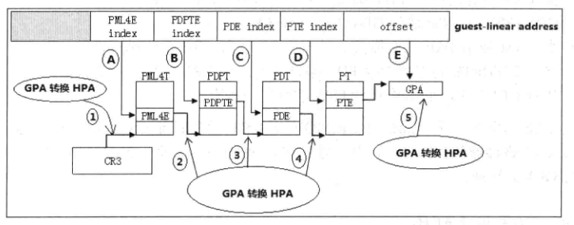

# 2. EPT机制概述

VMM在设置前应查询处理器**是否支持EPT机制**, 通过检查`secondary processor-based VM-execution control`字段的"`enable EPT`"位(bit 1)是否允许被置为1(见2.5.6.3). 当允许为1, 表明支持EPT机制, 否则不支持.

当"`enable EPT`"位为1, 表明**开启了EPT机制**. 在该机制下, 引出了**两个物理地址**概念.

- **GPA**: guest所有访问的物理地址都是GPA
- **HPA**: 平台最终的物理地址. GPA必须转换成HPA才能访问真实的物理地址.

**VMM**中**没有**这两个概念, 但**VMM访问的物理地址**可以被视为**HPA**. 

在**开启EPT机制**后**VMM**需要建立**EPT页表**结构, 通过在 **EPTP**(`Extended Page Table Pointer`)字段中提供**EPT页表结构**的**指针值**, 为**每个VM**准备**不同的EPT页表结构**, 或在**同一个EPT页表**结构中准备**不同的页表项**.

当"`unrestricted guest`"位为1, "enable EPT"位必须为1(见4.4.1.3), 说明guest运行在**实模式**时必须**启用EPT机制**. 同时, 当处理器**支持unrestricted guest功能**时, 也**必定支持EPT机制**.

## 2.1. guest分页机制与EPT

**实模式**下**不使用分页机制**, guest访问使用的linear address(**线性地址**)就是**物理地址**(也是`guest-physical address`).

当`CR0.PG=1`时**guest**启用**分页**, `guest-linear address`(guest线性地址)通过**页表结构**转换成**物理地址**. 当"`enable EPT`"位为1, **guest**内的**线性地址**转换成`guest-physical address`. 同时, 产生两个页表结构的概念.

- `guest paging structure`(**guest页表结构**): 这是**guest内**将线性地址**GVA**转换成**GPA**(`guest-physical address`)的页表结构. 即x86/x64下分页机制使用的页表结构.
- `EPT paging structure`(**EPT页表结构**): 负责将**GPA转换成HPA**所使用的页表结构.

注: 当"`enable EPT`"位为1, **guest**内所有"**物理地址**"都视为"`guest-physical address`". 例如, 由**CR3寄存器**指向的guest paging structure地址属于**GPA**(在"**enable EPT"位为0**, **CR3的地址是物理地址**), 并且guest paging structure**页表表项**内所引用的地址都属于**GPA**.

而**EPTP**所指向的EPT paging structure**地址是HPA(！！！**), 并且EPT paging structure**页表项内**所引用的**地址都属于HPA(！！！**).

下图是**开启EPT**时**guest**的**线性地址**访问**物理地址**的转换图. guest\-linear address通过guest paging structure页表结构转换为guest\-physical address, 再经过EPT paging structure页表结构转换成host\-physical address后访问属于自己的内存域(domain).

### 2.1.1. guest的分页模式

可参照其他.

x64 体系上有三种分页模式(`CR0.PG=1`)

(1) 当 `CR4.PAE=0`时, guest使用**32位分页模式**. 另外, 当`CR4.PSE=1`, 并且 MAXPHYADDR 值大于等于 40 时, 允许在 4M 页面上使用40位的物理地址.

(2) 当 `IA32_EFER.LMA=0`, 并且 `CR4.PAE=1`时, guest使用 PAE 分页模式.

(3) 当 `IA32_EFER.LMA=1`, 并且 `CR4.PAE=1`时, guest使用 IA-32e 分页模式.

guest的线性地址根据上面的分页模式转换成 guest physical address. 当guest使用PAE分页模式, 并且启用了EPT机制时, 在 VM-entry 时会加载 4 个 PDPTE字段(参见4.7.7与4.5.11).

### 2.1.2. 引发GPA转换HPA

三个途径引发`guest-physical address`转换成`host-physical address`

(1) guest进行**内存访问**, 包括**读写访问**及**执行访问**

(2) guest使用**PAE分页模式**加载**PDPTE**, 包括:

- 

(3) 在`guest-linear address`转换为`guest-physical address`过程中, 处理器访问`guest paging structure`**表项**内的地址, 它们属于GPA(例如PDPTE内的地址值)

总之, GPA可能是从`guest-linear address`转换而来, 或**直接访问GPA**(即并不是从guest linear address转换而来)

### 2.1.3. guest分页机制下GVA到HPA地址转换

**分页机制**下, 完成整个**guest访问内存**操作会引发一系列**GPA转换HPA**过程.

假设guest使用 `IA-32e`分页模式(`IA32_EFER.LMA = 1`, `CR4.PAE=1`, `CR0.PG=1`), 并且使用4KB页面. 下图描述了GPA转成HPA过程.

注: 图中是guest linear address转换成最终的HPA

完成这个内存访问操作一共需要**5次！！！GPA到HPA的转换**(N=MAXPHYADDR)

(1) **CR3寄存器**的`bits N-1:12`提供**PML4T基址**. 定位 PML4T 时需对 PML4T 基址进行GPA转换(图中第1步). 成功转换HPA后得到**PML4T的物理地址**, 再由PML4E index查找PML4E(图中A点)

(2) **PML4E**的`bits N-1:12`提供**PDPT基址**. 在定位PDPT时需要对PDPT基址进行GPA转换(第二步). 成功转换HPA后得到PDPT的物理地址, 再由PDPTE index查找PDPTE(B点)

(3) **PDPTE**的`bits N-1:12`提供**PDT基址**. 定位PDT时需要对PDT基址进行GPA转换(第3步). 成功转换HPA后得到PDT的物理地址, 再由PDE index查找PDE(C点)

(4) **PDE**的`bits N-1:12`提供**PT基址**. 定位PT时需要对PT基址进行GPA转换(第4步). 成功转换HPA后得到PT的物理地址, 再由PTE index查找PTE(D点)

(5) **PTE**的`bits N-1:12`提供**4KB page frame基址**. 这个page frame基址加上guest\-linear address的offset值(bits 11:0)得到**目标GPA值**(E点). 处理器将这个GPA转换成**HPA**得到**最终物理地址**(第5步), 从而完成guest内存的访问.

这整个过程中, **任何一个环节！！！** 都可能会发生**EPT violation**或**EPT misconfiguration**而导致**VM\-Exit发生**(见6.1.8)

也可能由于**guest paging structure**而引发**guest产生\#PF异常**, 从而使**guest处理\#PF异常处理程序**或由于`#PF异常`**直接或间接导致VM\-exit**.

举一反三, 我们可以得到:

- 当 guest 使用 32 位分页模式时, guest的内存访问操作需要进行 3 次GPA转换. 即
  - **CR3寄存器**内的 **PDT 基址**需要进行GPA转换, 
  - **PDE** 内的 **PT 基址**需要进行 GPA 转换, 
  - 以及合成的 **GPA** 需要进行转换.
- 当 guest 使用 PAE 分页模式时, guest 的内存访问操作需要进行 **3 次GPA转换**(**没有CR3指向！！！**). 即
  - PDPTE寄存器内的PDT基址需要进行GPA转换
  - PDE内的PT基址需要进行GPA转换
  - 以及合成的GPA需要进行转换

在 PAE 分页模式下, guest 执行 MOV to CR3 指令**更新 CR3 寄存器**(也包括更新 CR0 或 CR4 寄存器某些控制位)引发对 **PDPTE 的加载**. 因此, 在**加载 PDPTE 表项**时也会进行 GPA 的转换. (**尽管不用CR3直接指向了, 但是加载时候还是有！！！**)
