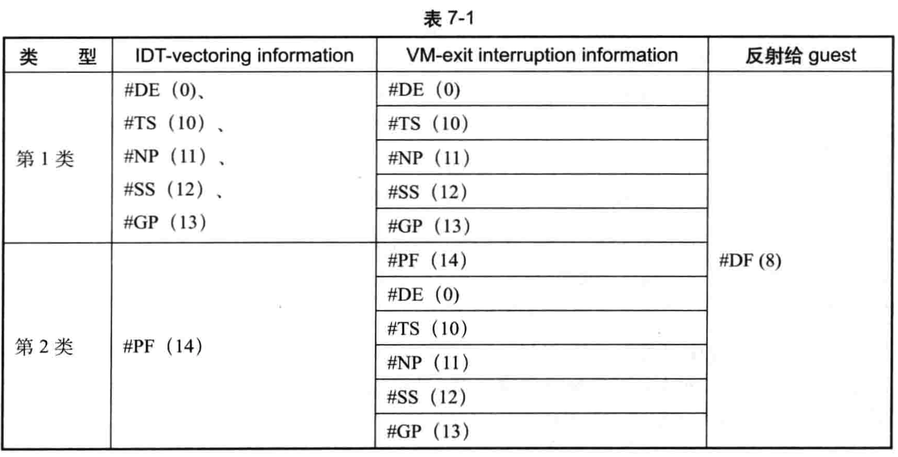

由于异常而引发`VM-exit`时，`VM- exit interruption information` 字段将记录这个异常的**delivery信息**(参见3.10.2.1节)，并且**有错误码**时，在`VM-exit interruption error code`字段里记录异常的错误码。

一般情况下， VMM可以直接将`VM-exit interruption information`字段的值复制给`VM-entry interruption information`字段，将`VM-exit interruption error code`字段的值复制给`VM-entry nterruption error code`字段(**存在错误码时**) .

# 处理NMI unblocking位

`VM-entry interruption information`字段的`bits 30:12`属于**保留位**，在注入事件时必须清为0值。

然而，`VM-exit interruption information` 字段的`bit 12`为"`NMI unbocking`" 位。当这个异常是在执行**IRET指令**时引发并导致`VM-exit`, `VM-exit interruption information`字段的`bit 12`被置位。此时，VMM需要将复制到`VM entry ineruption informatin` 字段的`bit 12`清0, 否则将会产生`VM-entry`失败。

因此，每次**反射异常给guest**时，VMM需要检查`VM-exit interruption information` 字段的`bit 12`, 做出相应的处理。

# 反射`#DF`异常

当 `IDT-vectring information` 字段的bit 31 (valid位) 为1时，表明这个字段所记录的向量事件并**不直接引发VM-exit**. 而是由于在**异常delivery 期间**遇到某些错误而导致`VM-exit`(参见3.10.3节). 

那么 `IDT-vectoring information` 字段记录**原始向量事件**的**delivery信息**, `IDT-vectoring error code`字段记录**原始异常的错误码**.

在如表 `7-1` 所示的情况下VMM需要反射一个`#DF`(Double Fault)异常给guest.

......

# 处理 triple fault

下面的三种情况会产生**triple fault**(异常属于前面所说的第1类或者第2类情况):

(1) 当 guest 遇到**异常**但并**不导致**`VM-exit`, 继而在这个**异常delivery期间**引发了**另一个异常**，这个异常也不导致VM-exit,从而这两个异常被转化为#DF异常。#DF异常也不导致VM-exit,继而在#DF异常的delivery期间再次引发了-一个异常，最终转化为triplefault而导致VM-exit。

(2) VMM注入一个硬件异常，在这个注人异常的delivery 期间引发了一 个异常，这个异常并不导致VM-exit, 从而转化为#DF异常。#DF异常也不导致VM-exit, 继而在#DF异常的delivery期间再次引发了-一个异常，最终转化为triple fault而导致VM-exit。

(3) VMM注人一个硬件异常#DF,在这个注人的#DF异常delivery 期间引发了一 一个异常，最终转化为triple fault而导致VM-exit。

由triple fault 直接引发VM-exit时，VMM不应该注人任何事件给guest执行。VMM可以选择终止guest的运行，或者将VM置为shutdown状态。当VM处于shutdown状态时，NMI、SMI及INIT事件能唤醒shutdown状态转为active状态(参见4.17.3节)

4. 直接反射异常

当异常由guest 自身条件所引发时，在下面的情况下VMM可以直接反射异常给guest处理。

(1)由异常直接导致VM-exit时， 也就是IDT-vectoring information字段bit31为0。

525 )