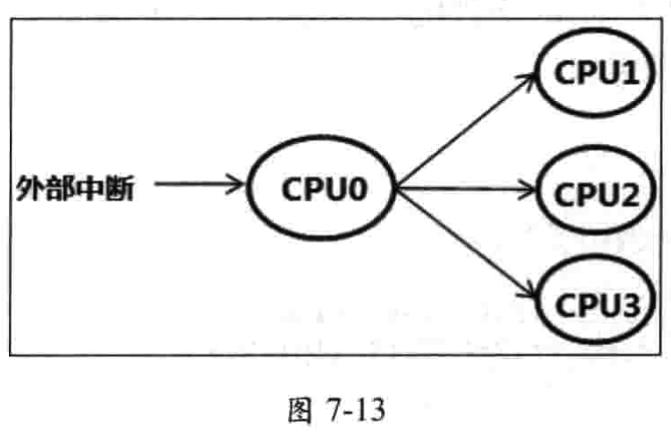

对于外部中断，处理器可以接收从**中断控制器**（**8259**、**I0APIC** 或者 **local APIC**）来的中断请求，也可以接收来自**处理器间**以 **Fixed delivery** 模式发送的 **IPI** 消息。

# 拦截外部中断

VMM 设置 **VM-execution 控制类字段**中 `pin-based VM-execution control` 字段的“`external-interrupt exiting`” 位为 1, 当处理器收到**未被屏蔽及阻塞的中断请求**时，将直接产生 `VM-exit`。

当虚拟机发生 VM-exit 后, 可以通过清除 `RFLAGS.IF` 来屏蔽中断. 

由**外部中断**产生的 `VM-exit` **不能**被 `eflags.IF` 标志位屏蔽，但可以被 local APIC 的 **TPR** 屏蔽.

在拦截外部中断产生 VM-exit 后，取决于 VM exit control 字段“acknowledge interrupt  on exit”位的设置，VMM 有不同的应对处理。

* “acknowledge interrupt on exit”为 1 时，在 VM-exit 时处理器响应中断控制器，从中断控制器里取出外部中断的信息，记录在 VM- exit interruption information 字段里（参见 3.10.2.1 节）。

* “acknowledge interrupt on exit”为 0 时，外部中断在中断控制器 IRR (Interrupt  equest register）里的请求位保持有效，中断被悬挂着，VM- exit interruption  information 字段属于无效。VMM 执行 STI 指令后重新打开中断时，处理器才响应中断控制器取得中断向量号。

当 VMM 想夺取对外部中断 delivery 的控制权时，需要设置 “acknowledge interrupt on exit” 为 0, 发生 `VM-exit` 后，VMM 在重新打开中断许可时（执行 STI 或 POPF 指令），处理器响应中断控制器并通过 host-IDT 进行外部中断的 delivery 操作。

VMM 需要反射外部中断给 guest 处理时，则需要设置 “acknowledge interrupt on Exit” 为 1。产生 `VM-exit` 后，VWMM 将 `VM-exit interruption information` 字段的值复制到  `Vm-entry interruption information` 字段后，执行 VMRESUME 指令回到 guest 运行，外部中断通过 guest-DT 进行 delivery 操作。

# 转发外部中断

在一个有**多个逻辑处理器**的平台里，**8259 中断控制器**的 **INTR 输出端**接在 **CPU0** 的 **LINT0 接口**里，**其余逻辑处理器**的 LINTO **空闲**着。但 I/O APIC 的中断消息可以发送到**某个处理器**，或者**某一组处理器**。

下面我们以 8259 中断控制器发送中断请求给 CPUO 为例，讲解 **VMM 转发外部中断的处理过程**。假设处理器拥有 4 个逻辑处理器，当用户**按下键盘**后 8259 的 IRQ 产生中断请求发给 CPUO, VMM 需要判断转发给哪个 CPU 执行。如图 7-13 所示。

如果当前是在 CPUI 的 guest 运行中用户按下了键盘，那么 VMM 应该将外部中断转发给 CPUI 处理。显然，只有在 guest 运行中产生了中断 VMMオ需要转发。当 CPUI 并没有 guest 正在运行，那么就不需要将外部中断转发给 CPUI。

另一个情况是，当 CPUO 的 guest 运行中产生了中断，CPUO 的 VMM 就直接拦截了。此时不需要转发给其他的 CPU 处理。