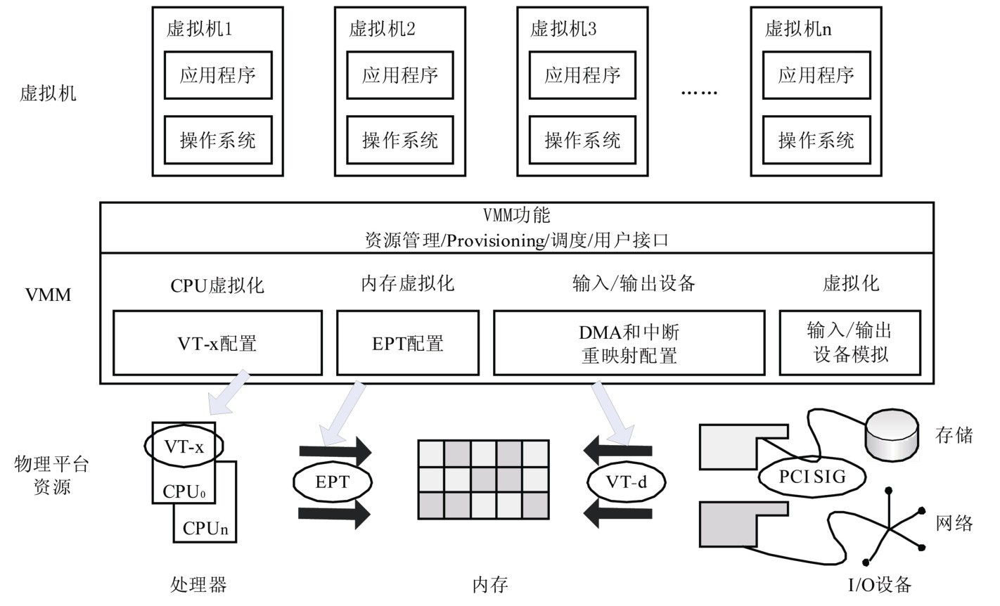

以Intel Virtualization Technology(Intel VT)为例说明硬件辅助虚拟化技术. 中间也会讲AMD SVM(主要内容来源于 <虚拟化技术原理与实现>)

Intel VT是Intel平台上**硬件虚拟化技术的总称**, 包含了对**CPU**、**内存**和**I/O设备**等各方面支持。图5\-1的Physical Platform Resource列举了Intel VT涵盖的内容. 

图5\-1展示了使用Intel VT技术实现的VMM的典型架构, 上层是通用功能, 如资源调度、系统调度等. 下层是平台相关的部分, 即使用Intel VT实现的处理器虚拟化、内存虚拟化和I/O虚拟化。

- 在**CPU虚拟化**方面, Intel VT提供了**VT\-x**(Intel Virtualization technology for x86)技术; 
- **内存虚拟化**, Intel VT提供了**EPT(Extended Page Table)技术**; 
- **I/O设备虚拟化**, Intel提供了**VT\-d**(Intel Virtualization Technology for Direct I/O)等技术.

AMD平台提供了类似的技术.

- 在**处理器虚拟化**方面，AMD SVM提供了与Intel VT-x类似的技术, 即AMD Virtualization(`AMD-V`)；
- 在**内存虚拟化**方面，AMD SVM提供了**NPT(Nested Page Table**)技术；
- 在I/O设备虚拟化方面，AMD SVM提供了**IOMMU**(I/O Memory Management Unit)技术。
