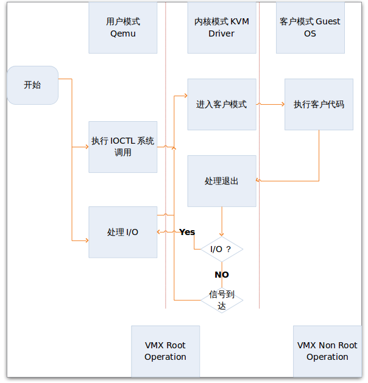

<!-- @import "[TOC]" {cmd="toc" depthFrom=1 depthTo=6 orderedList=false} -->

<!-- code_chunk_output -->

- [1. KVM架构](#1-kvm架构)
- [2. KVM工作原理](#2-kvm工作原理)
- [3. 参考](#3-参考)

<!-- /code_chunk_output -->

# 2. KVM工作原理

kvm基本工作原理概述：

**用户模式**的**qemu**利用**libkvm**通过**ioctl**进入**内核模式**，kvm模块为虚拟机**创建虚拟内存**、**虚拟CPU**后执行**VMLAUCH指令**进入客户模式。

加载Guest OS并执行。如果Guest OS 发生外部中断或者影子页表缺页之类的情况，会暂停Guest OS的执行，退出客户模式出行异常处理，之后重新进入客户模式，执行客户代码。如果发生I/O事件或者信号队列中有信号到达，就会进入用户模式处理。(如下图)

# 3. 参考

https://www.linuxidc.com/Linux/2015-01/112328.htm