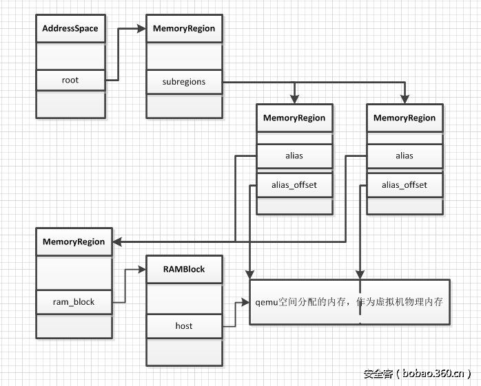

<!-- @import "[TOC]" {cmd="toc" depthFrom=1 depthTo=6 orderedList=false} -->

<!-- code_chunk_output -->

- [基本概述](#基本概述)
- [1. 相关配置参数](#1-相关配置参数)
- [2. 可热插拔的guest内存](#2-可热插拔的guest内存)
- [3. 真实内存资源Memory backends](#3-真实内存资源memory-backends)
- [4. 与内存相关的数据结构关系图](#4-与内存相关的数据结构关系图)
- [5. RAM blocks和ram_addr_t地址空间](#5-ram-blocks和ram_addr_t地址空间)
- [6. 跟踪脏页](#6-跟踪脏页)
- [7. AddressSpace和MemoryRegion](#7-addressspace和memoryregion)

<!-- /code_chunk_output -->

# 基本概述

在**虚拟机启动**时, 由qemu在**qemu的进程地址空间申请内存**, 即**内存的申请**是在**用户空间**完成的, 申请的是**主机虚拟地址空间**, 而这个空间就作为**虚拟机物理内存**.

通过**kvm提供的API**, 把**地址信息注册到KVM**中, 这样KVM中维护有**虚拟机相关的slot**, **所有这些slot**构成一个**完整的虚拟机物理地址空间**. slot中记录其对应的HVA、页面数、起始GPA等, 利用它可以将一个GPA转化为HVA.

整个内存虚拟化可以分为两部分: qemu部分和kvm部分.

- **QEMU**完成**内存的申请**
- **KVM**实现**内存的管理**

# 1. 相关配置参数

QEMU的命令行中有参数：

```
-m [size=]megs[,slots=n,maxmem=size] 
```

用于指定客户机**初始运行时的内存大小**以及客户机**最大内存大小**，以及**内存芯片槽的数量（DIMM**）。

之所以QEMU可以指定**最大内存**、**槽**等参数，是因为QEMU可以**模拟DIMM的热插拔**，客户机操作系统可以和在真实的系统上一样，检测新内存被插入或者拔出。也就是说，**内存热插拔的粒度**是**DIMM槽（或者说DIMM集合**），而不是最小的byte。

# 2. 可热插拔的guest内存

Qemu代码中的“**pc\-dimm**”设备（参考Qemu源码**hw/mem/pc\-dimm.c**文件中**Typeinfo pc\_dimm\_info**的定义）用来**模拟DIMM内存条**。

```cpp
// hw/mem/pc-dimm.c
static TypeInfo pc_dimm_info = {
    .name          = TYPE_PC_DIMM,
    .parent        = TYPE_DEVICE,
    .instance_size = sizeof(PCDIMMDevice),
    .instance_init = pc_dimm_init,
    .class_init    = pc_dimm_class_init,
    .class_size    = sizeof(PCDIMMDeviceClass),
    .interfaces = (InterfaceInfo[]) {
        { TYPE_MEMORY_DEVICE },
        { }
    },
};
```

代码中“**pc\-dimm”设备**的**创建**相当于**逻辑上热插拔了一块内存**（参考代码**type\_register\_static**(\&pc\_dimm\_info)）。尽管该设备名字包含的“pc”容易让人误解，但ppc和s390机器仍沿用了该名字。

旁注：上文提到的**guest的初始化内存**是**不能**用“**pc\-dimm**”设备创建的，也无法将其热移除。

在**QOM（Qemu Object Model**）模型中，“**pc\-dimm”对象**（参考代码include/hw/mem/pc\-dimm.h文件中的**PCDIMMDevice结构体**）中并**没有定义**表示其**对应物理内存的变量**，但定义了一个指针用来指向其**对应的“memory\-backend”对象**。

通过**在QEMU进程中**创建一个**新的PCDIMMDevice对象**，就可以实现**内存的热插拔**。

```c
// include/hw/mem/pc-dimm.h
typedef struct PCDIMMDevice {
    /* private */
    DeviceState parent_obj;

    /* public */
    uint64_t addr;
    uint32_t node; //numa node
    int32_t slot; //slot编号
    // memory-backend对象
    HostMemoryBackend *hostmem;
} PCDIMMDevice;

typedef struct PCDIMMDeviceClass {
    /* private */
    DeviceClass parent_class;

    /* public */
    void (*realize)(PCDIMMDevice *dimm, Error **errp);
    MemoryRegion *(*get_vmstate_memory_region)(PCDIMMDevice *dimm,
                                               Error **errp);
} PCDIMMDeviceClass;
```

# 3. 真实内存资源Memory backends

**每个PCDIMMDevice对象**都与**HostMemoryBackend对象相关联**。

设备“memory\-backend”（参考Qemu源码**backends/hostmem.c**文件中TypeInfo host\_memory\_backend\_info的定义）描述的是支撑guest物理内存的**host**上**真实的内存资源**。

```cpp
static const TypeInfo host_memory_backend_info = {
    .name = TYPE_MEMORY_BACKEND,
    .parent = TYPE_OBJECT,
    .abstract = true,
    .class_size = sizeof(HostMemoryBackendClass),
    .class_init = host_memory_backend_class_init,
    .instance_size = sizeof(HostMemoryBackend),
    .instance_init = host_memory_backend_init,
    .instance_post_init = host_memory_backend_post_init,
    .interfaces = (InterfaceInfo[]) {
        { TYPE_USER_CREATABLE },
        { }
    }
};
```

HostMemoryBackend对象包含了**客户机内存对应的真正的主机内存**，这些内存

- 既可以是**匿名映射的内存**（参考backends/hostmem\-ram.c中TypeInfo **ram\_backend\_info**的定义），
- 也可以是**文件映射**的内存（参考backends/hostmem\-file.c中TypeInfo **file\_backend\_info**的定义）。

```cpp
static const TypeInfo ram_backend_info = {
    .name = TYPE_MEMORY_BACKEND_RAM,
    .parent = TYPE_MEMORY_BACKEND,
    .class_init = ram_backend_class_init,
};

static const TypeInfo file_backend_info = {
    .name = TYPE_MEMORY_BACKEND_FILE,
    .parent = TYPE_MEMORY_BACKEND,
    .class_init = file_backend_class_init,
    .instance_finalize = file_backend_instance_finalize,
    .instance_size = sizeof(HostMemoryBackendFile),
};
```

**文件映射**这种方式允许**Linux**在**host宿主机**上使用**大页分配的内存**能够**映射到guest物理内存**，同时实现了**共享内存**，允许**host！！！** 的**其他应用程序**访问**guest物理内存！！！**。

“**pc\-dimm”对象**和“**memory\-backend”对象**（参考include/sysemu/hostmem.h文件中的**HostMemoryBackend结构体**）作为**Qemu中用户可见**的**guest物理内存！！！**，可以通过**Qemu命令行**或者**QMP（Qemu Monitor Protocol**）对其进行管理。

```c
// include/sysemu/hostmem.h
struct HostMemoryBackendClass {
    ObjectClass parent_class;

    void (*alloc)(HostMemoryBackend *backend, Error **errp);
};

struct HostMemoryBackend {
    /* private */
    Object parent;

    /* protected */
    uint64_t size;
    bool merge, dump, use_canonical_path;
    bool prealloc, force_prealloc, is_mapped, share;
    DECLARE_BITMAP(host_nodes, MAX_NODES + 1);
    HostMemPolicy policy;

    MemoryRegion mr;
};
```

然而这只是冰山一角，下面继续介绍**用户不可见的guest物理内存的管理**。

# 4. 与内存相关的数据结构关系图


# 5. RAM blocks和ram_addr_t地址空间

**HostMemoryBackend对象中的内存(guest物理内存**)被**实际映射**到通过**qemu\_ram\_alloc**()函数（代码定义在**exec.c**中）分配的**RAMBlock数据结构**中。

“**memory\-backend**(HostMemoryBackend对象中的内存)”表示的**host**上**真实内存资源**, 由**RAMBlock**调用**exec.c**文件中的**qemu\_ram\_alloc**()函数，最终通过**mmap**映射到**host**上的**一块虚拟内存**。

RAMBlock定义在include/exec/ram\_addr.h中。RAMBlock受**RCU机制保护**，所谓RCU，即Read\-COPY\-Update，

```c
// include/exec/ram_addr.h
typedef uint64_t ram_addr_t;

struct RAMBlock {
    struct rcu_head rcu; //该数据结构受rcu机制保护
    struct MemoryRegion *mr;
    uint8_t *host;  //RAMBlock在host上的虚拟内存起始位置
    uint8_t *colo_cache; /* For colo, VM's ram cache */
    ram_addr_t offset;  //在所有的RAMBlock中offset
    ram_addr_t used_length; //已使用长度
    ram_addr_t max_length;  //最大分配内存
    void (*resized)(const char*, uint64_t length, void *host);
    uint32_t flags;
    /* Protected by iothread lock.  */
    char idstr[256];    //RAMBlock的ID
    /* RCU-enabled, writes protected by the ramlist lock */
    QLIST_ENTRY(RAMBlock) next;
    QLIST_HEAD(, RAMBlockNotifier) ramblock_notifiers;
    int fd; //映射文件的描述符
    size_t page_size;
    /* dirty bitmap used during migration */
    unsigned long *bmap;
    unsigned long *unsentmap;
    /* bitmap of already received pages in postcopy */
    unsigned long *receivedmap;
};
```

而**offset**表示了**这块内存**在**虚拟机物理内存中的偏移**。每一个ram\_block还会被连接到全局的'ram_list'链表上。

**RAMBlock结构体**中的

- **uint8\_t \*host**指向**动态分配的内存**，用于表示**实际的虚拟机物理内存**，指向**host**上**虚拟内存的起始值**，
- ram\_addr\_t **offset**表示**当前RAMBlock**相对于**RAMList**（描述**host虚拟内存的全局链表**）的**偏移量**。

也就是说**ram\_addr\_t offset**位于一个**全局命名空间**中，可以通过此offset偏移量**定位某个RAMBlock**。

然而**ram\_addr\_t命名空间**并**不等同**于**guest物理内存空间！！！**，它仅表示**所有RAMBlock集合**构成的**一个地址空间**。

举个例子，**guest物理地址**0x100001000可能并**不对应**于**ram\_addr\_t命名空间**中的0x100001000地址，因为**ram\_addr\_t命名空间**不包含**guest物理内存**区域中用于**预留和I/O内存映射的这些部分**。

此外ram\_addr\_t **offset**的值取决于**RAMBlock被创建的顺序**，而在guest物理内存空间中每块内存都有其固定的地址。

所有的**RAMBlock**保存在**全局的RAMBlock的链表**中，名为**RAMList**，它有专门的**数据结构定义**。

**RAMList数据结构**定义在include/exec/ramlist.h中，而全局的ram\_list变量则定义在exec.c中。因此**这个链表**保存了**客户机的内存**对应的**所有的物理机！！！的实际内存信息！！！**。

```cpp
// include/exec/ramlist.h
#define DIRTY_MEMORY_VGA       0
#define DIRTY_MEMORY_CODE      1
#define DIRTY_MEMORY_MIGRATION 2
#define DIRTY_MEMORY_NUM       3        /* num of dirty bits */

typedef struct RAMList {
    QemuMutex mutex;
    //最近最常使用的RAMBlock，将其保存，从而能够迅速访问
    RAMBlock *mru_block;
    /* RCU-enabled, writes protected by the ramlist lock. */
    //ram_list的链表
    QLIST_HEAD(, RAMBlock) blocks;
    //用于保存脏页信息的bitmap，有三种bitmap，一种用于VGA，一种用于TCG编程中，一种用于热迁移中。
    DirtyMemoryBlocks *dirty_memory[DIRTY_MEMORY_NUM];
    //全局的ram_list，每更改一次，version+1
    uint32_t version;
    QLIST_HEAD(, RAMBlockNotifier) ramblock_notifiers;
} RAMList;
extern RAMList ram_list;

// exec.c
RAMList ram_list = { .blocks = QLIST_HEAD_INITIALIZER(ram_list.blocks) };
```

结构体ram\_list中记录了所有RAMBlock以及“脏”内存bitmap的信息。

# 6. 跟踪脏页

当**客户机CPU**或者**DMA**将**数据**保存到**客户机内存**时，需要通知下列一些用户： 

1. **热迁移**特性依赖于**跟踪脏页**，在迁移过程中一旦发现这些内存页发生变化就会重新向目的主机发送这些“脏”页面。因此他们能够在**被改变之后重新传输**。 
2. Qemu中的动态翻译器TCG（Tiny Code Generator）会一直追踪自调整的代码，当上游指令发生变化时对其重新编译。
3. **图形卡模拟**依赖于**跟踪脏的视频内存**，用于**重画某些界面**。

以上**每种特性**在结构体ram\_list的成员变量DirtyMemoryBlocks \*dirty_memory\[DIRTY\_MEMORY\_NUM]中都有其对应的bitmap，为以上特性**独立**的**开启或关闭“脏”页面跟踪机制**。

# 7. AddressSpace和MemoryRegion

**所有的CPU架构**都有**内存地址空间**, 有些CPU架构又有一个**IO地址空间**。它们在QEMU中被表示为**AddressSpace数据结构**，它定义在include/exec/memory.h中。

**一个AddressSpace**对应**一棵MemoryRegion树**（其对应关系在include/exec/memory.h文件的AddressSpace结构体中定义：mr = as\-\>root）。

**结构体MemoryRegion**是联系**guest物理地址空间**和描述**真实内存的RAMBlocks(宿主机虚拟地址**)之间的桥梁。**每个MemoryRegion结构体**中定义了RAMBlock \***ram\_block**成员指向**其对应的RAMBlock**，而在**RAMBlock**结构体中则定义了struct MemoryRegion \*mr指向**对应的MemoryRegion**。

**MemoryRegion**不仅可以表示**RAM**，也可以表示**I/O映射内存**，在**访问I/O**时可以调用**read/write回调函数**。这也是**硬件**从**客户机CPU注册的访问**被分派到**相应的模拟设备**的方法。如**guest CPU**在访问**硬件设备寄存器**时通过查找其**对应MemoryRegion**结构体中的信息去**访问指定的模拟设备**。

函数address\_space\_rw()访问MemoryRegion并对该MR描述的内存执行load/store操作。RAM类型的MemoryRegion描述的内存可通过访问RAMBlock中的guest物理内存来获取。Guest物理内存空间定义了一个全局变量AddressSpace address\_space\_memory，用来表示跟RAM相关的内存。

qemu中用AddressSpace用来表示CPU/设备看到的内存，一个AddressSpace下面包含多个MemoryRegion，这些MemoryRegion结构通过树连接起来，树的根是AddressSpace的**root域**。

```c
// include/exec/memory.h
struct AddressSpace {
    /* All fields are private. */
    struct rcu_head rcu;
    char *name;
    // MR树(多个MR)
    MemoryRegion *root;

    /* Accessed via RCU.  */
    //AddressSpace的一张平面视图，它是AddressSpace所有正在使用的MemoryRegion的集合，这是从CPU的视角来看到的。
    struct FlatView *current_map;

    int ioeventfd_nb;
    struct MemoryRegionIoeventfd *ioeventfds;
    QTAILQ_HEAD(, MemoryListener) listeners;
    QTAILQ_ENTRY(AddressSpace) address_spaces_link;
};

struct MemoryRegion {
    Object parent_obj;

    /* All fields are private - violators will be prosecuted */

    /* The following fields should fit in a cache line */
    bool romd_mode;
    bool ram;
    bool subpage;
    bool readonly; /* For RAM regions */
    bool nonvolatile;
    bool rom_device;
    bool flush_coalesced_mmio;
    bool global_locking;
    //表示哪种dirty map被使用，共有三种
    uint8_t dirty_log_mask;
    bool is_iommu;
    // 分配的实际内存
    RAMBlock *ram_block;
    Object *owner;
    // 与MemoryRegion相关的操作
    const MemoryRegionOps *ops;
    void *opaque;
    MemoryRegion *container;
    Int128 size;
    //在AddressSpace中的地址
    hwaddr addr;
    void (*destructor)(MemoryRegion *mr);
    uint64_t align;
    bool terminates;
    //是否是ram内存, 区别于rom只读
    bool ram_device;
    //如果为true，表示已经通知kvm使用这段内存
    bool enabled;
    bool warning_printed; /* For reservations */
    uint8_t vga_logging_count;
    MemoryRegion *alias;
    hwaddr alias_offset;
    int32_t priority;
    QTAILQ_HEAD(, MemoryRegion) subregions;
    QTAILQ_ENTRY(MemoryRegion) subregions_link;
    QTAILQ_HEAD(, CoalescedMemoryRange) coalesced;
    //MemoryRegion的名字,调试时使用
    const char *name;
    //IOevent文件描述符的管理
    unsigned ioeventfd_nb;
    MemoryRegionIoeventfd *ioeventfds;
};
```

MemoryRegion有**多种类型**，可以表示一段**ram**、**rom**、**MMIO**、**alias**，alias表示**一个MemoryRegion**的**一部分区域**，**MemoryRegion**也可以表示**一个container**，这就表示它**只是其他若干个MemoryRegion的容器**。

在MemoryRegion中，'ram\_block'表示的是**分配的实际内存**。

Address, MemoryRegion, RAMBlock关系如下图所示。




总结

Guest物理内存的管理是由几个不同层面共同作用的：

- “pc\-dimm”和“memory-backend”描述了用户可见的**guest物理内存！！！**（分别代表**DIMM内存条**与**host真实的内存资源**）；

- RAMBlock描述了通过**mmap映射**的**host虚拟内存块**；

- AddressSpace和MemoryRegion则记录了**guest物理内存**与**host虚拟内存**之间的映射。


参考

https://blog.csdn.net/u011364612/article/details/51345110

https://www.anquanke.com/post/id/86412