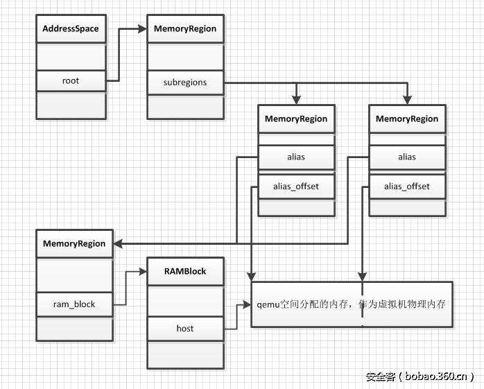
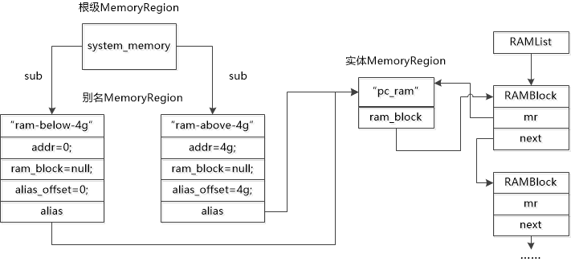
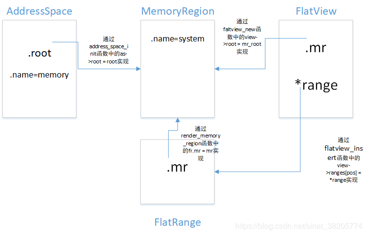
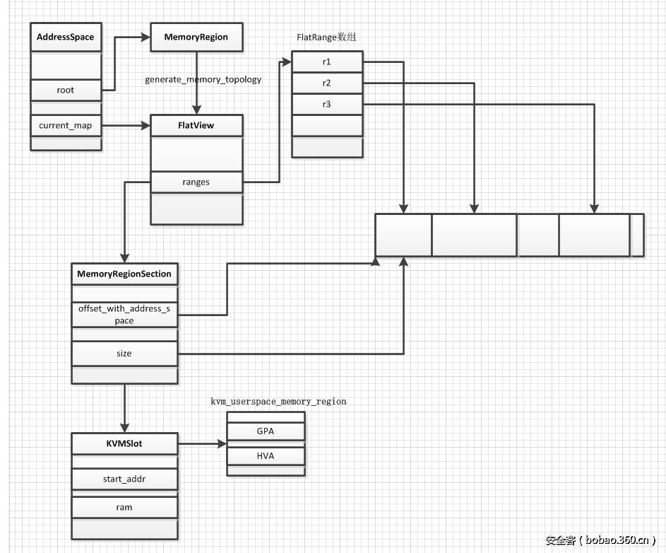
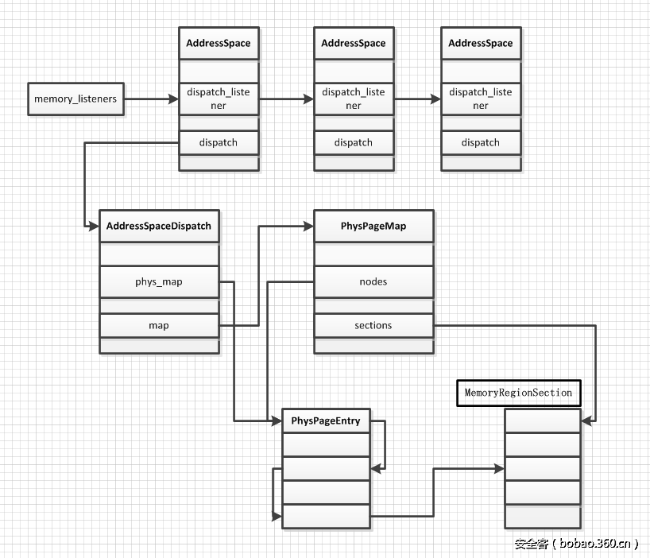

<!-- @import "[TOC]" {cmd="toc" depthFrom=1 depthTo=6 orderedList=false} -->

<!-- code_chunk_output -->

- [1. 简介](#1-简介)
- [2. 结构体代码](#2-结构体代码)
  - [2.1. AddressSpace: 虚拟机物理地址空间GPA](#21-addressspace-虚拟机物理地址空间gpa)
    - [2.1.1. 全局链表](#211-全局链表)
    - [2.1.2. AddressSpace与MemoryRegion](#212-addressspace与memoryregion)
  - [2.2. MemoryRegion: 虚拟机物理地址GPA到主机虚拟内存HVA(RAMBlock)的桥梁](#22-memoryregion-虚拟机物理地址gpa到主机虚拟内存hvaramblock的桥梁)
    - [2.2.1. 树结构? 其实只有一个root](#221-树结构-其实只有一个root)
    - [2.2.2. 子区域与子区域链表](#222-子区域与子区域链表)
    - [2.2.3. MemoryRegion与RAMBlock](#223-memoryregion与ramblock)
  - [2.3. RAMBlock: 虚拟机物理内存GPA与主机一段虚拟内存HVA](#23-ramblock-虚拟机物理内存gpa与主机一段虚拟内存hva)
    - [2.3.1. RAMList全局链表](#231-ramlist全局链表)
  - [2.4. Address, MemoryRegion, RAMBlock关系](#24-address-memoryregion-ramblock关系)
  - [2.5. FlatView: 虚拟机物理地址空间](#25-flatview-虚拟机物理地址空间)
    - [2.5.1. AddressSpace 与 FlatView](#251-addressspace-与-flatview)
    - [2.5.2. FlatView相关结构体](#252-flatview相关结构体)
    - [2.5.3. FlatView 与 MemoryRegion](#253-flatview-与-memoryregion)
  - [2.6. MemoryRegionSection: 虚拟机物理地址空间GPA](#26-memoryregionsection-虚拟机物理地址空间gpa)
  - [2.7. KVMSlot: KVM内存条模型](#27-kvmslot-kvm内存条模型)
  - [2.8. kvm_userspace_memory_region: GPA->HVA](#28-kvm_userspace_memory_region-gpa-hva)
  - [2.9. AddressSpace、MemoryRegion、FlatView、MemoryRegionSection与KVMslot的关系](#29-addressspace-memoryregion-flatview-memoryregionsection与kvmslot的关系)
  - [2.10. MemoryListener](#210-memorylistener)
    - [2.10.1. 全局链表和AddressSpace自己的MemoryListener](#2101-全局链表和addressspace自己的memorylistener)
  - [2.11. AddressSpaceDispatch](#211-addressspacedispatch)
  - [2.12. memory_listeners、AddressSpace、AddressSpaceDispatch等之间的联系](#212-memory_listeners-addressspace-addressspacedispatch等之间的联系)
- [3. 参考](#3-参考)

<!-- /code_chunk_output -->

# 1. 简介

1. Multiple types of MemoryRegion (MemoryRegion直接操作内存，每一棵MR树的树根对应一个RAMBlock，其host即为通过mmap()分配的HVA)

- RAM: a range of host memory that can be made available to the guest. e.g. “pc.ram”, “pc.bios”, “pc.rom”, ram/rom for devices like “vga.ram”, “vga.rom”, etc.
- IOMMU region: translate addresses esp. for each PCI device for DMA usage
- container: includes other memory regions, each at a different offset. Use memory_region_init() to initialize.
- alias: a subsection of another region. Initialize with memory_region_init_alias().

2. AddressSpace (代表某种用途的内存，比如"memory", "I/O", "cpu-memory"等，将其他几个内存相关的结构体联系到一起)
- Links all important structures together: MemoryRegion, MemoryRegionListener, FlatView, AddressSpaceDispatch, MemoryRegionIoevented, and so on.
- Initialize with address_space_init().

3. FlatView (将树状的MemoryRegion展成平坦型的FlatView，用于内存映射)

- Spread the MR-tree to Flat FlatView, which is filled with several FlatRange.

4. MemoryListener (用于监听内存以及内存更新)
- Callbacks structure for updates to the physical memory map
- Allows a component to adjust to changes in the guest-visible memory map. Use with memory_listener_register() and memory_listener_unregister().

# 2. 结构体代码

## 2.1. AddressSpace: 虚拟机物理地址空间GPA

```cpp
// include/exec/memory.h
struct AddressSpace {
    /* All fields are private. */
    struct rcu_head rcu;
    char *name;
    // MR树(多个MR), 指向根MR
    MemoryRegion *root;

    /* Accessed via RCU.  */
    //AddressSpace的一张平面视图，它是AddressSpace所有正在使用的MemoryRegion的集合，这是从CPU的视角来看到的。
    // 指向当前维护的 FlatView，在 address_space_update_topology 时作为 old 比较
    struct FlatView *current_map;

    int ioeventfd_nb;
    struct MemoryRegionIoeventfd *ioeventfds;
    // 该 AddressSpace 的 listeners 链表头
    QTAILQ_HEAD(, MemoryListener) listeners;
    // AddressSpace 链表节点
    QTAILQ_ENTRY(AddressSpace) address_spaces_link;
};
```

**所有的CPU架构**都有**内存地址空间**, 有些CPU架构又有一个**IO地址空间**。它们在QEMU中被表示为**AddressSpace数据结构**.

qemu中用**AddressSpace**用来表示**CPU/设备**看到的**内存**.

每个AddressSpace代表了**一种用途的内存**, 比如"memory"、"I/O"

qemu有几个全局的AddressSpace, 比如address_space_memory和address_space_io，一个是管理系统地址空间，一个是IO地址空间

```cpp
// 生成全局 system_memory 的 MemoryRegion
memory_region_init(system_memory, NULL, "system", UINT64_MAX);
// 初始化 address_space_memory 全局 AddressSpace, 将 system_memory 作为 root(根MR)
address_space_init(&address_space_memory, system_memory, "memory");

// 生成全局 system_io 的 MemoryRegion
memory_region_init_io(system_io, NULL, &unassigned_io_ops, NULL, "io", 65536);
// 初始化 address_space_io 全局 AddressSpace, 将 system_io 作为 root(根MR)
address_space_init(&address_space_io, system_io, "I/O");   
```

root指向根MR, 对于`address_space_memory`来说, root指向系统全局的MR system_memory.

### 2.1.1. 全局链表

**所有的AddressSpace**是通过一个**全局链表**`address_spaces`链接起来, 每个 AddressSpace 的`address_spaces_link`作为链表节点.

```cpp
static QTAILQ_HEAD(, AddressSpace) address_spaces
    = QTAILQ_HEAD_INITIALIZER(address_spaces);
```

所以在上面提到的`address_space_init`函数中有`QTAILQ_INSERT_TAIL(&address_spaces, as, address_spaces_link);`操作.

### 2.1.2. AddressSpace与MemoryRegion

一个 AddressSpace 对应多个 MemoryRegion .

所有AddressSpace下面**root**及其**子树**形成了**一个虚拟机**的**物理地址！！！**, 也就是说一个 AddressSpace 对应多个MemoryRegion

MR管理host的内存，那么address_space管理的更偏向于虚拟机。AddressSpace是将MR映射到虚拟机的物理地址空间.

见下面图

## 2.2. MemoryRegion: 虚拟机物理地址GPA到主机虚拟内存HVA(RAMBlock)的桥梁

```cpp
// include/exec/memory.h
struct MemoryRegion {
    Object parent_obj;

    /* All fields are private - violators will be prosecuted */

    /* The following fields should fit in a cache line */
    bool romd_mode;
    // 是否是ram
    bool ram;
    bool subpage;
    bool readonly; /* For RAM regions */
    bool nonvolatile;
    bool rom_device;
    bool flush_coalesced_mmio;
    bool global_locking;
    //表示哪种dirty map被使用，共有三种
    uint8_t dirty_log_mask;
    bool is_iommu;
    // 指向对应的RAMBlock, 分配的实际内存HVA
    RAMBlock *ram_block;
    // 拥有者
    Object *owner;
    // 与MemoryRegion相关的操作的回调函数
    const MemoryRegionOps *ops;
    void *opaque;
    // 指向挂载的上一级mr
    MemoryRegion *container;
    // mr的大小  
    Int128 size;
    // 相对父mr的偏移，起始GPA=父MR base+addr 可以去源码中搜索一下如何初始化的就明白了
    hwaddr addr;
    void (*destructor)(MemoryRegion *mr);
    uint64_t align;
    // teminates为false表明纯容器
    bool terminates;
    //是否是ram内存, 区别于rom只读
    bool ram_device;
    //如果为true，表示已经通知kvm使用这段内存
    bool enabled;
    bool warning_printed; /* For reservations */
    uint8_t vga_logging_count;
    // 如果本mr是alias, 指向真实的MR, 即从哪个MR中划分的
    MemoryRegion *alias;
    // 在真实MR中的偏移
    hwaddr alias_offset;
    // 优先级，属于同一个mr的subregions中高优先级的mr会被优先渲染 
    int32_t priority;
    // 子区域链表头
    QTAILQ_HEAD(, MemoryRegion) subregions;
    // 子区域链表节点
    QTAILQ_ENTRY(MemoryRegion) subregions_link;
    QTAILQ_HEAD(, CoalescedMemoryRange) coalesced;
    //MemoryRegion的名字
    const char *name;
    //IOevent文件描述符的管理
    unsigned ioeventfd_nb;
    MemoryRegionIoeventfd *ioeventfds;
};
```

首先MemoryRegion有两种,一种为纯容器(逻辑上的概念),一种为物理内存(物理内存又有几种 mmio内存. ram, rom, ioport)

每个MemoryRegion有**多种类型**，可以表示一段**ram**、**rom**、**MMIO**、**alias**.

**结构体MemoryRegion**是联系**guest物理地址空间**和描述**真实内存的RAMBlocks(宿主机虚拟地址**)之间的桥梁。

其中parent指向父MR, 默认是NULL;

size表示区域的大小; 

ram_block比较重要, 是分配的实际内存. 

alias表明该区域是某一个区域的一部分区域, 实际上虚拟机的ram申请时一次性申请一个完整的ram, 记录在一个MR中, 之后又会对此ram按照size划分, 形成subregion, 而subregion的alias便指向原始的MR, 而alias_offset便是在原始ram中的偏移. 对于系统地址空间的ram, 会把刚才得到的subregion注册到系统中, 父MR是刚才提到的全局MR system_memory. 实际关联host内存的是subregion->alias指向的MR, 其ram_block实际保存gpa到hva的映射关系.

### 2.2.1. 树结构? 其实只有一个root

QEMU通过MemoryRegion来管理虚拟机内存，通过内存属性，GUEST物理地址等特点对内存分类，就形成了多个MemoryRegion，这些MemoryRegion 通过树状组织起来，挂接到根MemoryRegion下。每个MemoryRegion树代表了一类作用的内存，如系统内存空间(system_memory)或IO内存空间(system_io),这两个是qemu中的两个全局MemoryRegion。

**一个AddressSpace**下面包含**多个MemoryRegion**，这些MemoryRegion结构通过**树**连接起来，**树的根**是**AddressSpace**的**root域**。

**每个MemoryRegion树！！！** 代表了**一类作用的内存**，如**系统内存空间**(`system_memory`)或**IO内存空间**(`system_io`), 这两个是qemu中的**两个全局MemoryRegion**。

这个树就是由MemoryRegion构成, MemoryRegion负责管理host的内存，理论上是树状结构，但是实际上根据代码来看仅仅有两层，也就是说AddressSpace下面是MR root, root往下再没有其他MR节点了, 而再往下就是子MR链表, 头是subregions, 子MR通过`subregions_link`链接. 所以这个树其实往下是通过subregion维护的.

### 2.2.2. 子区域与子区域链表

alias表示**一个MemoryRegion**的**一部分区域**，**MemoryRegion**也可以表示**一个container**，这就表示它**只是其他若干个MemoryRegion的容器**。

实际上**虚拟机的ram申请**时时一次性申请的一个**完整的ram**，记录在**一个MR**中，之后又对此ram**按照size进行了划分**，形成**子MR**, 而子MR的**alias**便指向**原始的MR**，而 `alias_offset` 便是在**原始MR**中的**偏移**。

对于系统地址空间的ram，会把刚才得到的subregion注册到系统中，父MR是**全局MR** `system_memory`, `subregions_link`是**链表节点**, 该链表头节点在父MR的`subregions`域.

前面提到，**实际关联host内存**的是`子MR->alias`指向的**MR**，`子MR->alias_offset`指向该子MR在父MR中的地址长度的偏移.

注: 子MR不关联host内存, 即不关联HVA, 实际**关联内存**的是`子MR->alias`指向的MR

下面有张图

### 2.2.3. MemoryRegion与RAMBlock

MR与RAMBLOCK是一对一的.

**结构体MemoryRegion**是联系**guest物理地址空间**和描述**真实内存的RAMBlocks(宿主机虚拟地址**)之间的桥梁。

**每个MemoryRegion结构体**中定义了`RAMBlock *ram_block`成员指向**其对应的RAMBlock**，而在**RAMBlock**结构体中则定义了`struct MemoryRegion *mr`指向**对应的MemoryRegion**。

MemoryRegion直接操作内存，**每一棵MR树的树根**对应一个**RAMBlock**，其host即为通过mmap()分配的HVA

其`RAMBlock->offset`是该MR在**虚拟机的物理内存中的偏移**, RAMBlock最直接的接触host的内存，看下其结构

## 2.3. RAMBlock: 虚拟机物理内存GPA与主机一段虚拟内存HVA

```cpp
// include/exec/ram_addr.h
typedef uint64_t ram_addr_t;

struct RAMBlock {
    struct rcu_head rcu; //该数据结构受rcu机制保护
    struct MemoryRegion *mr;
    uint8_t *host;  // RAMBlock在host上的虚拟内存起始位置, 即HVA
    uint8_t *colo_cache; /* For colo, VM's ram cache */
    ram_addr_t offset;  // 在虚拟机物理内存中的偏移, GPA
    ram_addr_t used_length; //已使用长度
    ram_addr_t max_length;  //最大分配内存
    void (*resized)(const char*, uint64_t length, void *host);
    uint32_t flags;
    /* Protected by iothread lock.  */
    /* 这里会被填充成mr的name */
    char idstr[256];    //RAMBlock的ID
    /* RCU-enabled, writes protected by the ramlist lock */
    // 全局链表
    QLIST_ENTRY(RAMBlock) next;
    QLIST_HEAD(, RAMBlockNotifier) ramblock_notifiers;
    int fd; //映射文件的描述符
    size_t page_size;
    /* dirty bitmap used during migration */
    unsigned long *bmap;
    unsigned long *unsentmap;
    /* bitmap of already received pages in postcopy */
    unsigned long *receivedmap;
};
```

理论上**一个RAMBlock**就代表**host的一段虚拟内存**，host指向**申请的ram的虚拟地址**, 是HVA。

**RAMBlock结构体**中的

- uint8\_t \***host**指向**动态分配的内存**，用于表示**实际的虚拟机物理内存**，指向**host**上**虚拟内存的起始值**，
- ram\_addr\_t **offset**表示**当前RAMBlock**相对于**RAMList**（描述**host虚拟内存的全局链表**）的**偏移量**。

也就是说`ram_addr_t offset`位于一个**全局命名空间**中，可以通过此offset偏移量**定位某个RAMBlock**。

然而**ram\_addr\_t命名空间**并**不等同**于**guest物理内存空间！！！**，它仅表示**所有RAMBlock集合**构成的**一个地址空间**。

qemu内存分布模型


qemu模拟了**普通内存分布模型**，内存的线性也是**分块被使用**的，**每个块**称为`RAMBlock`，由`ram_list`统领，**RAMBlock.offset**则是**区块的线性地址**，即**相对于开始的偏移位**，`RAMBlock.length(size)`则是区块的大小.

### 2.3.1. RAMList全局链表

这个全局链表描述了整个虚拟机使用的真正的**所有主机虚拟内存**.

```cpp
typedef struct RAMList {
    QemuMutex mutex;
    // 最近使用的block
    RAMBlock *mru_block;
    /* RCU-enabled, writes protected by the ramlist lock. */
    QLIST_HEAD(, RAMBlock) blocks;
    DirtyMemoryBlocks *dirty_memory[DIRTY_MEMORY_NUM];
    uint32_t version;
    QLIST_HEAD(, RAMBlockNotifier) ramblock_notifiers;
} RAMList;
extern RAMList ram_list;

RAMList ram_list = { .blocks = QLIST_HEAD_INITIALIZER(ram_list.blocks) };
```

所有的RAMBlock通过**next字段**连接起来，表头保存在一个**全局的RAMList结构**中，但是根据代码来看，**原始MR分配**内存时分配的是**一整块block**，之所以这样做也许是为了扩展用吧！！

**RAMList**中有个字段**mru_block指针**，指向**最近使用的block**，这样需要**遍历所有的block**时，先判断指定的block是否是`mru_block`，如果不是再进行遍历从而提高效率。

每一个ram\_block还会被连接到全局的`'ram_list'`链表上。

## 2.4. Address, MemoryRegion, RAMBlock关系

qemu层的内存管理分为三个层次, 

- MR位于顶级抽象层或者说偏向于host端, qemu中两个全局的MR, 分别是system_memory和system_io, 不过两个均是以指针的形式存在, 在地址空间的时候才会对其分配具体的内存并初始化. MR负责管理host的内存, 是树状结构.

- AddressSpace更偏向于虚拟机, 管理地址空间, qemu中有几个全局的AS, address_space_memory和address_space_io, 一个管理系统地址空间, 一个是IO地址空间

- 






## 2.5. FlatView: 虚拟机物理地址空间

### 2.5.1. AddressSpace 与 FlatView

AddressSpace下面**root及其子树**形成了一个**虚拟机的物理地址！！！**，但是在往**kvm进行设置！！！**的时候，需要将其转换为一个**平坦的地址模型**，也就是从0开始的。

这个就用FlatView表示，**一个AddressSpace**对应**一个FlatView**。

FlatView管理 MR 展开后得到的所有 FlatRange . 

### 2.5.2. FlatView相关结构体

```cpp
// memory.c
struct AddrRange {
    // GPA 虚拟机物理地址空间
    Int128 start; // 在虚拟机物理地址空间的起始地址
    Int128 size; // 大小
};

struct FlatRange {
    //指向所属的MR
    MemoryRegion *mr;
    //在MR中的offset
    hwaddr offset_in_region;
    //本FlatView代表的区间
    AddrRange addr;
    uint8_t dirty_log_mask;
    bool romd_mode;
    bool readonly;
    bool nonvolatile;
    int has_coalesced_range;
};

// include/exec/memory.h
typedef struct AddressSpaceDispatch AddressSpaceDispatch;
typedef struct FlatRange FlatRange;

struct FlatView {
    struct rcu_head rcu;
    //引用计数，为0就销毁
    unsigned ref;
    //对应的flatrange数组
    FlatRange *ranges;
    //flatrange数目
    unsigned nr;
    unsigned nr_allocated;
    // 负责根据 GPA 找到 HVA
    struct AddressSpaceDispatch *dispatch;
    // 指向该flatview
    MemoryRegion *root;
};
```

**ranges**是一个**数组**，记录FlatView下**所有的FlatRange**，**每个FlatRange**对应一段**虚拟机物理地址区间**，各个FlatRange**不会重叠**，按照地址的顺序保存在数组中。

FlatRange在FlatView中是按照地址升序来排列的,另外不存在地址重合的FlatRange.

具体的范围由一个`AddrRange`结构描述，其描述了地址和大小，`offset_in_region`表示该区间在**全局的MR**中的offset，根据此可以进行**GPA到HVA**的**转换**，mr指向所属的MR。


在FlatView中，FlatRange表示按照需要被切分为了几个范围。

### 2.5.3. FlatView 与 MemoryRegion

FlatView 是根据 MemoryRegion 通过 `generate_memory_topology()`生成的.

## 2.6. MemoryRegionSection: 虚拟机物理地址空间GPA

在内存虚拟化中，还有一个重要的结构是MemoryRegionSection，这个结构通过函数`section_from_flat_range`由**FlatRange转换过来**。

也就是说 `MemoryRegionSection` 对应于`FlatRange`，**一个FlatRange**代表**一个虚拟机物理地址空间的片段**，但是其偏向于`address-space`，而**MemoryRegionSection**则在**MR端**显示的表明了分片，其结构如下

```cpp
// include/exec/memory.h
struct MemoryRegionSection {
    // 所属的 MR
    MemoryRegion *mr;
    // 所属的 FV
    FlatView *fv;
    // 在 MemoryRegion 中的偏移
    /*
     * 相当于在region内偏移量，region上面挂载了一块从HOST上分配的内存，通过这个offset，就可以计算这个section在HOST内存上的HVA了
     */
    hwaddr offset_within_region;
    // 大小
    Int128 size;
    /*
     * AS内偏移量，该值是GPA，相当于从GUEST物理地址0处开始的偏移量，也就是说，这个值是该段内存GPA的起始地址
     * 这很好理解，如果AS代表的是系统内存，那么AS内的偏移量当然是物理地址
     */
    // 在 address space 的偏移, 该address space通过FV关联
    hwaddr offset_within_address_space;
    /*指明是ROM还是RAM*/
    bool readonly;
    bool nonvolatile;
};
```

MemoryRegionSection表示的是**MemoryRegion的一部分**。

其中注意两个偏移，`offset_within_region`和`offset_within_address_space`。

- 前者描述的是**该section**在**整个MR**中的**偏移**，一个**address_space**可能有**多个MR**构成，因此该offset是**局部**的。
- 而`offset_within_address_space`是在**整个地址空间**中的偏移，是**全局**的offset。

这个其实跟FlatRange差不多。

## 2.7. KVMSlot: KVM内存条模型

```cpp
typedef struct KVMSlot
{
    // 客户机物理地址 GPA
    hwaddr start_addr;
    // 内存大小
    ram_addr_t memory_size;
    // HVA qemu用户空间地址
    void *ram;
    // slot 编号
    int slot;
    int flags;
    int old_flags;
    /* Dirty bitmap cache for the slot */
    unsigned long *dirty_bmap;
} KVMSlot;
```

KVMSlot更接近KVM.

## 2.8. kvm_userspace_memory_region: GPA->HVA

```cpp
struct kvm_userspace_memory_region {
        // 插槽编号
        __u32 slot;
        // 标志位，例如是否追踪脏页、是否可用等
        __u32 flags;
        // 虚拟机物理地址, GPA
        __u64 guest_phys_addr;
        // 虚拟机内存大小(字节为单位)
        __u64 memory_size; /* bytes */
        // qemu分配的内存的起始地址, HVA
        __u64 userspace_addr; /* start of the userspace allocated memory */
};
```

kvm_userspace_memory_region是和kvm共享的一个结构，说共享不太恰当，但是其实最终作为参数给kvm使用的，kvm获取控制权后，从栈中复制该结构到内核。

`GPA -> HVA`

## 2.9. AddressSpace、MemoryRegion、FlatView、MemoryRegionSection与KVMslot的关系

这几个数据结构关系如下：






## 2.10. MemoryListener

```cpp
// include/exec/memory.h
struct MemoryListener {
    void (*begin)(MemoryListener *listener);
    void (*commit)(MemoryListener *listener);
    void (*region_add)(MemoryListener *listener, MemoryRegionSection *section);
    void (*region_del)(MemoryListener *listener, MemoryRegionSection *section);
    void (*region_nop)(MemoryListener *listener, MemoryRegionSection *section);
    void (*log_start)(MemoryListener *listener, MemoryRegionSection *section,
                      int old, int new);
    void (*log_stop)(MemoryListener *listener, MemoryRegionSection *section,
                     int old, int new);
    void (*log_sync)(MemoryListener *listener, MemoryRegionSection *section);
    void (*log_global_start)(MemoryListener *listener);
    void (*log_global_stop)(MemoryListener *listener);
    void (*eventfd_add)(MemoryListener *listener, MemoryRegionSection *section,
                        bool match_data, uint64_t data, EventNotifier *e);
    void (*eventfd_del)(MemoryListener *listener, MemoryRegionSection *section,
                        bool match_data, uint64_t data, EventNotifier *e);
    void (*coalesced_io_add)(MemoryListener *listener, MemoryRegionSection *section,
                               hwaddr addr, hwaddr len);
    void (*coalesced_io_del)(MemoryListener *listener, MemoryRegionSection *section,
                               hwaddr addr, hwaddr len);
    /* Lower = earlier (during add), later (during del) */
    unsigned priority;
    AddressSpace *address_space;
    QTAILQ_ENTRY(MemoryListener) link;
    QTAILQ_ENTRY(MemoryListener) link_as;
};
```

为了**监控虚拟机的物理地址访问**，对于**每一个AddressSpace**，会有**一个MemoryListener**与之对应。每当`物理映射（GPA->HVA)`发生改变时，会**回调这些函数**。

### 2.10.1. 全局链表和AddressSpace自己的MemoryListener

所有的MemoryListener都会挂在**全局变量memory\_listeners链表**上。

```cpp
static QTAILQ_HEAD(, MemoryListener) memory_listeners
    = QTAILQ_HEAD_INITIALIZER(memory_listeners);
```

同时，AddressSpace也会有一个链表连接器自己注册的MemoryListener。

## 2.11. AddressSpaceDispatch

为了在**虚拟机退出**时，能够顺利根据**虚拟机物理地址**找到**对应的HVA**地址，qemu会有一个AddressSpaceDispatch结构，用来在AddressSpace中进行位置的找寻，继而完成对IO/MMIO地址的访问。

```cpp
// exec.c
struct AddressSpaceDispatch {
    MemoryRegionSection *mru_section;
    /* This is a multi-level map on the physical address space.
     * The bottom level has pointers to MemoryRegionSections.
     */
    PhysPageEntry phys_map;
    PhysPageMap map;
};
```

这里面有一个**PhysPageMap**，这其实也是**保存**了一个**GPA\-\>HVA**的**一个映射**，通过**多层页表实现**，当**kvm exit退到qemu**之后，通过这个AddressSpaceDispatch里面的map查找对应的MemoryRegionSection，继而找到对应的主机HVA。

## 2.12. memory_listeners、AddressSpace、AddressSpaceDispatch等之间的联系

这几个结构体的关系如下：




# 3. 参考

https://blog.csdn.net/Shirleylinyuer/article/details/83592614

https://www.cnblogs.com/ck1020/p/6729224.html

https://abelsu7.top/2019/07/07/kvm-memory-virtualization/ (未整理)